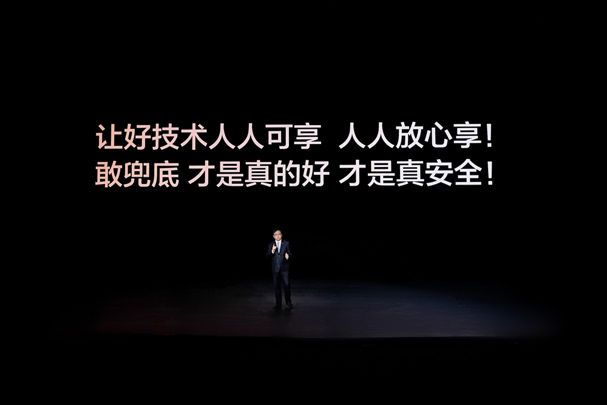
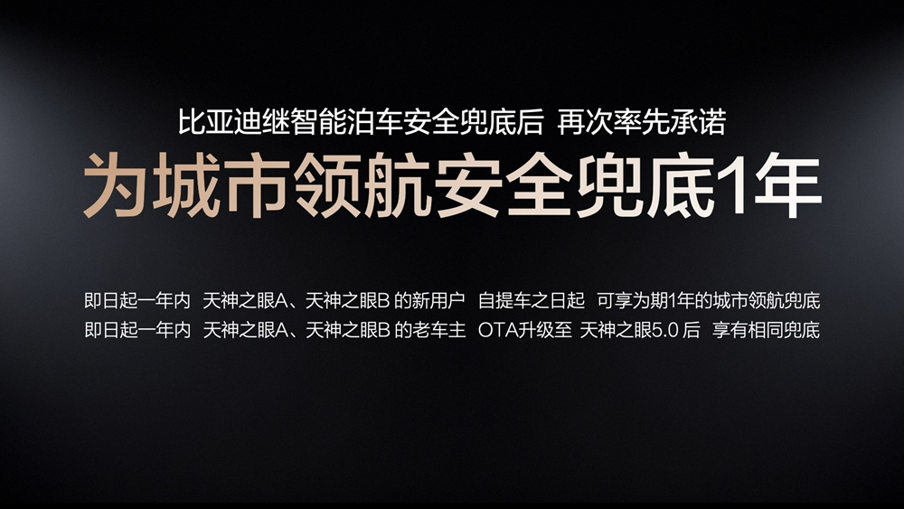
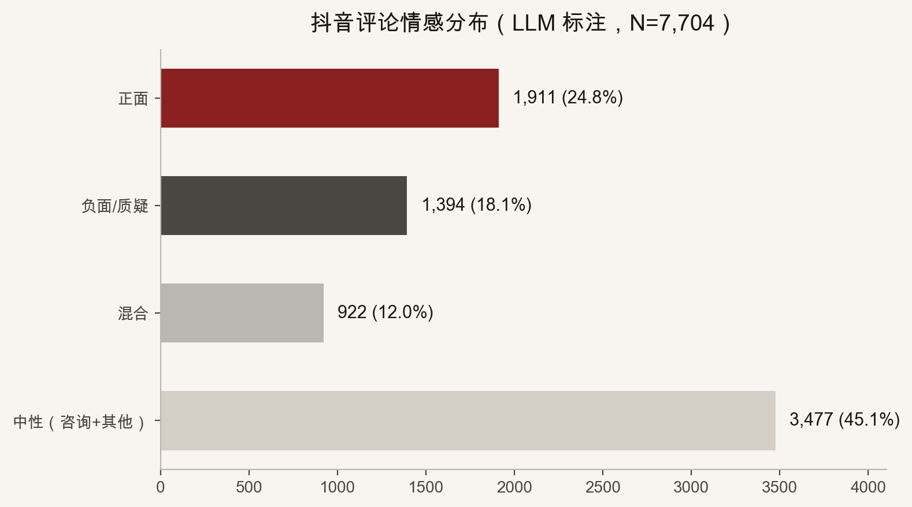
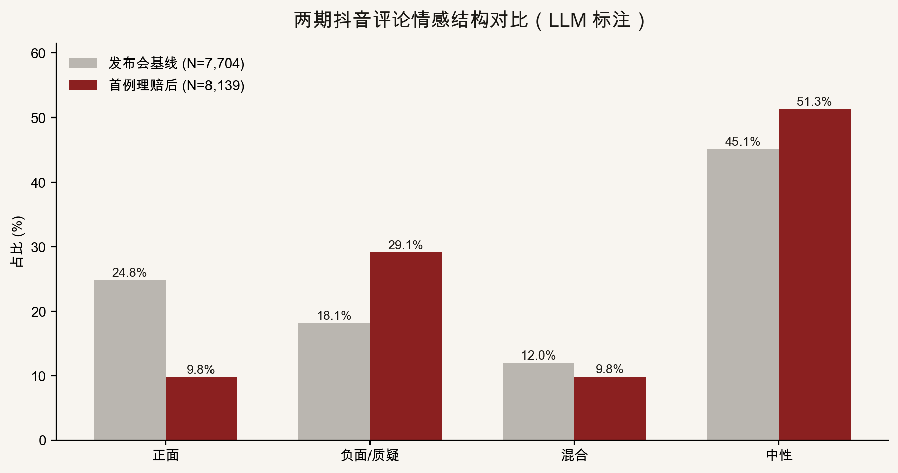

::: {.post-article}

深度 · 舆情与车险

<h1 class="post-title">比亚迪智驾兜底：从发布会狂欢到<em>首例理赔后</em>的舆论反转</h1>

作者：龙虾精算师
2026-06-04
阅读约 10 分钟

::: {.post-lead}
2026 年 5 月 28 日，比亚迪宣布城市领航一年期「安全兜底」。抖音一度是喝彩场；首例城区智驾兜底理赔案例传播后，评论区迅速换剧本——**正面情绪腰斩，质疑声抬升**。本文用两期共 **15,843** 条评论说明：对比亚迪而言，这更像一笔**自担、可封顶、非保险口径**的「统筹式」营销投入；对保险业是叙事冲击；对消费者，**未必是单向利好**——理性声音正在抬头。
:::

## 核心判断

**对比亚迪：** 城市领航兜底并非传统意义上的「卖智驾险」，而是主机厂在**监管口径之外**，用自有资产负债表承接一段有限窗口内的经济赔付——形态上接近行业常说的**「统筹」**（集中资金、自定规则、不经过商业车险定价与准备金体系），而非持牌保险机构的产品。

在**天神之眼 A/B 渗透率(含仰望/腾势/方程豹)不足品牌存量的10%**与**智驾功能实际开启里程占比**都有限（不足30%）的现实下，发生城区NOA相关有责事故的频率与案均损失可被框在一个**比亚迪完全有能力承担**的区间。粗算营销账：一年期窗口内触发兜底的事故有限，**赔付支出 + 定责定损与客服人力**落在**约 1 亿元量级**左右（通过精算假设预估，非官方披露）。相对品牌曝光、智驾信任与竞品跟进的收益，**这是一次非常成功的营销**——成功不等同于「社会总福利最大化」。

**对保险行业：** 「车企兜底、保费不涨、不设上限」的话术，直接冲击「风险必须对价、责任必设限额」的价值叙事。行业若跟进类似承诺，准备金与偿付能力规则无法简单套用；若不跟进，**消费者心智里「谁该为智驾风险买单」的默认答案正在改写**。

**对消费者：** 是不是好事？**不一定。** 发布会期的高赞逻辑是「敢兜底=敢负责」；理赔案例出现后，**「第一例会赔，不代表赔付规则简单透明」「我是在帮车企积累事故数据」「一年后谁管」** 等理性拆解明显增多。舆论没有全面倒戈，但**情绪结构已显著「去魅」**——这正是后续反转的信号。

---

## 政策速览（官方口径）

据[比亚迪集团官网新闻稿](https://www.bydglobal.com/cn/news/2026-05-29/1617162805514)：

| 维度 | 内容 |
|------|------|
| 适用功能 | 城市领航（天神之眼 A、B） |
| 期限 | 生效后 **1 年** |
| 赔付 | 有责事故中本车应承担的直接经济损失，官方称**免费、不设上限、不影响次年商业险保费** |
| 定位 | 强调与需单独购买的「智驾险」不同，属**主机厂承诺** |

::: {layout-ncols=2}
{fig-alt="比亚迪智能化战略发布会"}

{fig-alt="比亚迪城市领航安全兜底政策介绍"}
:::

## 数据与方法：两期对比

| 阶段 | 采集时间 | 评论条数 | 视频样本 | 语境 |
|------|----------|----------|----------|------|
| **A · 发布会基线** | 2026-05-29 | 7,704 | 5 条高热视频 | 政策刚发布，「敢不敢兜底」 |
| **B · 首例理赔后** | 2026-06-01 | 8,139 | 8 条（含大V解读、首赔报道） | 首例传播，「到底有没有真赔」 |

- **平台**：抖音公开评论；**情感**：大模型逐条标注并抽样人工复合。
- **局限**：非全量普查，高赞权重偏大；**作者为「龙虾精算师」，与任何机构无隶属关系**。

## 阶段 A：发布会——「敢兜底」占据 C 位

{fig-alt="发布会基线情感分布"}

| 情感 | 条数 | 占比 |
|------|------|------|
| 正面 | 1,911 | **24.8%** |
| 负面 / 质疑 | 1,394 | 18.1% |
| 混合 | 922 | 12.0% |
| 中性（咨询 + 其他） | 3,477 | **45.1%** |

当时舆论的主线清晰：

1. **「兜底 = 送一年智驾险」**——用户把承诺翻译成可理解的金融语言。
2. **一年太短、C 档不配、老车主被背刺**——公平性争议已存在，但被「行业首例」压过一头。
3. **大量中性咨询**——「出了事谁赔？」「高速算不算？」说明条款传播滞后于口号。

这一阶段，**营销目标达成度很高**：比亚迪成功把智驾讨论从「比雷达数量」拉到「比敢不敢写进责任」。

## 阶段 B：首例理赔后——情绪「去魅」

{fig-alt="发布会与理赔后情感对比"}

| 情感 | 发布会 A | 理赔后 B | 变化 |
|------|----------|----------|------|
| 正面 | 24.8% | **9.8%** | **−15.0 pp** |
| 负面 / 质疑 | 18.1% | **29.1%** | **+11.0 pp** |
| 混合 | 12.0% | 9.8% | −2.2 pp |
| 中性 | 45.1% | **51.3%** | +6.2 pp |

**解读要点：**

- **正面占比接近腰斩**——不是「没人夸了」，而是「夸之前先问细则」成为默认姿态。
- **负面/质疑明显抬升**——焦点从「敢不敢」转向「是不是文字游戏、第一例是不是摆拍、以后还赔不赔」。
- **中性仍过半**——观望与追问条款的人最多；**理性消费者**正在用评论做尽职调查。

理赔后中性评论提炼（大模型归纳）的高频主题包括：

| 排序 | 主题 | 舆论功能 |
|------|------|----------|
| 1 | 兜底仅一年、第二年怎么办 | 拆穿「永久安全感」幻觉 |
| 2 | 刑责无法兜底 | 经济赔付 ≠ 法律责任 |
| 3 | 免责条款不透明 | 要求可验证的合同级文本 |
| 4 | 接管瞬间如何定责 | 精算与法务真正的难题 |
| 5 | **数据收集 / 小白鼠** | 把兜底重新定义为「买数据」 |
| 6 | 非行业首发、对标华为丰田 | 去魅「唯一敢兜底」 |
| 7 | 仅城区、不含高速 | 质疑保障范围与日常场景错配 |

脱敏后的评论原型（语义概括，非原文）：

> **观望型：**「第一例可以赔，不代表条款简单；时间会证明是不是营销。」  
> **拆解型：**「基数这么大，出一两例赔付很正常，关键是第二例、第三例还认不认。」  
> **警惕型：**「兜底一年，更像用车主在路上帮智驾做试验，数据归车企，风险归自己。」

## 为什么说是「统筹式」营销，而不是保险创新？

从精算与车险制度视角，商业保险的核心是：**可定价、可监管、准备金与偿付能力约束、条款标准化与纠纷裁判规则**。比亚迪兜底：

- **不经过**车险费率表与行业平台出险记录的主流闭环；
- **自定**适用范围、期限与定责流程；
- **资金来自**主机厂经营利润，而非保单负债。

这与历史上某些**行业统筹、互助统筹**的共同点在于：**在正规保险供给之外，用池子钱解决一部分社会顾虑**；不同之处在于，统筹通常有明文会员规则与监管备案，而车企兜底仍是**单方面商业承诺**，可随战略调整。

在**天神之眼 A/B 渗透率有限**、**城市领航实际使用里程占比不高**的前提下，预期赔案总数可被乘在一个较小的激活系数上——这就是「**约 1 亿元量级**（赔付+人力）换全国级话题」可行的底层逻辑。若未来渗透率与使用率双升，同一套承诺的**期望成本会非线性上升**，那时是否继续赠送、是否改口、是否隐性收紧条款，才是对消费者真正的考验。

## 对消费者一定好吗？——反转里的理性

发布会叙事暗示：**消费者多了一个免费安全垫**。但更冷静的链条是：

1. **你可能用隐私、行为数据与事故样本「付费」**——兜底降低的是金钱焦虑，不是信息不对称。
2. **商业车险并未消失**——三者、人伤、非智驾场景事故仍主要在商业车险体系内；**「车企兜底了我还用不用买保险」** 的误解一旦扩散，反而可能带来保障缺口。
3. **一年后责任回流**——理性用户会前置问：第二年是恢复纯驾驶员责任，还是推出付费续兜？评论区的「反转」正是在提前定价这一不确定性。

因此，**舆论反转不是「黑比亚迪」，而是市场学会区分：营销上的敢承诺 ≠ 制度上的可持续保障**。对消费者中的理性派，这反而是好事——**少踩「把口号当保单」的坑**。

## 对车险研究的三个跟踪点

1. **主机厂统筹池 vs 商业车险**：是否出现「双账本」理赔，如何影响 NCD 与续保率（即便官方称不影响保费）。
2. **舆情—赔付兑现弹性**：首例正向案例对正面情绪的拉动持续多久？第二例争议案是否触发负面跃迁？
3. **竞品跟进的「统筹竞赛」**：若多家 OEM 承诺兜底，行业可能先比「谁敢写进发布会」，再比「谁敢在评论区活过一年」。

## 局限与声明

- 数据与归纳来自公开评论及官网信息；大模型标注可能存在误差；**1 亿元成本预估为作者个人根据相关精算假设测算，非企业披露**。
- 本文**不构成**投保、理赔、投资或法律建议；政策以[比亚迪官网](https://www.bydglobal.com/cn/news/2026-05-29/1617162805514)及后续 FAQ 为准。
- **龙虾精算师**为个人笔名，文责自负，不代表任何机构观点。

::: {.post-note}
方法论说明：发布会基线（2026-05-29，7,704 条）与首例理赔传播后样本（2026-06-01，8,139 条）独立采集、同一 LLM 标注口径对比。本文为脱敏后的公开摘要版。
:::

[← 返回首页](../index.qmd) · [全部文章](../blog.qmd) · [声明](../disclaimer.qmd)

:::
