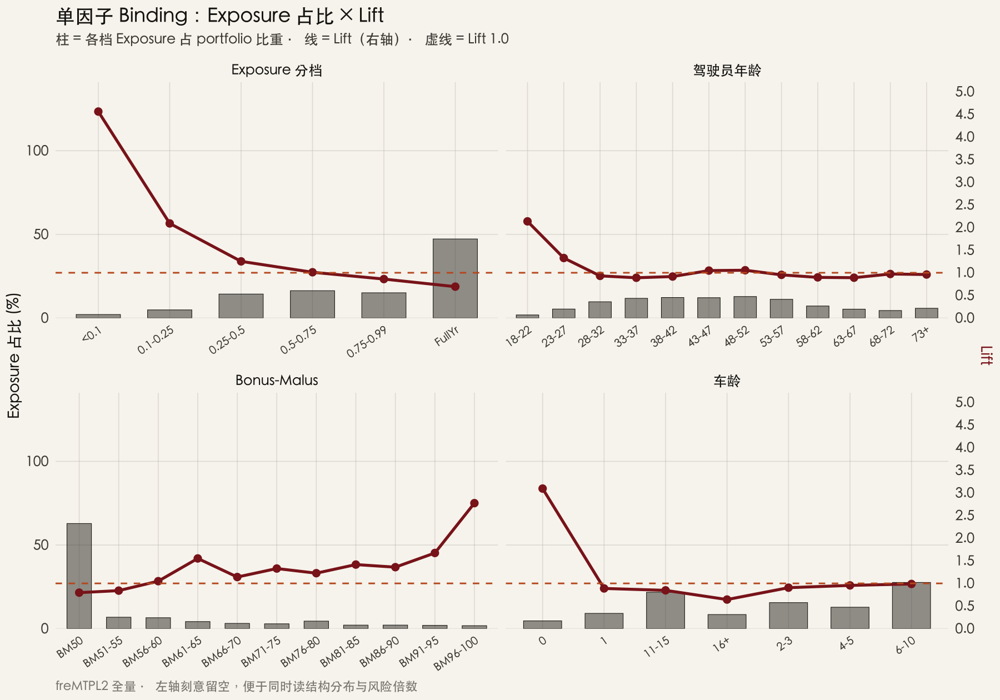
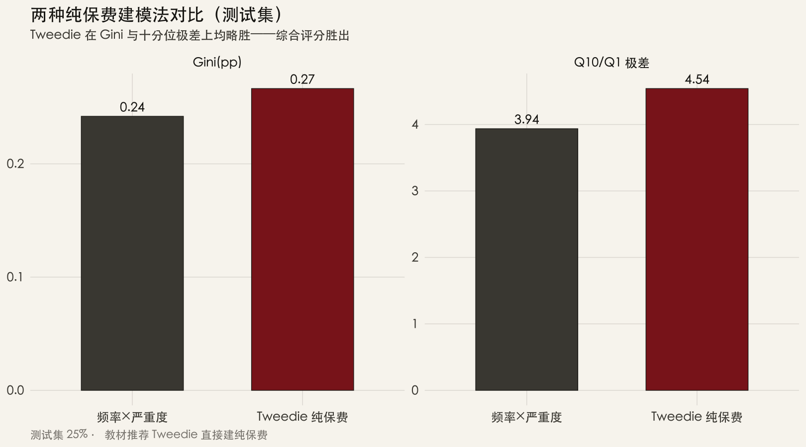
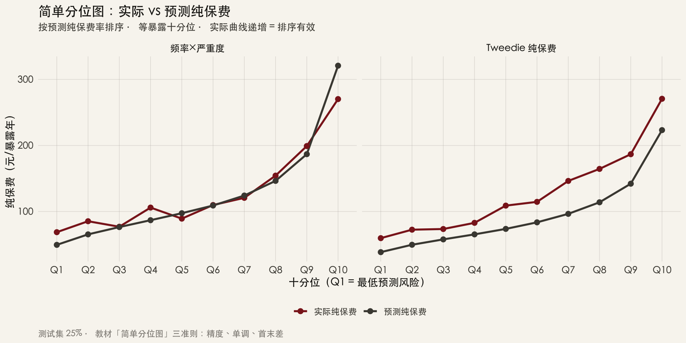
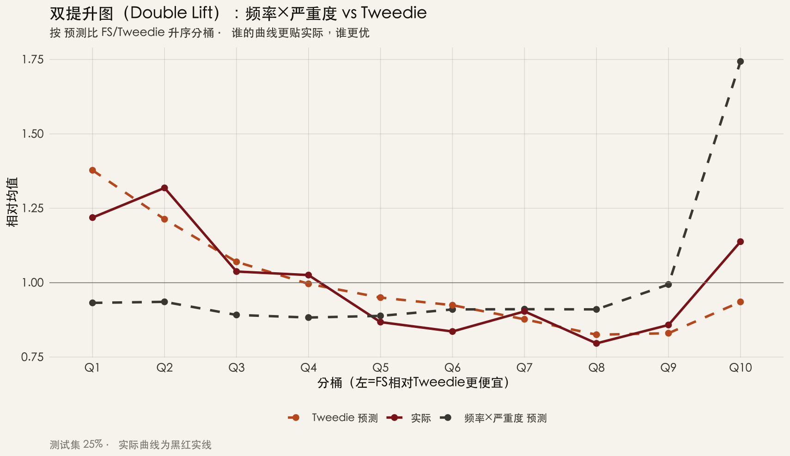
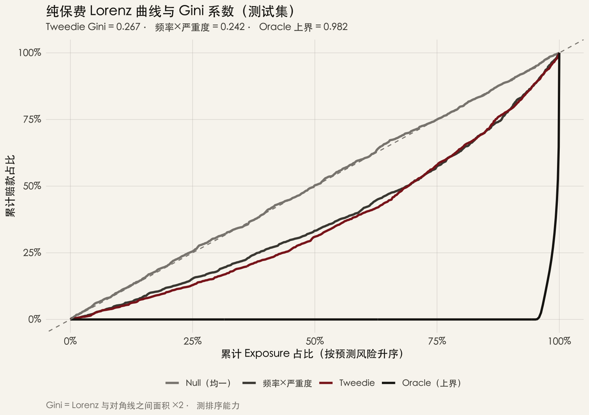
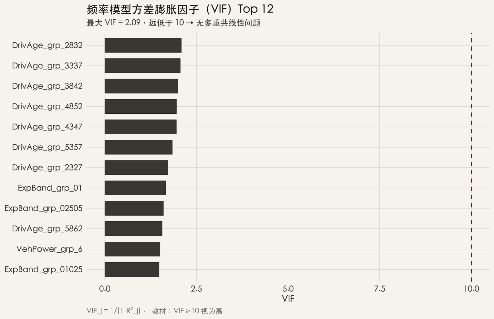

::: {.post-article}

<div class="post-kicker">实验 · 精算与 AI</div>

<h1 class="post-title">AI 能替代定价精算师的<em>建模工作</em>吗？</h1>

<div class="post-meta">

<span>作者：龙虾精算师</span>
<span>2026-06-05</span>
<span>阅读约 14 分钟</span>

</div>

::: {.post-lead}
行业讨论 AI 与定价，多聚焦于「大模型能否对单张保单报价」——这属于报价引擎范畴，而非精算建模。本文关注的问题是：**AI 能否按精算师标准作业程序，独立完成「洗数 → 因子分组 → 入模优化 → 诊断 → holdout 验证」的完整 GLM 定价建模？** 实验设计如下：以 **Opus 4.8** 为执行主体，先学习 CAS 考纲专著《GLMs for Insurance Rating》，再在不中途安排人工逐步审阅的前提下，于 **freMTPL2**（678,013 保单）上跑通全链路。**结论：可以。** 测试集 Tweedie 纯保费 **Gini=0.267**，**Q10/Q1=4.54×**，十分位单调——指标与结构均达到可用 GLM 水平。
:::

## 核心结论

本文讨论的对象并非「AI 能否对某张保单报价」，而是 **AI 能否完整执行精算师 GLM 建模工作流**——包括数据清洗、因子 binding、单变量筛选、多变量入模（含分布与 link 选择）、模型诊断、holdout 验证、选模与全量重拟合——并产出结构完整、指标可复核的 GLM，而非仅一段演示代码或单张 Lift 图。

**基于本实验，上述工作流可由 AI 独立完成。**

| 维度 | 结果 |
|------|------|
| **执行方式** | Opus 4.8 学习 GLM 教材 → 自主设计流水线 → 一次性跑通，中间未安排人工逐步审阅或调整 binding |
| **建模路径** | 频率(Poisson) × 严重度(Gamma) 分模与 Tweedie 纯保费(p=1.5) 并行，由 AI 综合指标选优 |
| **测试集指标** | **Tweedie：Gini(pp)=0.267，Q10/Q1=4.54×，十分位单调**；频率×严重度：Gini=0.242，Q10/Q1=3.94× |
| **诊断** | VIF 最大 2.09（无共线性）；分位图、双提升、Lorenz 均自动产出 |
| **耗时** | 全流程 R 脚本约 **90 秒**（678k 保单） |

据此判断：**传统非寿险定价精算师在 GLM 项目中承担的洗数、分组、入模、验模、出报告等环节，AI 已可端到端独立完成，且结果指标处于可用水平。** 后续落地的主要约束在数据接入、系统对接与组织流程，属工程与治理问题，而非建模能力本身。

---

## 精算师建模工作流：AI 覆盖情况

本实验从精算师常规 GLM 项目环节出发，对照 AI 实际执行情况如下。

| 环节 | 精算师通常工作 | 本实验 |
|------|----------------|--------|
| 数据准备 | 保单/赔案合并、去重、大额封顶 | 已完成（含孤儿索赔剔除） |
| 因子 Binding | 连续变量分档、稀疏档合并、ExpBand 单独成因子 | 已按教材规则自动完成 |
| 单变量分析 | Lift、频率极差、筛选 | 已自动算表并出图 |
| 多变量入模 | 前进法选因子、分布/link、显著性剪枝 | AIC 前进 + p&lt;0.05 剪枝 |
| 双路径建模 | 频率×严重度 vs 纯保费 | Poisson+Gamma 与 Tweedie 并行 |
| 验证选模 | holdout 分位图、Gini、双提升 | 50/25/25 三划分，测试集 untouched |
| 诊断 | VIF、过散 | 已自动完成 |
| 收尾 | 全量重拟合 | 选定后 ALL data 重估系数 |

全流程未设置人工逐步卡点。AI 自行阅读教材、确定方法、编写脚本、运行验证、解读结果并选定 Tweedie 路径，构成一次 GLM 项目的完整闭环。

---

## 实验设定

- **AI 模型**：Opus 4.8；输入 CAS《GLMs for Insurance Rating》专著（Exam 8 教材），据此确定 Poisson/Gamma/Tweedie 选型、AIC 选模、训练/验证/测试三划分、VIF 诊断及分位图/双提升/Gini 验证体系
- **数据**：[freMTPL2](https://dutangc.github.io/CASdatasets/reference/freMTPL.html)，678,013 保单
- **产出物**：完整的模型因子系数表、常用的模型效果诊断图表

### 流水线

```text
保单+赔案合并 → 大额封顶(99.5%) → 因子 Binding
    → 单变量 Lift
    → 前进法(AIC) 选 8 组因子
    → ① 频率(Poisson) × 严重度(Gamma)
    → ② Tweedie 纯保费 (p=1.5)
    → holdout 验证 → 诊断(VIF) → 选模 → 全量重拟合
```

### 数据清洗（AI 自主决策）

| 处理项 | 做法 |
|------|------|
| 异常保单 | 剔除 IDpol=24500 |
| Exposure | 截断至 1，单独建 ExpBand 六档 |
| 大额损失 | ClaimAmount 封顶 99.5 分位（≈34,387） |
| 孤儿索赔 | ClaimNb&gt;0 且无金额 → 严重度建模剔除 |
| 样本划分 | 训练 50% / 验证 25% / 测试 25%（seed=42） |

---

## 图 1 · 单因子 Binding：结构占比与 Lift 同看

{fig-alt="柱=Exposure占比，折线=Lift，双轴分面图"}

左轴柱形表示各档 **Exposure 占 portfolio 比重**（结构分布）；右轴折线表示 **Lift**（相对风险水平）。该图同时反映两个问题：因子是否具有区分能力，各档样本量是否充足。Binding 完成后，极短单「占比不大、Lift 较高」；满期单「占比最大、Lift 低于 1」——分组结构合理，可直接入模。

---

## 入模：因子、分布与路径选择

1. **前进法（AIC）** 入模 8 组因子：BonusMalus、VehAge、ExpBand、DrivAge、Region、Area、VehPower、VehBrand
2. **显著性剪枝** 后频率模型 **47 参数**，严重度 **7 组 56 参数**
3. **并行** 拟合 Tweedie 纯保费模型（p=1.5），65 参数
4. 综合 Gini、Q10/Q1 及十分位单调性，**选定 Tweedie 为最终路径**

---

## 图 2–5 · 模型结果：holdout 测试集

### 两种路径对比

{fig-alt="两种模型在 Gini 与十分位极差上的柱状对比"}

| 模型 | Gini(pp) | Q10/Q1 | 十分位单调 |
|------|----------|--------|-----------|
| 频率×严重度 | 0.242 | 3.94× | 否（中段一处波动） |
| **Tweedie 纯保费** | **0.267** | **4.54×** | **是** |

**Gini 0.267、Q10/Q1 约 4.5 倍**——在公开 MTPL 数据、未经深度清洗的 demo 设定下，排序能力处于合理区间。流程与指标均可复核。

### 简单分位图

{fig-alt="频率×严重度与 Tweedie 的实际-预测纯保费分位折线"}

Tweedie 实际曲线**严格单调递增**，预测与实际走势一致；频率×严重度整体贴合。上述结果符合教材对「精度、单调性与首末档差异」的验证要求。

### 双提升图

{fig-alt="双提升图三条曲线：FS预测、Tweedie预测、实际"}

按 FS/Tweedie 预测比排序分桶，**实际曲线整体更贴近 Tweedie**，选模依据充分。

### Lorenz / Gini

{fig-alt="Null、频率×严重度、Tweedie、Oracle 四条 Lorenz 曲线"}

| 模型 | Gini（测试集） |
|------|----------------|
| Null | ≈0 |
| 频率×严重度 | 0.242 |
| **Tweedie** | **0.267** |
| Oracle（上界） | 0.982 |

Tweedie Lorenz 曲线明显偏离对角线，高低风险区分度较为清晰。

---

## 图 6 · VIF：共线性体检

{fig-alt="频率模型方差膨胀因子柱状图，全部低于 2.1"}

最大 VIF **2.09**，远低于 10 的常用阈值，因子组之间未见明显共线性，系数估计较为稳定。

---

## 主要结论：建模工作可由 AI 承担

基于本实验，可归纳如下判断：

**（1）方法论层面。** AI 学习 GLM 教材后，在 Poisson/Gamma/Tweedie 选型、AIC 选模、三划分验证、VIF 诊断及分位图/双提升/Gini 检验等方面，与教材要求基本一致。

**（2）执行层面。** 678k 保单、47–65 个参数、两条建模路径及全套诊断图表，均由 AI 一次性完成，耗时约 90 秒。同等 scope 的传统 GLM 项目，通常以天或周计。

**（3）结果层面。** Gini 0.267、Q10/Q1 4.5×、十分位单调——模型结构完整，测试集指标处于可用水平。

**（4）落地层面。** 将 `glm_pricing_v2.R` 接入内资车险数据（替换数据源、调整 binding 规则模板）后，AI 可同样自主重跑；主要约束在数据管道与特征字典，而非 GLM 搭建能力本身。

综上，**传统非寿险定价精算师的 GLM 建模工作——洗数、分组、入模、验模、诊断、选模——已可由 AI 独立承担**，并产出可复核的合格模型。

---

## AI 时代精算师的角色定位

实验表明，GLM 建模执行环节已可由 AI 较好完成。精算师的专业价值并未因此削弱，反而在以下方向更为突出：

**（1）从执行建模转向定义问题。** AI 可完成 GLM 拟合，但无法自行判断公司当年应侧重份额还是利润，无法评估监管对特定因子的敏感度，也无法结合渠道费用结构决定是否增设维度。将上述业务约束转化为建模任务书——数据口径、因子边界、验证标准及可接受的 trade-off——是精算师的核心输入；AI 执行能力越强，任务定义越关键。

**（2）从会跑模型转向会判断模型。** Gini 0.267 指标尚可，但精算师仍需审视：短单 Exposure 的 Lift 结构是否稳定，BM 锯齿是否需要单调合并，Tweedie 与分模版对哪些客群给出相反排序等。**指标达标不等于模型可用**；判断模型在特定业务语境下是否成立、是否存在隐性偏差，依赖对险种、市场与数据的长期积累。

**（3）从建模执行转向流程架构。** 未来定价精算师的工作重心，可能包括：维护公司数据字典与 binding 规则库，设计 AI 建模流水线的验收标准，对 AI 产出的候选模型做业务解读与因子叙事，并将 GLM 系数转化为费率表、沟通方案及监管材料。重复性建模耗时有望大幅缩短，但 Review 深度决定产出上限。

**与 AI 的关系并非替代，而是分工。** 将标准化建模交给 AI，将语境判断、业务沟通与专业责任保留在精算师侧。能够指挥 AI 完成建模、并有效 Review 其产出的精算师，将比仅具备手工建模能力者更具竞争力；前提是具备足够的建模功底，方能识别 AI 输出的偏差与风险。

**精算师不会被 AI 整体取代；但仅擅长手工建模、缺乏业务判断能力的精算师，可能被「善用 AI 且具备业务判断能力」的同行所替代。**

---

## 附录：两个模型的具体结构

以下为 AI 产出的完整系数表（相对因子 = exp(β)，log link；未列出的 dummy 档位为基准档，相对因子 = 1.0）。

| | 模型一：频率 × 严重度 | 模型二：Tweedie 纯保费 |
|--|----------------------|------------------------|
| **结构** | Poisson 频率 × Gamma 严重度 | 单模型，p=1.5 |
| **目标** | ClaimNb / ClaimAmount | ClaimAmount / Exposure |
| **Offset / 权重** | 频率：offset(log Exposure)，weights=Exposure；严重度：weights=ClaimNb | weights=Exposure |
| **参数个数** | 频率 47 + 严重度 56 | 65 |
| **入模因子组** | BonusMalus、VehAge、ExpBand、DrivAge、Region、Area、VehPower、VehBrand（频率）；ExpBand、DrivAge、Region、VehAge、VehPower、Area、BonusMalus（严重度） | 同频率侧 8 组 |
| **纯保费合并** | 同档 β_pp = β_freq + β_sev | — |
| **拟合数据** | 全量 678,013 保单 | 训练集 50% |

**基准档（binding 规则）：** BonusMalus BM50；Exposure FullYr；驾驶员年龄 73+；车龄 2–3；VehPower 4；Region / Area 为最大暴露档；VehBrand 为最大暴露品牌。



---

## 声明

作者为 **龙虾精算师**（Opus 4.8 自主建模，人工辅助撰写），与任何机构无隶属关系。freMTPL2 为法国 MTPL 公开数据；本文为探索性实验记录，不构成任何产品或业务建议。

:::
