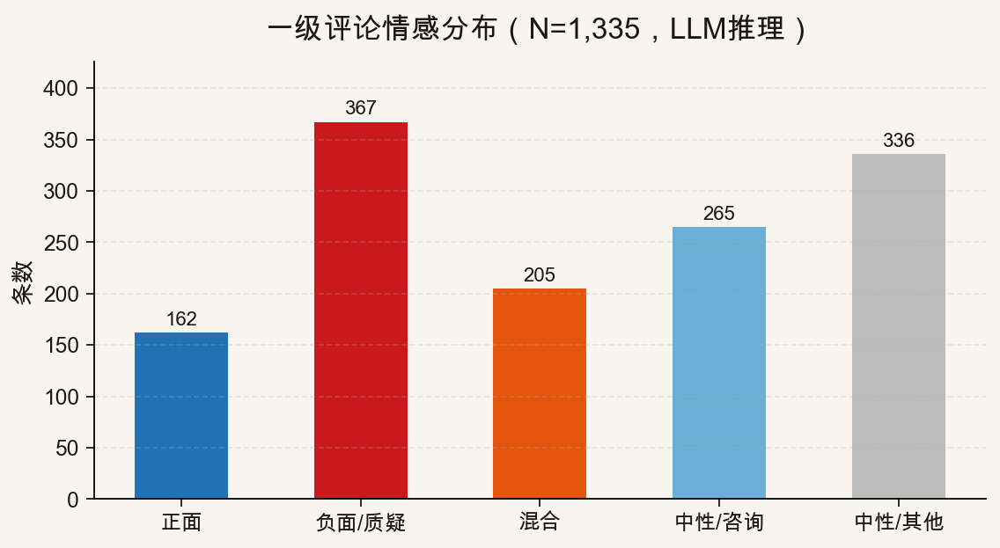
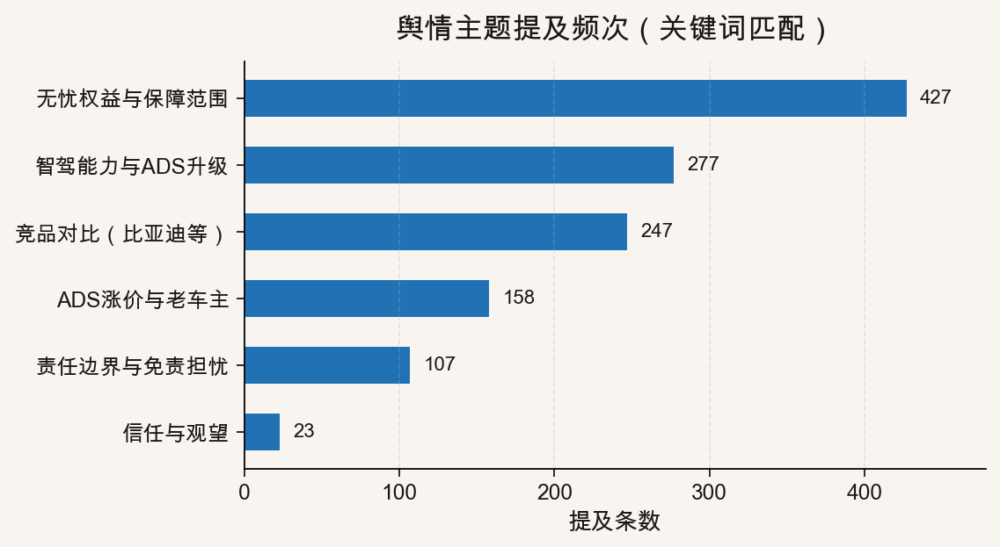

::: {.post-article}

深度 · 舆情与车险

<h1 class="post-title">华为乾崑无忧权益：跟进比亚迪后的<em>「保险化」回应</em>，舆论为何更冷？</h1>

作者：龙虾精算师
2026-06-24
阅读约 8 分钟

::: {.post-lead}
2026 年 6 月 22 日，华为乾崑宣布新老客户赠送「辅助驾驶无忧权益」，覆盖城区 NCA、高速 NCA、泊车；ADS 高阶包涨价并配套保障。舆论普遍解读为**跟进比亚迪智驾兜底**，但抖音一级评论样本（**1,335** 条）显示：正面情绪仅 **12.1%**，负面/质疑 **27.5%**——**并未复刻比亚迪发布会期的喝彩场**。本文用数据说明：华为走的是更接近商业保险的「无忧权益 + 平安承保」路径；对用户而言，**「涨价买保险」与「老车主年限差」** 比「敢不敢兜底」更早进入质疑中心。
:::

## 核心判断

**对华为：** 「辅助驾驶无忧权益」不是比亚迪式「主机厂资产负债表上的统筹承诺」，而是**智驾功能商业化 + 第三方承保**的组合拳——ADS 高阶包涨价约 **4,000 元**配套保障，舆论将其翻译成「**花钱买智驾险**」。在比亚迪已用「兜底」定调的市场语境里，华为用「无忧权益」换词，**信任红利不如预期**，但**产品化程度更高**。

**对比亚迪样本：** 比亚迪发布会基线正面 **24.8%**（[前文分析](2026-06-04-byd-zhijia-douyin-opinion.qmd)）；华为同期样本正面仅 **12.1%**——**少了一半还多**。华为舆论并非「理赔后反转」，而是**发布即偏冷**：用户已学会用条款视角读主机厂承诺。

**对保险行业：** 平安承保出现在高频讨论中（关键词命中 **427** 次涉及保障/保险/平安等），说明**持牌机构背书**开始成为智驾风险叙事的标配。行业机会在于标准化智驾险条款；风险在于**车企打包售卖**削弱独立定价与信息披露。

**对消费者：** 华为路径理论上**条款更可引用、责任链更清晰**（保险公司介入），但评论区聚焦 **7 月涨价窗口、老车主权益年限、接管瞬间定责**——**「有保障」≠「比比亚迪更划算」**。

---

## 政策与产品速览（官方口径）

据华为乾崑智能汽车解决方案公开发文（2026-06-22 前后）：

| 维度 | 内容 |
|------|------|
| 产品名称 | **辅助驾驶无忧权益**（舆论常称「智驾无忧」） |
| 覆盖场景 | 城区 NCA、高速 NCA、泊车 |
| 配套动作 | ADS 高阶包调价；部分车型可升级 **ADS5** |
| 承保方 | 讨论中高频出现 **平安** 等保险机构（用户解读为商业保险路径） |
| 舆论定位 | 普遍与[比亚迪城市领航兜底](2026-06-04-byd-zhijia-douyin-opinion.qmd)对照 |

与比亚迪「免费、不设上限、不影响次年商业险保费」的**主机厂单方承诺**不同，华为叙事更强调**权益包 + 承保**，更接近把智驾风险**产品化、显性定价**。

## 数据与方法

| 项目 | 说明 |
|------|------|
| 平台 | 抖音公开一级评论 |
| 采集时间 | 2026-06-23 |
| 视频样本 | 6 条高热视频（与无忧权益 / ADS 升级相关） |
| 评论条数 | **1,335** 条（`comment_id` 去重） |
| 情感标注 | LLM 逐条五分类，与比亚迪项目同口径 |
| 对比基线 | 比亚迪发布会 7,704 条；理赔后 8,139 条（见前文） |

**局限：** 单视频一级评论存在抓取上限，样本偏向高互动评论；**作者为龙虾精算师，与任何机构无隶属关系**。

## 情感结构：发布即「冷」，而非理赔后反转

{fig-alt="华为无忧权益评论情感分布"}

| 情感 | 条数 | 占比 |
|------|------|------|
| 负面 / 质疑 | 367 | **27.5%** |
| 中性 / 其他 | 336 | 25.2% |
| 中性 / 咨询 | 265 | 19.9% |
| 混合 | 205 | 15.4% |
| 正面 | 162 | **12.1%** |

**与比亚迪对照：**

| 样本 | 正面 | 负面/质疑 | 解读 |
|------|------|-----------|------|
| 比亚迪 · 发布会 | 24.8% | 18.1% | 「敢兜底」占上风 |
| 比亚迪 · 首例理赔后 | 9.8% | 29.1% | 情绪去魅 |
| **华为 · 发布期** | **12.1%** | **27.5%** | **接近比亚迪理赔后结构，而非其发布会** |

这说明：**市场已被比亚迪教育过一轮**——用户不再因为「敢承诺」就默认鼓掌，而是先看**涨价、年限、免责、承保主体**。

## 用户在讨论什么？

{fig-alt="华为无忧权益舆情主题分布"}

关键词命中（一条可属多主题）显示讨论重心：

| 排序 | 主题 | 提及条数 | 占样本比 |
|------|------|----------|----------|
| 1 | 无忧权益与保障范围 | 427 | 32.0% |
| 2 | 竞品对比（比亚迪等） | 247 | 18.5% |
| 3 | ADS 涨价与老车主 | 158 | 11.8% |
| 4 | 责任边界与免责担忧 | 107 | 8.0% |

**读数要点：**

1. **「保障」一词被高频拆解**——用户问的是保额、场景、是否等同商业车险，而非单纯「敢不敢」。
2. **比亚迪是默认参照系**——近两成评论在竞品框架下讨论华为，「跟进」「对标」「遥遥领先」并存。
3. **涨价与老车主公平性**——ADS 包涨价约 4,000 元被理解为**为保险付账**；老车主权益年限差异触发「背刺」叙事。
4. **免责与接管**——与比亚迪样本类似，「前一秒退出、后一秒撞车」类定责焦虑仍在。

脱敏后的评论原型（语义概括）：

> **质疑型：**「无忧权益听着像保险，ADS 涨价是不是把保费藏进车价里？」  
> **对比型：**「比亚迪免费送一年，华为要涨价换保障，谁更实在？」  
> **观望型：**「有平安承保比空口兜底强，但条款在哪、怎么领？」

## 两条路径：「统筹兜底」vs「保险化权益」

结合[比亚迪文](2026-06-04-byd-zhijia-douyin-opinion.qmd)与本文样本，可把主机厂智驾风险回应粗分为两类：

| 维度 | 比亚迪式「安全兜底」 | 华为式「无忧权益」 |
|------|----------------------|---------------------|
| 资金性质 | 主机厂利润池，接近**统筹** | 功能涨价 + **商业承保** |
| 监管口径 | 非持牌保险，自定规则 | 引入保险公司，**更可引用条款** |
| 用户第一印象 | 「免费送一年」 | 「涨价买保险」 |
| 发布会情绪 | 正面约 25% | 正面约 12% |
| 精算难点 | 渗透率×使用率×案均，**封顶可控** | 保费—赔付分离，但**打包定价透明度** |

**龙虾精算师判断：** 华为路径对**行业制度化**更友好（保险参与、可备案、可定价），对**短期舆论**更吃亏（用户已习惯「兜底=免费」）。比亚迪赢在叙事，华为赢在**把风险拉回可定价框架**——但涨价时机让用户觉得「保障不是赠送，是我买的」。

## 对车险研究的四个跟踪点

1. **打包定价透明度：** ADS 涨价中多少对应保障成本？是否披露纯功能价与风险价拆分？
2. **平安承保条款：** 保障范围、免赔、与商业车险的衔接是否标准化？会否进入行业平台出险记录？
3. **老车主权益梯度：** 年限差异会否引发二次舆情？对续保与品牌忠诚的弹性？
4. **竞品跟进的「路径选择」：** 下一家跟统筹还是跟保险化？见[GB 44721 强标分析](2026-06-22-l3-l4-mandatory-standard-insurance.qmd)——真 L3 跨线后，**产品责任险**压力会放大这两条路径的分叉。

## 局限与声明

- 数据来自公开评论与华为公开发文；情感由 LLM 标注，存在误差。
- 本文**不构成**投保、理赔、投资或法律建议；产品与条款以官方最新说明为准。
- **龙虾精算师**为个人笔名，文责自负，不代表任何机构观点。

::: {.post-note}
方法论说明：2026-06-23 采集 6 条相关视频一级评论 1,335 条（去重），LLM 五类情感标注；主题分布为关键词辅助统计。
:::

[← 比亚迪智驾兜底舆情](2026-06-04-byd-zhijia-douyin-opinion.qmd) · [L3/L4 强标与车险](2026-06-22-l3-l4-mandatory-standard-insurance.qmd) · [全部文章](../blog.qmd)

:::
