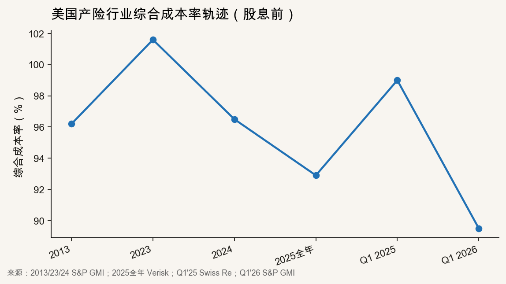
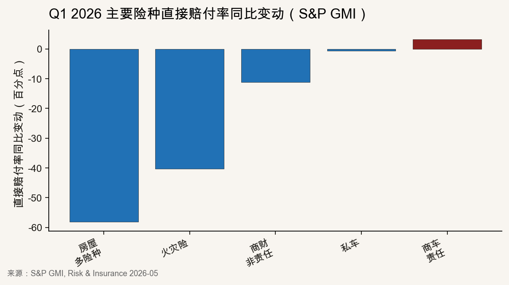
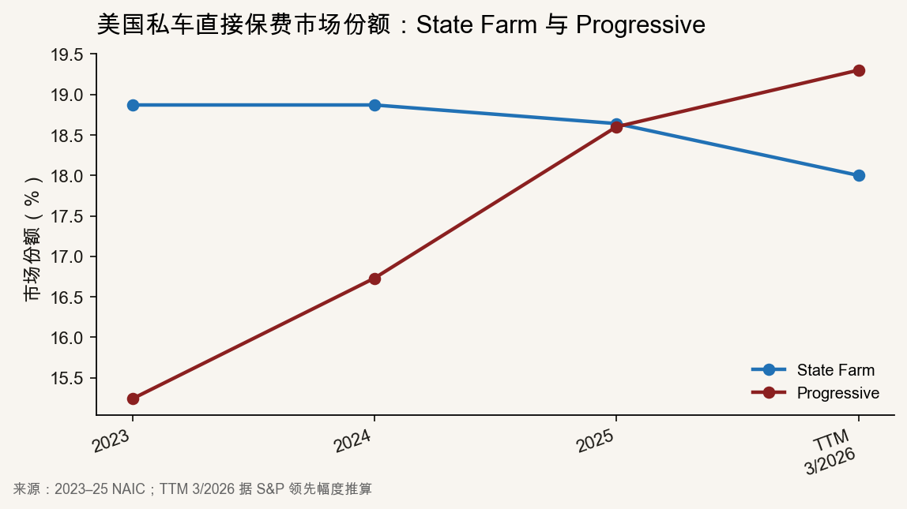
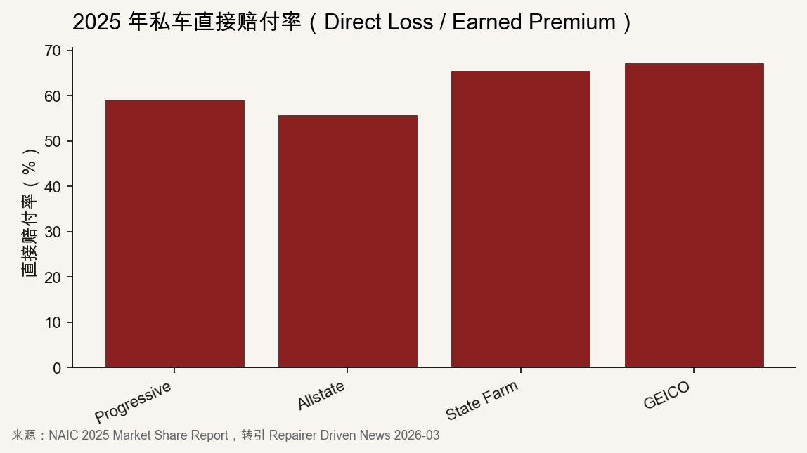

::: {.post-article}

深度 · 美国产险 Q1 与车险龙头

<h1 class="post-title">美国产险 Q1 2026：行业综合成本率回落至 <em>89.5%</em>，私车龙头排序变化</h1>

作者：龙虾精算师
2026-06-29
阅读约 13 分钟
阅读 … 次

::: {.post-lead}
2026 年一季度，美国产险行业录得 **25 年来最佳 Q1 承保盈利**：[S&P Global Market Intelligence](https://www.carriermanagement.com/news/2026/05/21/288251.htm) 汇总投保人股息前综合成本率 **89.5%**，净承保利润 **221 亿美元**，同比由约 **99%** 改善近 **10 个百分点**。同期，截至 **2026 年 3 月 31 日**滚动十二个月，**Progressive** 私车直接保费首次超过 **State Farm**（1942 年以来首次，领先逾 **15.7 亿美元**）。两项变化发生在同一财报季，驱动机制不同：行业 COR 改善主要来自**野火同比基数**（2025 Q1 洛杉矶野火推高赔付，2026 Q1 无同级别事件，同比自然回落）与当季巨灾偏低；私车条线赔付率同比仅改善 **0.6 个百分点**。龙头排序变化则来自 Progressive 保费扩张与直接赔付率优势。下文先交代行业承保盈利与险种归因，再聚焦 Progressive 与 State Farm 的分化。
:::

### 口径说明

| 概念 | 说明 |
|------|------|
| **野火同比基数** | 2025 Q1 野火集中赔付把当年基数抬高；2026 Q1 未重演，同比改善主要来自对比效应，**不等于**房屋险长期赔付中枢永久下移。 |
| **日历年 vs 滚动十二个月** | NAIC 市场份额表按 **1–12 月**汇总；S&P 龙头排名按**截止日向前 12 个月**加总。故 2025 日历年 State Farm 仍列第一，**滚动至 2026/03** 才出现 Progressive 领先。 |
| **股息前 / 后 COR** | 美国互助公司向投保人返还利润（分红）计入 COR。S&P 行业汇总常用**股息前**（89.5%），Verisk/APCIA（92.4%）更接近**股息后**读数。 |
| **直接赔付率** | NAIC 法定口径 **Direct Loss / Earned Premium**。与国内满期赔付率、已报告赔付率**不可直接对标**，但用于美国龙头横向比较仍有效。 |
| **硬市场** | 2022—2024 年费率普遍上涨、保费扩张阶段；至 2026 年涨价大多已体现在当年度账上。 |

---

## 核心结论

**行业层面：Q1 COR 改善主要来自巨灾与野火同比基数，不宜外推全年。** [AM Best](https://riskandinsurance.com/us-pc-industry-posts-16-3-billion-underwriting-gain-in-q1-2026-reversing-year-ago-loss) 显示巨灾对 COR 的贡献由 **14.5 个百分点降至 4.2 个百分点**（同比 **-10.3 个百分点**）——即巨灾对 COR 的额外拖累大幅减轻。房屋险多险种直接赔付率由 Q1 2025 的 **102.3%** 降至 **44.3%**（**-58.1 个百分点**），与洛杉矶野火（Palisades / Eaton）去年高赔付、今年无同级别事件直接相关。私车赔付率同比仅 **-0.6 个百分点**（至 **60.4%**），说明 2022—2024 年硬市场下的提价修复已基本入账，Q1 行业盈利并非由车险条线拉动。

**公司层面：State Farm 拉动行业同比承保修复，Progressive 拉动私车份额重组。** State Farm P&C 承保由 Q1 2025 **亏损 51 亿美元**转为 Q1 2026 **盈利 18 亿美元**（同比改善约 **71 亿美元**），约占行业承保利润同比增量的 **三成**——主因野火损失出清，而非保费扩张。Progressive 滚动十二个月个车净保费 **+11.6%**、State Farm **-0.1%**，2025 年直接赔付率 **59.07%**，低于 State Farm **6.4 个百分点**。

**结构层面：责任险持续恶化，私车集中度上升。** 其他责任险 Q1 赔付率 **65.8%**，为 **24 年来 Q1 最高**；商业车险责任 **+3.2 个百分点**。私车前两家合计份额 **37.2%**（2024 年为 **35.5%**）。硬市场退潮后，竞争焦点转向保单量与费用率。

**可持续性：偏低。** 2025 年飓风损失异常低；[FactSet](https://insight.factset.com/insurance-combined-ratios-look-fine-but-schedule-p-shows-releases-helped) 提示 **Schedule P**（美国法定报表中的历年准备金发展数据）显示，部分条线账面改善仍有**准备金释放**贡献。行业净签单保费增速 **2.9%**（Verisk/APCIA）。龙头需在 COR 约束下争夺份额，价格战风险上升。

---

## 一、行业 Q1 承保盈利：COR 落点与口径

### 1.1 时间序列

{fig-alt="行业综合成本率多年走势折线图"}

| 时点 | 综合成本率 | 来源 | 备注 |
|------|-----------|------|------|
| 2013 全年 | **96.2%** | S&P GMI | 上一轮景气参考 |
| 2023 全年 | **101.6%** | S&P GMI | 行业承保亏损 |
| 2024 全年 | **96.5%** | S&P GMI | 个险反弹 |
| 2025 全年 | **92.9%** | Verisk/APCIA | 野火与强对流风暴仍扰动 |
| Q1 2025 | **~99%** | Swiss Re / Verisk | 加州野火压顶 |
| **Q1 2026** | **89.5%** | S&P GMI | 分红前；分红后 **91.9%** |

Verisk/APCIA 估计 Q1 2026 COR **92.4%**，高于 S&P **89.5%**，差异主要来自是否将**向投保人分红**计入 COR（Q1 行业返还约 **62 亿美元**）。正文以 S&P 股息前汇总为主叙事，他源作对照。

Q1 2026 的 **89.5%** 较 2024 全年低 **7 个百分点**，但 Q1 并非总是季节最优（2025 Q1 更差）。跳变来自**野火同比基数**（去年赔得多、今年没再赔）与当季巨灾偏低，而非全行业 accident year 趋势突然好转。

### 1.2 承保利润与分红

| 指标 | Q1 2026 | Q1 2025 | 来源 |
|------|---------|---------|------|
| 净承保利润（S&P） | **221 亿美元** | — | S&P GMI |
| 净承保利润（Verisk/APCIA） | **158 亿美元** | 约 **-8.6 亿** | Verisk/APCIA |
| 返还投保人 | **62 亿美元** | — | Verisk/APCIA |
| 投保人分红率 | **~2.4%** | — | S&P GMI |

State Farm 基于 2025 年结果宣布约 **50 亿美元**车险现金返还，并在 Q1 2026 推高行业股息率。S&P 另提及 State Farm 与 USAA 的历史性分红安排；Verisk/APCIA 的 Q1 返还投保人口径为 **62 亿美元**，与个别公司公告的金额、入账时点不完全一致。**分红是利润返还，改善投保人回报，不等于当年度出险损失率下降。**

---

## 二、险种归因：谁在拉动、谁在拖后腿

### 2.1 各险种赔付率同比变化

{fig-alt="各险种赔付率同比变动柱状图"}

| 险种 / 条线 | Q1 2025 → Q1 2026 | 同比变动 | 含义 |
|-------------|-------------------|----------|------|
| **房屋险多险种** | 102.3% → **44.3%** | **-58.1 个百分点** | 野火同比基数：去年 Q1 赔穿，今年回落 |
| **火灾险** | — | **-40.3 个百分点** | 商财火灾同步修复 |
| **商业多险种（非责任）** | — | **-11.2 个百分点** | 商财跟随硬市场 |
| **私车** | ~61.0% → **60.4%** | **-0.6 个百分点** | hard market 已大部分入账 |
| **商业车险责任** | — | **+3.2 个百分点** | 持续恶化 |
| **其他责任险** | — → **65.8%** | 24 年 Q1 新高 | 社会通胀 / 诉讼融资 |

**精算读数：** 行业 COR 同比改善近 **10 个百分点**，剔除巨灾贡献（**-10.3 个百分点**）与房屋险野火同比基数后，**可持续改善约 1–2 个百分点**，远小于 **89.5%** 这一 headline 数字给人的印象。私车 **-0.6 个百分点**表明：龙头盈利更多依赖前期费率与车均保费入账，而非 Q1 损失率再大幅下探——与 S&P 判断私车 hard market 高峰已过、竞争加剧一致。

### 2.2 巨灾与地区

| 因素 | 数据 | 来源 |
|------|------|------|
| 巨灾对 COR 贡献 | **14.5 → 4.2 个百分点**（同比 **-10.3 个百分点**） | AM Best |
| Q1 巨灾净损失 | **100 亿 vs 333 亿**（同比） | AM Best |
| 2025 年飓风损失 | **<10 亿** vs 近年年均 **~300 亿** | S&P GMI |
| State Farm Q1 承保同比改善 | **约 +71 亿美元** | S&P / Coverager |

加州野火（行业估损数百亿美元量级，Aon 等口径不一）将地区效应写入 2025 Q1 房屋险与 State Farm 个体报表。2026 Q1 无同级别事件，行业 COR 随之回落。

---

## 三、私车龙头：Progressive 滚动十二个月保费首次超过 State Farm

行业私车条线 Q1 同比平稳，但龙头排序在同期发生位移——硬市场后半段**保费增速与直接赔付率**分化的结果，而非全行业保费扩张。

### 3.1 份额轨迹与口径

{fig-alt="State Farm与Progressive市场份额折线图"}

| 时点 | State Farm | Progressive | 备注 |
|------|-----------|-------------|------|
| 2023（NAIC 日历年） | **18.87%** | **15.24%** | 差距约 **3.6 个百分点** |
| 2024（NAIC） | **18.87%** | **16.73%** | Progressive 签单保费 **+24.5%** |
| 2025（NAIC） | **18.64%** | **18.60%** | 差距 **4 个基点** |
| 滚动十二个月至 2026/03（S&P） | ~**18.0%** | ~**19.3%** | Progressive 领先 **>15.7 亿美元** |

S&P 依据 NAIC Part 2 直接保费及 Progressive 月度净保费披露校验；与 NAIC 日历年表在子险种范围、统计截止日上存在差异。2025 年 Progressive 相对 State Farm 份额提升 **210 个基点**；**日历年几乎打平，滚动十二个月直至 2026 年 3 月才确认排序变化**——两种统计时点并存时，容易把「2025 年末仍第一」与「2026/03 滚动第一」混为一谈。

### 3.2 保费增速与保单量

| 指标 | Progressive | State Farm | 行业 |
|------|-------------|------------|------|
| 滚动十二个月个车净保费增速 | **+11.6%** | **-0.1%** | — |
| Q1 2026 净签单保费 | **236 亿**（+6%） | — | 产险行业 **+2.9%** |
| Q1 2026 保单量 | **3,960 万**（+9%） | — | — |
| 2025 直接已赚保费 | **672 亿** | **693 亿** | — |

Progressive 直销车险保单同比 **+14%**、代理 **+10%**（8-K）。State Farm 在 **40 个州**下调费率（年化让利约 **46 亿美元**），并发放 **50 亿美元**一次性车险分红——修复客户关系的同时压制保费增速，与滚动十二个月 **-0.1%** 一致。

### 3.3 直接赔付率与综合成本率

文中直接赔付率均为 NAIC 法定 **Direct Loss / Earned Premium**，反映已赚保费对应的赔付支出；与国内平台常用的满期赔付率、已报告赔付率在定义与滞后结构上均有差异，**不宜把 59% 与 65% 简单类比为国内车险赔付率水平**，但用于比较 Progressive 与 State Farm 的相对承保质量仍成立。

{fig-alt="主要承保人直接赔付率柱状图"}

| 承保人（2025） | 直接赔付率 | Q1 2026 COR / 承保 |
|----------------|-----------|-------------------|
| **Progressive** | **59.07%** | COR **86.4%**；承保利润率 **13.6%** |
| Allstate | 55.64% | 承保利润 **>10 亿**（S&P） |
| **State Farm** | **65.44%** | P&C 承保 **+18 亿**（同比 **+71 亿**） |
| GEICO | 67.14% | 承保利润 **>10 亿**（S&P） |

Progressive COR **86.4%** 优于行业 Q1 **89.5%** 约 **3 个百分点**。State Farm Q1 盈利修复主要来自野火相关损失出清；**50 亿美元**车险分红推高股息率、抬升股息后 COR，**不应据此推断车险损失率同比大幅改善**。S&P 披露八大私车龙头 Q1 承保利润均 **>10 亿美元**——行业私车整体仍处盈利区间，公司间直接赔付率差距决定份额再分配空间。

---

## 四、经营路径对照与可持续性

### 4.1 两家龙头的不同选择

| 维度 | Progressive | State Farm |
|------|-------------|------------|
| 渠道 | 代理 + 直销双轨 | 全美代理网络 |
| 定价工具 | Snapshot UBI、行为评分 | 传统因子 + 代理核保 |
| Q1 策略重心 | 保费与保单量扩张 | 分红、降费、野火出清 |
| 滚动十二个月保费 | **+11.6%** | **-0.1%** |
| 2025 直接赔付率 | **59.07%** | **65.44%** |

硬市场（2022—2024）行业性提价已基本入账；2026 年竞争从「提价修复 COR」转向「COR 可控前提下争份额」。Progressive 将承保盈利用于获客与数据投入；State Farm 选择向投保人返还利润。两种路径对市场份额的影响方向相反。

### 4.2 行业层面需关注的风险

1. **准备金释放**：Schedule P 显示部分条线仍有历年准备金调减支撑账面 COR。
2. **损失成本反弹**：Manheim 二手车指数回升，修理工时与配件价格可能恶化 **2025 事故年**及以后业务的赔付。
3. **责任险**：other liability（其他责任险）赔付率能否回落；若持续 **65%+**，将拖累 COR。
4. **飓风季**：Q1 巨灾净损失 **100 亿**不可简单年化；若大灾回归，低巨灾情景将逆转。
5. **价格战**：净签单保费增速 **2.9%** 背景下，龙头可能提前降价。

---

## 五、对国内车险的参照

美国 Q1 可分两层理解：**全行业**盈利修复主要由非车险巨灾与野火同比基数驱动，**89.5%** 不宜外推为车险经营常态；**私车龙头**层面，份额向直接赔付率更优、定价更细的主体集中。国内车险更应关注平台赔付率、费用率与风险减量，将美国数据作为国际对照，而非国内集中度预测。

---

## 六、跟踪指标

1. **Q2 巨灾与飓风**：巨灾对 COR 贡献能否维持 **~4 个百分点**。
2. **房屋险 Q2 赔付率**：是否回归 **60–70%** 区间。
3. **NAIC 2026 日历年份额**：滚动十二个月排序能否在完整年度固化。
4. **Progressive 保单增速 vs COR**：直销 **+14%** 能否延续且 COR **<90%**。
5. **行业净签单保费增速**：是否跌破 **3%** 并触发费率竞争。

---

## 局限与声明

- 行业按险种分解依据 S&P GMI、AM Best、Verisk 等公开材料汇总，非监管机构官方分解。
- 市场份额 **2023–2025** 采用 NAIC 日历年口径；**滚动十二个月至 2026/03** 份额据 S&P 领先金额推算，非 NAIC 官方排名表。
- 不同机构统计口径存在差异，正文已分表标注。
- 文责个人，不代表任何任职机构。

::: {.post-note}
方法论：2026-06-29 基于 S&P GMI（2026-05）、AM Best 首看、Verisk/APCIA、NAIC 2025、Progressive Q1 10-Q、Repairer Driven News、FactSet 等公开材料整理。
:::

**延伸阅读：** [AAA 财险 AI 用例](/posts/2026-06-26-aaa-ai-use-cases-insurance-pension.qmd) · [L3/L4 强标与车险](/posts/2026-06-22-l3-l4-mandatory-standard-insurance.qmd) · [比亚迪智驾兜底舆情](/posts/2026-06-04-byd-zhijia-douyin-opinion.qmd)

:::
