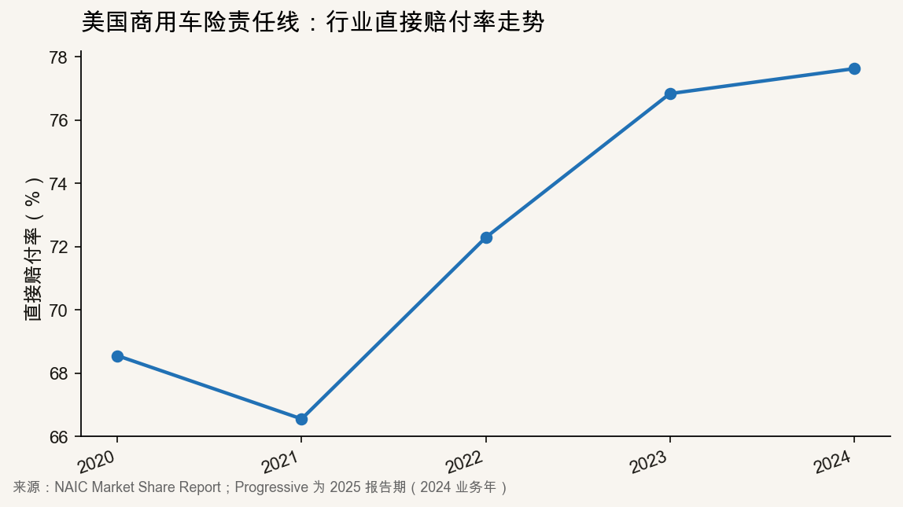
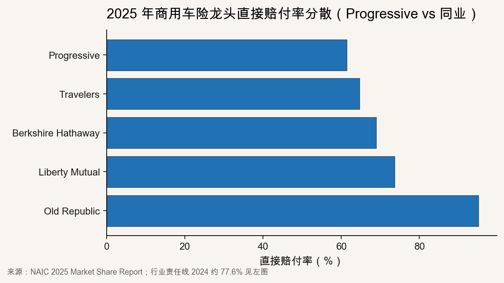
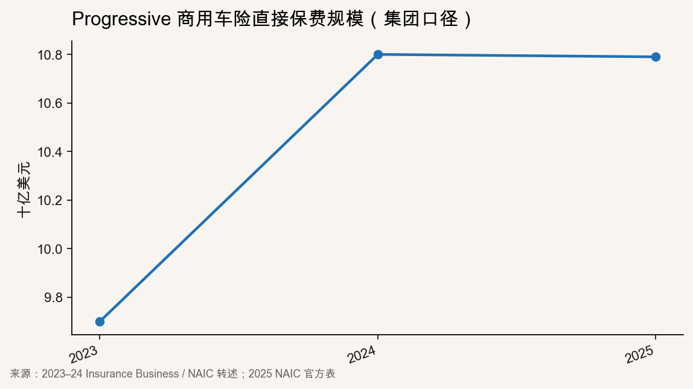

::: {.post-article}

深度 · 商用车险 UBI × AI 核保

<h1 class="post-title">美国商用车险十三年亏损：Progressive 车联网 UBI 样本与国内参照</h1>

作者：龙虾精算师
2026-06-30
阅读约 14 分钟
阅读 … 次

::: {.post-lead}
美国 **商用车险**（Commercial Auto，营业货车/车队/承包商车辆等，下文简称「商用车险」）与昨日讨论的私车市场处在两条曲线上：[Conning](https://www.conning.com/about-us/news/ir-pr---2025-commercial-auto) 统计该条线已连续 **十三年**承保亏损，**2024** 年综合成本率 **107%**、净亏损约 **50 亿美元**；费率已连涨 **55** 个季度，责任险案均赔款较 **2015** 年仍高约 **64%**。[Q1 2026 全行业](/posts/2026-06-29-us-pc-q1-progressive-state-farm.qmd) COR 回落至 **89.5%**，商用车险责任赔付率却仍在变差。**Progressive** 是少数跑通逻辑的样本：NAIC 2025 年其商用车险直接保费 **107.9 亿美元**、份额 **15.0%** 居首，直接赔付率 **61.5%**，明显低于行业责任线 **77.6%**。下文先用一节交代行业为何「涨价仍亏损」，再写 Progressive 如何把车队数据写进定价，最后讨论国内能借鉴什么。
:::

## 核心判断

**难点在赔付，不在缺技术。** 费率已连涨五十多个季度，全行业再靠统一加价的空间有限；责任险案均赔款又因诉讼和高额判决持续抬高（较 2015 年约 **+64%**），这部分损失很难靠车联网或 AI 直接压下去。因此 **2025** 年商用车险仍是美国产险里少数综合成本率高于 **100%** 的大险类（[III / Milliman](https://insuranceindustryblog.iii.org/u-s-p-c-market-records-hard-earned-decade-low-combined-ratio)）。竞争焦点正从「涨价」转向「挑客户」：有车队数据、安全记录更好的账户，更容易拿到好条件——Progressive 受益于此。

**Progressive 的路径很具体：采集行驶数据，按安全表现续保调价，并在保单年度内用看板督促改驾驶习惯。** 产品上分为 **Snapshot ProView**（一般车队）和 **Smart Haul**（货运 **ELD**），都脱胎于私车 Snapshot。AI 用在核保排序、理赔单证和反欺诈，处理的是车队数据，而不是脱离数据的独立项目（参见 [AAA AI 用例图谱](/posts/2026-06-26-aaa-ai-use-cases-insurance-pension.qmd)）。陪审团高额判决带来的人身伤害大案，仍要靠限额和承保条件管控，车联网替代不了。

**国内可学「数据换保费」闭环，但不能照搬美国诉讼环境。** 物流、网约车车队已在对接平台数据；若数据进不了续保定价，技术投入很难反映在赔付率上。乘用车 L2 渗透率高，不等于商用车事故率马上下降——车队业务应盯行驶与运营数据，而不是只看智驾渗透率。

---

## 一、行业亏损：引子（为何值得看 Progressive）

[Conning 2025 研究](https://www.conning.com/about-us/news/ir-pr---2025-commercial-auto) 归纳四条原因：**人身伤害案赔款变贵**（诉讼与高额判决）、**司机短缺**（新手司机增多）、**修车变贵**（ADAS 配件与工时）、**新能源车型案均赔款高**。前两条拉高责任赔付，后两条拉高物损案均；在案均持续走高的阶段，单靠提价很难把综合成本率压回 **100%** 以下，于是出现「涨了十几年仍亏」。

责任线赔付率自 **2021** 年低点反弹后持续走高：

{fig-alt="2020至2024年美国商用车险责任直接赔付率折线图"}

| 年度 | 其他商用车险责任直接赔付率 |
|------|---------------------------|
| 2020 | 68.6% |
| 2021 | 66.6% |
| 2022 | 72.3% |
| 2023 | 76.8% |
| 2024 | **77.6%** |

三年累计恶化约 **11 个百分点**；加上费用与再保，条线 COR 长期高于 **100%**。**2024** 年商用车险 COR **107%**，同期产险全行业净 COR **97.2%**（Swiss Re）——全行业回暖时，商用车险仍单独承压。Q1 2026 商用车险责任赔付率同比 **+3.2 个百分点**（S&P GMI），私车为 **-0.6 个百分点**；详见[昨日行业稿](/posts/2026-06-29-us-pc-q1-progressive-state-farm.qmd)。

在这一背景下，Progressive 仍扩张保费且维持低赔付率，才是本文重点。

---

## 二、Progressive 样本：份额、赔付率与产品闭环

### 2.1 承保结果：规模上去、赔付率下来

NAIC 2025 年商用车险直接保费前五集团中，Progressive 直接赔付率 **61.5%** 最低，Old Republic **95.2%** 最高——同一市场里差距可以拉到 **30 个百分点以上**，说明关键不在「做不做商用车险」，而在**选什么客户、怎么续保管理**。

{fig-alt="美国主要商用车险公司直接赔付率横向对比"}

| 集团 | 商用车险份额 | 直接赔付率 |
|------|-------------|-----------|
| **Progressive** | **15.0%** | **61.5%** |
| Travelers | 5.4% | 64.7% |
| Berkshire Hathaway | 3.7% | 69.0% |
| Liberty Mutual | 3.9% | 73.7% |
| Old Republic | 4.1% | 95.2% |
| *行业责任线（2024）* | — | *约 77.6%* |

Progressive 与行业责任线的差距约 **16 个百分点**——对 **100 亿美元+** 保费体量而言，这是承保利润与继续扩张份额的空间，而非营销折扣能单独解释的。

保费规模近三年维持增长，**2025** 年直接签单保费 **107.9 亿美元**，增速较 **2024** 年放缓，但份额仍第一：

{fig-alt="Progressive商用车险直接签单保费近年走势折线图"}

| 年度 | 直接签单保费 | 来源 |
|------|-------------|------|
| 2023 | 约 **97** 亿美元 | NAIC / 行业转述 |
| 2024 | 约 **108** 亿美元 | NAIC / Insurance Business |
| 2025 | **107.9** 亿美元 | NAIC 2025 官方表 |

### 2.2 车联网 UBI：两条产品线如何分工

Progressive 的商用车险 UBI 按**联邦是否强制 ELD**、**营运形态**拆成两条线，背后共用私车 **Snapshot** 的数据能力。

**（1）为什么分 ProView 与 Smart Haul**

| 维度 | **Snapshot ProView** | **Smart Haul** |
|------|---------------------|----------------|
| 适用车队 | 承包商、配送、租赁、一般小企业车队等 | 持 **USDOT** 号的**货运**车队 |
| 不适用 | 依法须装 **ELD** 的货运经营者 | 无 ELD、非货运商业用车 |
| 数据来源 | Progressive 提供车载硬件（或手机采集） | 已有 **ELD** 的行驶与诊断数据 |
| 接入时点 | 投保时安装设备即享开通折扣 | 报价环节选择参与，授权读取 ELD |

Progressive **2018** 年推出 **Smart Haul** 对接货运 ELD；**2019** 年试点 **SmartTrip**，再结合私车 Snapshot 逾 **250 亿英里**、Smart Haul 逾 **4 亿英里**数据，推出面向非 ELD 强制车队的 **ProView**（[发布稿](https://www.progressive.com/media/news/progressive-launches-snapshot-proview/)）。不同客群用不同信号变量，而不是把货运模型硬套在承包商面包车上。

**（2）Snapshot ProView：定价挂钩什么**

[产品页](https://www.progressivecommercial.com/business-insurance/snapshot-proview/) 公开规则如下：

- **开通**：安装 Progressive 设备后保费先降 **5%**；新客参与后平均再省约 **9%**。
- **续保**：按月生成**安全评分卡**，按行驶时段、路段与驾驶行为（急刹、超速等），续保浮动 **8%–20%**。
- **双向调价**：驾驶数据**也可能导致续保加价**，不是只奖不罚——差驾驶会反映在经验费率里。
- **车队看板**：**≥3 台车**纳入后免费提供管理界面，雇主按月辅导驾驶员——保费激励与运营干预绑定。

ProView 针对的是没有 ELD 的配送、装修、物业等车队：过去核保主要靠 MVR 和理赔史，telematics 把**保单年度内的行为**变成可定价变量。

**（3）Smart Haul：ELD 数据怎么进保费**

[Smart Haul](https://www.progressivecommercial.com/truck-insurance/smart-haul/) 面向货运：

- **开通**：授权共享 ELD 数据，即时 **3%** 折扣；无历史数据的新车队也可先拿开通价，**续保**再定额外优惠。
- **续保比价**：将近期 ELD 数据与**同类货运经营者**对比，每次续保按最近行驶数据自动加减费。
- **优选 ELD 供应商**：**Geotab、Motive、Omnitracs** 等对接更深的新业务客户，开通折扣至少 **5%**，部分账户续保可至 **15%+**；新客平均节省约 **1,300 美元**（官网披露，因户而异）。
- **数据字段**：车辆、驾驶行为、位置与车载诊断——更贴近**营运强度**（里程、工时）。

**（4）和赔付率 61.5% 怎么连起来**

共同逻辑：**新保**靠 MVR、DOT、车型与行业分类定价；**续保**靠本保单年度行驶数据修正。行业责任线 **77.6%** 对比 Progressive **61.5%**，差距不来自单一折扣，而是**愿分享数据、驾驶较好的车队**留存，差账户在续保加价或拒保中被筛掉——UBI 首先是**风险选择与续保纪律**，其次才是营销让利。

### 2.3 AI 与数据能力：Progressive 具体用在哪

**（1）网约车（TNC）里程定价**

Progressive [10-K](https://www.sec.gov/cgi-bin/browse-edgar?action=getcompany&CIK=0000080661) 披露，向 **Uber** 关联方承保的 **TNC** 商业车险 **2025** 年约占 Commercial Lines 净签单保费 **14%**（2024 年 **15%**）。保费按预估**总行驶里程**定价，并**按月**根据已行驶里程与剩余期间预估里程调整——营运强度直接进保费，不等年度续保。国内物流平台、网约车的**行程量数据**在合规前提下最接近这条路径。

**（2）核保与续保：模型吃哪些字段**

| 来源 | 典型变量 | 作用阶段 |
|------|----------|----------|
| ProView / Smart Haul | 急刹、超速、时段、路段、月度安全分 | 续保调价 |
| MVR | 违章、吊销 | 新保与续保准入 |
| DOT / FMCSA | 安全评分、检查记录 | 货运账户筛选 |
| 理赔史 | 频率、案均 | 续保加价或限额 |
| 车型与用途 | 牵引车/厢货、半径 | 基础费率表 |

AI/统计模型把多源数据对齐到**账户级**，在续保点给出加价、减价或拒保——在费率表之上做**账户修正**，不是替代费率表（参见 [AAA AI 用例](/posts/2026-06-26-aaa-ai-use-cases-insurance-pension.qmd)）。

**（3）理赔：员工主导，自动化有边界**

10-K 称商用车险理赔几乎全部由自有员工处理，依托约 **4,700** 家合作修理厂及**虚拟理赔**环境。AI 更可能用于：**影像定损**、**单证结构化**、**账单异常检测**——压费用率和简单案周期。人身伤害大案仍靠人工与律师；10-K **2025** 年 Commercial Lines 的 loss & LAE ratio 约 **66%**，低于行业责任线 **77.6%**，部分来自账户选择，部分来自处理效率。

**（4）与私车 Snapshot 的协同**

Commercial Lines 总裁 Barbagallo 称 ProView 依托 Snapshot 与 Smart Haul 的**长期数据积累**。私车 **250 亿+英里**数据帮助校准「哪些行为与赔付相关」；迁移到车队后，变量扩展为**多驾驶员、雇主监督、营运半径**——这是 Progressive 比后发者更快产品化的原因，也是国内做车队 UBI 需要积累**行为—赔付**样本的原因。

### 2.4 边界：Progressive 模式覆盖不了什么

- **人身伤害大额判决**：案均赔款较 2015 年已涨约 **64%**，要靠限额、伞形责任险和承保条件来管，UBI 不能替代。
- **修车成本**：ADAS 和电池专用件推高物损案均，AI 定损主要省人力，压不住配件价格。
- **高风险账户外溢**：**2025** 年上半年 E&S 市场商用车险保费同比仍大增（行业评论约 **+29%**），难保、不愿分享数据的车队流向非 admitted 市场；Progressive 的 UBI 产品服务的是愿意接入数据、安全记录较好的账户。

---

## 三、对国内车队与车险业务的借鉴

**可借鉴**

1. **产品闭环**：行驶/运营数据 → 月度或季度安全反馈 → **续保调价**；折扣与车队辅导绑定，而非一次性安装费补贴。
2. **分客群产品**：干线货运（类 ELD）与城配、承包商车队（类 ProView）数据要件不同，不宜一套 telematics 打天下。
3. **AI 怎么用**：先让数据进入核保和续保，再扩大理赔自动化；与 [AAA 用例图谱](/posts/2026-06-26-aaa-ai-use-cases-insurance-pension.qmd) 的优先级一致。
4. **账户选择**：行业亏损期更要敢对**无数据、高风险车队**加价或拒保——Progressive 的低赔付率伴随份额上升，说明「做好账户」比「做大市场」优先。

**不宜照搬**

1. **诉讼环境**：国内营业货车大案的处理逻辑不同于美国陪审团高额判决；管控案均的工具要本土化，不能指望 UBI 能兜住所有人身伤害大额赔付。
2. **数据合规**：驾驶数据用于保险定价的授权、存储与跨境规则更严；OEM 数据进承保需单独合规评估。
3. **渗透率指标误用**：乘用车 L2 渗透率已超 **60%**，但商用车风险改善滞后；应跟踪**车队事故率、行程风险分、维修案均**，而非智驾渗透率单一指标（参见 [L3/L4 强标稿](/posts/2026-06-22-l3-l4-mandatory-standard-insurance.qmd) 对责任边界的讨论）。

---

## 四、跟踪指标

1. **Progressive 商用车险直接赔付率**：能否稳定在 **62%** 以下并维持 **15%** 左右份额。
2. **NAIC 行业责任线赔付率**：**2024** 年 **77.6%** 是否继续上行。
3. **Conning / III 2026 商用车险 COR**：全行业是否仍高于 **100%**。
4. **Snapshot ProView / Smart Haul 披露**：续保折扣区间、参保车队规模是否有更多公开数据。
5. **国内车队 UBI 试点**：运营数据是否进入**续保定价**而非仅事故后定损。

---

## 局限与声明

- 正文「商用车险」均指美国 **Commercial Auto**；与国内「商业险」（财产险统称）不同。
- Progressive 集团赔付率为商用车险**全险种合并**口径，与 NAIC「其他商用车险责任」子险不完全同构，横向对比时以分散度与趋势为主。
- **2023–2024** 年 Progressive 保费为公开转述，**2025** 年为 NAIC 官方表。
- 文责个人，不代表任何任职机构。

::: {.post-note}
方法论：2026-06-30 基于 Conning 2025 Commercial Auto Study、NAIC 2025 Market Share Report、S&P GMI（Q1 2026 险种同比）、Progressive Commercial 产品页、III/Milliman 行业评论等公开材料整理。
:::

**延伸阅读：** [美国产险 Q1 2026](/posts/2026-06-29-us-pc-q1-progressive-state-farm.qmd) · [AAA 财险 AI 用例](/posts/2026-06-26-aaa-ai-use-cases-insurance-pension.qmd) · [L3/L4 强标与车险](/posts/2026-06-22-l3-l4-mandatory-standard-insurance.qmd)

:::
