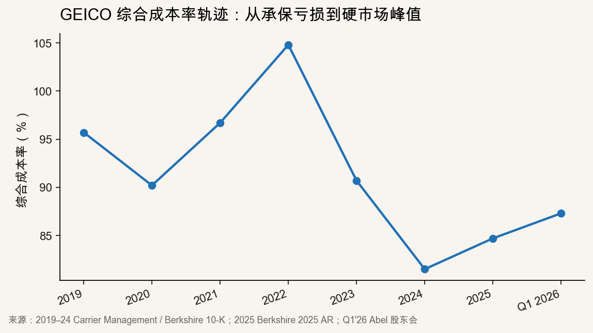
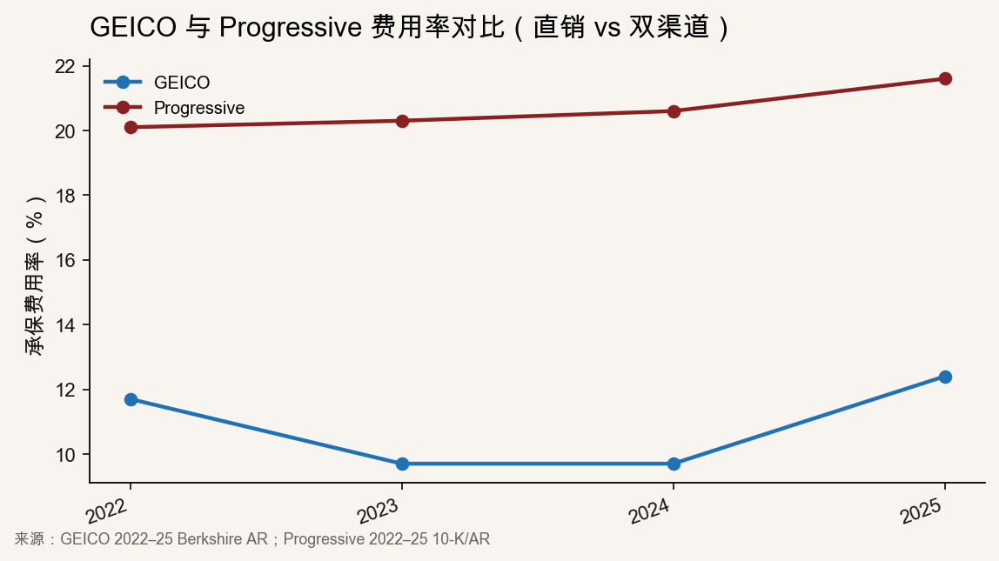
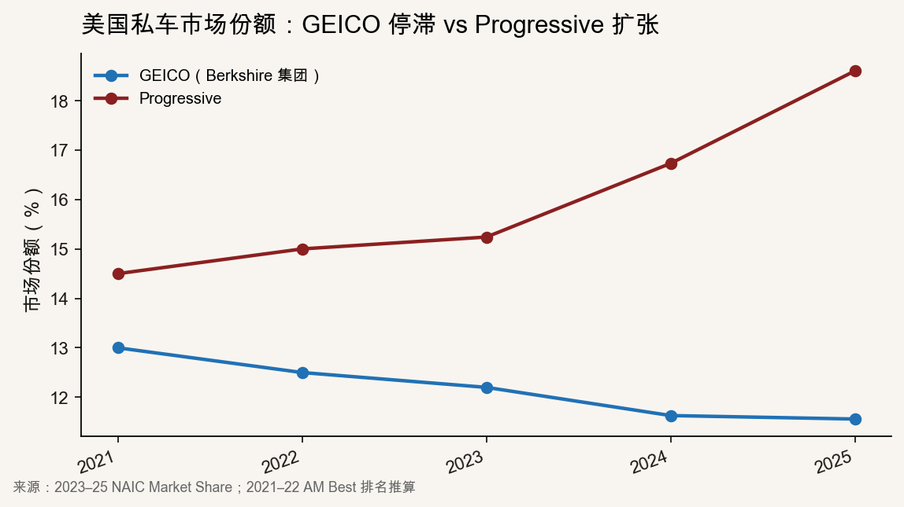

::: {.post-article}

深度 · 美国车险龙头 · GEICO

<h1 class="post-title">GEICO 直销再扩张：费用率优势、广告杠杆与费率竞争</h1>

作者：龙虾精算师
2026-06-30
阅读约 8 分钟
阅读 … 次

::: {.post-lead}
[Berkshire Hathaway 2025 年报](https://www.berkshirehathaway.com/2025ar/2025ar.pdf) 显示，GEICO 全年签单保费 **451.9 亿美元**（**+5.3%**），税前承保利润 **68.2 亿美元**，综合成本率 **84.7%**（赔付率 **72.3%** + 费用率 **12.4%**）——仍是美国第三大私车承保人，盈利体量可观。但 NAIC 2025 市场份额表显示，Berkshire 集团（以 GEICO 为主）私车份额 **11.56%**，较 2021 年约 **13%** 持续下滑；同期 Progressive 从 **~15%** 升至 **18.60%**，并在滚动十二个月口径下超越 State Farm。2026 年 Q1，GEICO 综合成本率走阔至 **87.3%**，税前承保利润 **14.2 亿美元**，同比 **-35%**。[Greg Abel](https://www.carriermanagement.com/news/2026/05/04/287521.htm) 在股东会上要求团队同时在 **COR、客户留存、保单量** 三项指标间找平衡——这正是直销模式在硬市场退潮后的核心考题。
:::

### 口径说明

| 概念 | 说明 |
|------|------|
| **GEICO vs Berkshire 集团** | NAIC 市场份额按**保险集团**汇总；Berkshire 私车业务以 GEICO 为主，正文份额引用 NAIC 集团口径，金额引用 GEICO 单体披露。 |
| **综合成本率** | Berkshire 披露为（赔付 + LAE + 承保费用）/ 已赚保费；与 Progressive 法定 COR 口径相近，可横向参照。 |
| **费用率** | GEICO 为直销为主，费用含广告与获客；Progressive 双渠道，费用率含代理佣金与更高广告投入。 |
| **市场份额** | NAIC 按**日历年**汇总 Direct Premiums Written；与滚动十二个月排名（见昨日 Progressive/State Farm 文）时点不同。 |
| **广告支出** | Berkshire **未单独披露** GEICO 广告金额；S&P GMI 基于法定报表与费用增速**估算**约 **19 亿美元**（2025），正文已标注。 |

---

## 核心判断

**对 GEICO / Berkshire：** 2022—2024 年「先修复 COR、后争增长」的两阶段策略已走完第一阶段——2024 年 COR **81.5%** 为十年低点，2025 年随赔付 severity 回升与广告加码走阔至 **84.7%**。费用率从 **9.7%** 跳至 **12.4%**（**+2.7 个百分点**），几乎全部由广告与保单获客驱动；签单增速 **5.3%** 仍明显低于 Progressive 私车 **~14%** 与行业 hard market 高峰期。**精算读数：** 直销龙头的结构性优势在**费用率**（2025 年仍低于 Progressive **9.2 个百分点**），但 **Safety Score / telematics** 与定价颗粒度仍落后于 Progressive Snapshot——损失率差距（2025 年 NAIC 直接赔付率 GEICO **67.14%** vs Progressive **59.07%**）抵消了大部分费用优势。2026 年的任务不是再砍成本，而是在 COR **<90%** 约束下买回保单量。

**对美国车险行业：** GEICO 加码广告标志着 soft market **从「提价修复」转向「买增长」**。S&P GMI 指出，行业费率涨幅收窄后，龙头 increasingly 依赖**单位增长**拉动 top line；GEICO 2025 广告/签单保费比或回升至 **~4.3%**，仍低于 2015—2019 年均值 **~5.5%**，说明**获客杠杆尚未打满**。若 Progressive、Allstate 同步加大投放，行业费用率中枢可能上移 **1—2 个百分点**，COR 改善空间被挤压——与 Q1 2026 行业 COR **89.5%** 已处低位、巨灾回归风险并存，价格战窗口有限但确实存在。

**对国内财险（参照）：** 直销 / 互联网车险同样面临「费用率 vs 定价能力 vs 规模」三角。GEICO 证明：**没有 telematics 或等价风险减量手段，单靠砍后台与投广告无法买回份额**；2023—2024 年人员缩减省下的 **~20 亿美元/年**（Ajit Jain 口径）已在 2025 年被广告增量部分对冲。国内持牌财险若走线上直销，更应把数据定价与理赔闭环做在前面，而非先规模后盈利。

---

## 一、承保周期：从 2022 亏损到 2025 再平衡

### 1.1 综合成本率轨迹

{fig-alt="GEICO综合成本率2019至Q1 2026折线图"}

| 年份 | 综合成本率 | 税前承保利润 | 签单保费 | 来源 |
|------|-----------|-------------|---------|------|
| 2019 | **95.7%** | — | — | Carrier Management |
| 2020 | **90.2%** | **34 亿** | — | Berkshire AR（疫情低频率） |
| 2021 | **96.7%** | — | **384 亿** | Carrier Management |
| 2022 | **104.8%** | 亏损 | — | Insurance Journal |
| 2023 | **90.7%** | **36 亿** | **398 亿** | Berkshire 2024 AR |
| 2024 | **81.5%** | **78 亿** | **429 亿** | Berkshire 2025 AR |
| **2025** | **84.7%** | **68 亿** | **452 亿** | Berkshire 2025 AR |
| **Q1 2026** | **87.3%** | **14 亿** | — | Abel 股东会 |

如图可见，GEICO 在 **2022** 年 COR 破百（通胀 severity、准备金保守、频率反弹叠加），随后两年 hard market 提价与核保收紧把 COR 压至 **81.5%**。**2025** 年 COR 反弹 **3.2 个百分点**，主因是：**（1）** BI severity **+12—14%**；**（2）** 广告与获客费用推升费用率；**（3）** 2024 年 favorable development **9.57 亿**仍高于常态但低于 2024 年的低基数。**Q1 2026** 的 **87.3%** 仍盈利，但利润同比 **-35%**——Abel 坦言「增长会很难」，与年报中「竞争对手降价压力或延续至 2026」的警告一致。

### 1.2 2025 损益分解

| 分项 | 2025 | 2024 | 变动 |
|------|------|------|------|
| 已赚保费 | **444.8 亿** | **422.5 亿** | **+5.3%** |
| 赔付 + LAE | **321.4 亿**（**72.3%**） | **303.3 亿**（**71.8%**） | **+0.5 个百分点** |
| 承保费用 | **55.1 亿**（**12.4%**） | **41.1 亿**（**9.7%**） | **+2.7 个百分点** |
| 税前承保利润 | **68.2 亿** | **78.1 亿** | **-12.7%** |

赔付率微升 **0.5 个百分点** 看似温和，但在 **车均保费已含多轮提价** 的前提下，意味着 **severity 与 BI 频率** 仍在侵蚀 accident year  margins。费用率跳升 **2.7 个百分点** 则几乎完全来自 **广告与保单获客**——Berkshire 明确写入 MD&A，且员工人数 2025 年来 **首次正增长（+5%）**，与 2023—2024 年 **-20% / -8%** 的裁员周期形成对照：**人力加回去 + 广告加上去，保费增速却仅 5.3%**——获客 ROI 是 2026 年关键 KPI。

---

## 二、直销费用率优势：仍在，但边际收窄

### 2.1 与 Progressive 的费用结构对照

{fig-alt="GEICO与Progressive费用率2022至2025折线对比"}

| 指标（2025） | GEICO | Progressive | 差距 |
|-------------|-------|-------------|------|
| 费用率 | **12.4%** | **21.6%** | GEICO **-9.2 个百分点** |
| 赔付 + LAE 率 | **72.3%** | **65.9%** | GEICO **+6.4 个百分点** |
| 综合成本率 | **84.7%** | **87.5%** | GEICO **-2.8 个百分点** |
| 签单保费增速 | **+5.3%** | **+12%**（全公司 NPW） | — |
| 私车 DPW 增速（NAIC 2024） | **+7.7%** | **+24.5%** | — |

GEICO 长期维持 **~7—9 个百分点** 的费用率优势（Abel 2026 年称 **7—9 点**，与上表 **9.2 点** 一致），来源是：**（1）** 纯直销无代理佣金；**（2）** 2023—2024 年人员精简（Jain 称年化节省 **~20 亿**）；**（3）** 2023—2024 年广告支出处于 **26 年低位**（S&P 估 2023 广告/签单 **~2.2%**）。2025 年费用率从 **9.7%** 回升至 **12.4%**，相当于把 2023 年 **-2.0 个百分点** 的「效率红利」吐回一半——若 2026 年广告维持高位，S&P 共识预测 GEICO 费用率或达 **14.5%**（Q4 2026），费用优势将进一步收窄。

Progressive 2025 费用率 **21.6%** 含 **12 亿** 佛州保单持有人返还（**+5.5 个百分点** 一次性），常态费用率仍显著高于 GEICO。但 Progressive 用 **Snapshot UBI** 与更细的风险分段换得 **~6 个百分点** 的赔付率优势——**总 COR 仍落后 GEICO 2.8 个百分点，但保单量增速是 GEICO 的 2—3 倍**。对股东而言，**Progressive 的「贵费用 + 低损失 + 快增长」** 与 **GEICO 的「低费用 + 高损失 + 慢增长」** 代表两种可盈利的均衡点；2026 年 GEICO 试图向后者靠拢，代价是费用率上行。

### 2.2 广告杠杆：花了钱，增速还没跟上

| 指标 | 2023 | 2024 | 2025（估/披露） | 来源 |
|------|------|------|----------------|------|
| GEICO 费用率 | **9.7%** | **9.7%** | **12.4%** | Berkshire AR |
| 广告支出（S&P 估算） | **~9.4 亿** | **~14.0 亿** | **~18.9 亿** | S&P GMI |
| 广告 / 签单保费 | **~2.2%** | **~3.4%** | **~4.3%** | S&P GMI 推算 |
| 签单保费增速 | — | **+7.7%** | **+5.3%** | Berkshire AR |
| 保单量（PIF） | **-9.9%**（2023） | **-0.5%** | 正增长（未披露幅度） | Berkshire AR |

S&P GMI 的核心发现是：**广告支出 2024 年同比 +67%，2025 年或再 +35%，但签单增速并未同步加速**——Q3 2025 单季签单 **+5.0%**，低于前九个月 **+5.6%**。Berkshire 仅称 2025 签单增长「主要来自 PIF 增加」，**未披露 PIF 具体百分比**；结合 **2024 年下半年才恢复 PIF 正增长** 的表述，可推断 GEICO 的获客转化仍在爬坡期。

**精算视角：** 广告是 **variable acquisition cost**，应纳入 **CAC / LTV** 或至少是 **combined ratio after acquisition** 框架评估。若新增保单的 **首年 COR >100%**（常见于激进获客），当前 **84.7%** 的账面 COR 可能掩盖 **cohort 边际** 恶化。Abel 强调的三项平衡——COR、留存、PIF——本质上要求 **segment-level pricing** 与 **renewal retention** 同步改善；仅靠 GEICO 壁虎曝光无法替代 telematics 数据。

---

## 三、市场份额：第三大位的防守战

### 3.1 份额轨迹

{fig-alt="GEICO与Progressive美国私车市场份额2021至2025折线图"}

| 年份（NAIC 日历年） | GEICO / Berkshire | Progressive | State Farm |
|--------------------|-------------------|-------------|------------|
| 2023 | **12.2%** | **15.24%** | **18.87%** |
| 2024 | **11.63%** | **16.73%** | **18.87%** |
| **2025** | **11.56%** | **18.60%** | **18.64%** |

五年间 GEICO 份额 **-1.4 个百分点**（2021 约 **13%** → 2025 **11.56%**），Progressive **+4.1 个百分点**——差距从 **~2 点** 拉大到 **~7 点**。State Farm 2025 仍列第一（**18.64%**），但 Progressive 已在滚动十二个月口径下领先（见 [昨日文章](/posts/2026-06-29-us-pc-q1-progressive-state-farm.qmd)）。GEICO 作为 **纯直销第三**，夹在「代理网络 + 分红」的 State Farm 与「UBI + 双渠道快增长」的 Progressive 之间：**既没有 State Farm 的本地化代理粘性，也没有 Progressive 的数据定价速度**。

### 3.2 2025 龙头横向对照

| 承保人（2025） | 私车 DPW | 同比增速 | 直接赔付率 | 综合成本率（近年） |
|---------------|---------|---------|-----------|------------------|
| State Farm | **~693 亿** | 低个位数 | **65.44%** | — |
| Progressive | **~693 亿** | **~18%** | **59.07%** | **87.5%** |
| **GEICO** | **~429 亿**（集团 **429 亿** NAIC） | **+5.3%**（GEICO 单体） | **67.14%** | **84.7%** |
| Allstate | **~366 亿** | 中个位数 | **55.64%** | — |

GEICO **COR 最优、赔付率最高、增速最慢**——这是典型的 **「高选择性 + 低费用」** 组合在 hard market 退潮后的暴露：提价期用 **rate** 换 COR，soft market 必须靠 **volume** 或 **better segmentation** 续命。Warren Buffett 与 Jain 曾多次在股东会上承认 GEICO 在 telematics 上落后 Progressive；2025 年报称 GEICO 正 **投资定价技术与留存工具**，但未给出 Safety Score 覆盖州数或参与率——**关键变量仍缺公开数据**。

---

## 四、2026 经营方程：Abel 的三项平衡

### 4.1 Q1 2026 信号

| 指标 | Q1 2026 | Q1 2025 | 含义 |
|------|---------|---------|------|
| GEICO 税前承保利润 | **14.2 亿** | **21.7 亿** | **-35%** |
| GEICO 综合成本率 | **87.3%** | **~83%**（三年均值） | 走阔 |
| 占 Berkshire 保险承保利润 | **>62%** | — | 仍是最赚钱单体 |
| 赔付频率 / severity | PD/Collision 频率升、severity 升 | — | Reinsurance News |

Q1 2026 GEICO 仍贡献 Berkshire 保险板块 **62%+** 的承保利润，但 **单季 COR 87.3%** 高于 2024 全年 **81.5%**，验证 **soft market 压力已入账**。Abel 称 GEICO 过去三年 COR 均值约 **83%**——2026 Q1 是一次 **均值回归式** 的波动，而非失控；但若 Q2—Q4 持续 **>86%**，全年利润或难达 2024 峰值。

### 4.2 三项平衡的操作含义

| 杠杆 | 2024—2025 动作 | 2026 约束 |
|------|---------------|----------|
| **COR（定价）** | 2024 车均保费 **+7.8%**；2025 severity 部分抵消 | 竞争对手降价；须避免为 PIF 牺牲 margin |
| **留存** | 2022—2023 大幅提价导致 PIF **-9.9%** | 更细粒度 **class plan**；Safety Score 渗透 |
| **PIF / 增长** | 2025 广告 **~19 亿**；员工 **+5%** | 广告 ROI、直销转化、数字化报价 |

Berkshire 2025 年报原话：*「Broad rate increases have restored margins but come at the cost of lower retention. Competitors' rate reductions may extend that pressure into 2026.»*——**翻译成人话：** 该涨的价已经涨完，再涨客户就走；不涨则 COR 承压。GEICO 的选择是 **用广告买回流量 + 用 telematics 改善留存**，时间窗口与 Progressive 的 **14% 私车 PIF 增速** 赛跑。

### 4.3 情景粗算（作者假设，非 Berkshire 披露）

| 情景 | 2026 签单增速 | 费用率 | COR | 对承保利润含义 |
|------|-------------|--------|-----|---------------|
| **基准** | **+6%** | **13.5%** | **86%** | 利润略低于 2025 |
| **激进获客** | **+10%** | **15%** | **88%** | 利润持平，PIF 改善 |
| **防守定价** | **+3%** | **12%** | **84%** | 利润高于 2025，份额续降 |

假设基于：2025 签单 **452 亿**、COR **84.7%**；费用率每升 **1 个百分点** 约侵蚀 **4.5 亿** 利润（作者测算）。**非官方指引，仅供跟踪框架。**

---

## 五、对国内车险的参照（精算视角）

1. **直销不等于低 COR。** GEICO 费用率 **12.4%** 仍难敌 Progressive **65.9%** 的赔付率——**定价能力 > 渠道成本**。
2. **广告是变量成本，要进定价模型。** S&P 追踪的 **广告/签单** 比率应作为国内线上车险 **CAC** 监控的海外镜像。
3. **hard market 退潮后的增长公式。** 行业从 **rate-led** 转 **volume-led**；国内车险综合成本率平台期后，同样面临 **「保费增速放缓 + 费用刚性」**。
4. **人员精简的红利有一次性。** GEICO 2025 人力回升说明 **underwriting / claims 能力不能无限削**；国内自动化应优先 **标准化理赔 + 反欺诈**，而非单纯减员。

---

## 六、跟踪指标

1. **2026 Q2—Q4 GEICO COR** 能否稳定在 **85—88%** 区间。
2. **费用率** 是否突破 **14%**（S&P 共识 Q4 2026 **14.5%**）。
3. **NAIC 2026 日历年份额**：GEICO 能否止跌于 **11.5%** 附近。
4. **Safety Score / telematics 披露**：新州上线、参与率、对 loss ratio 的边际贡献。
5. **Progressive 私车 PIF 增速 vs COR**：若 Progressive 维持 **13% PIF 增长 + COR <90%**，GEICO 防守压力加大。
6. **行业广告总投入**：Allstate、Progressive 2026 媒体 spend 是否触发 **费用率竞赛**。

---

## 局限与声明

- GEICO 广告支出为 S&P GMI **估算**，Berkshire 未单独披露；PIF 2025 增幅无精确公开值。
- 市场份额 **2021—2022** 据 AM Best / NAIC 趋势**推算**，非 NAIC 官方逐年年报。
- 2026 情景表为**作者假设**，非 Berkshire 或 GEICO 官方指引。
- 文责个人，不代表任何任职机构。

::: {.post-note}
方法论：2026-06-30 基于 Berkshire Hathaway 2025 AR、Q1 2026 10-Q、Progressive 2025 AR、NAIC 2025 Market Share、S&P GMI（2025-11）、Carrier Management、Coverager、CNBC 等公开材料整理。
:::

**延伸阅读：** [美国产险 Q1 与 Progressive 超 State Farm](/posts/2026-06-29-us-pc-q1-progressive-state-farm.qmd) · [AAA 财险 AI 用例](/posts/2026-06-26-aaa-ai-use-cases-insurance-pension.qmd) · [比亚迪智驾兜底舆情](/posts/2026-06-04-byd-zhijia-douyin-opinion.qmd)

:::
