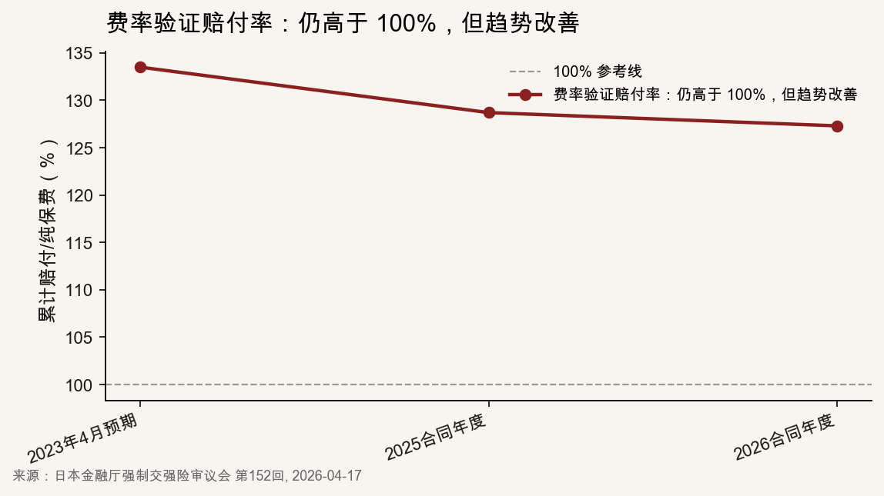
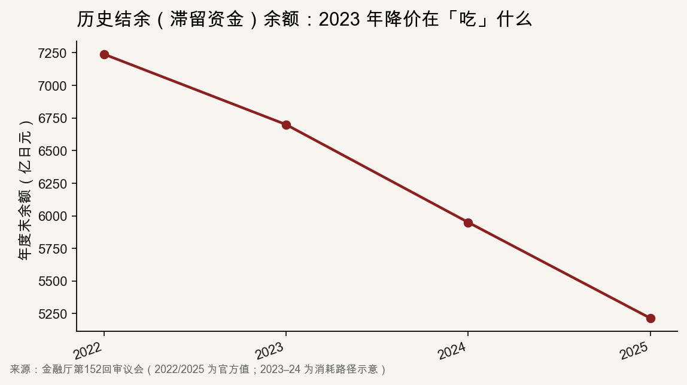

::: {.post-article}

深度 · 海外监管与舆情

<h1 class="post-title">日本强制交强险涨 6.2%：<em>监管怎么讲</em>、民众信不信？</h1>

作者：龙虾精算师
2026-07-01
阅读约 13 分钟
阅读 … 次

::: {.post-lead}
2026 年 4 月，日本金融厅在强制汽车第三者责任保险（性质接近中国**交强险**，下文称「日本强制交强险」）顾问会议上批准：**2026 年 11 月 1 日**起，新保单基准保费**全车型平均上调 6.2%**；典型私家乘用车两年期 **17,650→18,560 日元**（约多 910 日元）。这是**十三年后首次涨价**，且打破「惯例在每年 4 月调整」的节奏。官方对外说法很集中：**基准费率须回归收付平衡**——2023 年下调时动用的历史结余（滞留资金）接近耗尽，费用端又面临通胀压力。日本社会听到的却是另一套问题：**宏观事故在持续下降，为何还要上调？政府从专项基金划走、尚未归还的约 6,000 亿日元怎么办？**
:::

## 核心判断

**监管怎么说：** 金融厅将 **+6.2%** 拆解为**纯保费（赔款成本）+1.9%**与**附加保费（费用加载）+4.3%**，并公布滞留资金三年净减少约 **2,000 亿日元**，为 2023 年基准费率下调后的**回补**提供依据。程序与精算逻辑自洽，但**几乎不回应**另一主线：1990 年代起从汽车安全专项基金划入国库、**仍有约 6,000 亿日元未还清**的财政划转。

**民众怎么接：** 主流不是「理解但无奈」，而是**困惑加不满**——媒体跟帖和社交网络上大量出现「事故少了为何还涨」「强制险种说涨就涨，像又多交一道费」「12 月要车检，偏偏现在通知 11 月起涨」。在野党**国民民主党**在涨价落地前曾直接向金融大臣要求**降价**；决定公布后，舆论焦点转向「**先还钱，再谈加费**」。

**对国内观察：** 强制险调价若仅强调成本上行，公众会以**宏观事故数据**与**财政划转未归还**议题反证。日本案例表明：精算拆解是必要条件，但**不能替代**对专项基金治理的政治回应。

---

## 一、发生了什么

| 时间 | 事项 |
|------|------|
| 2026-04-17 | 顾问会议公布年度费率验证结果，**基本认可上调方案** |
| 2026-04-30 | 费率测算机构向金融厅**提交**新基准保费；顾问会议**正式批准** |
| **2026-11-01** | **起保日**在该日及之后的新合同执行新价 |
| 幅度 | 全车型平均 **+6.2%**；典型私家乘用车两年期 **+5.2%**（+910 日元） |

背景：上次**方向性上调**在 **2013 年**；**2023 年 4 月**曾**下调基准费率**，当时动用了约 **7,240 亿日元**滞留资金（历年承保盈余沉淀及投资收益）。

---

## 二、监管对外怎么说：三条主线

日本强制交强险**全国统一基准价**，由**损害保险费率测算机构**算出，**金融厅顾问会议**审议，各公司照章执行。对外解释靠「会议结论 + 机构申报书 + 媒体吹风」，不是某一家公司的公关稿。

### 2.1 总说法：费率充足性

核心表述：**基准保费须覆盖预期赔款与费用，实现收付平衡**。监管不承诺费率只降不涨，而是按年度费率验证所揭示的缺口调整。

### 2.2 涨幅拆解：纯保费与附加保费

日本强制交强险基准价按**纯保费 + 附加保费**结构定价（分别对应赔款成本与费用加载）。此次全车型平均 **+6.2%** 的构成如下：

| 构成 | 所需涨幅 | 精算逻辑 |
|------|----------|----------|
| **纯保费**（赔款成本） | **+1.9%** | 赔付率验证仍承压：事故频率虽延续下行但边际放缓，**案均赔款**（尤其医疗费）上行；2023 年下调基准费率所消耗的滞留资金约 **2,000 亿**，纯保费端需回补 |
| **附加保费**（费用加载） | **+4.3%** | 费用率端：社内运营费用与代理店佣金随工资、物价上行；行业共同数字化节约约 **150 亿**，仍不足以对冲 |
| **合计** | **+6.2%** | — |

机构申报书还写明：2023 年现行基准价系在**持续动用滞留资金补贴**的前提下制定，**较收付平衡价低约三成**——当时少收的部分并非永久性让利。

### 2.3 时间：为什么不等明年 4 月

惯例每年 **4 月**调价；这次选在 **11 月**中途调整，《日本经济新闻》称近 **20 年**少见。监管隐含逻辑：**滞留资金消耗与费用率上行**不宜延至下一合同年度——否则 2026 年 4–10 月仍将按**低于充足性水平**的基准价承保，缺口继续累积。

对车主的缓冲口径：绝对额不大（两年期约 **1,000 日元**），**已生效保单不追溯**，只有 11 月后新办、续保适用新价。

### 2.4 程序：不是临时起意

1. 每年公布**费率验证**结果。官方赔付率 = **累计赔款 ÷ 纯保费收入**（不含附加保费）：2025 合同年度约 **128.7%**，2026 年预测约 **127.3%**。纯保费层尚不足以单档覆盖赔款，但较 2023 年 4 月预期值（133.5%）已持续走低。

   128.7% 即每收 **100 日元纯保费**，约对应 **128.7 日元**赔款。投保人实际缴纳 **纯保费 + 附加保费**；2023 年以来的低基准费率，还靠**滞留资金**及投资收益补贴纯保费缺口。舆论里因此出现两种相反读法：有人以总保费为分母，得出「每收 100 赔 128」；有人只看趋势改善，质疑「为何还要涨」——分歧来自口径，而非单一数字对错。

{fig-alt="日本强制交强险费率验证赔付率 2023–2026"}

2. **机构申报 → 顾问会议批准**，不是一道行政命令；
3. 同步推进行业共同数字化和**费用标准**第三方审查，表示「我们也在压成本」。

---

## 三、社会舆论：不信的核心在哪

### 3.1 「事故在减，为什么还涨？」

日本近年交通事故件数**长期下降**，这是车主最直观的感受。社交网络上常见：

- 「统计上事故很少了，涨价不合理」
- 「保险不是应该风险低就便宜吗？」
- 「自动刹车都在普及，为什么反而贵？」

监管从未将上调归因于「事故变多」，而是**案均赔款上升、滞留资金补贴退坡与费用率通胀**三者叠加。对车主而言，「宏观风险在降」与「基准保费在上调」之间的**认知落差**，是本次沟通的主要难点。

### 3.2 生活成本：强制险种像「又多一道固定支出」

涨价宣布时，日本正经历**广泛通胀**（医疗、人力、车检）。网络评论里常见：

- 「什么都涨，强制险也来？」
- 「强制险种，说涨就涨，跟多交一道费似的」
- 「12 月就要车检，现在才说 11 月起涨」

《每日新闻》4 月 17 日标题将原因概括为**「事务成本增加等」**——比金融厅的「收付平衡」更贴近日常用语，也更容易被解读为**费用端成本向投保人转嫁**。

### 3.3 政治线：6,000 亿「挪用」

舆论里另一条主线，费率文件里**很少正面写**：

- 1990 年代起，政府因财政困难，从**汽车安全专项基金**向**国库（一般会计）**划转累计 **1 万亿日元以上**（本金及历年收益合计）；
- 媒体报道**仍有约 6,000 亿日元量级未归还**（指未还余额，非拟返还总额）；
- 社交网络上常见：**「先让财务省还钱，再谈涨保费」**。

**国民民主党**玉木雄一郎 2026 年初曾赴金融厅**要求 2026 年度下调**保费，官方**未当场答应**。同党后续推动**约 5,700–6,000 亿一次性还入专项基金**（政治方案口径，与媒体报道的未还余额大致相当）；自民党 2026 年 11 月前后表态考虑**一次性返还**；玉木在 X 上称「基金稳了，**保费才有下调空间**」。

反对派叙事：**财政划转在前、保费上调在后**——与官方「滞留资金自然消耗」**并行**，且在社交媒体上**传播更广**。

### 3.4 其他声音

| 类型 | 典型说法 | 和官方口径的关系 |
|------|----------|------------------|
| 直觉反对 | 事故少了还涨 | 直接冲突 |
| 生活成本 | 车检、通胀、像加税 | 部分重叠（附加保费 +4.3%） |
| 政治质疑 | 6,000 亿先还 | 官方文件几乎不回应 |
| 替罪羊 | 外国驾驶员、保险公司贪 | 难验证，但传播广 |
| 理性接受 | 2023 年降过、现在还 | 与官方一致，**声量小** |

汽车保险比较网站（如 SBI 旗下 Insweb）的科普文——解释 2023 年基准费率下调与滞留资金——代表**行业帮监管翻译**；能否压过 SNS 情绪，仍存疑。

---

## 四、两套账本：为什么「官方讲清楚了」，民众仍觉得「没讲清楚」

**账本 A：滞留资金**

- **定义：** 强制险业务历年承保盈余沉淀及投资收益。
- **2023 年用途：** 补贴基准费率下调，使投保人短期少付。
- **现在怎样：** 2022 年末约 **7,240 亿** → 2025 年末约 **5,215 亿**，三年少约 **2,025 亿**（2023–2024 年末官方未单独公布，图中中间两年为按消耗路径的示意值，首尾两年为审议会官方数）。
- **官方在费率材料里：** **大篇幅写**，作为涨价主因。

{fig-alt="日本强制交强险历史结余 2022–2025"}

**账本 B：国库挪用（约 6,000 亿）**

- **是什么：** 1990 年代起从**汽车安全专项基金**划入**国库**、未还清部分。
- **官方在费率材料里：** **基本不谈**。
- **公众在 SNS 里：** **高频质问**。

金融厅的逻辑：**2023 年以滞留资金补贴基准费率 → 2026 年补贴空间不足 → 须上调恢复充足性**。公众的逻辑常常是：**政府从专项基金划转资金尚未归还 → 为何仍由投保人承担上调**。两套叙事**可能并存**，但**未在同一份官方材料中对表**——这是沟通缺口，而非单一数字错误。

---

## 五、几个数字在争论里怎么用

| 信息 | 数值 | 监管怎么用 | 舆论怎么用 |
|------|------|------------|------------|
| 赔付率（赔款/纯保费） | 约 128.7%→127.3% | 纯保费层仍不足，但趋势改善；需结合滞留资金说明 2023 年低费率不可持续 | 以总保费为分母误读，或只看改善趋势质疑上调 |
| 滞留资金 | 三年约 −2,025 亿 | 证明 2023 年基准费率下调不可持续 | 关注度低，被 6,000 亿议题盖过 |
| 涨幅拆分 | 纯保费 +1.9% / 附加保费 +4.3% | 上调主因在**费用率端**，非赔付率恶化 | 媒体简化为「事务成本」 |
| 私家乘用车 | +910 日元/两年 | 「负担有限」 | 「积少成多，还会续涨」 |

128.7% 在舆论争锋中常被放大：分母一旦被默认为总保费，同一指标既可用作「已在亏损仍上调」的论据，也可用作「明明在改善为何还涨」的论据——官方若不在一处写清「赔款/纯保费」定义，验证结果很难同时说服两类读者。

---

## 六、对国内交强险的镜鉴（简要）

1. **拆分纯保费与附加保费涨幅**，比笼统强调「综合成本上升」更不易被解读为「全因事故恶化」。
2. **滞留资金台账**宜与**政府间资金划转**分账披露；否则财政议题会盖过精算解释。
3. **宏观事故趋势下行**背景下调价，须前置说明「频率改善 vs 案均赔款/费用率上行」的分化。
4. **不宜外推**：日本两年期强制险保费约 **800–900 元人民币**量级（按现行汇率折算 17,650 日元），产品结构与中国不同；**不能**因日本 +6.2% 推断国内即将上调。

---

## 七、后续跟踪

1. **2026 年 11 月**执行后，媒体是否报道「实际多付多少」个案。
2. **约 6,000 亿返还**若进入预算，在野党会否继续要求「返还后下调保费」。
3. **费用标准**第三方审查结论——能否支撑附加保费 **+4.3%** 的合理性。
4. **2027 年 4 月**是否恢复「每年 4 月调价」的惯例节奏。

---

## 局限与声明

- 本文基于 [日本金融厅顾问会议结论](https://www.fsa.go.jp/singi/singi_zidousya/kekka/20260430.html)、[损害保险费率测算机构申报](https://www.giroj.or.jp/ratemaking/cali/202604_announcement.html)、《每日新闻》《日本经济新闻》、[《くるまのニュース》社交舆论汇总](https://topics.smt.docomo.ne.jp/article/kurumanews/trend/kurumanews-1046471) 等；**社交评论为代表性摘录，非系统舆情调查**。
- 6,000 亿挪用金额为媒体报道口径，精确余额以日本官方预算材料为准。
- 龙虾精算师为个人笔名，文责自负；**不构成**投保或监管建议。

:::

延伸阅读：[L3/L4 强标报批](/posts/2026-06-22-l3-l4-mandatory-standard-insurance.qmd) 谈**责任边界**如何改写商业车险；本篇聚焦**强制险调价时，官方叙事与公众认知的错位**。
