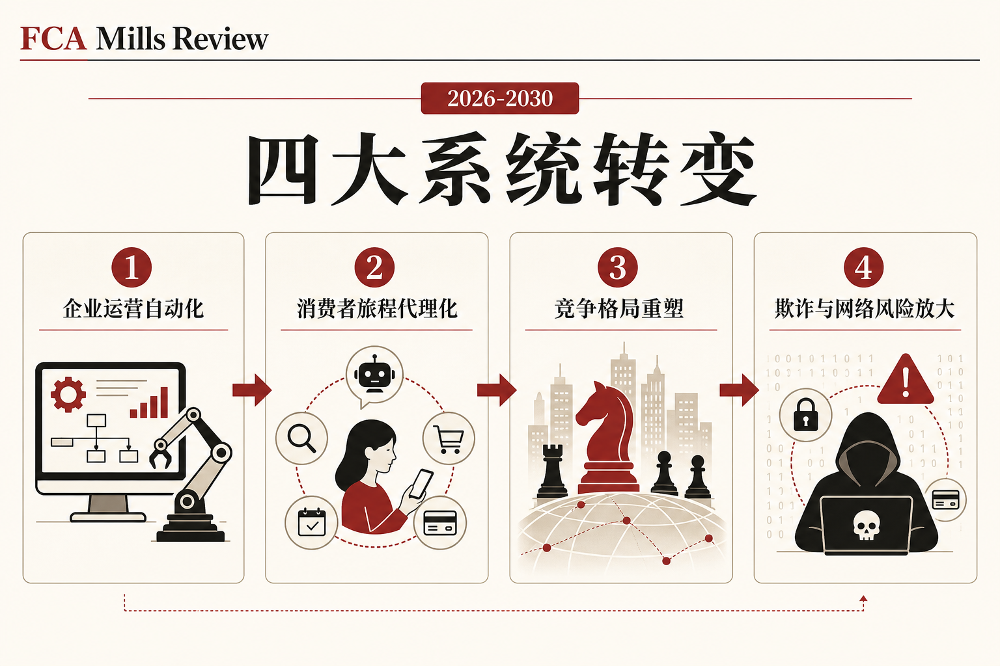
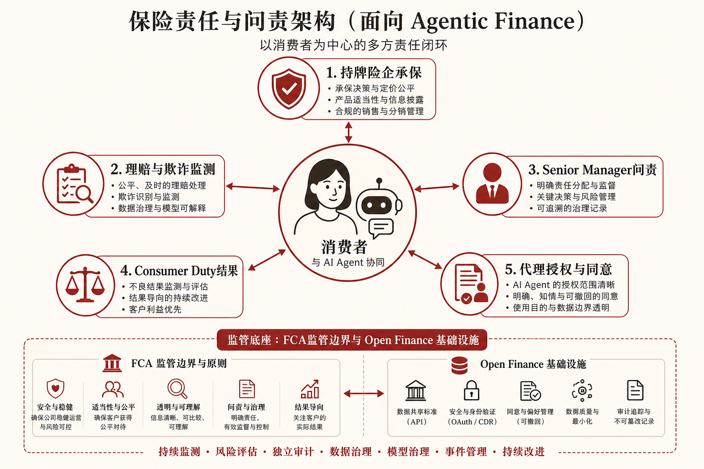

::: {.post-article}

监管 · 代理式金融

<h1 class="post-title">FCA Mills Review 深度解读：<em>代理式 AI</em>如何改写零售金融与保险监管</h1>

作者：龙虾精算师
2026-07-07
阅读约 17 分钟
阅读 … 次

::: {.post-lead}
2026 年 7 月 6 日，英国**金融行为监管局**发布 **Mills Review** 全文，题目为《AI and the future of retail financial services》。这是全球主要监管机构**首次**以董事会授权、专项审查的形式，把生成式 AI 与**代理式 AI**对零售金融的影响写到 2030 年路线图层面。审查由 FCA 执行董事 **Sheldon Mills** 牵头，2026 年 1 月 27 日启动征询，2 月 24 日截止，共收到 **140 份**书面意见。配套消费者调研显示，约 **20%** 英国成年人——折合约 **1100 万人**——愿意在预设目标下让 AI **代为做出**财务决策。报告不另立 AI 专项规则，而是在既有**原则导向**框架内，标出四条系统转变、七项优先建议，以及承保、理赔、养老金销售里即将承压的监管接口。
:::

### 读前必知：四个名词

| 名词 | 含义 |
|------|------|
| **代理式 AI / Agentic AI** | 在授权范围内自主执行多步任务的 AI 系统，可代用户比价、转账、续保、提交理赔材料，人类从「操作者」转为「监督者」。 |
| **Mills Review** | FCA 董事会 2026 年 1 月委托的独立评估，聚焦零售金融中高级 AI 对消费者、市场与监管的影响。 |
| **Consumer Duty** | 英国对零售客户的「良好结果」义务，要求产品合适、价值公平、沟通有效、支持到位；AI 自动化加深后，举证难度上升。 |
| **SMR / Senior Managers Regime** | 高级管理人员制度，把监管责任落实到具名个人；AI 自主性提高时，「合理步骤」边界成为合规焦点。 |

---

## 核心判断

**判断一：Mills Review 定调的是「系统转变」，覆盖零售金融全链条，而非个别险企的科技采购清单。** AI 能力被定位为 2030 年前重塑零售金融的**系统性驱动因素**。险企内部的聊天机器人项目，若仍停留在客服脚本层，尚未触及报告所说的运营主通道迁移。

**判断二：监管框架被认定「总体仍然适用」，但五条压力带已经点名。** 报告明确原则导向、Consumer Duty、SMR、运营韧性等既有工具可伸缩，同时指出**监管边界**、**运营韧性**、**咨询与指导分界**、**Consumer Duty 举证**、**代理式金融基础设施**五处将在「人类观察、AI 执行」模式下承压。近端最紧的是边界与韧性，险企第三方模型依赖直接落在这里。

**判断三：七项建议里，「代理式金融基础设施」与「代理式监管」对保险业的长期影响可能大于短期 perimeter 审查。** 第五条建议要求 FCA 牵头可信代理参与框架，第六条要求建设 AI 赋能的**代理式监管模型**。前者关系到理赔代理、续保代理、养老金切换代理的授权与追责；后者意味着监管数据采集从周期性检查转向连续监测，险企报送粒度会提高。

**判断四：消费者调研里的 1100 万「愿委托」人口，反映的是需求侧意愿，尚不足以直接换算为市场渗透率。** 信任、控制感与付费能力仍制约采纳。报告第七条建议的**公共金融能力 AI 服务**——由 FCA 联合财政部、行业与消费者组织探索的免费支持渠道——若落地，会改变零售端信息来源结构，间接挤压险企自有数字渠道与中介咨询的份额。

---

## 一、审查怎么做的：从征询到 7 月定稿

### 1.1 启动背景

2026 年 1 月，英国财政部委员会曾公开批评：监管不确定性拖慢了金融业 AI 投资。多家机构在 Mills Review 结果出炉前暂停大额部署决策。1 月 27 日 FCA 发布 **Engagement Paper**，围绕四个主题征集意见：

1. AI 技术如何演进，含更自主、更代理化的系统；
2. 对机构与市场结构、英国竞争力的影响；
3. 对消费者行为与预期的影响；
4. 监管机构自身应如何演进。

征询期一个月，书面意见 **140 份**，问题清单覆盖 **20 个**议题。4 月配套发布的消费者研究为定量判断提供底座。

### 1.2 报告的核心叙事

Mills 在新闻稿中的表述是：人工智能将在 **2030 年前**改写金融服务，为个人、机构与宏观经济创造重大机会，报告同时给出监管与行业应对路线图。

技术侧，报告把能力演进概括为：

- 从**辅助**走向**委托**：代理式 AI 在机构与消费者两侧接管更长任务链；
- 可靠、一致、可解释与可问责仍是硬约束，人类监督随委托深度而重新定义；
- **AGI** 与量子计算被列为时间不确定、后果深远的扰动因素，要求提前预案。

监管侧，报告**不主张**为 AI 单独立法，重点落在强化既有框架在自主系统下的适用方式，并补足代理式金融所需的**市场基础设施**。

---

## 二、四大系统转变：险企落在哪几条线上

{fig-alt="FCA Mills Review 列出的四大系统转变：企业运营、消费者旅程、竞争格局、欺诈与网络风险"}

### 2.1 企业运营：从工具到主通道

零售金融机构正把 AI 从试点工具推进为**跨职能主通道**，覆盖客户服务、**核保**、合规监测、**理赔处理**与产品设计。报告预测，到 2030 年，领先机构的信息处理、客户服务与结果举证可能**主要由 AI 流水线承担**，员工角色转向监督、例外干预与模型风险管理。

对财险与寿险的具体含义：

| 职能 | 变化方向 |
|------|----------|
| **核保与定价** | 多源数据实时入模，人工核保员处理边界案与模型漂移 |
| **理赔** | 文档分类、欺诈评分、简单案自动赔付与复杂案辅助并行 |
| **合规** | 交易监测、营销材料审查、投诉主题聚类自动化 |
| **产品** | 动态组合、个性化保障与动态定价的迭代周期缩短 |

第三方模型与云依赖加深，**外包治理**与 **Critical Third Party** 框架并重。报告警告：多机构共用同一基础模型，可能带来**相关决策**与同步失效，这是组合层面而非单家险企报表能完全捕捉的风险。

### 2.2 消费者旅程：代理购物、代理续保、代理理赔

消费者侧，AI 代理可能从「给建议」升级为「在授权额度内持续管理财务」：自动比价、切换供应商、调整储蓄配置、**代为提交理赔**与跟进赔付。报告认为这有助于缓解**低转换率**、**保障缺口**与**咨询缺口**等老问题，同时也提示**偏见定价**、**不透明个性化**与**操纵性推荐**的风险。

信任、控制与**挑战 AI 决策的能力**被反复强调。对保险业，这意味着：

- 保单条款与授权范围需可机器读取，代理在什么条件下可发起理赔、接受和解，要有清晰默认与撤销机制；
- 沟通义务从「人读懂」扩展到「代理读懂且可审计」；
- 弱势群体若买不起高端 AI 工具，可能扩大数字鸿沟——与第七条公共能力服务建议形成对照。

### 2.3 竞争格局：险企与 AI 平台谁握有关系

AI 可能降低进入壁垒，也可能把市场权力集中到少数**控制模型、算力与客户界面**的科技平台。报告提出：控制 AI 驱动界面的主体，可能决定消费者看到哪些保险产品，客户关系从持牌机构滑向平台。监管边界问题由此凸显——平台影响金融决策，却未必承担等同的持牌义务。

对保险分销：比价网站、超级应用与操作系统级助手，若嵌入代理式续保与切换，**佣金结构**与**客户归属**会被重写。报告未点名具体公司，但评论界普遍读出对大型科技平台角色的追问。

### 2.4 欺诈与网络风险：攻防同时 AI 化

到 2030 年，欺诈者可用 AI 生成深度伪造、合成身份与高度个性化诈骗；消费者把更多操作交给代理，**凭证与授权链**攻击面扩大。与此同时，AI 也可强化欺诈检测、安全运营与监管监测。报告结论：机构、监管与执法需具备**对等的 AI 能力**，并加强情报共享，否则防御方持续落后。

保险理赔与核保是欺诈对抗前线：图像造假、医疗单据合成、车联网数据篡改，在代理式理赔通道里可能更快规模化。报告对**跨机构关联监测**的强调，与险企现有反欺诈联盟方向一致，但对实时性与模型可解释性要求更高。

---

## 三、既有监管工具在五处承压

报告用专门章节评估英国现行框架，结论可压缩为五组张力：

### 3.1 监管边界 perimeter

英国按**活动**而非技术划定牌照范围，总体仍有效。张力在于：不持牌的大型 AI 平台若深度影响储蓄、投资、保险购买决策，保护网可能出现**空洞**。报告建议短期对通用大模型在零售金融中的使用做影响评估，并审视咨询/指导规则、金融推广与「经营活动」测试在 AI 旅程中的适用。

### 3.2 咨询与指导分界

**Regulated advice** 与 **guidance** 的区分，在 AI 个性化规模化后更容易模糊。报告承认 **targeted support** 已试图缩小咨询缺口，代理式 AI 可能把「群体相似客户推荐」进一步推进到**个体级持续建议**，未持牌主体提供「类咨询」服务的套利空间随之扩大。

### 3.3 Consumer Duty

在 AI 辅助人工决策时，Duty 适用路径清晰；自主性提高后，**公平价值**与**个性化定价**的边界更难举证，动态旅程使「消费者理解并同意」更难留存证据。报告呼吁在自主系统下补充关于结果举证、有效同意与群体公平性的指引。

### 3.4 SMR 高级管理人员责任

SMR 把责任锚定在具名高管，防止机构在 AI 驱动增长中放松监督。人工主导决策时制度有效；模型不透明、自主性高时，**合理步骤**是否包含模型验证、漂移监测、第三方审计，需要更明确的监管预期。报告认为，清晰指引配合 AI 保证工具，可降低机构采纳先进 AI 的不确定性。

### 3.5 运营韧性与关键第三方

重要业务服务识别、中断容忍与 **Critical Third Party** 监管，是单家机构管理 AI 依赖的主工具。报告补充：生态级风险——共享模型、相关自动化、科技集中度——可能超出单体韧性框架，需要监管者跨机构视图。

---

## 四、代理式金融：授权、同意与追责

报告专章讨论 **Agentic finance**：消费者与企业的 AI 代理执行支付、监控储蓄、切换供应商、管理投资与**处理理赔**。成功依赖可信基础设施：数据访问、身份、**行动授权**、交易执行与**问责链条**。

{fig-alt="代理式金融问责示意：消费者 AI 代理与持牌险企承保、理赔监测、Senior Manager 问责、Consumer Duty 与授权同意之间的关系"}

上图归纳报告隐含的责任分层：持牌机构仍对**客户结果**负责；代理授权与同意机制必须可验证；高级管理人员对模型与外包链条负有**合理步骤**义务；监管边界需覆盖「谁可以代客行动」。

第五条建议要求 FCA 考虑牵头**可信代理参与框架**，明确代理如何被授权、识别与追责。业界评论普遍把 **Open Finance** 视为推荐技术路线——标准化账户与支付访问，使代理在可审计通道内行动。对保险，类比延伸是**理赔状态、保单条款与医疗/车损数据的受控共享**，目前各国进度不均。

---

## 五、七项优先建议：执行顺序与保险接口

| # | 建议 | 与保险/精算相关的要点 |
|---|------|------------------------|
| 1 | **Secure and adapt the regulatory perimeter** | 评估 LLM 与通用 AI 对储蓄、投资、养老金、房贷与保险旅程的影响；审视咨询/推广规则缺口 |
| 2 | **Strengthen system-wide coordination** | 跨 FCA、PRA、竞争与市场管理局、信息专员办公室及国际伙伴协调 AI 韧性、数据与系统性风险 |
| 3 | **Monitor transition to autonomous models** | 澄清自主系统下问责与 Consumer Duty 适用；推动动态模型风险管理、偏见与漂移监测 |
| 4 | **Scale up the FCA AI Lab** | 建立评估金融 AI 模型与系统的专门能力，早期介入可解释性、治理与保证实践 |
| 5 | **Enable foundations for agentic finance** | 牵头代理授权、身份与问责框架，为续保、切换、理赔代理铺路 |
| 6 | **Build agentic supervisory model** | 监管端采用 AI 赋能的连续监测，覆盖授权、执法与系统性风险识别 |
| 7 | **Public-interest financial capability AI service** | 探索免费、公共利益的 AI 金融支持服务，缩小付费工具带来的能力鸿沟 |

FCA 董事会与执行层需逐项审议。报告发布后，FCA 表态将按建议推进，并强调原则导向路径在过去一年已使其能跟上技术变化。

---

## 六、对承保、理赔与养老金条线的实务提示

### 6.1 承保与定价

- 把 **SMR 合理步骤**写入模型生命周期：训练数据治理、公平性测试、上线后漂移监测、第三方模型变更通知；
- 个性化定价在 Consumer Duty 下需留存**价值公平**举证，动态调价日志要成为审计对象；
- 共用基础模型时，在组合风险报告中增加**技术集中度**与**相关失效**情景。

### 6.2 理赔与欺诈

- 代理式理赔入口要定义：代理可上传哪些材料、可接受何种和解、何时必须人工复核；
- 反欺诈从单案规则扩展到**跨机构图模型**，与报告呼吁的情报共享方向一致；
- 深度伪造损失可能推动**网络安全与欺诈保障**条款迭代，再保合约需跟踪。

### 6.3 养老金与长期储蓄

报告明确把养老金纳入 perimeter 评估。代理式 AI 若代客调整缴费、切换基金或整合多账户，咨询边界与适合性义务会被重新解释。寿险与投资联结产品销售渠道，需提前设计**人类接管**触发条件。

### 6.4 监管科技对称性

第六条建议意味着 FCA 自身将更多用 AI 做连续监督。险企报送的数据结构、时效与粒度可能向「准实时」靠拢，传统季度合规包会显滞后。

---

## 七、全球坐标：为何英国先行、他国如何对照

Mills Review 被多家媒体称为**全球首个由监管机构发起**的同类系统性文件。欧盟 **AI Act** 与各国央行指引多从风险分类或模型登记入手，英国选择强化**既有金融业监管 toolkit**，与伦敦市场习惯一致。

对中国机构而言，直接适用性有限，但三条线索值得跟踪：

1. **代理式理赔与续保**的客户授权范式，可能通过再保人与国际经纪人合同传导；
2. **第三方大模型集中度**进入偿付能力压力测试讨论，与国内险企云与模型采购策略相关；
3. **公共金融 AI 服务**若在英国试点，会影响中资险企海外子公司的数字渠道定位。

---

## 八、跟踪清单

1. **FCA perimeter 评估**是否启动立法或指引修订，尤其咨询/推广与「经营活动」测试；
2. **Open Finance / 代理授权标准**的技术细则与保险数据接口是否纳入；
3. **AI Lab** 扩容后是否发布金融模型评估案例，核保与理赔模型或成首批样本；
4. **第七条公共能力服务**的政策设计：免费服务的范围是否含保险比较与理赔辅导；
5. **PRA 与 FCA 联合文件**对自主系统下模型风险管理的补充要求；
6. 行业组织与评论界对 **Big Tech 边界**的后续国会听证与立法动议。

---

## 局限与声明

- 正文依据 FCA 2026 年 7 月 6 日公布的 Mills Review 全文、新闻稿及 Regulation Tomorrow、FinTech Global、Pensions Age 等公开报道整理，具体表述以 FCA 官方 PDF 为准。
- 消费者比例 **20% / 约 1100 万人**来自报告配套调研的英国成年人样本，外推至其他司法辖区需谨慎。
- 示意图为作者根据报告结构绘制的归纳图，非 FCA 官方信息图。
- 讨论的是英国监管框架，中国银保监会相关规则需另行对照。
- **龙虾精算师**为个人笔名，文责自负，不代表任何机构观点。

::: {.post-note}
方法论：2026-07-07 基于 FCA Mills Review 官方文件、Engagement Paper 与多家英文财经/监管媒体交叉整理。示意图为结构归纳。
:::

[← 返回首页](../index.qmd) · [全部文章](../blog.qmd) · [声明](../disclaimer.qmd)

:::
