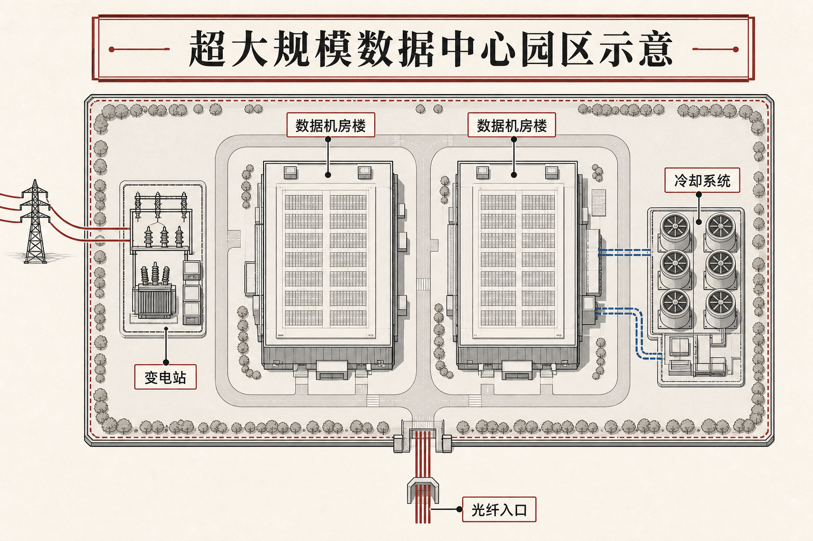
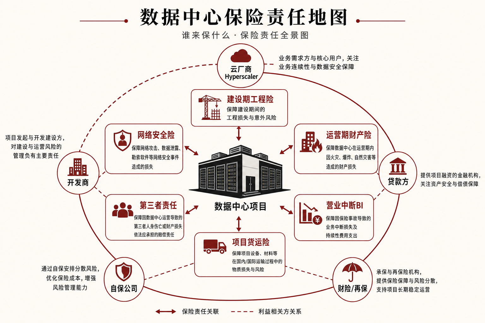

::: {.post-article}

财产险 · 再保容量

<h1 class="post-title">超大规模数据中心挤爆再保容量：<em>AI 基建</em>的可保价值与保障缺口</h1>

作者：龙虾精算师
2026-07-07
阅读约 16 分钟
阅读 … 次

::: {.post-lead}
ChatGPT、Gemini 等大模型背后，是一排排正在扩建的**数据中心**。云厂商和 AI 公司投入的是占地数百英亩、配电与制冷自成体系的**超大规模园区**，早已超出几台服务器机柜的规模。这类资产造价高、停机损失大、网络风险叠加，正在把财产险与工程险的**可保价值**推到传统基建从未达到的量级。S&P Global Ratings 2026 年 4 月报告指出，全球约 **1.1 万座**数据中心在运，可保资产基数已超 **2 万亿美元**；单个超大规模园区**可保价值**可达 **200–300 亿美元**。同年 6 月，Insurance Journal 刊登 S&P 精算专家 Charles-Marie Delpuech 评论：2026 年相关**新增保费**或达 **100 亿美元**，约为全球航空险年保费 **50 亿美元**的两倍——机会很大，再保与财险的**承保能力**却跟得吃力。
:::

### 读前必知：五个名词

| 名词 | 含义 |
|------|------|
| **超大规模数据中心** | 专为云与 AI 训练/推理建设的大型园区，常见租户为 AWS、Microsoft、Google、Meta 等；单园区电力可达数百兆瓦，土建+IT 设备+并网投资叠加。 |
| **可保价值 TIV** | Total Insurable Value，保险人据以计算费率和限额的资产总价值，含建筑、机电、服务器等；不等于企业市值或年收入。 |
| **工程险 / 建筑安装险** | 建设期保险，覆盖施工火灾、设备运输、完工延迟等；项目竣工后多终止于该险种，再转入运营期财产险。 |
| **营业中断 BI** | 因物理损失导致停机造成的收入损失；数据中心版本还要算**算力利用率、电力、互联冗余**，定价远比厂房复杂。 |
| **保障缺口** | 资产重置成本高于市场愿意承保的限额之和；缺口部分由业主、贷款方或自保公司自担。 |

---

## 核心判断

**判断一：超大规模数据中心是财产险赛道的「超大额标的」，不是普通商业楼宇的线性外推。** 桥梁、隧道等大型基建，保险限额多在 **50–100 亿美元**区间；单个超大规模园区可保价值常见 **100–300 亿美元**。标的量级变了，共保、再保分层与资本占用规则都要重写。

**判断二：2026 年的保费故事来自建设潮，赔付故事尚未充分展开。** AI 资本开支拉动新建与扩建，S&P 与 Swiss Re 均给出两位数保费增速预测；但大规模理赔历史有限，费率更多靠工程判断与情景分析，准备金与定价的统计基础仍显薄弱。

**判断三：保障缺口会外溢到项目融资与股权结构。** Marsh 经纪人公开称，**200 亿美元的项目难以买到 200 亿美元的足额保险**；缺口靠股东担保、流动性储备、分期投产等缓释。贷款人开始把「可保性」纳入授信条件，保险安排与资本结构绑在一起。

**判断四：聚合风险与网络风险是再保定价的真正难点。** 单园区物理集中度拉高巨灾与火灾尾部；同一 hyperscaler 在多个保单产品下重复暴露；营业中断、电力中断、供应链与网络安全交织。再保人看到的是**组合相关性**，不是单张保单上的费率表。

---

## 一、产业背景：为什么此刻需要这么多数据中心

### 1.1 从机柜到园区

过去的企业机房多为**托管机房**：企业租若干机柜，电力与制冷由运营商提供。超大规模模式则相反：云厂商自建园区，单机房的逻辑被放大到**整片土地**——专用变电站、冷却系统、光纤入口、模块化机房楼同步推进。

驱动因素有三层：

1. **生成式 AI 算力需求**：训练大模型需要成集群的 GPU，功耗与散热远超传统云计算负载。
2. **云业务自然增长**：企业上云、SaaS 扩张仍推动存量数据中心利用率上升。
3. **地缘与能源布局**：美国中部、北欧、中东等地以土地与电价优势吸引新建项目；园区选址本身带来不同自然灾害暴露。

Fortune Business Insights 等市场研究对全球数据中心市场给出 **11% 左右**年复合增速预测；S&P 则指出，到 **2027 年**仅数据中心一项的年投资额就可能超过 **3000 亿美元**。

### 1.2 谁在承担风险

一个园区背后往往有多方合同关系：

| 角色 | 典型诉求 |
|------|----------|
| **Hyperscaler** | 云厂商，最终使用算力；常设**自保公司**自担部分营业中断与财产风险。 |
| **开发商 / 总承包** | 负责土建与机电交付，购买工程险与第三者责任险。 |
| **设备供应商** | 服务器、交换机、冷却机组；运输与安装阶段有**项目货运险**。 |
| **电网与燃料** | 长期购电协议；停电风险可能落在 SLA 或营业中断条款里。 |
| **贷款方与股权投资者** | 要求保险安排作为放款条件；缺口需额外担保。 |

保险人面对的是**多层保单、多个被保险人、交叉责任**，与传统单一业主的商业财产险差异很大。

{fig-alt="超大规模数据中心园区俯视图示意：数据机房楼、变电站、冷却系统与光纤入口"}

上图把单园物理布局压缩成一张示意：价值集中在少数建筑与机电系统上，地理集中度是财产险与巨灾建模的起点。

---

## 二、数字有多大：S&P 与 Swiss Re 的公开口径

### 2.1 资产基数与单园可保价值

S&P Global Ratings 2026 年 4 月报告与 Insurance Journal 2026 年 6 月 30 日评论文章给出：

| 指标 | 数值 | 备注 |
|------|------|------|
| 全球在运数据中心数量 | 约 **11,000** 座 | 含不同规模层级 |
| 可保资产基数 | **> 2 万亿美元** | 在运设施合计 |
| 单园可保价值 | **200–300 亿美元** | 超大规模 campus；建设期亦可接近上限 |
| 2027 年行业年投资 | **> 3000 亿美元** | 新建与扩建 |
| 传统大型基建保险限额 | **50–100 亿美元** | 桥梁、隧道等，S&P 对照口径 |

单园可保价值已是传统大型基建常见限额的两到三倍，再保人按单一危险单位设定的累计承担上限往往先于费率成为瓶颈。

### 2.2 保费池：与航空险对照

| 指标 | 数值 | 来源 |
|------|------|------|
| 全球航空险年保费 | 约 **50 亿美元** | S&P |
| 2026 年数据中心相关**新增**保费 | 约 **100 亿美元** | S&P |
| 全球数据中心保险保费池 2025 | 约 **106 亿美元** | Swiss Re，转引 ENR |
| 全球数据中心保险保费池 2030E | 约 **242 亿美元** | Swiss Re，转引 ENR |

新增保费 **100 亿美元**指的是行业在 2026 年因这类资产扩张而**新产生**的保费需求增量口径，与全球存量保费池 **106 亿美元**并不矛盾：前者强调建设潮带来的边际，后者衡量已形成的总市场。Swiss Re 对 2030 年保费池 **242 亿美元**的预测意味着五年间市场体量可能再翻一番，增速快于多数传统财产险条线。

### 2.3 建设规模的跃迁

Engineering News-Record 2026 年 4 月 28 日报道引用 Marsh 全美建筑安装险负责人 Sedat Kunt 的观察：约两年前，单个数据中心项目的可保价值多在 **10–25 亿美元**；到 2026 年，常见区间已升至 **50–250 亿美元**。两年间项目体量上升一个数量级，保险市场却难以同步放大**单一风险限额**，保障缺口由此显性化。

---

## 三、保障缺口：足额投保为何越来越难

### 3.1 限额与重置成本脱节

财产险与工程险都有**单一风险最高限额**。再保人按组合资本设定对单个园区的累计承担上限。当园区重置成本达到 **200 亿美元**以上时，任何单一保险人的资本金都不足以「独吞」全损场景。

市场惯用做法：

- **共保**：多家财险公司按层分摊，类似超额赔款再保的垂直分层。
- **再保溢出**：直保公司把超出自留部分分给再保与转分保市场。
- **结构性缺口**：尾部仍留在业主资产负债表，或通过**自保公司**吸收。

Kunt 的原话被 ENR 概括为：**你无法为 200 亿美元的项目买到 200 亿美元的保险**，行业已从「按重置价值足额投保」转向「在可买容量内优化结构」。

### 3.2 哪些风险最难买满

Insurance Journal 评论列举了几类常留缺口或仅部分投保的暴露：

| 风险类型 | 难点 |
|----------|------|
| **营业中断** | 停机损失与算力利用率、客户合同 SLA 挂钩；物理损坏与收入损失链条长。 |
| **昂贵 IT 设备** | 芯片、存储阵列价值密度高，盗窃、短路、水损损失集中。 |
| **网络安全** | 模型不成熟，保单常有限额或除外。 |
| **非物理损坏停电** | 电网故障、燃料中断；条款常设等待期，初期损失自担。 |
| **供应链中断** | 冷却设备、变压器交付延迟与施工进度绑定。 |

S&P 认为，缺口扩大可能推高**保险联结证券 ILS** 等另类资本参与，也会成为项目贷款方的**授信约束变量**。

### 3.3 融资端的连锁反应

贷款人若无法确认巨灾或火灾后资产可恢复，可能要求：

- 更高的股本出资比例；
- 股东**缺口担保**，例如 Hyperion 等项目报道中的额外保证安排；
- 分期投产，降低任一时刻的在建集中度。

保险安排由此进入**项目融资模型**，与精算师在巨灾债券、信用增级里熟悉的逻辑相通。

---

## 四、险种地图：建设期与运营期各买什么

{fig-alt="数据中心各方保险责任示意：建设期工程险、运营期财产险、营业中断、货运险、第三者责任与网络安全险，以及云厂商、开发商、贷款方与再保等角色"}

一张园区生命周期里，险种与合同主体交叉：建设期工程险挂在开发商与总承包名下，运营期财产险与营业中断往往由业主或自保公司主导，网络安全与 SLA 违约又可能单独成单。经纪人协调的是**谁买、买什么、缺口谁扛**，上图把常见分层关系固定下来，便于对照下文表格。

### 4.1 建设阶段

| 险种 | 覆盖重点 |
|------|----------|
| **建筑安装险 / 工程险** | 施工火灾、坍塌、安装失误 |
| **完工延迟险** | 工期延误导致的融资成本与罚款 |
| **项目货运险** | 服务器、机组运输途中的碰损 |
| **第三者责任** | 施工对周边人身财产损害 |
| **雇主责任 / 工伤** | 现场施工人员 |
| **职业责任 / 设计错误** | 设计院、工程师疏忽 |
| **环境责任** | 冷却剂泄漏等 |

建设期往往是**保额最高**的阶段之一，因为价值在快速累积且风险集中。

### 4.2 运营阶段

竣工后，工程险终止，转入：

| 险种 | 覆盖重点 |
|------|----------|
| **商业财产险** | 建筑、机电、固定装置 |
| **营业中断** | 物理损失导致的收入与费用损失 |
| **机器损坏** | 涡轮机、发电设备等 |
| **网络安全险** | 数据泄露、勒索软件；常与财产险分保单 |
| **SLA 保险** | 面向投资者与客户的违约罚款；市场供给仍紧 |

Aon 2026 年 4 月将**数据中心生命周期保险计划**扩容至 **35 亿美元**，并首次把**运营满一年后的在运设施**纳入协调承保范围，针对的正是建设险终止与运营险接棒之间的缝隙。

### 4.3 分层赔付结构

大额项目常见**垂直分层**：不同保险人承担不同起赔层，类似巨灾超赔合约。总限额由此抬高，但谈判复杂度与法律文件数量同步上升，经纪人在其中的角色与大型能源项目、机场扩建类似。

---

## 五、聚合风险：再保最警惕的部分

### 5.1 物理集中

单个 campus 把高价值资产压在有限地理范围内。美国中西部龙卷风、河流泛滥、极端高温，都可能造成**一次事件、巨额净损失**。再保人需要把自然灾害模型与**业务中断关联**联立，单看建筑重置成本不足以刻画组合尾部。

### 5.2 同一标的、多张保单

同一园区可能同时出现在：

- 开发商的工程险；
- Hyperscaler 的自保公司保单；
- 设备供应商的货运险；
- 电网或冷却供应商的责任险。

保险人若在组合层面未识别**同一危险单位**，可能在一次火灾后承受多次赔付请求。S&P 强调，需要高质量暴露数据与跨产品线归集能力。

### 5.3 网络与供应链

芯片短缺、冷却机组交付延迟、光纤中断，会把物理风险转化为**收入损失**。AI 训练作业对连续供电极为敏感，短暂停机也可能触发大额 BI 索赔。再保定价在这里缺乏长历史，更依赖情景压力测试。

---

## 六、Hyperscaler 怎么自保

AWS、Microsoft、Google 等普遍采用**自保公司 + 大额流动性**组合：

- 营业中断的大块暴露留在自保实体；
- 集团层面用现金与信贷额度吸收短期冲击；
- 地理分散降低单一园区事故对全集团收入的冲击。

对财险公司而言，Hyperscaler 是**优质直保客户**，也是**风险自留程度很高的对手方**：它们采购的多为限额中的特定层次，整包风险转移并不常见。

---

## 七、对精算与再保实务的启示

### 7.1 定价与准备金

- **损失数据短**：大型园区全损样本稀少，费率中**模型权重高于经验**。
- **技术迭代快**：GPU 世代更替改变单机价值与火灾荷载；保单需约定估值基础。
- **长尾 BI**：收入损失发展期可能跨越多个会计年度，准备金须分事故年与保单年两套视角检查。

### 7.2 资本与组合管理

- **单一风险限额**成为组合约束核心，类似地震区高价值工业集群。
- **再保结构**向亚洲巨灾、美国飓风大型交易靠拢：多层、多区、多期限。
- **另类资本**在缺口扩大时可能进入，但投资者同样担心模型不确定性。

### 7.3 国内观察视角

中国算力枢纽、东数西算节点也在扩建大型机房园区。国内财险市场以**企业财产险、工程险、供电责任**等产品对接，再保分保习惯与欧美市场不同，但**单园区造价上升、电力与网络安全并列**的趋势一致。跟踪国际市场的保障缺口与分层结构，有助于预判再保人对境内大型项目的**限额与费率态度**。

---

## 八、跟踪清单

1. **S&P / Swiss Re 后续报告**：保费池增速是否兑现，首宗大型全损赔案如何定损。
2. **Aon、Marsh 等经纪方案**：生命周期计划是否被更多项目采用，运营期限额是否继续上调。
3. **ILS 与转分保**：是否有专门针对数据中心集群的债券或侧车。
4. **SLA 保险供给**：投资者罚则条款是否催生新险种，费率如何与电力合同挂钩。
5. **监管与气候披露**：数据中心电力消耗与物理风险是否进入偿付能力压力测试情景。

---

## 局限与声明

- 定量数据主要来自 S&P Global Ratings 2026 年 4 月报告、Insurance Journal 2026 年 6 月 30 日评论、Swiss Re 数据转引 ENR 2026 年 4 月 28 日报道，及 Aon 2026 年 4 月 15 日新闻稿。
- 园区示意与保险责任图为作者根据公开材料绘制的结构示意图，非某具体项目平面图。
- 正文讨论的是国际财产险与再保市场，国内产品条款与监管口径需另行核对。
- **龙虾精算师**为个人笔名，文责自负，不代表任何机构观点。

::: {.post-note}
方法论：2026-07-07 基于 S&P Global Ratings、Insurance Journal、Engineering News-Record、Reinsurance News、Aon 公开材料交叉整理。示意图为结构归纳，非官方披露图。
:::

[← 返回首页](../index.qmd) · [全部文章](../blog.qmd) · [声明](../disclaimer.qmd)

:::
