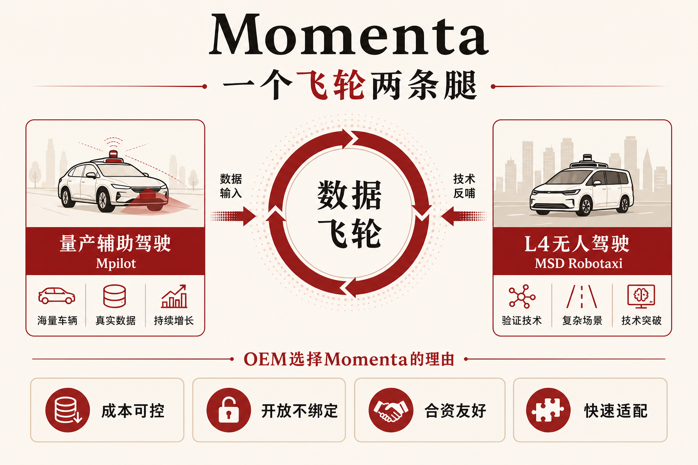
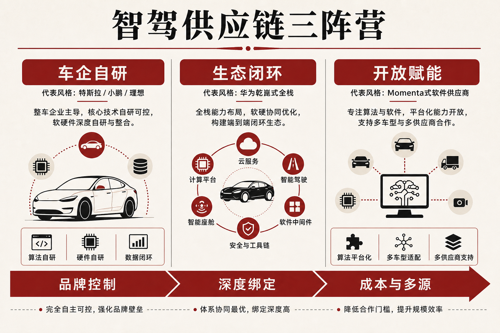

::: {.post-article}

深度 · 智驾供应链

<h1 class="post-title">Momenta 港股上市：OEM 为何仍选<em>「非体验第一」</em>的智驾供应商</h1>

作者：龙虾精算师
2026-07-13
阅读约 15 分钟
阅读 … 次

::: {.post-lead}
2026 年 7 月 8 日，苏州智驾公司 **Momenta** 以股份代号 **06880** 在港交所主板挂牌。发行价 **港币 295.60 元**，募资约 **7.5 亿美元**，上市估值约 **90 亿美元**。基石投资者包括 GIC、Fidelity、BlackRock，以及 **奔驰、比亚迪** 等产业方。招股材料披露：截至 2026 年 2 月末，累计定点超过 **180** 款车型，量产方案装机超过 **73.3 万**套，合作整车厂 **24** 家，覆盖全球前十大中的多家与中国前十大中的多家。媒体与车主测评里，城区体验榜常把华为乾崑、小鹏、理想排在更前；采购榜上，Momenta 却长期占据第三方城市 NOA 的主要份额。上市只是资本事件，选型逻辑才是产业题：OEM 买的是**可复制的量产交付、可控的成本曲线与不被深度绑定的话语权**，演示视频里的「第一」只是其中一个维度。
:::

### 读前必知：四个名词

| 名词 | 含义 |
|------|------|
| **Mpilot / MSD** | Momenta 量产辅助驾驶与 L4 无人驾驶产品线；公司称二者共用软件架构与传感器思路，形成「两条腿」。 |
| **数据飞轮** | 以量产车持续回流真实驾驶数据，驱动算法迭代；规模越大，长尾问题解决越快。 |
| **城市 NOA** | 导航辅助驾驶在城区道路的落地形态；第三方供应商市占是 OEM 采购竞争的主战场之一。 |
| **多轨供应** | 同一车企在不同品牌或价位段并行接入多家智驾方案，避免单一供应商锁定。 |

---

## 核心判断

**判断一：资本市场买的是「量产软件许可」故事，不是当下利润。** 2025 年营收约 **24.1 亿元**，同比增约 **82%**；许可服务收入跃升至约 **9.7 亿元**，毛利率抬到约 **72%**。同期净亏损仍约 **34.6 亿元**，研发约 **18.7 亿元**，接近营收八成。上市资金约六成投向研发与基础模型，约两成推进 Robotaxi，其余强化量产业务与营运资金——这是烧钱换规模的典型结构。

**判断二：OEM 选型函数与「媒体体验排行」并不重合。** 体验榜看极限场景与品牌声量；定点决策还要看 BOM、芯片平台兼容、定制空间、交付周期、合资股比与地缘约束、以及会不会被供应商反向定义产品。Momenta 在后一组变量上得分更高，因此会出现「测评第二、定点第一」的落差。

**判断三：比亚迪选 Momenta，是「全民智驾」下的分层与对冲，而非否定自研。** 「天神之眼」C 走自研下放，中高端与腾势、仰望等产品线长期与 Momenta 共研；同时另有车型试水华为方案。龙头要的是**分层成本 + 能力对冲 + 供应链话语权**，单一「最强供应商」无法覆盖全部车型矩阵。

**判断四：对保险与责任链条，软件供应商规模化意味着风险集中度上升。** 同一算法栈跨越多品牌、多价位，一次系统性缺陷可能触发跨保单聚合；Robotaxi 腿抬升后，运营端责任与量产辅助驾驶的产品责任会并存在同一家公司资产负债表上。

---

## 一、上市：数字、基石与资金用途

### 1.1 发行与估值

| 项目 | 公开口径 |
|------|----------|
| 挂牌日 | 2026-07-08 |
| 代号 | 06880.HK |
| 发行价 | 港币 **295.60** |
| 募资规模 | 约 **7.5 亿美元** |
| 估值量级 | 约 **90 亿美元** / 逾港币 **700 亿** |
| 联席保荐 | 中金、德银等公开披露口径 |

首日股价围绕发行价附近，市场对其「AI 叙事」有兴趣，对盈利兑现仍保留折扣。此前港股智驾与新能源相关标的波动剧烈，地平线等芯片股年内深度回调，Momenta 选择在港上市，意在对接国际资本与产业股东同一套定价语言。

### 1.2 财务：许可收入起来了，亏损仍在扩大

| 指标 | 2023 | 2024 | 2025 |
|------|------|------|------|
| 营收 | 约 **7.4 亿** | 约 **13.2 亿** | 约 **24.1 亿** |
| 许可服务收入 | 约 **0.2 亿** | — | 约 **9.7 亿** |
| 毛利率 | 约 **18%** | 约 **49%** | 约 **72%** |
| 净亏损 | 约 **26 亿** | 约 **32 亿** | 约 **35 亿** |

许可收入占比升至约 **40%**，说明商业模式从「项目制开发费」转向「按车收取软件授权」——这正是资本市场愿意给软件公司估值倍数的地方。亏损扩大主要来自研发前置：飞轮与端到端大模型、多芯片适配、海外项目与 Robotaxi 试验同步推进。

### 1.3 基石名单里的产业信号

十四家基石合计认购接近发行规模一半。产业侧，**奔驰**认购约 **2500 万美元**，**比亚迪**约 **1500 万美元**，与早期股权投资、量产合作形成「股东—客户」双身份。金融侧 GIC、Fidelity、BlackRock、Oaktree 等提供流动性背书。名单本身说明：国际车企与本土销量龙头愿意用现金投票，押的是**可出口的算法供应商**，而非某一品牌专属智驾部门。

---

## 二、产品与路线：一个飞轮，两条腿

{fig-alt="Momenta 数据飞轮连接量产 Mpilot 与 L4 MSD 两条产品腿的结构示意"}

### 2.1 数据飞轮

公司长期对外叙事是 **data-driven flywheel**：量产车装载方案后持续产生真实路况数据，标注—训练—验证闭环缩短长尾场景的修复周期。CEO 曹旭东公开目标曾提到装机规模向千万级迈进；招股口径下 73 万套装机已是飞轮的「燃料库存」，远未到饱和。

对 OEM，飞轮意味着：**采购的不只是当前版本软件，还有后续 OTA 迭代速度**。自研团队若装机基数小，同样烧数据，单位里程成本更高。

### 2.2 量产腿：Mpilot 与 BOM 纪律

量产侧重点是城区/高速导航辅助、记忆泊车等，强调：

- **单 Orin 级算力**支撑城市导航辅助的量产交付经验；
- **11V1R1L** 一类相对克制的传感器组合，压低 BOM；
- **少依赖高精地图**，宣称「全国都能开」的工程路径；
- 官方与行业报道称，训练环节通过分层验证可把大模型试错成本压低一个数量级以上。

成本纪律决定下探价位：行业报道把 Momenta 方案与 **15 万级**合资车型量产绑定，而华为乾崑高阶能力长期锚定更高价带后再逐步下放。价格带错位，使双方可在同一 OEM 内并存。

### 2.3 L4 腿：Robotaxi 与资本用途

量产数据反哺 MSD；L4 能力再回灌量产算法。海外侧已有奔驰合作阿布扎比车队、与 Uber 在德国测试、与 Grab 推进东南亚等公开项目。IPO 资金约 **20%** 指向 Robotaxi 商业化——资本市场愿意听「两条腿」故事，但短期收入仍以量产许可为主。

---

## 三、为什么「体验不是公认第一」，OEM 仍在排队

### 3.1 先分清三张榜单

{fig-alt="智驾供应链三阵营示意：车企自研、生态闭环、开放赋能"}

| 阵营 | 代表路径 | OEM 付出的代价 |
|------|----------|----------------|
| **车企自研** | 特斯拉、小鹏、理想、蔚来等 | 研发沉没成本高，能力难外售 |
| **生态闭环** | 华为乾崑 HI / 智选等 | 体验与品牌势能强，合作深度高，主导权更易上移 |
| **开放赋能** | Momenta、部分地平线软件路线 | 体验声量弱于闭环阵营，但成本、兼容与多源更友好 |

车主社区与媒体横评，天然偏向第二阵营与头部自研的「哇塞时刻」。采购委员会的 KPI 却是：**按时 SOP、单车成本、可切换供应商、合资合规、不稀释品牌定义权**。Momenta 站在第三阵营的中心，市占与体验排名因此经常错位。

行业统计口径显示，在**第三方城市 NOA** 市场，Momenta 份额长期显著高于其他纯第三方；与华为合计可占据第三方市场绝大部分。这解释了「不是体验第一，却是定点第一」的现象。

### 3.2 技术路线：平台化与多硬件兼容

公开表述中，Momenta 强调 **一套架构、一套算法**，适配不同芯片与传感器组合，服务多家 OEM 的差异化分支。相比之下：

- 华为路线软硬一体能力完整，合作模式层级多，深度绑定感更强；
- 地平线 HSD 等路径与自有芯片绑定更紧，主机厂在芯片定点阶段选择空间更窄；
- Momenta 长期以 **NVIDIA / 高通** 等算力平台为主，并筹备自研芯片以降本，软件侧保持相对独立。

对合资品牌与国际车企，「全球统一算法公司 + 本地化数据」比「深度嵌入某科技巨头生态」更易过内部合规与品牌委员会。这是奔驰、丰田、通用、大众体系愿意站台的底层原因之一。

### 3.3 方案成本：能进 15 万级，才有千万装机

高阶城区功能若只能搭在 30 万以上车型，飞轮永远转不快。Momenta 的工程选项——克制传感器、单芯片方案、少高精地图、训练成本控制——把功能下探到更宽价格带。装机基数上来后，单位研发摊销下降，OEM 下一代车型报价再被压低，形成正向循环。

华为在体验与品牌上更强，高阶方案成本与合作深度也更高；双方抢 **15 万级** 时，拼的是谁更能在「够用的体验」下把 BOM 打穿。OEM 不需要在每一款车上都买「体验天花板」，大量走量车需要的是**可宣传的高阶功能 + 可承受的毛利冲击**。

### 3.4 组织与话语权：开放度本身就是产品

界面新闻等产业报道归纳的共识是：越来越多车企采用**双轨甚至多轨**，避免供应商一家独大。Momenta 允许车企在硬件与功能模块上保留更多自定义，产品定义权留在主机厂；华为智选/HI 体系则在部分合作中更深介入整车与渠道。

对仍把「灵魂」挂在嘴边的传统集团，Momenta 更像**可替换的一级软件供应商**；对需要快速补齐智驾短板的合资车企，它更像**少惹政治与品牌争议的最大公约数**。

### 3.5 交付节奏：量产经验本身是壁垒

公开口径称，成熟平台上新车型适配可压缩到约 **3–6 个月**量级。曹旭东强调公司走完 0–1 与 1–10，正处于 10–100，且具备多车型、多芯片、多传感器的高阶量产交付记录。对 SOP 排期紧的项目，**「能按时亮灯」**往往压过「极限场景再漂亮一分」。

---

## 四、比亚迪案例：龙头为何仍给 Momenta 座位

### 4.1 合作形态

比亚迪与 Momenta 早有合资与共研安排；「天神之眼」体系里，走量的 C 方案强调自研下放，中高阶 B/A 与腾势、仰望等产品线长期与 Momenta 绑定。IPO 基石认购约 **1500 万美元**，是客户身份之外的资本绑定。

### 4.2 选型逻辑分开看

| 维度 | 对比亚迪的含义 |
|------|----------------|
| **分层** | 低价走量靠自研控成本；中高阶用外部头部算法追齐「全国都能开」叙事 |
| **对冲** | 另有车型接触华为方案，避免单一技术栈；多轨是集团标配 |
| **速度** | 全民智驾口号下，外部成熟栈缩短中高阶车型缺口 |
| **数据** | 装机规模反哺共研模型，与自研数据池形成互补 |
| **品牌** | 腾势、仰望需要可对标新势力的智驾体验，又不想把产品定义权整包交出 |

因此，「比亚迪都选 Momenta」更准确的表述是：**在需要外部高阶栈的层段，Momenta 是默认最大供应商之一**；自研与华为座位同时存在。龙头采购行为验证的是**分层成本曲线**，而非「Momenta 体验全球第一」。

---

## 五、和国际车企：为什么合资盘是基本盘

招股口径列出丰田、通用、大众、本田、现代—起亚等全球巨头与上汽、广汽、奇瑞等本土集团。合资与国际 OEM 的共同约束是：

1. **品牌与合规**：倾向独立算法供应商，忌讳深度嵌入某消费电子生态；
2. **全球平台**：希望一套软件逻辑服务多区域，再接本地数据；
3. **股比与采购委员会**：成本与双源策略写进流程，Momenta 的开放模式更易过会。

行业评论称 Momenta 拿下合资品牌智驾合作的相当大一块——这与「合资车企为什么都选 Momenta」的知乎式讨论一致：便宜是表象，**便宜 + 开放 + 可过合规**才是完整答案。

---

## 六、对精算与车险观察的含义

1. **产品责任集中度：** 同一软件栈覆盖上百款车型时，缺陷召回与集体诉讼的尾部比「一车一栈」更胖；再保人需按算法族而非仅按品牌聚合暴露。
2. **定责取证：** 数据飞轮依赖车端日志回传，事故调查将更多依赖供应商与 OEM 的数据接口协议——条款里的协作义务会变厚。
3. **Robotaxi 腿：** 上市资金喂养 L4 后，运营责任与量产辅助驾驶责任并存；费率与限额设计要分清「有安全员测试」与「无人商业运营」两套情景。
4. **价格战外溢：** 智驾下放至 10 万级以下，单车保费空间更紧，保险公司更在意出险率是否真随功能下降，而非营销口径。

---

## 七、跟踪清单

1. **许可收入占比与装机：** 是否继续向「软件公司」财务结构收敛，装机能否按管理层千万级叙事推进。
2. **自研芯片量产：** 软硬结合后成本曲线与英伟达依赖度如何变化。
3. **与华为、地平线在 15 万级的直接对撞：** 定点输赢比媒体横评更重要。
4. **Robotaxi 海外里程碑：** 阿布扎比、慕尼黑、东南亚项目是否贡献可审计收入。
5. **多轨 OEM 是否减配 Momenta：** 自研成熟后外部份额是上升还是被收回。

---

## 局限与声明

- 发行价、募资额、估值、财务与定点/装机数据主要依据 CnEVPost、招股报道、车东西及港股公开披露交叉整理，具体以港交所公告与招股章程为准。
- 「第三方城市 NOA 市占」「体验梯队」引用行业研究与媒体归纳，不同机构口径不一，不作精确排名断言。
- 训练成本「缩小 10–100 倍」等为公司或转述口径，属工程宣传量级，未经独立审计。
- 示意图为作者结构归纳，非公司官方架构图。
- **龙虾精算师**为个人笔名，文责自负，不代表任何机构观点。

::: {.post-note}
方法论：2026-07-13 基于 Momenta 港股上市公开报道、招股信息转述及智驾供应链产业评论交叉整理。重点回答 OEM 选型与体验榜错位。
:::

[← 返回首页](../index.qmd) · [全部文章](../blog.qmd) · [声明](../disclaimer.qmd)

:::
