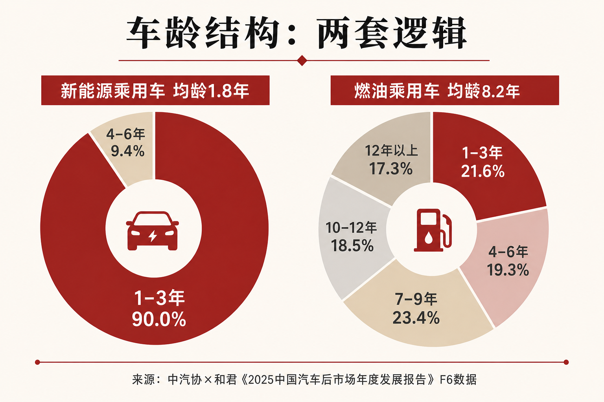
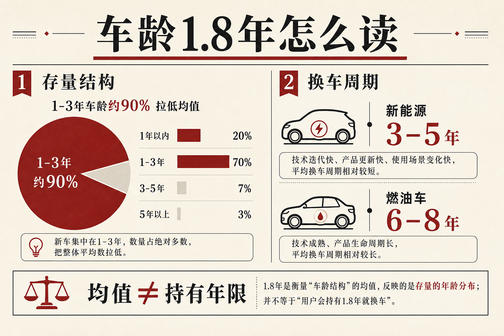
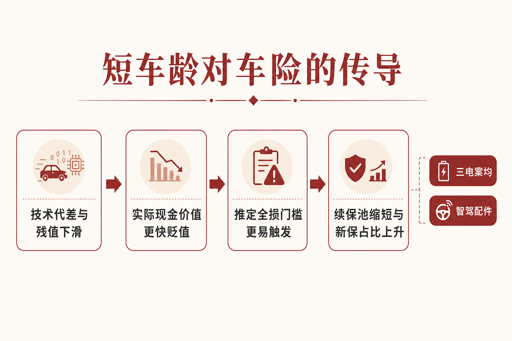

::: {.post-article}

车险 · 新能源存量结构

<h1 class="post-title">新能源车平均车龄仅 <em>1.8 年</em>：短生命周期如何改写车险定价假设</h1>

作者：龙虾精算师
2026-07-14
阅读约 15 分钟
阅读 … 次

::: {.post-lead}
2026 年 6 月 10 日，中汽协与和君咨询发布《2025 中国汽车后市场年度发展报告》。报告把油电对照写得很直白：传统动力乘用车平均车龄 **8.2 年**，7 年以上接近 **60%**；新能源乘用车平均车龄 **1.8 年**，**1–3 年占 90.0%**，**4–6 年仅 9.4%**。同一份材料给出的产业含义，是「车龄结构分化，维保需求走向两套逻辑」——燃油车进入高龄刚性维修，新能源仍处导入期，短期以基础保养、检测、软件与轻维修为主。流通协会等外部口径再补一层：新能源主流换车周期约 **3–5 年**，三年保值率约 **43.35%**。车险要处理的，是**极新存量 + 更快置换 + 授权化维修**叠在一起后，残值曲线、推定全损阈值与续保池长度同时失真。
:::

### 读前必知：四个名词

| 名词 | 含义 |
|------|------|
| **平均车龄** | 某一时点保有量按车龄加权的均值；新车放量会显著压低平均数，不等于车主平均持有年限。 |
| **换车周期** | 车主从购入到置换的典型间隔；流通协会等给出新能源约 3–5 年、燃油约 6–8 年。 |
| **保值率** | 二手成交价相对新车指导价的比例；三年保值率约 43% 意味着残值曲线更陡。 |
| **实际现金价值 ACV** | 出险时车辆市场价值，是车损赔付与推定全损判断的基准之一。 |

---

## 核心判断

**判断一：1.8 年首先是爆发式上量的结构结果。** 报告给出的分档比均值更重要：新能源 1–3 年占九成，4–6 年不足一成。把 1.8 年直接当成保单预期存续期，会系统性低估续保长度。

**判断二：报告原文的重点是「两套维保逻辑」，不是「人人两年换车」。** 燃油池子在老化、维修刚性上升；新能源池子仍年轻，重维修需求尚未充分释放。对车险，这意味着当前赔付结构由高价值次新车与授权维修主导，而未来 3–5 年车龄抬升后，案均与出险形态还会再变一档。

**判断三：短生命周期的定价证据在换车周期与保值率，传导链在授权维修。** 三年保值率约 43%、换车 3–5 年，叠加三电高压与品牌授权，使 ACV 下滑与案均维修同向上行；推定全损更容易被触发。

**判断四：后市场产值是车险的领先指标。** 报告显示整体维保约 **1.0–1.2 万亿元** 企稳，2025 年约 **1.15 万亿元、同比约 -4%**；新能源维保由 2020 年 **91 亿元** 升至 2025 年 **904 亿元**，占比由 **1%** 升至 **8%**。车龄结构、二手成交、授权化与电池回收合规，比单看新车销量更能预判车损成本曲线。

---

## 一、报告原文：车龄分档与两套服务路径

{fig-alt="中汽协与和君报告车龄分档：新能源一至三年占九成均龄一点八年，燃油七至九年等分档合计七年以上近六成均龄八点二年"}

报告数据合作方包括 F6 大数据研究院等，车龄对照来自乘用车后市场篇的公开节选。

### 1.1 车龄分档：均值之外的结构

| 车龄段 | 新能源乘用车 | 传统动力乘用车 |
|--------|--------------|----------------|
| 1–3 年 | **90.0%** | 21.6% |
| 4–6 年 | **9.4%** | 19.3% |
| 7–9 年 | — | 23.4% |
| 10–12 年 | — | 18.5% |
| 12 年以上 | — | 17.3% |
| **平均车龄** | **1.8 年** | **8.2 年** |

燃油侧 7 年以上合计约 **59.2%**，与报告「接近六成」一致；新能源侧几乎全部压在 6 年以内。媒体标题里的「当手机换」，把**存量极新**写成了**人人两年一换**——二者差了一个统计量级。

### 1.2 换车周期与二手成交：持有确实更快

| 口径 | 燃油 | 新能源 |
|------|------|--------|
| 主流换车周期 | 约 **6–8 年** | 约 **3–5 年** |
| 2025 二手成交平均车龄 | 约 **8.6 年** | 约 **3.4 年** |

报告二手车篇另给出：2025 年二手车成交约 **2010.8 万辆**，同比 **+2.52%**；新能源二手约 **160 万辆**，同比 **+42%**，占二手总量约 **8%**；二手车与新车销量比约 **0.58**，保有量析出率约 **5.49%**。置换节奏快于燃油车约一半，但仍明显高于 1.8 年。更准确的表述是：**存量极新，且流通端确实更短**。

### 1.3 保值率与电池衰减

中国汽车流通协会口径：新能源三年保值率约 **43.35%**，燃油车普遍 **50%** 以上，部分中大型燃油车型可到 **55%** 以上。公开报道转述的电池衰减区间：使用 **3–5 年**容量或降 **8%–15%**，**5 年以上**或超 **20%**。残值压力来自价格战、技术代差与电池健康度；保险理赔看到的是三者合成后的 ACV。

### 1.4 报告真正强调的：两套维保逻辑

| 维度 | 燃油车后市场 | 新能源后市场 |
|------|--------------|--------------|
| 配件结构 | 发动机、变速箱、排放、油液；种类多、更新勤 | 电池、电机、电控；件数少、专业性高 |
| 维修模式 | 综合维修门店为主，网络成熟 | 高压安全、BMS 诊断、专用设备；专修门店 + **授权体系** |
| 服务诉求 | 功能维保、价格与便捷，刚性维修为主 | 数字化体验、系统优化、能耗与个性服务 |
| 所处阶段 | 高龄化，故障维修与延寿需求上升 | **导入期**，基础保养、检测、软件、轻维修为主 |

对精算最重要的一句，是报告对新能源的定位：**需求尚未完全释放**。当前组合里的高案均，主要来自次新车价值与授权维修；车龄一旦向 4–6 年、甚至更长迁徙，电池衰减、部件老化与维修网络产能会同时进入赔付方程——不能把今日损失率当成稳态。

---

## 二、维保产值：结构切换已经发生

{fig-alt="新能源平均车龄结构示意：一到三年存量占比约九成拉低均值，换车周期新能源约三到五年、燃油约六到八年"}

| 指标 | 报告口径 |
|------|----------|
| 整体维保产值 | 2020–2025 约维持在 **1.0–1.2 万亿元**；2025 年约 **1.15 万亿元**，同比约 **-4%** |
| 近年增速 | 2023 年约 **+19%**，2024 年约 **+3%**，2025 年约 **-4%** |
| 新能源维保产值 | 2020 年 **91 亿元** → 2025 年 **904 亿元** |
| 新能源维保占比 | **1% → 8%** |

总量企稳、结构搬家：传统后市场扩容空间变窄，新能源维保五年近十倍。门店策略调研里，**12.7%** 把「增加新能源业务」列为优先项，**21.5%** 选择加大线上流量投入。供应端同步收紧：三电、高压与智能模块走向主机厂**授权准入**；六部门《新能源汽车废旧动力电池回收和综合利用管理暂行办法》自 **2026 年 4 月 1 日**施行，维修更换环节的追溯义务进入合规清单。

对车险的含义直接：

- **案均维修**将越来越受授权网络、专用设备与技师供给约束，而不是「社会修理厂平均价」；
- **残值与全损**会更多绑定电池健康度、是否原厂件、是否合规回收路径；
- 维保产值占比抬升，是赔付通胀的产业侧先行指标，应与保信出险率、案均一并进监测表。

---

## 三、为什么新能源存量这么「年轻」

### 3.1 爆发式上量压低均值

近五年新能源保有量陡增，2025 年零售渗透率已处高位。大量「车龄不到一年」的车辆进入分母，平均数必然靠近新车端。这与人口学里年轻移民涌入压低平均年龄，是同一类结构效应。

### 3.2 产品迭代像电子产品

燃油车时代，动力总成与底盘换代往往以 **5–8 年**计；新能源把电池、电控、芯片与智驾软件推到产品力中心，开发周期被压缩到约 **18–24 个月**。上市两三年后，续航、补能与算力出现可见代差，叠加以旧换新，置换被提前。懂车帝等转述称，相当比例新能源车主换车诉求落在智能配置升级——体验折旧会传导为市场残值折旧。

### 3.3 价格战与残值预期

新车频繁降价，改写二手锚定价；车主预期残值更差，更倾向早换；早换又增加次新车供给。对保险人，残值曲线参数要随出厂价与二手成交同步重估，不能沿用购车时点的静态折旧表。

---

## 四、对车险定价：四条传导链

{fig-alt="短车龄对车险传导示意：残值下滑到实际现金价值、推定全损、续保池缩短与新保占比上升"}

### 4.1 实际现金价值贬值更快

三年保值率约 43%，意味着同价位新车在保单第 2–3 年 ACV 已明显低于燃油对照。车损赔付、修理或置换决策、残值回收都会跟着变。费率模型若仍用燃油车折旧曲线，会出现保额与风险暴露错配。

### 4.2 推定全损更容易触发

维修费用相对 ACV 的比例越过阈值，推定全损成立。新能源案均维修本就偏高：三电集成、一体化车身、激光雷达与域控制器单价高，且报告强调维修正向**授权体系**集中。残值曲线更陡时，同样维修账单更容易跨过全损线，赔案从「修」转为「报废 + 残值」，尾部分布变胖。

### 4.3 续保池变短，新保占比上升

持有周期 3–5 年，客户在经验损失尚不充分时就离开组合。组合更依赖新保获取与首次投保风险筛选，续保折扣与多年度经验因子的权重下降。需要更密的车型—车龄—用途交叉，更早识别营运属性混入家用投保，并对「次新车二次投保」单独观察残值跃迁与出险模式。

### 4.4 案均结构：配件新、工时贵、渠道窄

存量偏新，并不自动等于低赔付。新车价值高、智能配件贵、原厂维修约束强，小剐蹭也可能打穿传感器预算。行业 2025 年新能源车险保费约 **1900 亿元**、承保约 **4358 万**辆，仍录得约 **56 亿元**承保亏损——规模上来了，残值与维修结构问题仍在。短车龄放大的是高价值新车占比，与授权维修通胀同向。

另一条时间轴不能漏：报告判定新能源后市场仍处导入期。当均龄从 1.8 年向 4–6 年迁移，今日「轻维修」会让位给电池衰减、三电大修与回收合规成本。定价与准备金若只拟合当前极新车队，会在车龄台阶到来时系统性低估。

---

## 五、燃油老龄化与新能源年轻化对照

商务部等口径：全国汽车保有量约 **3.7 亿**辆，乘用车 7 年以上占比已过半。报告乘用车篇与二手车篇合在一起，画出的是油电两套车龄结构：

| 池子 | 车龄与后市场 | 车险侧压力 |
|------|--------------|------------|
| 燃油存量 | 均龄 8.2 年，7 年以上近六成；故障维修与延寿刚性 | 案均相对可控，保费价格竞争激烈 |
| 新能源增量 | 均龄 1.8 年，1–3 年占九成；授权维修 + 残值陡 | 新保占比高、全损与配件通胀并行；车龄抬升后赔付形态将再变 |

综合成本率改善，不能只看新能源渗透率；要看两个池子各自的损失率与费用率是否同时改善，以及新能源池子内部的车龄迁移速度。

---

## 六、定价与产品上可落地的调整

### 6.1 残值与保额

- 按品牌—动力形式—电池健康度分档更新 ACV 曲线，至少年度校准，价格战期可提高到季度；
- 明确保值率外部指数接入核保，减少「保额按购车价线性折旧」的惰性；
- 全损阈值与残值拍卖、合规回收假设分开标定，避免燃油车经验直接平移。

### 6.2 车龄因子重新释义

传统车龄因子假设「车越老风险越高、价值越低」。新能源在 **0–3 年**段同时具备高 ACV、高配件成本、高智驾渗透；**4–6 年**段将叠加电池衰减与维保需求释放。车龄因子可能呈 U 型或分阶段平台，建模时应把技术世代、授权维修可得性作为显式变量。

### 6.3 续保与置换场景

置换高峰出现在 3–5 年，续保挽留与新车交叉销售会重叠。产品侧可观察：质保期末、电池健康度拐点、OTA 重大升级后的退保与转保，是否与出险率同步跃迁。

### 6.4 数据需求

应进入车险监测仪表盘的后市场指标至少包括：分动力类型车龄分档、新能源维保产值与占比、二手成交量与成交车龄、三年保值率、授权维修渗透与电池回收合规节点。缺二手成交与电池 SOH 的公司，残值假设误差会直接变成准备金与费率偏差。

---

## 七、跟踪清单

1. **中汽协后续年度报告：** 新能源均龄是否随保有老化回升，1–3 年占比是否下降，维保产值占比是否继续抬升。
2. **流通协会保值率：** 纯电、插混、增程是否继续背离。
3. **精算师协会与保信新能源车险年报：** 亏损是否收窄，高赔付车系是否仍由营运与网约属性主导。
4. **推定全损占比：** 车损案件中全损比例是否随残值下台阶而抬升。
5. **授权维修与电池追溯：** 2026 年 4 月起回收办法落地后，定损配件来源与残值处置路径是否可观测。

---

## 局限与声明

- 车龄分档、维保产值、油电服务路径对照主要依据中汽协与和君《2025 中国汽车后市场年度发展报告》公开节选，包括数局在新浪财经发布的报告幻灯片及 F6 等数据口径转述；完整报告含车险等专题，公开节选未必覆盖全部章节，具体以协会正式文本为准。
- 换车周期、二手成交车龄、保值率与电池衰减区间同时参考中国汽车流通协会及金融界、新浪汽车、网通社等公开报道。
- 「1.8 年」为保有量结构均值，必须与换车周期分列。
- 2025 年新能源车险保费、承保量与亏损额来自中国精算师协会与银保信公开经营数据的媒体转述。
- 示意图为作者根据公开材料绘制的结构归纳，非协会官方信息图。
- **龙虾精算师**为个人笔名，文责自负，不代表任何机构观点。

::: {.post-note}
方法论：2026-07-14 基于中汽协与和君《2025 中国汽车后市场年度发展报告》公开节选、流通协会保值率口径及 2025 新能源车险经营数据交叉整理。重点区分存量均值、换车周期与维保导入期三层含义。
:::

[← 返回首页](../index.qmd) · [全部文章](../blog.qmd) · [声明](../disclaimer.qmd)

:::
