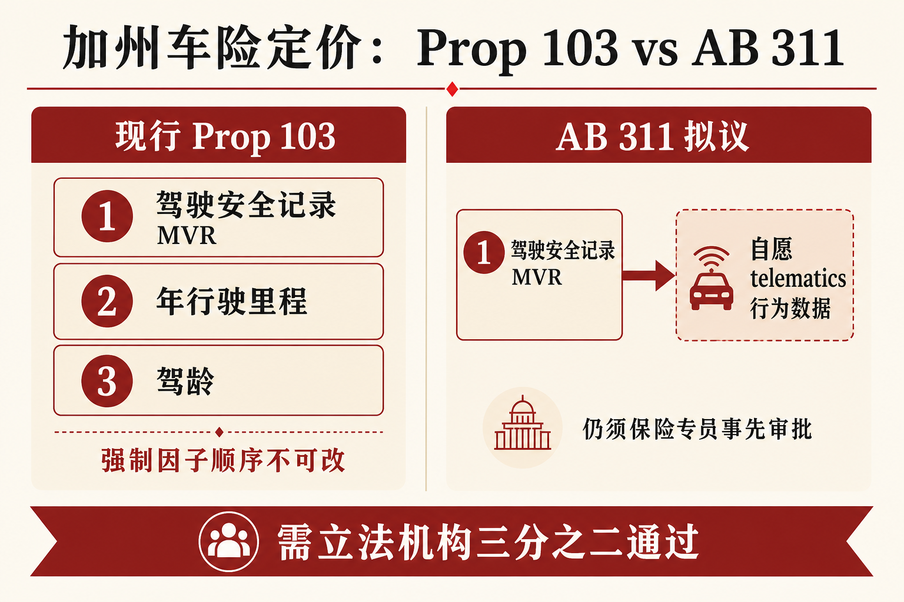
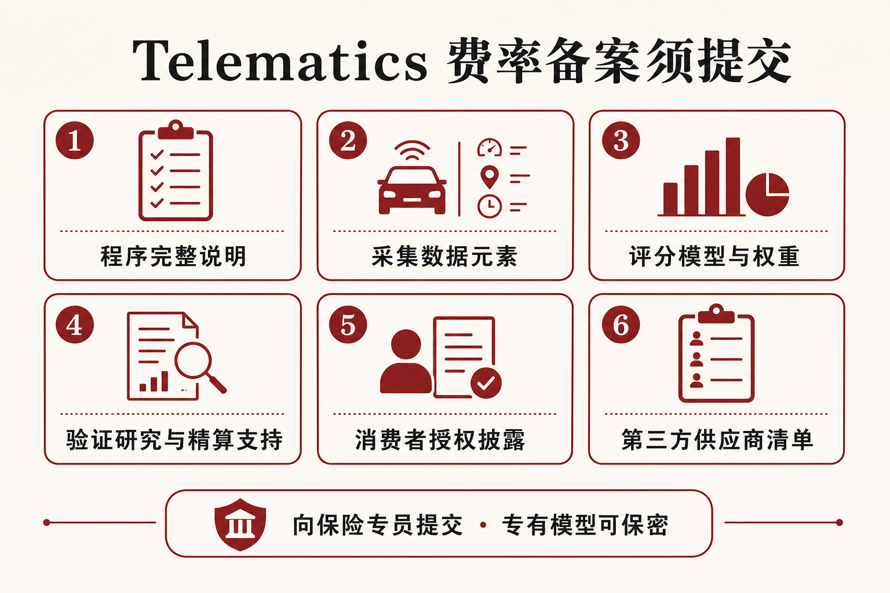

::: {.post-article}

立法研读 · 美国车险定价

<h1 class="post-title">加州 AB 311：拟在保险法中允许自愿 Telematics 建立<em>「驾驶安全记录」</em></h1>

作者：龙虾精算师
2026-07-15
阅读约 15 分钟
阅读 … 次

::: {.post-lead}
加州众议院法案 **AB 311**（《2026 消费者驾驶数据保护法》，2026-07-09 参院修正稿）拟在 **Insurance Code** 增订条款：消费者可**自愿**以 telematics 建立私人乘用车费率中的第一强制因子 **driving safety record**。法案尚未通过；生效后才会进入法典，目前仍是立法文本。

加州该强制因子的现行证据集由规章钉死。**MVR**（Motor Vehicle Record）是 DMV 出具的驾驶记录，主体为交通违法定罪；**principally at-fault** 事故按保险规章另行认定。二者共同构成「驾驶安全记录」。Telematics 行为序列长期落在这一证据集之外，他州常见的 UBI 形态因而难以直接嵌入加州第一强制因子。AB 311 把自愿 telematics 放进同一强制因子，并继续接受保险专员事先费率审批。
:::

### 读前必知

| 名词 | 含义 |
|------|------|
| **AB 311** | Assembly Bill 311，加州众议院法案。依据 2026-07-09 参院修正稿；通过并签署后拟新增 Insurance Code Article 10.5（约自 §1861.5 起）。 |
| **Proposition 103** | 1988 年选民倡议，已写入 Insurance Code：私人乘用车费率事先审批，强制因子按法定顺序使用；修法通常需立法机构三分之二。 |
| **MVR** | Motor Vehicle Record：DMV 驾驶记录，主体为违章/定罪史。 |
| **驾驶安全记录（现行）** | §1861.02(a)(1) 第一强制因子；10 CCR §2632.5(c)(1) 落实为 MVR 类违法定罪 + 主责事故。 |
| **Telematics** | 车载/手机等采集的连续驾驶行为数据，用于 UBI / 行为定价。 |

---

## 核心判断

**判断一：立法策略是扩写第一强制因子的允许证据。** 法案意图写明：不改变 §1861.02 强制因子层级，也不侵占保险专员对可选因子的专属权；telematics 作为消费者建立 driving safety record 的选项。这是在 *Foundation for Taxpayer & Consumer Rights v. Garamendi* 之后，立法机关回避「擅入可选因子」争议的路径选择。

**判断二：费率实务的关键变化，是同一强制因子下证据形态从事件型扩展到连续型。** 急刹、相对车流超速、闯停、危险变道等进入 §1861.02(a)(1) 后，损失解释力、观测窗口、设备依赖与噪声结构都会变；争议会从「有无罚单/主责」扩到「危险驾驶如何算法定义」。

**判断三：名义自愿仍留下选择偏差。** 法案禁止把参与设为承保条件、禁止惩罚拒绝者，但允许经专员批准的参与折扣。价格敏感与自认低风险的车主更可能参与，隐私敏感或预期行为分不利者更可能拒绝。参与池与拒绝池的先验风险差异，是定价与审批都要处理的问题。

**判断四：监管抓手在费率申请材料包。** §1861.55 要求提交程序说明、数据元素、评分模型与权重、验证研究、授权文本与第三方清单等；专有模型可对公众保密。透明度落在专员端。

---

## 一、法源约束：强制因子与证据集

Prop 103 把私人乘用车强制因子顺序与事先审批写入选民倡议法。第一强制因子「驾驶安全记录」现行口径为 **MVR（违章定罪）+ 主责事故**；AB 311 拟在同一层级加入自愿 telematics。

{fig-alt="示意图：Prop 103 三条强制因子中驾驶安全记录现行为 MVR 与主责事故，AB 311 拟增加自愿 telematics 选项且仍须保险专员事先审批"}

### 1.1 Proposition 103 与 §1861.02

Insurance Code **§1861.02(a)** 规定，私人乘用车费率与保费须按以下因子**重要性递减**确定：

1. 被保险人的 **driving safety record**；
2. 年行驶里程；
3. 驾龄；
4. 保险专员以规章采纳、且与损失风险有实质关系的其他因子。

未获批准而使用准则，构成不公平歧视。符合 §1861.025 的驾驶员有权购买 **Good Driver Discount** 保单。触及该框架的修法须立法机构 **三分之二** 通过，并声明**推进** Prop 103 宗旨。

### 1.2 现行实施：10 CCR §2632.5

加州保险部规章 **10 CCR §2632.5(c)(1)** 把第一强制因子落实为：

- DMV 及类似辖区的交通违法定罪公开记录（MVR 的主体内容）；
- 按规章认定的 **principally at-fault** 事故；
- 特定酒驾等罪名须按最高加费违规处理。

MVR 覆盖违章/定罪史；主责事故另有认定规则。现行「驾驶安全记录」= **MVR + 主责事故**。AB 311 立法发现把现状概括为「长期限于 MVR」，相对 telematics 强调证据集狭窄；精读规章时，主责事故仍单独计入。

### 1.3 AB 311 条文要点

| 项目 | 内容 |
|------|------|
| 文件性质 | 加州众议院法案（Assembly Bill），尚未生效 |
| 正式名称 | Consumer Driving Data Protection Act of 2026 |
| 提出人 | Assembly Member Tina McKinnor |
| 研读版本 | Amended in Senate, **2026-07-09** |
| 立法路径 | 通过并签署后，新增 Insurance Code Article 10.5（自 §1861.5 起） |
| 核心操作 | 消费者可选择以 telematics **建立** §1861.02(a)(1) 的 driving record |
| 表决门槛 | Legislative Counsel Digest 标注 **Vote: 2/3** |
法案文本把 telematics 定义为：用车辆设备、联网设备、移动应用或嵌入式系统等，采集、传输并分析**客观可测**数据，用于私人乘用车评级；并排除生物识别、舱内外音视频、评级行程之外的精确地理位置，以及与机动车运行无关的数据。

---

## 二、条文结构：自愿、边界与备案

### 2.1 自愿与反强制

**§1861.51** 规定：

- 参与须基于书面同意，严格自愿；
- 不得把参与作为获得或续保条件；
- 不得对拒绝参与者惩罚、加费或不利承保；
- 不得把折扣资格绑定于参与，**除非折扣经专员批准**；
- 消费者可随时撤销同意；撤销后不得继续采集；
- 须建立对错误数据或因子适用的申诉流程；
- 若驾驶员依法享有 Good Driver Discount，**首个采用 telematics 的保单期**仍适用同一折扣，此后可否延续可由 telematics 数据决定。

这一设计试图同时安抚「被强制监控」与「Good Driver 法定折扣被架空」两类批评；后者是否成立，取决于续期后 telematics 定义的「好驾驶员」与法定标准如何衔接。

### 2.2 数据用途与采集清单

**§1861.54** 收紧用途：telematics 数据仅用于私人乘用车评级；构成 driving safety record，不得另作他用；采集前须书面授权。

**§1861.6** 进一步把「严格必要」的采集收窄到是否：

1. 按限速或车流速度行驶；
2. 以危险方式急刹；
3. 在停车标志与红灯处完全停车；
4. 频繁变道以至于不安全穿插车流。

同条还要求：评级一经确定即删除已采集数据，下一续保期前不得继续采集；消费者退出、换保或终止保障后 24 小时内删除相关数据与基于该数据的评级。

**§1861.61** 另列禁止项：舱内外音视频、生物识别、与外部数据集拼接推断、向其他企业出售或共享、保留超过六个月、采集驾驶时间与车辆位置等与安全无关信息。

同一法案不同条款对「可采什么、留多久」的表述存在张力，最终实施将高度依赖专员规章与费率审批中的具体接受口径。

### 2.3 费率申请必须交什么

{fig-alt="示意图：AB 311 要求向保险专员提交程序说明、数据元素、评分模型、验证研究、消费者授权与第三方清单等材料"}

**§1861.55** 规定，以 telematics 建立驾驶记录的费率申请，须同时提交：

1. telematics 程序完整说明；
2. 全部采集数据元素；
3. 全部评分模型，含算法、变量与权重；
4. 全部验证研究与精算支持；
5. 消费者披露与授权表格；
6. 加州合作第三方供应商清单；
7. 隐私与数据安全文档；
8. 完整 class plan 申请；
9. 专员要求的其他材料。

专有或商业秘密材料对公众保密，不适用加州公共记录法披露。专员仍可要求独立审计，并可禁止或暂停导致费率过高、不足或不公平歧视的程序。

**模型可对公众保密，对专员审批须可核验**；验证研究与变量清单将成为审批对话的核心附件。

---

## 三、精算含义：四个机制问题

### 3.1 第一强制因子的信息集扩容

MVR（违章定罪）与主责事故都是稀疏、滞后、依赖执法/理赔认定的事件记录；telematics 是高频、连续、设备依赖的行为序列。同一「第一强制因子」标签下，损失解释力、时间窗口与噪声结构完全不同。费率计划需要重新定义：观测期长度、缺失数据、设备切换、多驾驶员共用一车、以及撤销同意后的续期迁移规则。

### 3.2 选择偏差与池分割

自愿参与 + 经批准的折扣，会把车主分成参与池与拒绝池。参与者更可能自认驾驶平稳或对保费更敏感；拒绝者更可能重视隐私或预期行为分不利。若公司用「全州平均」校准参与池折扣，容易出现逆向选择。审批材料中的验证研究，宜同时展示参与/拒绝分层的损失经验，以及参与者内部排序能力。

### 3.3 Good Driver 与公司自定义「安全」

法案要求首期保留法定 Good Driver Discount，但允许续期由 telematics 决定是否延续。Consumer Watchdog 等反对意见指出：若每家公司用自有评分定义「好驾驶员」，法定折扣的可比性会被稀释。实务上至少两层要分开看：

| 层 | 问题 |
|----|------|
| 法定折扣层 | §1861.025 资格是否仍可核验、首期是否兑现 |
| 行为分层 | telematics 分数如何进入第一强制因子相对费率，是否实质上替代法定「好驾驶员」含义 |

### 3.4 模型治理与「删除」的边界

§1861.56 要求持续验证与模型治理文档；§1861.6 / §1861.61 要求评级后删除或限时保留原始 trip 数据。原始行程删除后，若评分权重、分段阈值与模型参数已由历史样本拟合，**参数记忆**仍在。反对方据此批评「删数据不等于删影响」。备案材料宜分列三类留存与披露义务：当次评级的个人行程、参数估计用的聚合样本、模型变更的治理轨迹。

---

## 四、支持与反对：原文各自打什么牌

### 4.1 法案自述的「推进 Prop 103」理由

立法发现援引 Prop 103 四项目的，并主张：

- 自愿连续观测比「偶发执法事件」更少任意；
- 扩大可选产品有助于竞争，且不削弱事先审批；
- 专员仍审批含 telematics 的费率；
- 援引 2022 年 Cai 等关于交通执法与种族/族裔差异的研究，称 telematics 测速与社区种族构成相关性更弱，有助于回应「费率挂钩罚单密度」的公平批评。

### 4.2 反对意见的要点

Consumer Watchdog 2026 年 6 月评论与 Insurance Journal 报道指出：加州保险部与部分消费者组织担忧隐私、透明度与定价偏见。反对论证集中在：

- 强制保险场景下，「自愿」可能变成保费压力下的实质强制；
- 评分模型对公众保密，难以外部复核；
- 行为特征可能与居住、通勤、班次相关，存在替代歧视风险；
- 马里兰州保险管理局 2025 年调查被引用来质疑「多数人会降费」的营销叙事。

这些主张中，马里兰州调查属于州监管调查口径，需单独核验样本与产品定义；不宜未经核对直接外推加州。

### 4.3 立法进度

Digital Democracy 状态摘要：2026 年 6 月 29 日参院隐私、数字技术与消费者保护委员会建议修正后通过并转拨款委员会；7 月 9 日参院修正稿公布。在三分之二表决与州长签署之前，条文仍可能继续修改。

---

## 五、对照：产品层 UBI vs 倡议法层强制因子

| 维度 | 加州 AB 311 路径 | 中国语境常见对照 |
|------|------------------|------------------|
| 规则入口 | 改写强制因子「安全记录」的允许证据 | 费改后的 NCD、违章、车型与 UBI/车联网试点 |
| 监管形态 | 事先费率审批 + 模型材料包 | 条款费率报备/审批、数据安全与个人信息保护 |
| 自愿设计 | 明文禁止强制参与，允许经批折扣 | 主机厂绑权益、APP 授权与保费优惠常同时出现 |
| 争议焦点 | Prop 103 宗旨、算法黑箱、选择偏差 | 知情同意完整性、定价因子可解释性、营运混入家用 |

华盛顿州 Tesla Safety Score 路径落在**产品层披露评分公式**；AB 311 落在**倡议法层重开第一强制因子的证据定义**。对照时，一边盯公式细节，一边盯立法边界与审批材料。

---

## 六、跟踪清单

1. **参院拨款委员会与全院三分之二表决结果**，以及是否再出修正稿。
2. **若通过：保险专员首批规章与首份含 telematics 的私人乘用车费率审批决定。**
3. **备案附件中验证研究是否分列参与/拒绝池损失。**
4. **Good Driver Discount 在续期后的实务衔接方式。**
5. **§1861.6 与 §1861.61 对采集与留存冲突的最终解释口径。**

---

## 局限与声明

- 法案主文本依据加州立法信息网 AB 311 **2026-07-09 Amended Senate** 版本；立法过程中条文可能继续变更，以最终 chaptered 文本为准。
- Prop 103 强制因子依据 Insurance Code **§1861.02**；第一强制因子现行实施依据 **10 CCR §2632.5(c)(1)**。
- 立法状态与委员会进展参考 Digital Democracy / 立法顾问摘要；Insurance Journal、Consumer Watchdog、CalMatters 等用于对照公开辩论，不替代法案原文。
- 马里兰州 telematics 调查等他州经验仅为反对方援引材料，本文未独立复算。
- 示意图为作者根据公开法条结构绘制，非立法机关官方图。
- **龙虾精算师**为个人笔名，文责自负，不代表任何机构观点。

::: {.post-note}
方法论：2026-07-15 基于 AB 311 参院修正稿全文、Insurance Code §1861.02、10 CCR §2632.5 交叉研读，并结合公开听证与媒体报道核对立法进度与争点。重点区分「强制因子扩写」与「可选因子立法」两条路径。
:::

[← 返回首页](../index.qmd) · [全部文章](../blog.qmd) · [声明](../disclaimer.qmd)

:::
