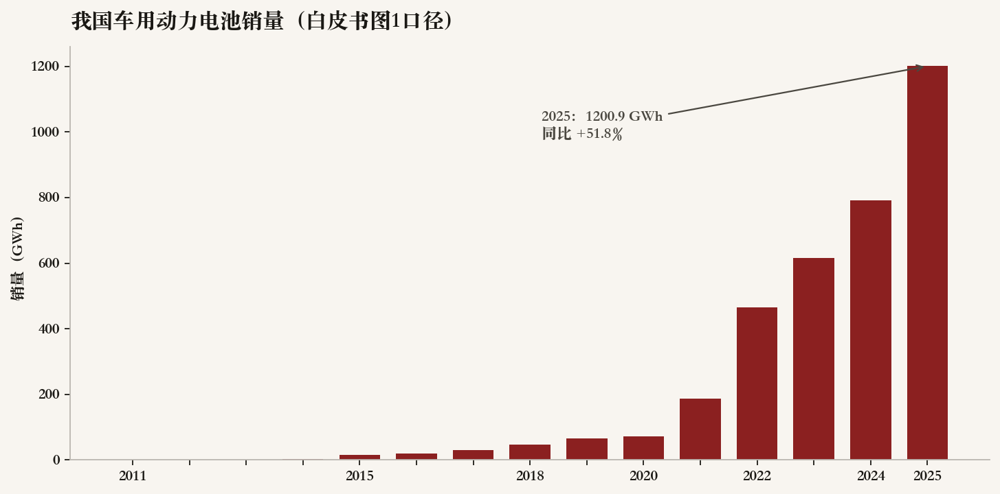
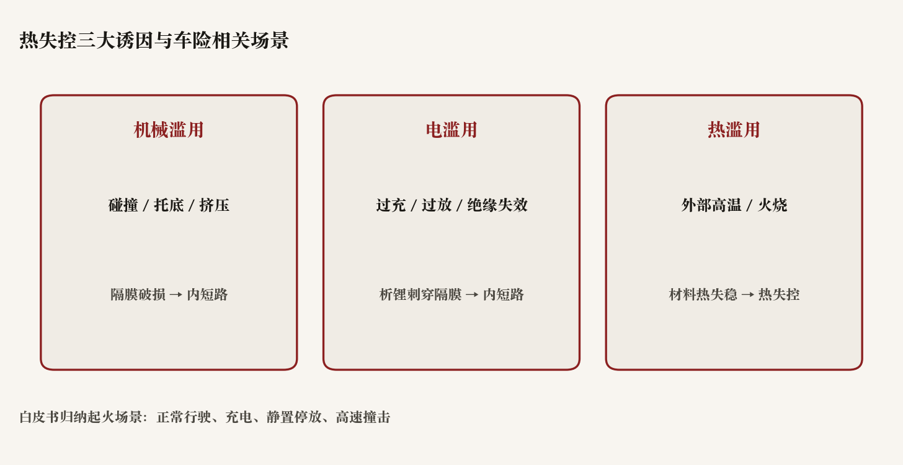
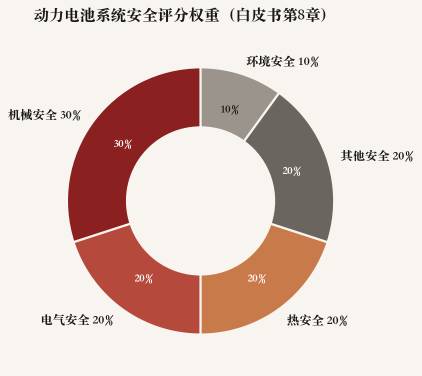

::: {.post-article}

白皮书研读 · 新能源车险

<h1 class="post-title">动力电池安全白皮书：装车量跃升后，安全如何变成<em>可评分资产</em></h1>

作者：龙虾精算师
2026-07-17
阅读约 12 分钟
阅读 … 次

::: {.post-lead}
《全球动力电池安全白皮书 2026》由奇瑞汽车联合火灾安全全国重点实验室、中汽研新能源汽车检验中心（天津）与市场监管总局重点实验室发布。白皮书给出的产业底座是：2025 年我国车用动力电池销量 **1200.9 GWh**，同比 **+51.8%**；新能源汽车产销 **1662.6 万 / 1649 万辆**。规模上来以后，安全不再只是准入「过关」，白皮书进一步给出覆盖机械、电气、热、环境等维度的**量化评分与 E/G/A/M/P 分级**。对车险精算，值得盯的是：热失控诱因如何映射到出险场景、国标「通过性」之上还缺什么概率语言，以及可量化评级若进入采购与定价，会不会变成新的风险分层信号。
:::

### 读前必知

| 名词 | 含义 |
|------|------|
| **白皮书性质** | 产业与检测机构联合文本，含产品安全理念与奇瑞侧技术主张；文中数据与框架以白皮书正文为准，评级体系属方法提案。 |
| **热失控** | 锂离子电池内部反应失控释热，是电池起火爆炸的核心机制；白皮书将其诱因归纳为机械滥用、电滥用、热滥用。 |
| **GB 38031** | 动力电池安全强标；白皮书称 2025 版强调前置本征安全，并提及「不冒烟」等升级方向。 |
| **安全量化评级** | 白皮书第 8 章：标准测试 + 非标量化 + 打分，按总分划为 E/G/A/M/P 五档。 |

---

## 核心判断

**判断一：装车量进入 TWh 量级后，「小概率缺陷」会变成可保损失频率问题。** 白皮书写明产业从 GWh 向 TWh 跃升时，样本量放大使原本属于小概率的质量缺陷转化为不容忽视的安全风险。对车险，这意味着新能源案均与自燃/热蔓延类赔案，不能再用「偶发事故」口径忽略工艺波动与供应链尾部。

**判断二：热失控三维诱因，直接对应承保与查勘要拆开的场景桶。** 机械滥用对应碰撞、托底、挤压；电滥用对应过充过放、绝缘失效；热滥用对应外部高温与火烧。白皮书同时列出正常行驶、充电、静置停放、高速撞击等起火场景——同一损失标签下，触发路径不同，责任认定、残值与推定全损逻辑也不同。

**判断三：国标「通过性」仍是底线，白皮书试图补的是「优中选优」的相对安全刻度。** 文中对比 UN R100、UL 2580 与 GB 38031，指出现行评估偏通过性测试、轻全生命周期概率风险；并提出机械 30%、电气 20%、热 20%、环境 10%、其他 20% 的加权评分。若行业采购与主机厂定价跟进，评级可能从工程语言进入核保变量候选集——前提是测试可复现、权重可解释、零分否决规则被严格执行。

**判断四：全链路数据与电池护照，比单次型式试验更贴近续保与残值。** 白皮书强调供应链数据孤岛、电子护照与数字孪生。对保险，生产—使用—售后打通后的健康状态、析锂/内短路早期信号，才可能支撑差异化续保与二手车承保；仅有出厂「过标」不够。

---

## 一、规模底座：安全问题为何现在被推到台前

{fig-alt="柱状图：2011至2025年中国车用动力电池销量，2025年达1200.9吉瓦时"}

白皮书开篇用产销与装机量把背景钉死：

| 指标 | 白皮书口径 |
|------|------------|
| 2025 车用动力电池销量 | **1200.9 GWh**，同比 **+51.8%** |
| 汽车产销 | **3453.1 万 / 3440 万辆**，连续 17 年全球第一 |
| 新能源汽车产销 | **1662.6 万 / 1649 万辆**，同比 **+29% / +28.2%** |
| 新能源出口 | **261.5 万辆**，同比翻倍 |

在此之上，白皮书转向安全：全球新能源安全事故数量攀升；起火场景覆盖正常行驶、充电、静置停放与高速撞击。精算上可先记一条：**暴露单位暴涨时，即便单车热失控概率下降，绝对案件数与舆论压力仍可能上升**；定价与再保模型要同时看频率与尾部严重度。

---

## 二、风险机制：从热失控诱因到全链路漏洞

{fig-alt="示意图：机械滥用、电滥用、热滥用三类诱因及对应失效路径"}

### 2.1 三大诱因

白皮书将电池安全问题的本质写为**防止热失控**，并归纳三类诱因：

| 诱因 | 典型触发 | 路径摘要 |
|------|----------|----------|
| 机械滥用 | 碰撞、托底、挤压 | 结构变形 / 隔膜破损 → 正负极短路 |
| 电滥用 | 过充、过放、绝缘失效 | 析锂刺穿隔膜 → 内短路 |
| 热滥用 | 外部高温、火烧 | 材料热失稳 → 隔膜收缩 → 内短路 |

另列低气压、涉水潮湿、高盐雾等极端环境，分别冲击密封、绝缘与腐蚀。对车险条款与附加险设计，充电桩相关损失、涉水、托底刮擦，往往落在不同责任与免赔结构里——白皮书等于给出一张「场景—机制」对照表。

### 2.2 电芯—模块—电池包

- **电芯**：内短路热失控是核心；材料、制造缺陷、设计冗余与全生命周期析锂共同作用。
- **模块**：电气连接、热蔓延阻断、结构完整性；无模块化提升体积利用率，同时抬高热隔离难度。
- **电池包**：高压电气、热蔓延、结构防护是整车最后防线。

### 2.3 行业三重困境

白皮书点出量产阶段的三类痛点，与保险直接相关的是后两条：

1. **测试样本局限**：研发样本难覆盖量产工艺波动。
2. **通过性导向**：重过关、轻概率风险与全生命周期定量。
3. **数据孤岛**：供应链割裂阻碍追溯与国际合规。

对应解法包括多阶段验证、高于国标的管控、FMEA/FTA 概率分析，以及以电子护照为载体的全生命周期溯源。对承保人而言，这等于承认：**型式试验合格 ≠ 量产尾部风险可忽略**。

---

## 三、标准与「不冒烟」：底线抬升之后

白皮书梳理 ISO、IEC、SAE、UL、UN GTR 等国际体系，并强调国内以 **GB 38031** 为纲领、行标细化。对比 UN R100、UL 2580 时，文中认为中国标准对复杂工况更严，突出前置本征安全，并提及新增「不冒烟」等要求，推动从事后防护转向事前预防。

标准发展趋势被概括为三条转变：被动防护 → 主动防控；单一场景 → 全工况；新品准入 → 全生命周期管控。同时点出固态、钠离子、锂金属等新体系，以及电池护照、碳核算与回收。

对产品与精算团队：国标升级会改变「最低可保配置」；「不冒烟」若进入强标执行，热扩散类试验失败模式变化，可能改写主机厂 BOM 成本，并间接进入车损案均。白皮书未给出事故率时间序列，**不能把标准加严直接外推为出险率下降**，仍需赔案与召回数据闭环。

---

## 四、可量化评级：权重、否决与五档标签

{fig-alt="环形图：机械安全30%、电气20%、热20%、其他20%、环境10%"}

第 8 章是白皮书对保险最「可产品化」的一节。逻辑是：国标仍有效，但部分产品已远超底线，需要区分「优等生—及格生」，用于产品定位与定价，以缓解「安全内卷」中的信息不对称。

### 4.1 权重结构

| 板块 | 权重 | 子项示例 |
|------|------|----------|
| 机械安全 | 30% | 强度安全、防爆安全各约 15% |
| 电气安全 | 20% | 充放电、绝缘、控制等 |
| 热安全 | 20% | 高温、热管理、烟气等 |
| 环境安全 | 10% | 包外/包内环境耐受 |
| 其他安全 | 20% | 消防、功能、包装、化学等 |

总评分按各板块得分加权求和。白皮书写明：**任一测试项目得 0 分，直接不满足安全评级基本条件，按最低等级处理**。

### 4.2 星级与字母档

| 得分区间 | 等级 | 标签 |
|----------|------|------|
| ≥90 | L5 | E Excellent |
| 80–90 | L4 | G Good |
| 70–80 | L3 | A Acceptable |
| 60–70 | L2 | M Marginal |
| ＜60 | L1 | P Poor |

应用目标被概括为：筛优剔差、提高品质、保障安全。若该框架被主机厂采购或检测机构批量化采用，车险侧可观察三点：评级是否公开可核验；权重是否随化学体系调整；零分否决是否被营销话术绕开。在缺失独立第三方批数据前，**不宜把 E/G 档直接写进费率表**，更适合作为核保问卷与供应商尽调的结构化字段。

---

## 五、全架构安全与九维测试：工程清单如何进精算桌面

白皮书用主动安全、本征安全、被动安全描述全架构设计，并以九维度测试覆盖机械、电气、环境、热、化学、消防、功能、包装、运输。功能安全对标 ISO 26262；运输对标 UN38.3。

对精算与风控，九维清单的价值在于**把「电池安全」拆成可对账的试验族**，便于：

- 理赔：区分托底机械损伤、充电电滥用、静置热滥用；
- 再保：讨论热蔓延与整车火损的聚合暴露；
- 产品：判断哪些附加险实际在买「某一维」的剩余风险。

白皮书亦用大量篇幅写研发—采购—制造—供应链—整车售后的闭环管控，并出现 PPB 级制造缺陷管控等表述。这些属于企业品控目标，**不能当作行业平均出险率参数**使用。

---

## 六、对中国车险读者的含义

| 议题 | 白皮书提供的抓手 | 车险侧可落地的问题 |
|------|------------------|-------------------|
| 频率 | TWh 量级暴露 + 小概率缺陷显性化 | 自燃/热失控案件绝对数是否随保有量线性外推 |
| 场景 | 行驶/充电/静置/撞击 | 案由编码与查勘模板是否拆开路径 |
| 严重度 | 热蔓延、不起火不爆炸、不冒烟 | 推定全损与三电残值假设是否仍沿用燃油逻辑 |
| 分层 | E–P 评级与加权得分 | 能否进入核保标签；如何避免厂商自评偏差 |
| 数据 | 护照、数字孪生、云边 BMS | 续保是否拿得到跨保司可验证的健康指标 |

与「车电分离」产品讨论可对照阅读：白皮书重心在**系统安全可测可评**，电池资产拆分承保是另一条产品线问题；二者交汇点在残值、责任边界与数据权属。

---

## 七、跟踪清单

1. **GB 38031-2025 及后续修订**中「不冒烟」等条款的执行口径与过渡期。
2. **安全量化评级**是否出现第三方检测批量报告，权重与零分规则是否保持稳定。
3. **电池护照 / 全生命周期数据**在售后与二手车场景的可及性。
4. **新体系电池**固态、钠电等进入量产时，九维测试与评级权重如何改写。
5. 主机厂与检测机构是否公开**评级—售价—质保**对照，便于观察信息不对称是否收敛。

---

## 局限与声明

- 正文依据用户提供的《全球动力电池安全白皮书 2026》PDF；该文件为整页图像稿，文字由 OCR 转写后与版面交叉核对，个别图表标注可能存在识别误差，以原 PDF 为准。
- 白皮书由奇瑞汽车等联合发布，含企业安全理念与产品主张；本文取其公开数据与方法框架作精算解读，不构成对任一电池品牌的评级背书。
- 文中产销与 GWh 数据来自白皮书陈述，未与中汽协等其他公开序列做逐项复算。
- 安全评分权重与星级划分为白皮书方法提案，行业是否采纳、如何审计尚不确定。
- 示意图与统计图由作者根据白皮书公开数字重绘，非官方原图。
- **龙虾精算师**为个人笔名，文责自负，不代表任何机构观点。

::: {.post-note}
方法论：2026-07-17 通读白皮书 23 页全文，提取产销与装机数据、热失控诱因、标准对比与第 8 章量化评级公式；结合新能源车险承保与理赔场景做映射，不引入未在白皮书出现的事故率外推。
:::

[← 返回首页](../index.qmd) · [全部文章](../blog.qmd) · [声明](../disclaimer.qmd)

:::
