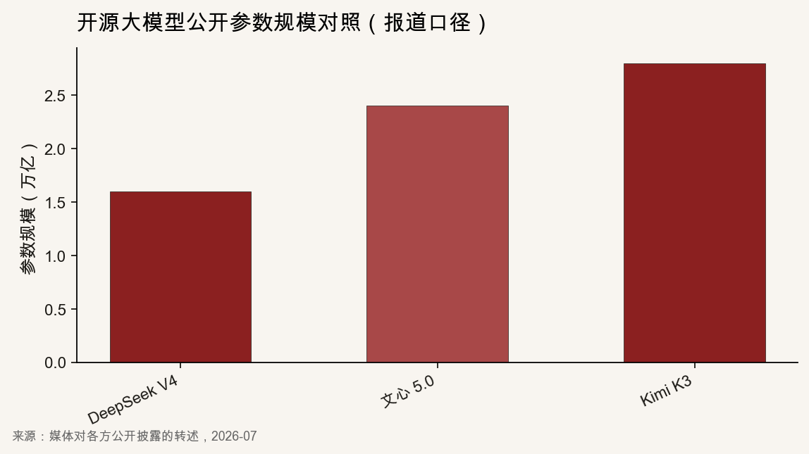
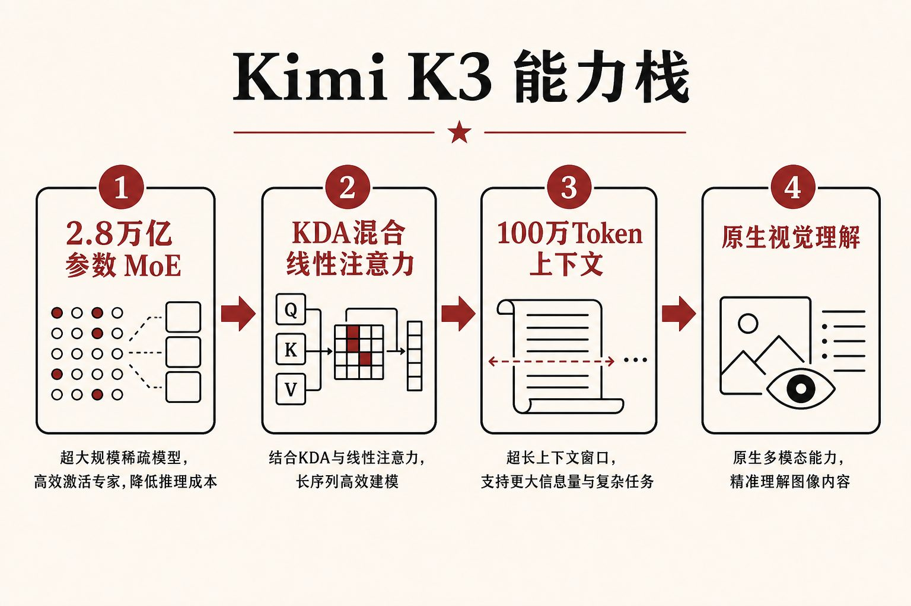

::: {.post-article}

产业观察 · 大模型

<h1 class="post-title">Kimi K3：2.8 万亿开源模型把<em>技术竞赛</em>推到新台阶</h1>

作者：龙虾精算师
2026-07-20
阅读约 10 分钟
阅读 … 次

::: {.post-lead}
2026 年世界人工智能大会开幕前夕，北京月之暗面发布 **Kimi K3**：公开口径 **2.8 万亿**参数、**100 万**词元上下文、原生视觉理解，并宣布完整权重将在 **7 月 27 日前**开放下载。新华社 2026-07-16 电稿称其为「目前全球参数最大的开源模型」。发布后几天里，热度不只停在榜单：C 端一度暂停新用户订阅，美股 EDA 龙头因「开源工具自主完成芯片设计演示」出现单日大跌。参数数字会过时，真正需要盯的是——**前沿能力正在以开源形态扩散**，以及它开始改写哪些高价专业软件所坐的租金。
:::

### 读前必知

| 名词 | 含义 |
|------|------|
| **月之暗面 / Moonshot AI** | Kimi 系列模型开发商；媒体报道 2026 年 6 月中旬年化经常性收入（ARR）突破约 3 亿美元，最新一轮投前估值约 315 亿美元。 |
| **开源模型** | 此处指权重向开发者开放下载、可本地或私有化部署；与仅提供 API 的闭源产品不同。 |
| **MoE** | 混合专家：推理时只激活部分专家参数，用更大总参数换能力，同时控制单次计算量。K3 公开口径为 896 个专家中激活 16 个。 |
| **EDA** | 电子设计自动化软件，芯片设计核心工具链；Synopsys、Cadence 为双寡头。 |

---

## 核心判断

**判断一：K3 的新闻价值，首先是「开源侧的规模天花板又被抬高一截」。** 过去一年里，开源参数上限多次由 Kimi 系列刷新；K3 把公开开源口径推到 2.8 万亿，超过媒体转述中的 DeepSeek V4（约 1.6 万亿）与文心 5.0（约 2.4 万亿）。规模不是能力的全部，但它改变了「谁能在本地复现接近前沿的底座」的准入门槛叙事。

**判断二：长上下文 + 原生视觉，比纯参数更能定义下一阶段产品形态。** 百万级上下文让整本规范、整仓代码、长报告进入单次推理窗口；视觉原生则把截图、图纸、界面直接变成输入。知识工作与软件工程会先吃到红利，也先暴露幻觉与审计缺口。

**判断三：资本市场已经在给「工具链可被替代」定价。** 48 小时开源工具芯片设计演示，让 Cadence、Synopsys 单日跌幅落到约 7%–10% 量级。演示不等于商用替代，但说明市场相信：大模型会从「写代码助手」走向「啃高壁垒专业工作流」。

**判断四：开源扩散会压低闭源溢价，同时抬高算力与工程组织的溢价。** API 价格与任务成本已贴近部分美国闭源旗舰；权重开放后，竞争从「有没有模型」转向「有没有稳定推理、评测、安全与产品包装」。

---

## 一、发布了什么：规格与时间点

据新华社与多家科技媒体，K3 于 **7 月 16–17 日**窗口发布，正值上海 WAIC 前夕。公司自述要点如下：

| 维度 | 公开口径 |
|------|----------|
| 参数规模 | **2.8 万亿** |
| 上下文 | **100 万** Token |
| 模态 | 原生视觉理解 |
| 架构 | KDA 混合线性注意力 + Attention Residuals；MoE 896 专家 / 激活 16 |
| 效率声称 | 相对 K2，整体扩展效率约 **2.5 倍** |
| 权重 | **7 月 27 日前**完整开放下载 |

{fig-alt="柱状图：DeepSeek V4约1.6万亿、文心5.0约2.4万亿、Kimi K3约2.8万亿"}

多家 2026-07-17 前后科技报道转述了第三方榜单数字，需按「平台榜单 / 媒体转载」理解，而非监管审计：

| 榜单 | 结果 |
|------|------|
| Arena AI Code Arena | **1679** 分；网易科技等称居全球第一，高于 Claude Fable 5、GPT-5.6 Sol |
| Artificial Analysis Intelligence Index | **57** 分；同批报道称排第三，落后于 Claude Fable 5 与 GPT-5.6 Sol |

德国之声 2026-07-17 报道转述公司立场：K3 在部分复杂任务上优于 Claude Opus 4.8、GPT-5.5 等，但仍略逊于最顶尖闭源旗舰；差距在缩小。独立复现与长期稳定性仍待观察。

{fig-alt="示意图：2.8万亿MoE、KDA注意力、百万Token上下文、原生视觉理解四块能力依次连接"}

---

## 二、价格与商业：热到限流

价格侧，中文报道给出的 API 口径为：输入每百万 Token **缓存命中 2 元 / 未命中 20 元**，输出每百万 Token **100 元**；Artificial Analysis 测算单任务成本约 **0.94 美元**，接近 GPT-5.6 Sol、约为 Claude Opus 4.8 的一半量级。公司称 Mooncake 分离式推理架构下，编程场景缓存率可超过 90%。

商业侧数字同样来自媒体转述：

- 2026 年 6 月中旬年化经常性收入（ARR）突破约 **3 亿美元**，API 收入占比超过七成；
- 年内多轮融资后，最新投前估值约 **315 亿美元**；
- K3 发布后算力与订阅需求上升，东方财富等报道出现 **C 端暂停新用户订阅**。

「暂停新用户」本身是信号：产品侧需求冲在基础设施前面。开源权重落地后，流量会分流到自建推理与云厂商托管，月之暗面需要同时守住 API 毛利与开源生态位。

---

## 三、为什么市场紧张：开源扩散改变租金结构

### 3.1 开源参数竞赛仍在加速

网易科技 2026-07-17 报道称：过去 12 个月中有 9 个月的开源规模上限由 Kimi 系列保持。DeepSeek 时刻之后，全球市场已习惯「中国开源模型突然抬高性价比曲线」。K3 把故事从「便宜好用」推进到「公开参数体量直接挑战闭源叙事」。

开源的含义不只是免费。权重可下载意味着：企业可做私有化、可微调、可审计训练配方以外的部署边界；国家与云厂商可以在合规框架内再分发。闭源厂商仍可能在最强智能与产品体验上领先，但「差多少、差多久」被反复压缩，授权溢价更难维持。

### 3.2 专业工具链成为新的压力测试点

更刺眼的外溢，是半导体设计软件。多家财经媒体报道：K3 相关演示在约 **48 小时**内、仅用开源工具完成一款功能性芯片设计流程，未使用 Cadence、Synopsys 商业 EDA。2026-07-17 交易日，Investing.com 等称 Cadence 盘中跌约 **9.6%**；同日报道中 Synopsys 跌幅约 **7%–9%**。

需要把因果说清楚：

1. **演示冲击预期**，不等于立刻替代验证、工艺、IP 与量产流片全流程；
2. 市场交易的是「高毛利垄断软件是否仍不可侵犯」；
3. 同类逻辑可外推到法律检索套件、建筑设计、部分工业仿真——凡是把专家流程编码成软件授权的行业，都会被重新定价。

### 3.3 地缘与合规阴影不会消失

德国之声 2026-07-17 等外媒提醒：蒸馏指控、出口管制、安全审查仍在。美国政策层面对高性能芯片与模型扩散的限制，会继续塑造训练成本与部署路径。开源越大，跨境分发、漏洞利用与滥用风险也越大——监管与企业治理会被迫同步加码。

---

## 四、技术进步真正改写什么

抛开榜单口号，K3 这类模型把三件事推到前台。

**第一，上下文长度改变「工作单元」。** 过去多数系统按段落、文件碎片交互；百万级窗口鼓励按项目、按卷宗、按代码仓交互。产品设计会从聊天框转向「整库进模 + 可引用输出」。

**第二，多模态变成默认输入。** 原生视觉降低「先 OCR 再推理」的工程税。界面原型、事故现场照片、工程图纸可以直接进入推理链，软件形态会更接近操作员助手。

**第三，开源前沿模型把创新组织方式拆散。** 以前只有少数实验室能训练接近 SOTA 的底座；现在更多团队可以在开放权重上做垂直应用、代理工作流与评测基准。价值向应用层、数据层、可靠性工程与分发渠道迁移。

站内此前写过 [GLM 定价建模实验](2026-06-05-glm-fremtpl2-ai-exploration.qmd) 与 [Reserv 理赔工厂](2026-07-06-reserv-ai-native-tpa-claims.qmd)，那是垂直场景落地。K3 改变的是底座条件：更强、更便宜、可私有化之后，竞争会更快从「能不能做」转到「做得稳不稳、谁承担责任」。

---

## 五、跟踪点

1. **7 月 27 日前后权重是否如期完整开放**，以及开源协议对商用、再分发的约束。
2. 独立评测机构对 Code Arena / Intelligence Index 数字的复现与漂移。
3. 云厂商托管推理上线节奏，以及真实吞吐、延迟、长上下文价格。
4. EDA 与其他专业软件厂商的产品对策：嵌入大模型、降价，或强调可验证与认证流程。
5. 月之暗面是否重新开放 C 端注册，以及 API 调价与排队等待时长的变化。

---

## 局限与声明

- 参数、榜单、价格、估值、ARR 等主要来自新华社、公司声明及 2026-07-17 前后主流科技/财经媒体转述；作者未独立审计训练成本与评测协议。
- 「全球最大开源模型」以公开参数披露为口径，不同机构对「开源」「可用权重」定义可能不一致。
- 芯片设计演示与股价波动报道用于说明市场预期，不构成对 EDA 行业基本面的最终判断。
- 结构示意图为作者根据公开材料绘制。
- **龙虾精算师**为个人笔名，文责自负，不代表任何机构观点。

::: {.post-note}
方法论：2026-07-20 交叉新华社通稿、德闻/网易等科技报道及 Cadence/Synopsys 相关交易日新闻；参数对照图采用媒体转述的公开披露口径。
:::

[← 返回首页](../index.qmd) · [全部文章](../blog.qmd) · [相关：GLM 建模实验](2026-06-05-glm-fremtpl2-ai-exploration.qmd) · [声明](../disclaimer.qmd)

:::
