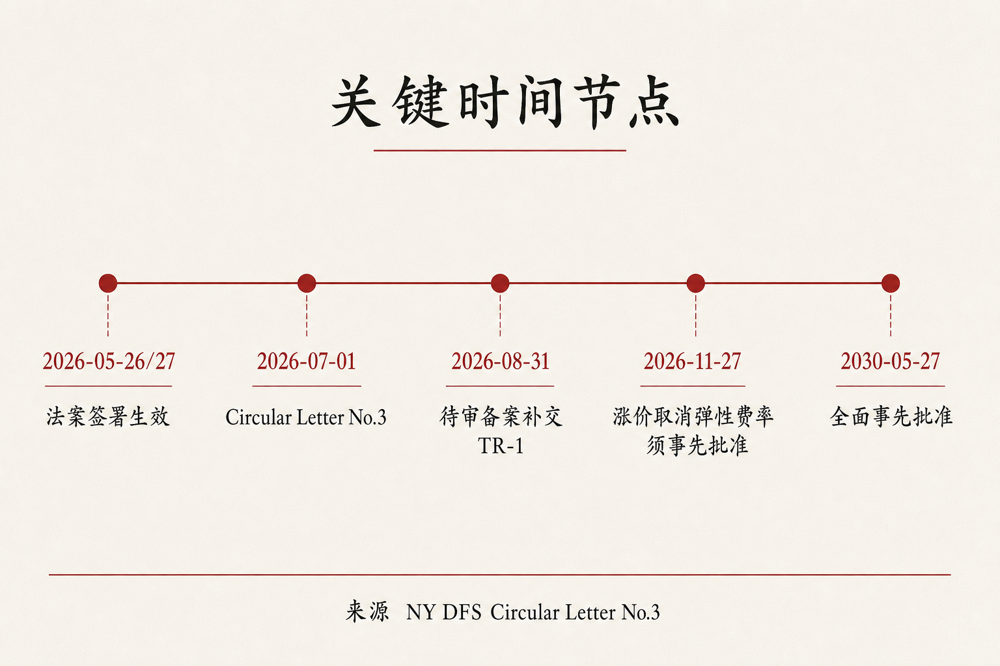
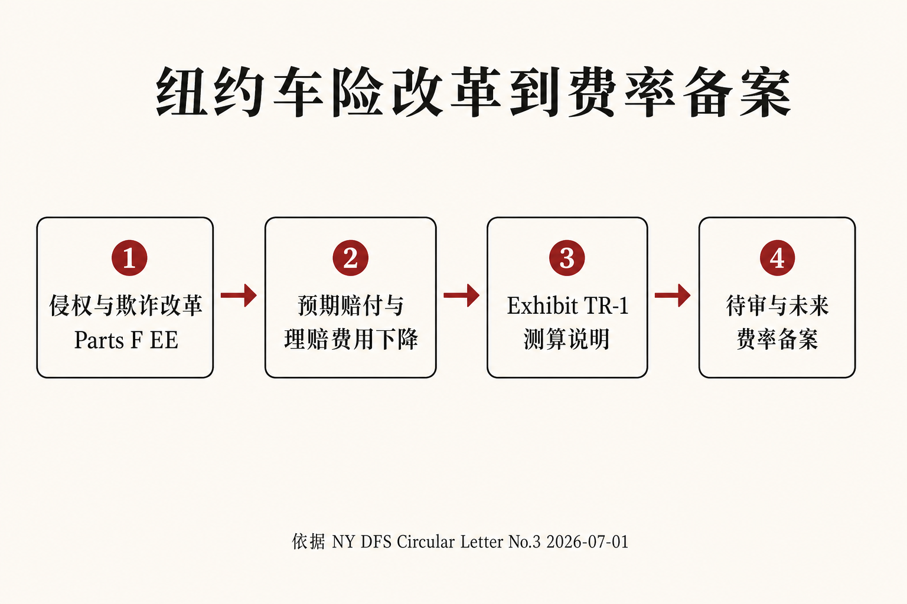

::: {.post-article}

立法研读 · 美国车险定价

<h1 class="post-title">纽约车险改革：赔付节省如何<em>写进费率备案</em></h1>

作者：龙虾精算师
2026-07-21
阅读约 12 分钟
阅读 … 次

::: {.post-lead}
2026 年 7 月 1 日，纽约州金融服务局发布 **Insurance Circular Letter No. 3**，对象是获准承保机动车保险的保险公司、纽约汽车保险计划以及费率服务组织。文件确认：2026 年 5 月签署的车险相关法律修订已生效；监管要求在**所有待审与未来机动车费率备案**中，评价并适当反映改革对索赔频率、案均赔款、理赔费用及其他精算上可指示减项的影响。待审备案须在 **2026 年 8 月 31 日**前补交新表 **Exhibit TR-1**。车主侧关注保费是否下调；费率备案侧须在完整事故年经验尚未形成时，完成「预期节省」的百分比测算与方法说明。
:::

### 读前必知

| 名词 | 含义 |
|------|------|
| **Circular Letter No. 3** | 纽约州金融服务局 2026-07-01 行业通函，阐释 2026 年机动车保险改革对费率备案的要求。 |
| **Part F / Part EE / Part II** | 2026 年州法 Chapter 55、Chapter 58 中与车险相关的三项修订：扩大保险欺诈定义、修改严重伤害与非经济损害规则、收紧私车弹性费率。 |
| **Exhibit TR-1** | 「Automobile Tort Reform Calculation」附表：须给出改革带来的预期索赔与理赔费用下降百分比，并说明测算方法与假设。 |
| **弹性费率** | Insurance Law § 2350：此前私车整体平均费率上调不超过约 5% 时，可在一定条件下无需事先批准即实施；Part II 取消涨价免予事先批准的路径。 |
| **事先批准** | 费率上调须经监管专员批准后方可实施。 |

---

## 核心判断

**判断一：通函的执行重点，是将「预期赔付节省」纳入费率备案义务。** 监管写明：Part F 与 Part EE 预计将抑制虚假与夸大索赔、缓和频率与严重度、降低理赔费用；待审与未来机动车费率备案须一致反映这些预期影响，依据 Insurance Law §§ 2304(b)、2305(c)。

**判断二：Exhibit TR-1 要求公司披露节省百分比及其测算依据。** 公司须给出改革导致的预期索赔与理赔费用下降百分比，并提供完整推导、计算与精算流程、方法、假设。备案审查将同时核对涨价申请与节省假设是否相互一致。

**判断三：自 2026 年 11 月 27 日起，私车整体平均费率上调须事先批准。** Part II 禁止在未经专员事先批准的情况下实施整体平均费率上调；降幅不超过约 5% 的路径仍可保留。2030 年 5 月 27 日 § 2350 将废止，此后非营业机动车费率全面适用事先批准。

**判断四：通函要求反映预期节省，未规定统一降幅，亦未要求保费即时下调。** 节省百分比接近零且论证不足，可能影响备案进度；节省估得过高而后续经验未兑现，则须在后续事故年以新经验修正 indication。

---

## 一、三项立法修订

Chapter 55、Chapter 58 于 2026 年 5 月 26–27 日签署。Circular Letter No. 3 将其中与车险成本直接相关的条款归为三组。

### 1.1 Part F：扩大「保险欺诈行为」定义

Penal Law § 176.05 的定义扩展为：雇佣、请求、鼓励、组织或邀请他人**策划机动车事故**的人，亦构成保险欺诈行为；并视同其不当取得或扣留了受害人损失的全部金额。该部分自 **2026 年 5 月 27 日**起生效。

精算上，该修订首先影响**频率假设与欺诈相关理赔费用**：策划事故链条的刑事定义扩宽后，监管预期虚假事故及相关索赔将受到抑制。

### 1.2 Part EE：严重伤害门槛、程序与非经济损害

该部分自 **2026 年 5 月 26 日**起生效，适用于当日及之后启动的诉讼与程序，主要包括：

| 条款方向 | 内容要点 |
|----------|----------|
| **严重伤害定义收窄** | 删除 Insurance Law § 5102(d) 中「非永久性伤害、事故后 180 日内至少 90 日无法从事惯常日常活动」这一支。 |
| **程序顺序** | 非经济损失诉讼中，须先由事实审理者认定过错，再认定是否构成严重伤害；未认定严重伤害前，不得固定非经济损失责任。 |
| **特定情形非经济损害上限** | 新增 § 5104(d)：在特定过错情形下，严重伤害诉讼的非经济损害上限为 **10 万美元**；死亡案件不适用。 |
| **修正比较过失** | 新增 CPLR § 1411(b)：人身损害诉讼中，若索赔人过错大于对方，则不得获偿。 |

上述条款压低诉讼可及性与非经济损害尾部，对应**严重度与理赔费用**假设；碰撞物理损失本身不因该部分直接下调。

### 1.3 Part II：私车弹性费率收紧

Insurance Law § 2350 被修改为：保险公司不得在未经专员事先批准的情况下，实施整体平均费率**上调**；整体平均费率**下调**不超过约 5% 的路径仍可保留。

| 时间点 | 规则 |
|--------|------|
| **2026-11-27** | Part II 生效；金融服务局将同步修订 11 NYCRR Part 163 |
| 此前已提交的备案 | 仍适用现行弹性费率规则 |
| **2030-05-27** | § 2350 废止；非营业机动车费率全面事先批准 |

涨价路径收紧后，上调费率的审批时滞与材料要求提高；保费水平是否下降，仍取决于 indication 中的损失与费用假设。

{fig-alt="时间线：2026年5月法案签署、7月1日通函、8月31日补交TR-1、11月27日涨价须事先批准、2030年全面事先批准。来源：NY DFS Circular Letter No.3"}

---

## 二、「体现赔付节省」在费率里的具体要求

监管在通函中写明：Part F 与 Part EE **预计**将抑制虚假与夸大索赔，缓和频率与严重度，并降低理赔费用；因此定价模型与待审、未来备案须评价并适当反映这些**预期减项**。

费率 indication 的简化结构为：

> 目标保费 ≈ 预期损失 + 费用 + 利润与资本加载  
> 预期损失 ≈ 频率 × 案均 × 暴露量

改革改变频率、案均与理赔费用所依赖的法律环境参数。若备案完全沿用改革前的损失与理赔费用假设，监管将认定：改革带来的成本下降未被反映到费率中。

{fig-alt="四步传导：侵权与欺诈改革、预期赔付与理赔费用下降、Exhibit TR-1测算说明、待审与未来费率备案。来源：NY DFS Circular Letter No.3"}

### 2.1 Exhibit TR-1 须提交的内容

金融服务局已更新 Rate Filing Sequence Checklist，并在 SERFF 中纳入 **Exhibit TR-1 Automobile Tort Reform Calculation**。待审与未来机动车费率备案须完成该表，至少包括：

1. 因 Part F、Part EE 改革而导致的**预期索赔与理赔费用下降百分比**；  
2. **完整、详细的推导说明**：具体计算、精算流程、方法与假设。

待审机动车费率备案须在 **2026 年 8 月 31 日**前补交上述材料。

仅写「改革有利」或「影响待观察」不满足 TR-1。公司须给出可复核的百分比与方法链；百分比可以很小，论证须完整。

### 2.2 示意：节省假设如何改变 indication

下表为**作者示意假设，非任何公司披露，亦非监管规定的统一降幅**，用于说明「节省百分比」进入 indication 的算术位置。

| 项目 | 改革前假设 | 改革后示意假设 |
|------|------------|----------------|
| 预期损失率 | 70% | 66% |
| 理赔费用率 | 8% | 7% |
| 其他费用与利润加载 | 17% | 17% |
| 综合目标 | 95% | 90% |

若改革前 indication 显示「需整体上调约 8%」才能贴近目标，改革后因损失与理赔费用假设下调，indication 可能变为「上调约 3%」或「持平」。「体现节省」要求将此类下调写入备案材料；继续按改革前环境报涨，将与通函要求不一致。

实务中，公司通常按责任限额、无过错医疗、诉讼敞口、欺诈占比分层估计。各公司组合中欺诈与诉讼结构不同，TR-1 百分比不会整齐划一。

---

## 三、备案与审批的两个关键时点

### 3.1 2026 年 8 月 31 日前补交 TR-1

通函要求：所有目前待审的机动车费率备案，须在 8 月 31 日前补入 TR-1 信息。精算与备案团队须在完整事故年经验形成之前，完成「法律变更 → 频率 / 严重度 / 理赔费用」的映射说明。

可用方法包括：历史欺诈与诉讼占比、类比其他州类似改革后的经验、情景分析与敏感性区间。监管要求过程可复核，不要求所有公司提交同一百分点。

### 3.2 2026 年 11 月 27 日起上调须事先批准

Part II 生效后，私车整体平均费率上调不得再适用「不超过约 5% 即可免予事先批准」的弹性路径。降价路径相对宽松，涨价路径的审批约束增强。

市场侧可能出现两类安排：在 11 月前清理待审上调；或将上调方案按事先批准标准准备完整材料包。若同一备案同时包含涨价申请与 TR-1 节省假设，监管将对照审查二者是否自洽。

---

## 四、对行业与观察者的含义

**对纽约车险市场：** 短期观察指标是备案材料完整度与审批进度。欺诈与侵权规则已生效，经验损失率的改善将滞后显现；TR-1 要求公司在价格中提前写入预期节省。

**对费率精算：** 工作内容在历史 loss cost 外推之外，增加法律变更的前瞻性参数调整与文档化。节省估得过高，后续事故年经验将偏离假设；估得过低且论证空泛，备案可能被要求补充说明。

**对中国观察者：** 「监管改革 → 成本下降 → 保费应降」常被写成线性叙事。纽约通函给出可对照的制度细节：改革对成本的影响须进入正式费率流程，载体是附表、百分比与方法论说明。

---

## 跟踪点

| 时间 / 事项 | 看什么 |
|-------------|--------|
| **2026-08-31** | 待审机动车备案是否普遍完成 TR-1；公开讨论中节省百分比的区间分布 |
| **2026-11-27** | 私车涨价是否全面转入事先批准；11 NYCRR Part 163 修订文本 |
| **2027–2028 事故年** | 欺诈与诉讼相关频率、案均、理赔费用是否出现可归因于改革的变化 |
| **至 2030-05-27** | § 2350 废止前，弹性费率剩余空间如何被使用 |

---

## 局限与声明

- 本文依据纽约州金融服务局 **Insurance Circular Letter No. 3（2026-07-01）** 公开文本整理；法案细节以州法及后续规章修订为准。  
- 文中 indication 示意表为**作者假设，非公司披露、非监管统一参数**。  
- 通函要求反映**预期**节省；实际赔付改善程度取决于执法、诉讼行为与公司组合结构，存在显著不确定性。  
- 结构示意图为作者根据公开材料绘制，非官方制图。  
- **龙虾精算师**为个人笔名，与任何机构无隶属关系；本文为公开信息研究，不构成任何产品、投资或业务建议。

::: {.post-note}
方法论说明：政策事实与时间节点以 NY DFS Circular Letter No. 3（2026-07-01）为准；示意表仅用于解释「节省百分比」进入费率 indication 的位置。
:::

[← 加州 AB 311 与 Prop 103](2026-07-15-ca-ab311-telematics-prop103.qmd) · [日本强制交强险调价](2026-07-01-japan-jibaiseki-rate-reform.qmd) · [全部文章](../blog.qmd)

:::
