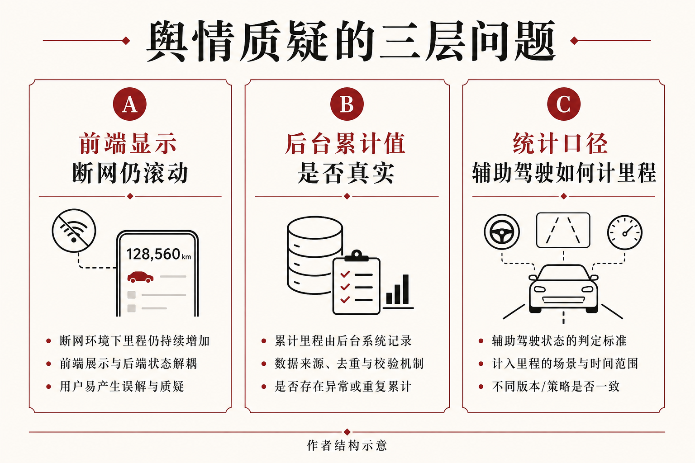
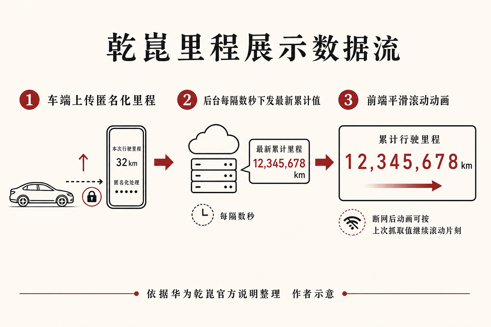

::: {.post-article}

舆情研读 · 智驾数据披露

<h1 class="post-title">华为乾崑里程争议：断网还在滚，质疑的是<em>显示</em>还是<em>口径</em>？</h1>

作者：龙虾精算师
2026-07-22
阅读约 10 分钟
阅读 … 次

::: {.post-lead}
2026 年 7 月初，社交媒体流传实测：断开网络后，华为乾崑智能汽车解决方案官网首页的「累计辅助驾驶里程」数字仍继续滚动上涨。舆论迅速指向「刷里程」「后台预设虚假数值」。7 月 7 日前后，华为乾崑发布《关于乾崑智驾累计辅助驾驶里程显示的说明》，声明数据来自搭载乾崑智驾 ADS 车辆的实际里程汇总；断网后继续滚动，是前端为避免卡顿而做的平滑动画。7 月 16 日，华为智能汽车解决方案 BU CEO 靳玉志在公开场合再次重申同一技术解释。争议的表面是一串数字会不会停，真正被考验的是：**智驾厂商公开累计里程时，公众如何区分「显示层动画」与「统计层事实」。**
:::

### 读前必知

| 名词 | 含义 |
|------|------|
| **累计辅助驾驶里程** | 官网展示的、搭载乾崑智驾车辆在辅助驾驶功能开启期间累计行驶的里程汇总。官方声明发布时写明已超过 **125 亿公里**。 |
| **平滑处理** | 官方用语：前端每隔数秒从后台取最新累计值，再把两次取值之间的差额用连续滚动动画展示，避免数字生硬跳变。 |
| **匿名化汇总** | 官方称里程来自车端实际上传，经匿名化后汇总展示。 |
| **显示层 / 统计层** | 本文区分用语：前者指网页如何把数字呈现给用户；后者指后台累计值如何定义、采集与加总。 |

---

## 核心判断

**判断一：官方解释覆盖的是「断网后为何仍滚动」，未自动消解「累计值如何定义」的全部疑问。** 声明把现象归因于前端动画与抓取节奏，并断言后台累计值真实。公众质疑里至少有三层：显示是否误导、累计值是否真实、辅助驾驶里程的计入规则是否可复核。三层问题不可混为一谈。

**判断二：对智驾营销而言，实时滚动的「百亿公里」是高强度信任资产，也是高强度攻击面。** 任何与直觉不符的展示细节，都会被解读为统计造假。技术上可解释的动画，在舆情上仍可能被记为「数字不可信」。

**判断三：对精算与保险观察者而言，公开累计辅助驾驶里程目前更接近品牌披露指标，尚不足以直接进入定价模型。** 定价需要的是可复核的暴露量、功能开启口径、接管与事故标签；官网滚动数字缺少独立审计与口径白皮书时，只能作为叙事材料，不能作为费率因子。

**判断四：行业下一步压力在「披露规则」，不在单一品牌的前端交互。** L2 组合驾驶辅助强制国标推进数据记录统一后，面向公众的里程公示若仍各家自定，同类争议会反复出现。

---

## 一、事件经过

| 时间 | 事项 |
|------|------|
| 2026 年 4 月起 | 华为乾崑开始在官网公开辅助驾驶里程实时数据 |
| 2026 年 7 月初 | 用户断网实测视频流传，断网后里程数字仍滚动上涨 |
| 约 2026-07-07 | 华为乾崑发布《关于乾崑智驾累计辅助驾驶里程显示的说明》 |
| 约 2026-07-16 | 靳玉志公开回应：滚动为前端平滑设计，公示统计为真实运行数据 |

官方说明中的关键数字与表述：

- 声明发布时，累计辅助驾驶里程 **超过 125 亿公里**；  
- 展示指标包括「乾崑智驾累计辅助驾驶里程」「搭载乾崑智驾车辆累计行驶总里程」；  
- 数据来源为搭载乾崑智驾 ADS 的车辆实际里程，匿名化汇总；  
- 后台每隔数秒向前端传输最新数据；前端用连续滚动展示两次抓取之间的变化。

{fig-alt="三列示意：前端显示、后台累计值、辅助驾驶计里程口径。作者结构示意"}

---

## 二、官方解释在说什么

按官方说明，数据链路可概括为三步。

{fig-alt="车端上传、后台下发、前端平滑滚动三步。断网后动画可按上次抓取值继续片刻。依据官方说明的作者示意"}

**第一步：车端生成里程并上传。** 官方称累计辅助驾驶里程与搭载车辆总行驶里程，均来自实际车辆数据。

**第二步：后台汇总后间歇下发。** 「每隔数秒」向展示页推送或供前端拉取最新累计值，以应对网络时延。

**第三步：前端动画填平两次抓取之间的差额。** 用户看到的「不停在涨」，在连通状态下对应后台增量的可视化；在断网或网络波动时，页面可能仍持有断网前最后一次抓取到的目标值，动画继续滚向该目标，直至收敛停止。

因此，官方逻辑下：

| 观察 | 官方对应解释 |
|------|----------------|
| 断网后数字仍动一会儿 | 平滑动画未立刻中断 |
| 最终停住的位置 | 取决于断网前最后一次成功获取的累计值 |
| 是否等于「后台还在造假增长」 | 官方否定；称无最新数据后会逐步停止滚动 |

从工程角度看，该解释自洽：动画层与统计层可以分离。从舆情角度看，用户做断网实验的预期是「断网 = 数字应立即冻结」；任何继续运动都会被读成「本地在编数字」。**预期差**构成了此次争议的直接点火点。

---

## 三、三层问题：显示、真实、口径

### 3.1 显示层：动画是否构成误导

即便后台累计值完全真实，断网后继续滚动仍会改变用户对「实时」的理解。官网若以「实时数据」自我定位，却未在页面显著位置说明「展示含平滑动画、断网后可能短暂继续滚动」，则显示设计会放大不信任。

此类争议的处置通常需要两类动作并行：技术说明与产品改版。仅发声明而不改交互提示，同类实测视频仍可能反复出现。

### 3.2 统计层：累计值是否可被独立验证

官方声明断言数据真实有效，并指向安全出行报告与实时公开。外部观察者目前缺少：

- 第三方审计或鉴证；  
- 可下载的口径说明；  
- 分车型、分功能、分开启状态的明细表。

在缺少上述材料时，外部只能选择相信或不相信声明，无法像核对监管费率备案那样复核。对精算观察者，这意味着：**公开累计里程尚不具备「可审计暴露量」的属性。**

### 3.3 口径层：什么叫「辅助驾驶里程」

累计辅助驾驶里程的大小，高度依赖计入规则，例如：

- 哪些功能开启才计；  
- 短暂退出、接管、降级是否切段；  
- 泊车、高速、城区是否同一套计数；  
- 是否包含合作车型全系、是否含试驾与内部车队。

口径未公开到可复核程度时，即使每一个公里都来自真实车辆，「125 亿」与他品牌「XX 亿」仍可能不可比。乘联会等行业声音近期强调智驾渗透率升高后**统计标准缺失**，与本次舆情指向同一制度缺口。

---

## 四、对智驾叙事与保险观察的含义

### 4.1 里程公示已成为高敏感营销资产

「百亿公里级」累计辅助驾驶里程用于证明规模、数据飞轮与安全迭代。资产越大，对展示瑕疵越敏感。华为乾崑选择从 2026 年 4 月起实时公开，本身提高了透明度预期；透明度提高后，任何显示层异常都会被按「统计造假」标准审视。

### 4.2 与「无忧权益」稿的区分

本站此前讨论过乾崑辅助驾驶无忧权益的保险化路径。那是**产品与责任安排**议题。本稿是**披露与信任**议题。二者相关，但证据链不同：前者看条款与承保结构，后者看公示数字的生成与展示机制。

### 4.3 精算可用的里程，需要另一套字段

若未来智驾相关风险进入车险定价或专属产品，精算侧更需要的是：

| 字段方向 | 用途 |
|----------|------|
| 功能开启时长与里程 | 暴露量 |
| 接管次数与原因码 | 行为与系统边界 |
| 事故与近事故标签 | 损失关联 |
| 不可篡改记录与读取接口 | 理赔定责与审计 |

官网首页的累计滚动值，最多提供行业规模感；不能替代上述字段。L2 强制国标推进数据记录统一后，**车端记录标准化**可能先于**公众披露标准化**落地；在披露规则补齐之前，品牌实时大屏仍将是舆情高发区。

---

## 跟踪点

| 事项 | 观察什么 |
|------|----------|
| 官网展示改版 | 是否增加「平滑动画 / 断网说明」提示，是否提供静态累计快照 |
| 安全出行报告 | 是否补充口径附录、分功能里程、活跃车辆定义 |
| 行业规则 | 智驾里程公众披露是否进入统一规范讨论 |
| L2 强标落地前后 | 车端数据记录统一后，品牌公示是否改用可对齐口径 |

---

## 局限与声明

- 事件事实与官方技术解释，主要依据华为乾崑《关于乾崑智驾累计辅助驾驶里程显示的说明》及公开报道；未对官网前端做独立逆向工程验证。  
- 文中「显示层 / 统计层 / 口径层」划分为作者分析框架，非监管分类。  
- 结构示意图为作者根据公开材料绘制，非官方制图。  
- **龙虾精算师**为个人笔名，与任何机构无隶属关系；本文为公开信息研究，不构成任何产品、投资或业务建议。

::: {.post-note}
方法论说明：政策与官方口径以华为乾崑公开说明为准；结构图用于区分显示、累计值与统计口径三层问题。
:::

[← 华为乾崑无忧权益舆情](2026-06-24-huawei-qiankun-wuyou-opinion.qmd) · [四央企可信数据空间试点](2026-07-03-soe-auto-trusted-data-space-pilot.qmd) · [全部文章](../blog.qmd)

:::
