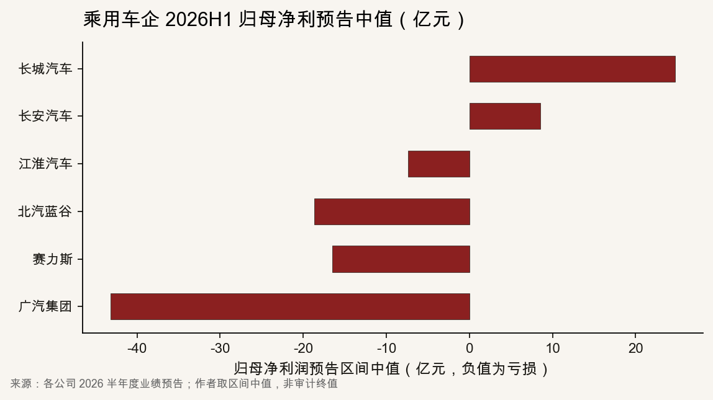
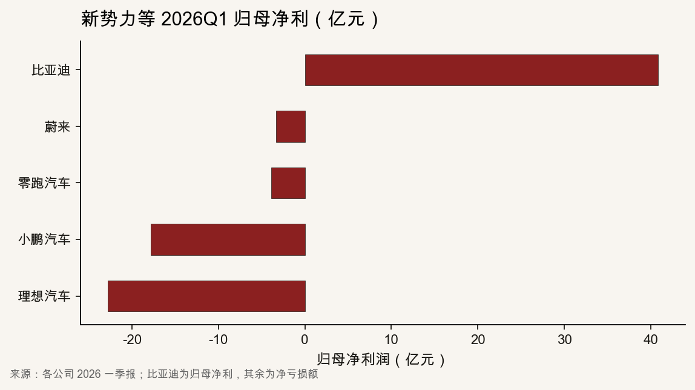
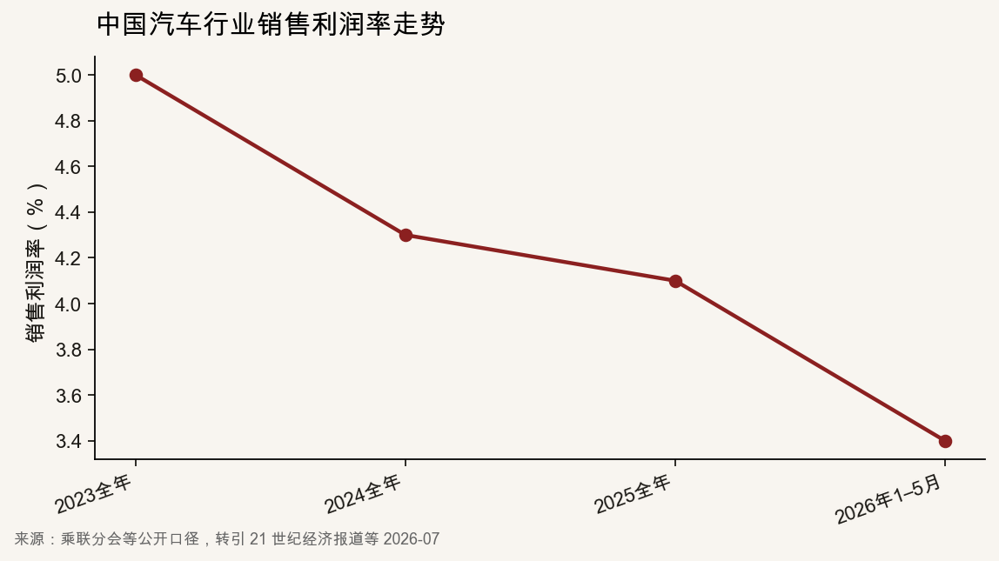
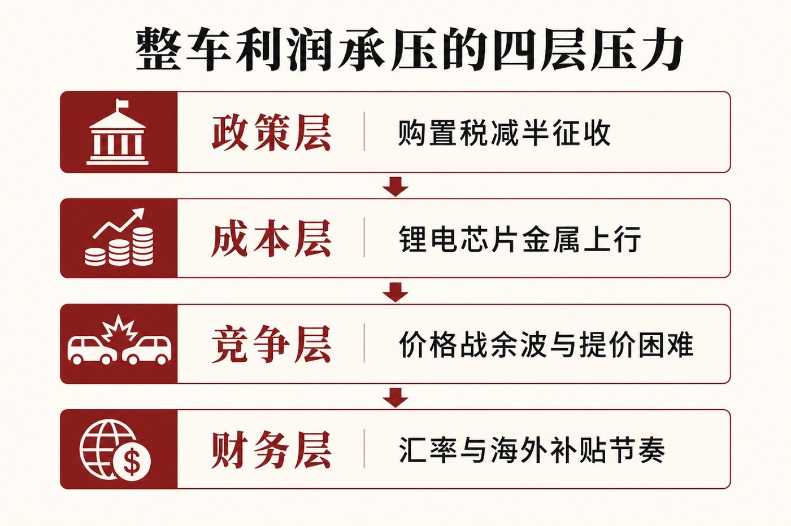

::: {.post-article}

产业财务 · 新能源整车

<h1 class="post-title">新能源车企利润承压：销量高位之后，单车利润<em>去哪了</em>？</h1>

作者：龙虾精算师
2026-07-23
阅读约 12 分钟
阅读 … 次

::: {.post-lead}
2026 年 7 月中旬，多家 A 股乘用车企集中披露半年度业绩预告：长城、长安仍报盈利，但归母净利同比降幅多在五成以上；赛力斯由上年同期盈利转为预亏；广汽亏损进一步扩大。与此同时，一季报显示比亚迪归母净利同比下降逾五成，理想、小鹏、蔚来等均报净亏损。渗透率与智能化配置仍在高位，利润表却集体走弱。对车险与精算观察者，问题不在「又有一家亏了」，而在**整车利润被哪些变量抽走，以及抽走之后哪些承诺还能写进产品与权益条款。**
:::

### 读前必知

| 名词 | 含义 |
|------|------|
| **归母净利润** | 归属于上市公司股东的净利润；业绩预告常用区间，正式半年报可能微调。 |
| **扣非净利润** | 扣除非经常性损益后的净利润，更能反映主业盈利。 |
| **销售利润率** | 利润相对营业收入的比率；乘联分会等公开口径用于描述汽车行业整体盈利厚度。 |
| **购置税减半** | 2026 年 1 月 1 日起，新能源乘用车购置税由全额免征调整为减半征收，实际税率 5%，单车减税额上限 1.5 万元。 |

---

## 核心判断

**判断一：2026 年上半年的利润承压是行业性的，不是个别车企「经营失手」。** 乘用车侧盈利腰斩、由盈转亏与亏损扩大同时出现；行业销售利润率已落到近年低位。把问题只归因于某一家的产品节奏，会低估共同冲击。

**判断二：利润被四层压力叠压抽走——政策退坡、上游成本上行、终端价格竞争、财务与海外节奏。** 任意单层都不足以解释「渗透率高、利润薄」；四层同向时，单车毛利与归母净利会一起变薄。

**判断三：产业链利润正在向上游与具备议价能力的环节集中。** 整车制造利润率显著低于汽车行业整体，更低于电池与部分原材料环节。整车厂用规模换份额的空间变窄。

**判断四：对车险观察者，OEM 利润变薄会改写三类可观察对象——智驾与售后权益的可持续性、残值与案均波动、主机厂主导的保险合作深度。** 财务压力不会立刻改写强制定价公式，但会改写「谁还愿意为辅助驾驶事故额外买单」。

---

## 一、截面：半年度预告与一季报同向走弱

### 1.1 乘用车企 2026H1 业绩预告

下表取各公司业绩预告区间的**中值**，便于对照量级；正式半年报以审计披露为准。

| 公司 | 2026H1 归母净利预告 | 相对上年同期 | 公司点名的主要原因（摘要） |
|------|---------------------|--------------|----------------------------|
| 长城汽车 | 约 23.5–26.0 亿元 | 约 -59% 至 -63% | 海外税收补贴延期收回；汇率波动 |
| 长安汽车 | 约 7.4–9.7 亿元 | 约 -58% 至 -68% | 汇兑损失；原材料上涨 |
| 赛力斯 | 预亏约 15–18 亿元 | 上年同期盈利约 29.4 亿元，由盈转亏 | 存储芯片、工业金属、碳酸锂等上涨 |
| 广汽集团 | 预亏约 40.6–45.7 亿元 | 亏损同比扩大 | 自主亏损加剧；合资投资收益下降；汇率 |
| 北汽蓝谷 | 预亏约 17.7–19.7 亿元 | 亏损收窄 | 销量同比改善；原材料成本仍上行 |
| 江淮汽车 | 预亏约 7.4 亿元 | 小幅减亏 | 汇兑收益同比减少 |

{fig-alt="横向条形图：长城与长安为正，赛力斯北汽蓝谷江淮广汽为负。作者取预告区间中值"}

仍盈利的企业，扣非净利降幅往往更大。例如长安预告扣非净利约 2.3–3.3 亿元，同比降幅最高可接近八成，说明**主业利润厚度比归母净利更薄**。

商用车板块同期表现分化：一汽解放等依托海外订单，归母净利同比大幅上升。本文焦点在乘用车与新能源整车；商用车只作对照，说明「出口兑现」对利润表的含义因细分市场而异。

### 1.2 新势力与头部新能源：2026Q1 已先报亏或利润腰斩

| 公司 | 2026Q1 归母净利 | 同比含义 |
|------|-----------------|----------|
| 比亚迪 | 约 40.85 亿元 | 约 -55% |
| 理想汽车 | 净亏损约 22.8 亿元 | 上年同期盈利，由盈转亏 |
| 小鹏汽车 | 净亏损约 17.8 亿元 | 亏损同比扩大约 1.7 倍 |
| 蔚来 | 净亏损约 3.3 亿元 | 仍亏；非公认会计原则口径下经营层有改善报道 |
| 零跑汽车 | 净亏损约 3.9 亿元 | 继续承压 |

{fig-alt="横向条形图：比亚迪为正，理想小鹏零跑蔚来为负"}

一季报与半年度预告前后衔接：年初需求与政策冲击先打利润表，年中预告再确认乘用车侧普遍承压。个别企业因产品切换、交付节奏出现更大波动，但方向一致。

---

## 二、行业利润率：高渗透率与低利润率并行

乘联分会等公开口径显示，中国汽车行业销售利润率近年连续下移：2023 年约 **5.0%**，2024 年约 **4.3%**，2025 年约 **4.1%**，2026 年 1–5 月约 **3.4%**，低于下游工业企业平均水平。同期有公开表述称，**整车制造环节利润率约 1.5%**——按此粗算，一台开票价 20 万元的新车，整车厂层面净利量级约三千元。

{fig-alt="折线图：行业销售利润率从 2023 年约百分之五降至 2026 年一至五月约百分之三点四"}

一季度宏观截面还显示：行业收入可维持，成本增速更快，单车毛利润同比下滑。新能源零售渗透率在 2026 年春季已有突破六成的报道；**渗透率上升与整车利润率下行可以同时成立**，因为前者描述结构份额，后者描述单位盈利。

上游对照强化了同一结论：动力电池与锂盐等环节利润弹性更高，公开报道多次指出头部电池企业单季净利可超过多家整车厂利润之和。利润在产业链上的位置，比「新能源卖得好不好」更能解释整车厂的财务报表。

---

## 三、四层压力：利润被怎样抽走

{fig-alt="四层信息图：政策、成本、竞争、财务。作者结构示意"}

### 3.1 政策层：购置税由免征改为减半

自 **2026-01-01** 起，新能源乘用车购置税优惠政策调整为减半征收，实际税率 5%，单车减税额最高不超过 **1.5 万元**。对开票价约 20 万元的车型，消费者端税负较全额免征期明显上升；车企若用厂家补贴对冲税负，直接侵蚀毛利。2026 年 1 月多家新能源车企交付环比大幅回落，市场已将政策退坡与需求前置结束写进销量解释。

### 3.2 成本层：碳酸锂、芯片与工业金属上行

赛力斯、广汽、北汽蓝谷、长安等在预告中点名原材料。公开产业报道称，碳酸锂价格自 2025 年低点反弹后，2026 年春季再度升至较高区间；车规级存储芯片与铜铝等亦推高单车成本。整车厂在激烈竞争下，难以把成本一对一转嫁给消费者；5 月前后出现的选择性提价与智驾软件包涨价，更像「止血」，难改上半年已实现的利润表。

### 3.3 竞争层：价格战余波与营销加码

国内乘用车仍处存量争夺。广汽将自主板块亏损归因于竞争白热化、营销加码与产品结构调整。终端长期让利压低单车毛利；出口虽成为增量，但海外建厂、认证、渠道与汇兑会同步抬高费用与财务波动。**销量改善不等于利润改善**，半年度预告把这一点写得很清楚。

### 3.4 财务层：汇率与海外补贴节奏

长城公开说明利润下降与海外税收补贴延期收回、汇率波动相关；长安、江淮等亦强调汇兑。出口占比上升后，人民币汇率与当地补贴结算时点，会把「海外销量故事」改写成「汇兑与递延收益」科目。这类因素对扣非净利的冲击，有时不亚于单车硬件成本。

---

## 四、对车险与精算观察的含义

本站此前讨论过新能源车龄结构与残值，以及主机厂智驾权益。利润承压把这些议题推进一层：**披露与权益条款背后的支付能力在变薄。**

### 4.1 智驾与售后权益的可持续性

车企「辅助驾驶期间事故由官方承担」类权益，本质是经营性承诺或与保司合作的服务包，依赖整车毛利与营销预算。归母净利腰斩或由盈转亏后，观察点应转向：权益是否收窄地域与功能范围、是否提高指定承保与维修约束、是否缩短免费期限。条款越慷慨，对利润表的或有支出越敏感。

### 4.2 残值、案均与推定全损

价格战压低新车成交价，会沿残值曲线传导到实际现金价值；随后若因成本被迫提价，二手成交与保单期内 ACV 会出现更大波动。新能源本就车龄结构极新、换车偏快，残值不确定性叠加整车利润压力，会抬高车损案均与推定全损触发频率的建模难度。

### 4.3 保险合作与主机厂渠道

整车利润变薄时，主机厂更倾向用保险、延保、金融贴息锁定客户终身价值，也可能削减补贴型合作。对持牌财险公司，需区分三类现金流：保费、厂家贴费、事故后厂家追偿。厂家自身盈利变弱，贴费与追偿的可回收性都要重新评估。

### 4.4 不该过度外推的部分

半年度业绩预告不是审计后半年报；出口与新品周期可能在下半年修复部分利润。行业利润率低，不等于每一家新能源车企都将持续亏损。精算上仍应按车型、用途、维修网络与数据接口分别建模，避免用「行业都在亏」替代风险分类。

---

## 跟踪点

| 事项 | 观察什么 |
|------|----------|
| 正式半年报 | 预告区间是否落在中值附近；毛利率、单车收入与费用率分拆 |
| 原材料与芯片 | 碳酸锂、车规存储价格是否继续上行，能否向终端传导 |
| 智驾权益改版 | 免费额度、指定保司、是否影响无赔优待系数 |
| 出口与汇兑 | 海外交付占比上升时，汇兑损益与当地补贴结算是否稳定 |
| 上游利润对照 | 电池与锂盐企业盈利与整车利润差是否继续扩大 |

---

## 局限与声明

- 半年度业绩预告为公司初步测算区间，图表中的中值为作者为对照量级所取，**非**审计后最终数。  
- 行业利润率引用乘联分会等公开口径及媒体转引，统计口径与「整车制造 1.5%」可能不完全同构，引用时保留来源层级。  
- 新势力一季报与 A 股半年度预告会计期间、披露规则不同，截面对照用于方向判断，不宜做简单加总。  
- 四层压力图为作者根据公开材料绘制的结构示意，非官方制图。  
- **龙虾精算师**为个人笔名，与任何机构无隶属关系；本文为公开信息研究，不构成任何产品、投资或业务建议。

::: {.post-note}
方法论说明：乘用车 H1 数字取自各公司 2026 半年度业绩预告；新势力取自 2026 一季报公开报道；行业利润率取自乘联分会等公开口径的媒体转引。
:::

[← 新能源车龄与车险假设](2026-07-14-nev-avg-age-auto-insurance.qmd) · [华为乾崑无忧权益舆情](2026-06-24-huawei-qiankun-wuyou-opinion.qmd) · [全部文章](../blog.qmd)

:::
