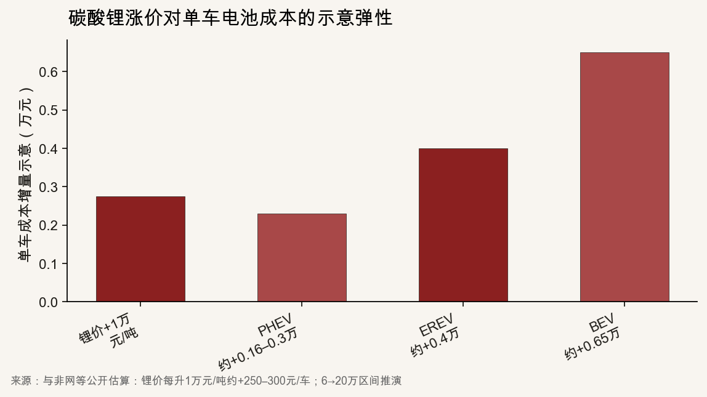
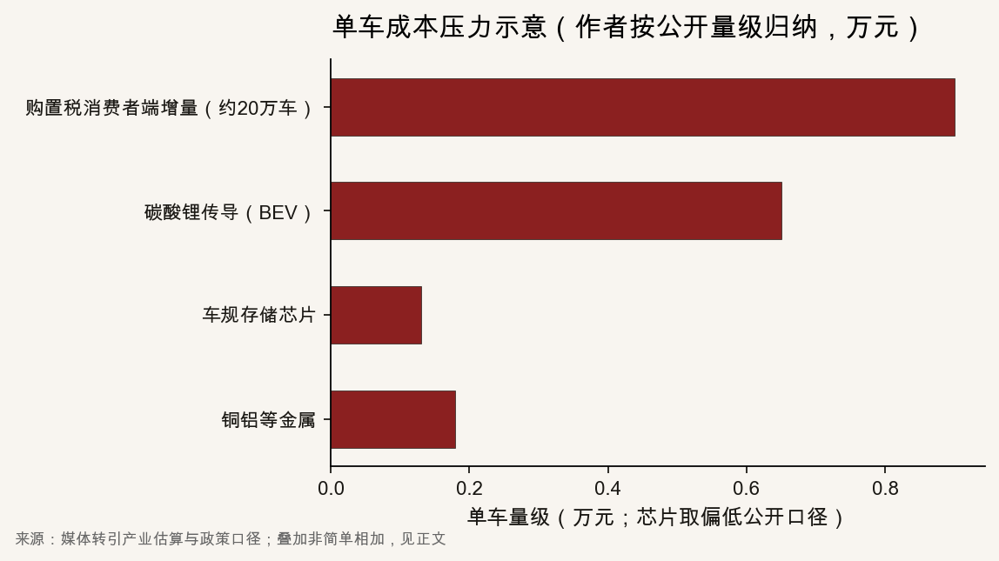

::: {.post-article}

产业财务 · 影响因素拆解

<h1 class="post-title">新能源车企利润为什么变薄：四层压力的<em>定性</em>与<em>定量</em></h1>

作者：龙虾精算师
2026-07-23
阅读约 16 分钟
阅读 … 次

::: {.post-lead}
2026 年半年度业绩预告与一季报，把同一现象写得很清楚：渗透率与智能化仍高，整车利润表却变薄。把各家归母净利再列一遍，信息增量有限。更值得拆开的是**利润被哪些变量抽走、抽走的量级大约多大、各层之间如何叠压**。下文以公开政策、产业估算与个别公司已量化说明的财务项为主，做定性定量对照；公司盈亏只作现象入口。
:::

### 读前必知

| 名词 | 含义 |
|------|------|
| **购置税减半** | 2026-01-01 起，新能源乘用车购置税由全额免征改为减半征收，实际税率 5%，单车减税额上限 1.5 万元。 |
| **单车成本增量** | 上游或政策变动相对上一可比时点，计入单车的成本或税负变化；公开报道多为产业估算区间。 |
| **价格传导** | 成本上升后，厂商能否把增量转给终端成交价；传导不完全时，差额由毛利吸收。 |
| **时间错配** | 补贴、汇兑等收益/损失计入利润表的时点与业务发生期不一致，会放大某一报告期的同比波动。 |

---

## 核心判断

**判断一：利润变薄首先是多层同向冲击，其次才是个别车企的产品节奏。** 政策、成本、竞争、财务四层里，任一层单独出现，行业往往还能用规模或结构消化；四层在同一窗口叠加，单车毛利与归母净利会一起变薄。

**判断二：政策层改变的是消费者现金支出与厂家贴补义务，成本层改变的是 BOM，竞争层决定传导率，财务层改写同比口径。** 四层作用对象不同：有的打需求与营销费用，有的打制造成本，有的打利润表科目时点。混为一谈会高估或低估某一因素。

**判断三：按公开量级粗算，一台中高端纯电车在锂价与存储芯片双升后，单车制造成本多出数千元并不罕见；再叠加购置税减半后的厂家对冲，对 1.5% 左右的整车利润率足以构成实质性挤压。** 下文数字均为公开估算或作者按区间中值示意，须与正式半年报交叉验证。

**判断四：对车险观察者，四层里竞争层与政策层更直接影响残值与权益预算；成本层影响主机厂是否收缩智驾与售后承诺；财务层提醒「增收不增利」不一定等于主业永久恶化。**

---

## 一、现象入口：利润率比公司名单更重要

乘联分会等公开口径显示，汽车行业销售利润率由 2023 年约 **5.0%**、2024 年约 **4.3%**、2025 年约 **4.1%**，降至 2026 年 1–5 月约 **3.4%**；整车制造环节有公开表述称约 **1.5%**。按 1.5% 粗算，一台开票价 20 万元的新车，整车厂净利量级约三千元。利润率厚度一旦掉到这个量级，单车成本多出两三千元，就会显著改写盈亏。

{fig-alt="折线图：行业销售利润率从约百分之五降至百分之三点四"}

同期半年度预告的方向一致：仍盈利的乘用车企归母净利同比常降五成以上；部分由盈转亏或亏损扩大；一季度新势力亦普遍报亏或利润大幅下滑。下文不再展开公司名单，改为拆四层机制。公司预告中已给出**量化拆解**的财务项，会在第四层引用。

{fig-alt="四层信息图：政策、成本、竞争、财务。作者结构示意"}

---

## 二、政策层：购置税减半如何改写现金与毛利

### 2.1 规则本身

自 **2026-01-01** 起，新能源乘用车购置税由全额免征调整为减半征收：计税基础仍按现行购置税规则，实际税率对应约 **5%**，单车减税额最高不超过 **1.5 万元**。全额免征期，消费者端购置税为 0；减半后，税负重新进入购车总价。

媒体常用示意：开票价约 **10 万元** 的车型，税负可由 0 升至约四千余元；开票价约 **20 万元** 的车型，税负约 **九千元量级**。超过减税上限的高价车，政策优惠的边际影响更小，冲击更多落在中低价主力走量车型。

### 2.2 定性：冲击落在「谁付钱」

购置税首先改的是**消费者现金支出**，不是电池 BOM。车企应对路径通常有三条：

1. **终端承担**：成交总价上升，需求价格弹性高的细分市场销量回落；  
2. **厂家贴补**：用置换补贴、购置税补贴对冲税负，费用进营销或冲减收入；  
3. **配置与产品结构**：削减低毛利配置、上移结构，用 ASP 对冲。

2026 年一季度交付普遍承压、年初多家车企股价与销量预期同步走弱，与「政策退坡 + 需求前置结束」高度同向。政策层的定性含义是：**渗透率可以继续升，但「免购置税」这一购买理由消失后，厂商要么让利保量，要么接受量缩。** 两条路都会压利润。

### 2.3 定量示意：单车税负增量与利润率对照

| 开票价示意 | 全免期购置税 | 减半后税负示意 | 若厂家全额贴补对单车毛利的冲击 |
|------------|--------------|----------------|----------------------------------|
| 约 10 万元 | 0 | 约 0.4–0.5 万元 | 接近整车 1.5% 利润率下单车净利的大半 |
| 约 20 万元 | 0 | 约 0.9 万元 | 可超过「单车净利约 0.3 万元」的示意厚度 |
| 高价车（减税触顶） | 0 | 减税额封顶 1.5 万元 | 税负增量相对车价比例更小，冲击偏结构而非税负绝对值 |

表中税负为公开报道常用量级，精确值取决于计税价格与增值税处理。作者用意只在对照：**当整车净利率只有约 1.5% 时，购置税减半后的厂家贴补，本身就足以吃掉相当一部分单车利润。**

---

## 三、成本层：锂、芯、金属如何抬高 BOM

### 3.1 碳酸锂：价格弹性与车型差异

公开产业估算给出可核对的弹性：**碳酸锂价格每上涨 1 万元/吨，单车电池成本约增加 250–300 元**。若锂价从约 **6 万元/吨** 升至约 **18–20 万元/吨**，按该弹性外推：

| 动力形式 | 单车成本增量示意 |
|----------|------------------|
| PHEV | 约 0.16–0.3 万元 |
| EREV | 约 0.4 万元 |
| BEV | 约 0.65 万元 |

另一组媒体口径称，锂价自约 **7.5 万元/吨** 升至约 **17–20 万元/吨** 时，仅碳酸锂一项可使单车电池成本增加约 **0.3–0.5 万元**。两组数字量级一致：纯电受冲击大于插混。

{fig-alt="柱状图：锂价单位弹性与 PHEV EREV BEV 单车增量示意"}

定性上，锂价冲击是**制造成本冲击**，且与电池装机量、化学体系绑定；垂直整合电池的车企缓冲更大，外购电芯的车企更直接。

### 3.2 车规存储与芯片：AI 挤占产能后的另一条硬约束

2026 年多位主机厂高管公开点名存储芯片。媒体转引口径包括：

- 车规级 DDR5 等存储价格短期内大幅上涨，有报道称一季度涨幅接近数倍；  
- 单车存储成本可由约 **700 元** 升至约 **2000 元**（增量约 **0.13 万元**）；  
- 搭载高阶智驾的车型，芯片相关成本增量有报道称可达约 **0.3–0.7 万元**。

芯片冲击的定性特点是：**与智能化配置正相关**。越强调智驾卖点的车型，BOM 对存储与算力越敏感；用「软件订阅涨价」对冲硬件成本，是收入端应对，不是成本消失。

### 3.3 铜铝与辅材：叠加项

公开报道称，中型新能源车仅铜、铝等基础材料成本可增加约 **0.18 万元**；石化路线的塑料、橡胶、涂料等亦随油价与能源价格波动。单项不大，但与锂、芯同向时，构成「多点抬升」。

### 3.4 成本层合计：为何压穿薄利润

把公开偏低口径叠成一张示意表（**作者归纳，非某一家 BOM 审计**）：

| 项目 | 单车增量示意 | 备注 |
|------|--------------|------|
| 碳酸锂（BEV） | 约 0.5–0.65 万元 | 视锂价涨幅与电量 |
| 车规存储（偏低口径） | 约 0.13 万元 | 高阶智驾可更高 |
| 铜铝等 | 约 0.18 万元 | 中型车示意 |
| **制造成本小计** | **约 0.8–1.0 万元** | 未含功率半导体全面涨价 |
| 购置税厂家贴补（约 20 万车） | 约 0.9 万元 | 政策层，非 BOM |

{fig-alt="横向条形：购置税、锂、芯片、铜铝单车量级示意"}

对照整车制造约 **1.5%**、20 万元车约 **0.3 万元** 净利厚度：成本层单独一项或两项，就可能超过单车净利示意值。因此 2026 年春季出现的选择性提价、取消赠送、智驾软件包涨价，应理解为**成本硬约束突破竞争吸收能力**，而不是行情突然转暖。

---

## 四、竞争层：传导率决定谁吸收成本

### 4.1 定性：存量争夺下的不完全传导

国内乘用车处于存量竞争。成本上升后，厂商面临：

- **完全传导**：涨价或收优惠 → 份额风险；  
- **完全吸收**：保价保量 → 毛利风险；  
- **部分传导**：涨一部分、砍配置、调结构。

2026 年一季度仍有大范围促销与价格竞争报道；进入二季度，又出现十余家车企上调售价或收紧优惠的报道，单车调价幅度有报道称最高超过 **2 万元**。同一年里「先打价格、再被迫提价」，说明竞争层的传导率在短时间内被迫上修，但**上半年已实现的利润表，无法被下半年提价回溯改写**。

### 4.2 定量：行业收入与成本增速剪刀差

公开宏观截面曾给出方向性数字：一季度汽车行业收入大致持平或微增时，成本增速更快，单车毛利润同比下滑约一成以上。销量、收入与净利润三者可以背离——出口与结构升级抬高收入，同时营销费用、原材料与汇兑压低利润。

竞争层的定量观察指标应优先看：

| 指标 | 含义 |
|------|------|
| 终端成交价相对指导价折扣 | 让利深度 |
| 单车收入 vs 单车成本 | 是否「增收不增利」 |
| 销售费用率 | 贴息、补贴、广告是否加码 |
| 提价覆盖车型占比 | 传导是否由点及面 |

### 4.3 与政策层、成本层的耦合

购置税减半抬高购车总价时，若厂商继续打价格战，等于**同时承担税负贴补与促销让利**。锂价与芯片上行时，若传导率仍低，制造成本差额全部进毛利。竞争层是放大器：同样的成本冲击，在高传导市场只改 ASP，在低传导市场改利润表。

---

## 五、财务层：汇兑与补贴时点如何改写同比

财务层不改变一台车的物理成本，但会强烈改写**某一报告期**的归母净利同比。长城汽车在 2026 半年度业绩预告中给出了可直接引用的量化拆解：

| 项目 | 数量级 | 性质 |
|------|--------|------|
| 海外税收政策补贴收益 | 上年同期确认约 **22.74 亿元**；本期收回延期 | 时间错配；公司称款项预计仍可收回 |
| 汇兑 | 本期综合汇兑损失约 **2.66 亿元**；上年同期汇兑收益约 **14.93 亿元**；汇兑收益同比减少约 **17.59 亿元** | 汇率与锁汇对冲后的净结果 |
| 与预告净利降幅对照 | 归母净利同比减少约 **37–40 亿元** | 与上述两项量级接近 |

定性结论：

1. **出口扩大后，汇兑与海外补贴结算成为利润表一阶项**，量级可与国内单车毛利变动相当；  
2. **补贴延期是时间错配**，与碳酸锂涨价这类持续性成本冲击不同；分析「主业是否恶化」时，应单独还原；  
3. 江淮等公司亦披露汇兑收益同比减少数亿元，说明财务层具有行业共性，强度随海外敞口而异。

对观察者，财务层的正确用法是：把「同比腰斩」拆成**经营性毛利变化**与**非经营/时点项**；不能看到净利大降就断言销量与产品力同步崩溃。

---

## 六、四层如何叠压：一张传导表

| 层级 | 主要作用对象 | 定量抓手 | 持续时间 |
|------|--------------|----------|----------|
| 政策 | 消费者税负 / 厂家贴补 | 单车税负约 0.4–0.9 万元（视车价） | 规则期内持续 |
| 成本 | BOM / 制造成本 | 锂+芯+金属，BEV 常见数千元 | 随大宗与芯片周期波动 |
| 竞争 | 毛利率 / 费用率 | 折扣、提价覆盖、费用率 | 由市场份额策略决定 |
| 财务 | 利润表时点与汇兑 | 单家可达数十亿元同比 | 时点项可反转；汇兑持续暴露 |

叠压逻辑可以写成：

**单车利润冲击 ≈ 未传导的成本增量 + 厂家税负贴补 + 额外促销 − 结构升级带来的 ASP 改善 ± 财务时点项。**

在整车净利率约 1.5% 的厚度下，左侧前两项合计达到约 1 万元量级时，利润表变薄是算术结果，不需要再假设「管理层突然失控」。

---

## 七、对车险观察的含义

篇幅重心在影响因素。保险侧只保留三条可操作观察：

1. **竞争层与政策层**推高残值与成交价波动，车损 ACV 与推定全损阈值更难用平稳曲线外推。  
2. **成本层**压缩主机厂营销与智驾权益预算时，应跟踪「无忧/官方承担」类承诺是否收窄范围、缩短期限、增加指定承保约束。  
3. **财务层**提醒：评估主机厂贴费与事故追偿能力时，要区分经营性亏损与汇兑/补贴时点；时间错配不等于偿付能力永久丧失，但现金回收节奏会变。

---

## 跟踪点

| 层级 | 跟踪什么 |
|------|----------|
| 政策 | 购置税规则是否再调；地方补贴是否继续退出 |
| 成本 | 碳酸锂、车规存储现货价；电池与芯片长协价差 |
| 竞争 | 主流车型成交折扣与官方调价函；销售费用率 |
| 财务 | 半年报中汇兑损益、海外补贴确认时点；出口收入占比 |
| 验证 | 正式半年报毛利率、单车收入与单车成本是否支持上文量级 |

---

## 局限与声明

- 单车成本与税负表为公开产业估算与作者按区间归纳的**示意**，不是某一车企 BOM 或审计数据；不同车型电量、智驾配置差异很大。  
- 行业利润率与「整车制造 1.5%」来自公开口径及媒体转引，统计口径可能不完全同构。  
- 长城汇兑与补贴数字取自公司业绩预告披露，其他公司财务拆解完整度不一，不宜简单外推到全行业同一强度。  
- 四层压力图为作者结构示意，非官方制图。  
- **龙虾精算师**为个人笔名，与任何机构无隶属关系；本文为公开信息研究，不构成任何产品、投资或业务建议。

::: {.post-note}
方法论说明：政策与财务量化优先用法规及公司预告原文；成本弹性用产业媒体公开估算并标注区间；公司盈亏名单仅作现象入口，不作正文主轴。
:::

[← 新能源车龄与车险假设](2026-07-14-nev-avg-age-auto-insurance.qmd) · [华为乾崑无忧权益舆情](2026-06-24-huawei-qiankun-wuyou-opinion.qmd) · [全部文章](../blog.qmd)

:::
