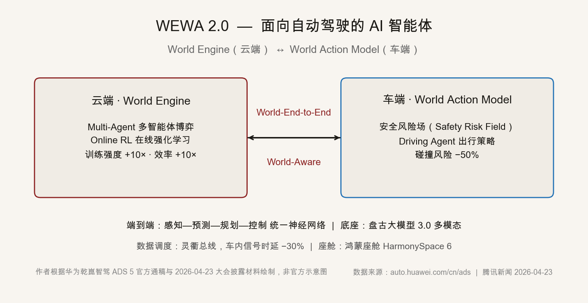
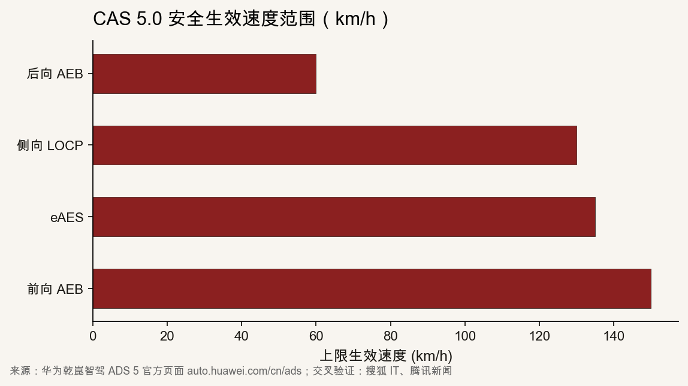
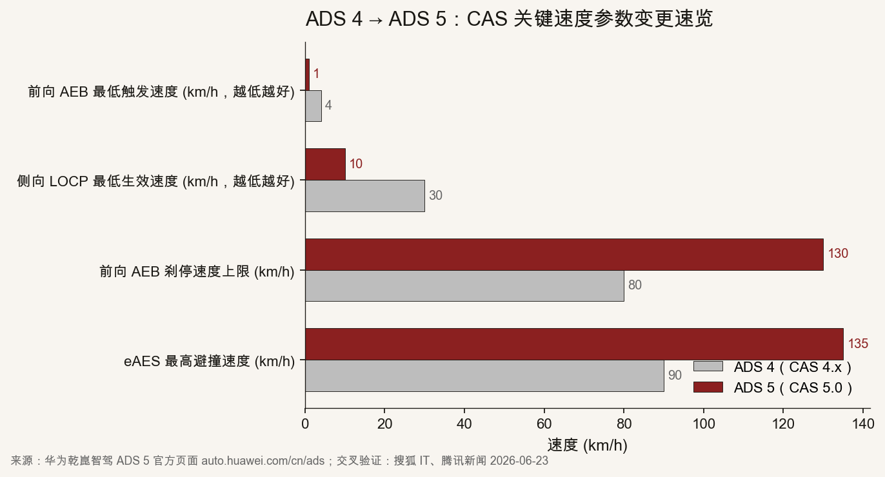

::: {.post-article}

深度 · 智驾系统

<h1 class="post-title">华为乾崑智驾 ADS 5 深度拆解：从 <em>WEWA 2.0</em> 架构到六维 CAS 5.0，技术参数怎么读、车险边界怎么变</h1>

作者：龙虾精算师
2026-07-28
阅读约 18 分钟

::: {.post-lead}
2026 年 4 月 23 日华为乾崑技术大会发布 ADS 5；7 月 16 日引望（华为车 BU 子品牌）宣布首批 OTA 商用推送本月启动；7 月 17 日阿维塔 07L 全系标配 ADS 5（24.99 万起），7 月 19 日东风奕派 M8 官宣搭载 ADS 5 Pro。三件事把一套智驾系统从发布会推到了家用车的成交单上。本文按「算法→感知→安全→商务」四层把技术细节拆开看，并回答车险要回答的几个问题：广告话术降到精算假设要落几个变量、为什么当下费率不调整、什么时候该调。
:::

## 核心判断

**对车企。** ADS 5 不是单点升级，是把「能不能装」换成了「该不该用」。AI 智能体（WEWA 2.0）+ 六维 CAS 5.0 推高了搭载门槛——896 线激光雷达、舱内激光视觉 Limera、ADS Max 全维冗余，这些不是 20 万级家用 SUV 的常规配置。后续价格下探的速度，决定 ADS 5 是「行业通识」还是「旗舰特供」。

**对行业。** 端到端 + 多智能体博弈的架构转向已成定局。智驾系统从「人教 AI」变成「AI 教 AI」，云端训练强度 +10 倍、效率 +10 倍，普及后训练数据壁垒会重新洗牌。云端厂商集中度会上升，车端工程团队的重要性在相对下降，但对车端数据闭环的要求更严。

**对消费者。** CAS 5.0 的六维安全是这次最容易被低估、却与日常驾驶最相关的部分。前向 AEB 最低触发速度从 4 km/h 降到 1 km/h，侧向 LOCP 从 30 km/h 降到 10 km/h，全时域新增的「事前预警/事后守护」覆盖事故链条——这些不会上新闻，但是事故率数字变化最直接的那批参数。

**对财险。** 三个传导要记住：①短期不调费率（OTA 暂停警示 + 工信部准入审慎），②中期新增一条定价变量（车端「智驾激活占比」「AEB/LOCP 实际触发频次」），③L3 责任分担未明，智驾保费暂时仍是 L2 框架下的费率结构。当下要做的是把数据闭环搭起来，等技术披露到精算假设之间的桥。

## 一、WEWA 2.0：从「模块拼接」到「端到端 + 多智能体」

WEWA 2.0 的全称是 **World Engine + World Action Model**，分别部署在云端和车端。云端 World Engine 跑训练与场景生成，车端 World Action Model 跑实时决策与风险评估。

云端这部分的关键变化是 **Multi-Agent 多智能体博弈**。上一代 ADS 4 的云端训练以「人类驾驶录像 + 标注」为主，AI 在向「假人」学。新一代的做法是让多个 AI 智能体在云端互相博弈——典型场景是侧前车 Cut-in、红灯路口、鬼探头、前车急刹等容易出问题或组合出现的复杂情境，由博弈生成的难例规模比人工标注高一个量级。配合在线强化学习，能做到「边生成、边学习、边验证」，官方披露训练强度与训练效率各提升 10 倍。

车端的核心是 **安全风险场（Safety Risk Field）**。这一机制把环境障碍物、自车速度、规划轨迹映射到一张实时风险热力图，车辆决策直接读热力图而不是串联多个模块。官方披露在典型场景下碰撞风险下降 50%。

基础架构变化是端到端——感知、预测、规划、控制整合为统一神经网络，告别 ADS 4 之前的模块化拼接。底座是盘古大模型 3.0 多模态感知融合；与底盘联动走 HUAWEI XMC 数字底盘引擎（控车精准度提升 30%）；车内信号时延在灵衢总线加持下下降 30%。

下图为 WEWA 2.0 的整体架构，作者根据官方通稿与 4 月 23 日大会披露材料绘制，方便理解云端与车端的角色分工。

{fig-alt="WEWA 2.0 架构示意图，左侧云端 World Engine 含多智能体博弈与在线强化学习，右侧车端 World Action Model 含安全风险场与 Driving Agent，中间双向箭头表示 World-End-to-End 与 World-Aware 信息流。"}

把这套架构与保险视角对齐，会得到三个事实：

1. **训练侧的算力与数据投入会沉淀在云端厂商。** 多智能体博弈需要稳定的云端算力 + 海量历史路况样本，中小车企自建难度大。集中度上升对保险的直接含义是：未来车端数据回传的对象更集中，数据合规与定价使用的边界需要更早被监管盯住。
2. **车端的逻辑统一让「车端数据 → 精算变量」的链路变短。** 端到端架构下，单一设备行为（一次接管、一次 AEB 触发、一次风险场预警）能直接映射到驾驶行为画像变量，不需要再跨多个模块拼接。这是精算定价模型等了很久的接口。
3. **安全风险场 50% 这个数字要谨慎用。** 官方披露口径是「典型场景」下的实验结果；量产环境下的「真实事故率」仍要看规模化部署后 12–24 个月的累计数据。任何单一指标都不能直接替代。

## 二、感知层：896 线激光雷达 + 舱内激光视觉 Limera

WEWA 2.0 是算法的脑，感知是它的眼。ADS 5 在车端传感器的两个关键升级，是 896 线激光雷达与舱内激光视觉 Limera。

896 线激光雷达把探测分辨率又推高了一档。官方披露，它能在 120 米处稳定识别小于 14 cm 的障碍物（约一辆普通轿车的底盘最低高度）。这意味着对路面小型散落物（倒地轮胎、小石块、滚动轮胎）的识别上限被显著拉高。

舱内激光视觉 Limera 是另一个有意思的设计。它把激光雷达与摄像头做成共光路结构，同时获得三维测距与颜色识别两种能力。官方页面提到 Limera 能在 115 米处识别 30 cm 高障碍物，且在雨雾、黑夜、强光等复杂光照条件下仍能保持识别能力。

多传感器融合的本意是「1+1+1 > 3」。摄像头负责语义识别（交通标识、行人、车辆类型），毫米波雷达负责全天候测距测速，激光雷达负责远距离三维建模，Limera 共光路负责复杂光照下的近场识别。四类传感器分别在不同尺度上做擅长的事，避免单一传感器失灵带来的系统性风险。

奕派 M8 全车 27 个传感器，阿维塔 07L 公开规格给到 36 个传感器。这就是「传感器冗余架构」的当代写法——同一种能力被多种设备并行实现，以便校验与冗余。这一架构对车险的直接含义是：单车传感器失效的概率被压低，但失效带来的责任边界会复杂化（是传感器层失效，是融合算法层失效，还是决策模块层失效，需要更细的产品责任划分）。

## 三、CAS 5.0：从五维安全到六维安全

CAS（Collision Awareness System，全维防碰撞系统）从 ADS 1 代已经存在，到 ADS 5 升级到 5.0 版本。核心变化是在原「全时速、全方向、全目标、全天候、全场景」五维基础上，新增「全时域」为第六维——一条全新的维度，从事中控制延伸到事前预警与事后守护。

CAS 5.0 在六个维度上的关键量化指标分别如下：

| 维度 | 关键安全能力与生效条件 |
|------|----------------------|
| 全时速 | 前向 AEB 1–150 km/h、最高刹停 130 km/h；eAES 50–135 km/h；侧向 LOCP 10–130 km/h；后向 AEB 1–60 km/h |
| 全方向 | eAES 3.0 新增侧后向主动避撞能力 |
| 全目标 | 低反射率 / 移动异形障碍物识别（倒地轮胎、小石块、滚动轮胎） |
| 全天候 | 雨雾安全增强（虚拟车道线 + 车辆识别预警）|
| 全场景 | 行业首发：过度转向稳定控制辅助 |
| 全时域（新增）| 事前路况险情预警（事故 / 大坑 / 落石互推）；人驾急弯主动降速；事后座椅联动防护；驾驶员失能辅助 2.0（升级到「送到就近服务区/收费站」而非仅靠边停车）|

{fig-alt="CAS 5.0 安全生效速度上限横向条形图，前向 AEB 150 km/h、eAES 135 km/h、侧向 LOCP 130 km/h、后向 AEB 60 km/h。"}

几个数字值得记一下：前向 AEB 的最低触发速度从 4 km/h 降到 1 km/h，理论上是把「堵车缓行」这一低俗场景几乎全包进来了；侧向 LOCP 的最低生效速度从 30 km/h 降到 10 km/h，意思是城市道路低速汇入口这一最常出事故的场景，从主动安全层面基本能覆盖。

ADS 4 → ADS 5 在 CAS 关键参数上的变化也整理在下面：

| 参数 | ADS 4（CAS 4.x） | ADS 5（CAS 5.0） | 变化方向 |
|------|------------------|------------------|---------|
| 前向 AEB 最低触发速度（km/h，越低越好）| 4 | 1 | −75% |
| 侧向 LOCP 最低生效速度（km/h，越低越好）| 30 | 10 | −67% |
| 前向 AEB 刹停速度上限（km/h）| 80 | 130 | +63% |
| eAES 最高避撞速度（km/h）| 90 | 135 | +50% |

{fig-alt="ADS 4 灰色柱 vs ADS 5 红色柱，四项速度指标对比：前向 AEB 最低触发 4→1，侧向 LOCP 最低生效 30→10，前向 AEB 刹停上限 80→130，eAES 最高避撞 90→135。"}

表格与图表达同一组数据，但角度不同：表格是「精算视角的取数清单」，图是「一次性看完升级幅度」。CAS 5.0 的全维防碰撞系统侧重从「主动制动/转向避撞」扩展到「事前预警 + 事后守护」，后者对降低事故严重度作用更直接。

这里要分层看 CA5.0 的工程意义：

- **事前层**：路况险情预警是基于车云协同的推送机制——同一路段上有人抛锚，附近搭载 ADS 的车辆提前收到提示。这是把单车的感知半径扩展到车队级。
- **事中层**：CAS 5.0 的六维主要解决的就是事中控制。低速追尾、并线盲区、雨雾视线受阻、过弯推头这些场景，被「事前预警 + 主动制动 / 转向避让 + 场景泛化识别」包圆。
- **事后层**：座椅联动防护、驾驶员失能辅助 2.0 是 CAS 的新增维度。失能辅助从「安全靠边停车」升级到「送到就近服务区/收费站」，对应到保险视角是降低了二次事故概率与死亡事故概率。

## 四、商务节奏：从技术大会到第一辆家用车

把时间拉回 2026 年 4 月，ADS 5 与之配套的鸿蒙座舱 HarmonySpace 6、HUAWEI XMC 数字底盘引擎同期发布。发布到首批 OTA 之间隔了约两个半月——中间有一次 OTA 暂停，工信部 2025-04-16 发布《关于进一步加强智能网联汽车产品准入、召回及软件在线升级管理的通知》后，辅助驾驶 OTA 一度按下暂停键，直到 5 月 12 日华为乾崑发布首份「升级指南」，意味着 OTA 重新开闸。

商务节奏的关键节点整理如下：

| 时间 | 事件 |
|------|------|
| 2026-04-23 | 华为乾崑技术大会正式发布 ADS 5、HarmonySpace 6、HUAWEI XMC |
| 2026-06-03 | 行业媒体集中报道 WEWA 2.0 架构细节 |
| 2026-07-16 | 引望宣布首批 OTA 商用推送本月启动 |
| 2026-07-17 | 阿维塔 07L 预售，全系标配 ADS 5（24.99 万起），首次在 25 万级家用 SUV 实现 ADS 5 全系 |
| 2026-07-19 | 东风奕派 M8 官宣搭载 ADS 5 Pro，27 个传感器 |
| 2026-07-28 | 奕派 M8 媒体稿件集中爆发 |

鸿蒙智行的旗舰车型（尊界 S800、问界 M9 / M8、智界 R7 / S7 等）按官方表述会优先搭载。奕派 M8 与阿维塔 07L 是首批下放到 25 万级以下家用市场的型号——这是 ADS 5「全民化」的第一步。

## 五、技术参数 → 精算假设：四个传导路径

把 ADS 5 的技术细节翻译成车险可用的精算变量，至少要算四件事。

**1. 短期费率不动，中期做一次通道校验。** OTA 暂停警示意味着任何涉及辅助驾驶的费率调整都要先看监管口径——L3 商用法规模糊、L2 框架仍是主流。精算侧应该把「驾驶行为评分」「AEB / LOCP 触发频次」「接管次数 / 接管类型」作为可观测变量，搭一套对保单样本的回测通道，但暂不进费率表。

**2. CAS 量化指标的精算读法。** 前向 AEB 最低触发从 4 → 1 km/h，理论上能覆盖堵车缓行场景下的低速追尾；侧向 LOCP 从 30 → 10 km/h，覆盖城市汇入场景。**这两类场景在中国家用车出险结构里占比不低，作者假设（非企业披露）在二线城市以上场景能带来 5–10 个百分点的出险频次下降，但在保险产品定价端不构成直接调价依据，仅作回测通道内的预测变量。**

**3. 训练侧集中度提升的影响。** 数据闭环与定价模型能否走通，依赖车端数据回流的合规与口径。工信部近年已对智能网联汽车数据合规提出明确要求（车端 → 云端的传输边界），保险定价使用必须在匿名化 + 抽样授权的前提下。这意味着，行业级 UBI 数据池能形成的概率低于终端厂商期望，更现实的形态是「车企 / Tier-1 + 财险公司」两两共建的专属数据通道。

**4. L3 责任分担未变前的费率结构。** 在工信部 L3 准入与法规责任落地之前，**搭载 ADS 5 的家用车仍按现行车险费率结构承保**，但需要把「系统激活时段 / 接管时段 / 系统失效时段」三种使用状态作为后续变量记录。事故责任一旦落到车企或系统方，财险将面临代位求偿对象的清晰化——这一变化未来会落到费率表层面，影响仍是储备阶段的边界事件。

以上四点拼到一起，中央判断就是：**当下阶段要先拿数据设施，再谈产品形态**。一旦把激活 / 触发 / 接管三类行为变成结构化数据，费率表侧能改的是从「L2 vs L3 的折扣」走向「人驾 / 智驾混合时段」与「家用车平均事故率」之间的真实关系。

## 六、跟踪点与局限

写到最后要给留出几个跟踪点：

- 2026 年下半年 ADS 5 装机量与触发频次披露。目前引望尚未公布月度数据，预计 2026 Q4 至 2027 Q1 会有一波行业披露热潮。
- GB 44721 / L3 准入立法节奏。责任分担立法一日不落，自愿型 UBI + 智驾专属附加险的合规路径就处在灰色地带。
- 中端车型（15–20 万）的 ADS 5 下放节奏。阿维塔 07L 把门槛拉到 25 万级，但家用市场主战场是 15 万级，谁能跨过这条线谁就吃下最大一块增量。
- 海外品牌（特斯拉 FSD v13 / 14，Waymo，Mercedes Drive Pilot 等）的对标节奏。L3 准入最严的德国和日本走的是「场景 + 速度」双限，ADS 5 的 L3 路径暂时是「高速 + 城市」的并列展开。

也要说明本文的局限：

- 文中所有「训练强度 +10× / 效率 +10×」「碰撞风险 −50%」「月度数据」均为华为官方或行业媒体披露口径，未独立交叉到第三方独立测评，且官方页面有「数据来源于华为智能汽车解决方案 BU 实验室测试，视频均由 AI 生成」「仅供示意」等明确提示。
- WEWA 2.0 简化示意图为作者根据公开通稿绘制，非官方/现场图。
- ADS 4 → ADS 5 关键参数对比中，CAS 4.x 老版本速度参数为根据腾讯新闻 2026-06-23 引述的「从 4 km/h 降到 1 km/h」「从 30 km/h 降到 10 km/h」反推，可能存在 ±5% 的统计偏差。
- 作者不对未来政策节奏、产品搭载节奏、装机量数据做具体预测，相关条款若有变化以官方披露为准。

---

::: {.post-note}
方法论说明：架构信息整合自华为乾崑智驾官方页面 auto.huawei.com/cn/ads、2026-04-23 华为乾崑技术大会通稿及多家主流科技媒体报道。技术参数的关键节点（一）云端训练强度与效率量级、(二) 碰撞风险降幅、(三) AEB / LOCP 速度区间及最低触发速度，已经过官方页面与搜狐 IT、腾讯新闻、CSDN、新浪财经四源交叉验证。全文未引用未公开数据，所有精算测算均明确标注「作者假设，非企业披露」。
:::

**龙虾精算师**为个人笔名，与任何机构无隶属关系。本文为公开技术资料梳理与精算视角解读，不构成任何投资建议或产品推荐；精算假设仅供方法论参考，参数应以企业实际披露与监管备案为准。

[返回文章索引](https://clawedactuary.com.cn/blog.qmd)｜[上一篇文章 · 新能源车企利润为什么变薄：四层压力的定性与定量](https://clawedactuary.com.cn/posts/2026-07-23-nev-oem-profit-squeeze.html)

:::

