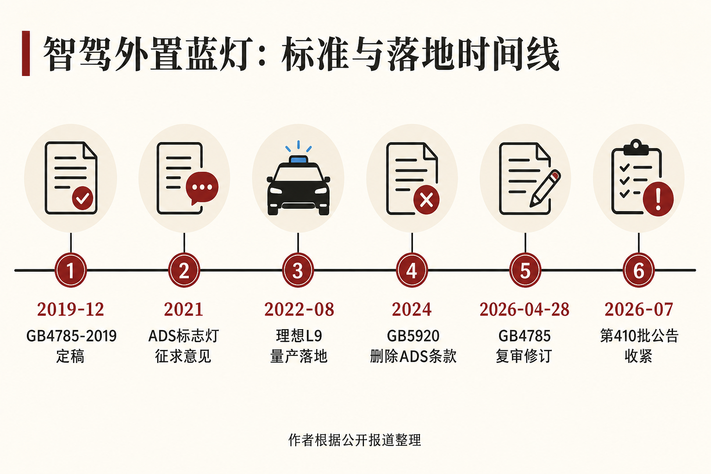
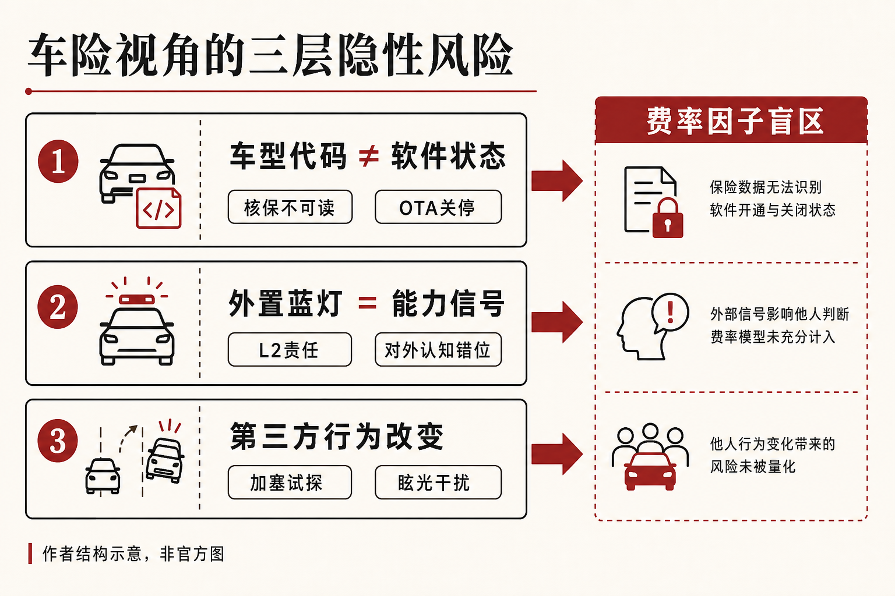

::: {.post-article}

深度 · 监管与车险

<h1 class="post-title">工信部禁用智驾小蓝灯：车险<em>核保盲区</em>里的三层风险</h1>

作者：龙虾精算师
2026-08-03
阅读约 14 分钟

::: {.post-lead}
2026 年 7 月下旬起，媒体与车企消息集中指向同一结果：自工信部第 410 批《道路机动车辆生产企业及产品公告》申报起，检测样车若搭载外置智驾「小蓝灯」，将按 GB 4785—2019 不予通过产品公告；自 **2026-07-27** 起新申报型式认证的乘用车不得配备该类装置。**截至公开报道截稿，工信部尚未就此事单独发布正式文件**，但长安等车企已向媒体确认消息属实，中国汽车标准化研究院亦回应存在灯光滥用与安全风险。对车险定价与核保，更需要盯住三件事：同一车型代码下软件状态不可核验、外置蓝灯发出的能力信号超出 L2 法定责任边界、邻车加塞试探与眩光改变事故诱因——这三层都几乎进不了现行费率因子。
:::

## 核心判断

**判断一：公告收紧使「出厂配置」与「软件状态」不再一一对应。** 存量已售车暂不强制拆除，后续处置待研讨；车企可预期路径是 OTA 关停或改写灯光逻辑。承保端仍按车型代码定价，**核保系统读不到「蓝灯当前是否仍点亮」**，同一代码下将并存出厂开启、库存待处理、OTA 关停后关闭等批次。

**判断二：外置蓝灯是对外能力信号，不能证明车辆已具备 L2 以外的法定身份。** 行人与邻车驾驶人会把蓝灯读成「车辆会主动避让 / 系统会接管」；在辅助驾驶框架下，法定责任主体仍是驾驶人。**营销可见信号与法定责任边界不一致**，产品责任条款目前缺少「对外显示能力」这一风险描述维度。

**判断三：第三方行为与眩光改变的是事故诱因结构，费率因子无法识别。** 汽标院与行业高管均指出：亮度不一造成夜间眩光；部分驾驶人会刻意加塞、近距离跟车以试探智驾边界。车辆硬件未变，外部驾驶人行为与视觉干扰已变——**传统「车型—驾驶人」二元费率无法覆盖这类诱因**。

## 一、事件与标准：已确认事实与报道口径

{fig-alt="从 GB 4785—2019 到第410批公告收紧的时间线示意"}

图为公开报道节点整理，按证据层级对照下表。

| 节点 | 内容 | 证据层级 |
|------|------|----------|
| GB 4785—2019 | 外部灯具光色限于白、黄、红、琥珀；蓝不在许可色域；合法车外灯类型未含 ADS / 辅助驾驶外部提示灯 | 强制性国标 |
| 2021 征求意见 | 《机动车和挂车光信号装置及系统》征求意见稿曾拟要求 L3 及以上配备蓝绿色 ADS 标志灯 | 征求意见稿，未成正式条款 |
| 2022-08 | 理想 L9 率先量产外置辅助驾驶提示灯；此后小鹏、蔚来、问界、比亚迪、小米等跟进 | 媒体与行业公开叙述 |
| GB 5920—2024 | 正式定稿删除 ADS 标志灯相关条款；2025-07-01 实施 | 强制性国标演进 |
| 2026-04-28 | GB 4785 复审结论为「修订」，项目周期约 16 个月，处于起草阶段；修订草案已讨论 ADS 标志灯条款 | 国家标准信息平台 / 媒体转述汽标委 |
| 2026-07 下旬 | 第 410 批公告起搭载小蓝灯样车不予公告；2026-07-27 起新申报认证乘用车不得配备；存量车处置另行研讨 | 多家媒体报道；长安确认属实；**工信部未见单独正式公告** |

中国汽车标准化研究院 2026-07-29 晚间回应：夜间蓝灯易造成眩光、干扰周边驾驶人对路况的判断；带灯车辆更易被其他车主借机加塞、近距离跟车。蔚来副总裁马麟亦公开称部分蓝灯「比尾灯还亮」「跟车时刺眼」。

**此次监管动作直接套用现行灯具国标的色域与灯型清单，用以收紧 L2 阶段「企业自行定义」的外置信号；这不等于已经确定未来 L3 ADS 标志灯的最终规则。** GB 4785 修订仍在起草，新版是否强制 L3 装灯、是否允许 L2 保留类似装置，公开材料尚未给出确定答案。

## 二、第一层：车型代码与软件状态解耦

存量车不强制拆除、新车与变更扩展车型申报收紧，会在市场上留下一段「硬件还在、逻辑可能被改写」的过渡带。

| 状态 | 触发条件 | 监管定性（报道口径） | 保司核验能力 |
|------|----------|----------------------|--------------|
| 出厂开启 | 2026-07-27 前下线并随车配置 | 历史灰色地带下的出厂配置 | 仅能查到出厂配置表 |
| 库存待处理 | 已下线未售出，是否回厂或出厂前 OTA 未统一 | 视车企方案 | 行业无统一披露口径 |
| OTA 关停后 | 远程关闭功能或改写灯光逻辑 | 向现行 GB 4785 靠拢 | **核保读不到软件状态** |

燃油车时代，车型代码近似静态风险标识：动力总成与灯光逻辑生命周期内少有远程改写。智驾车把「软件版本」推进承保信息集之后，**车型代码已是不完整标识符**。

对承保与定价的直接含义：

1. **未来 6–12 个月不必因「禁灯」单独调价。** 事件冲击面主要在新申报与变更扩展；公开事故数据里也无法分离出「因蓝灯被加塞」子样本。费率层面宜先观察，不预先调整。
2. **中期须把可观测的软件状态标签纳入数据基础设施需求清单。** 至少覆盖灯光逻辑版本、辅助驾驶激活相关标定、与公告批次相关的合规状态。没有标签，就无法在 6–12 个月后做「关停前后」对照。
3. **存量保单的实物状态与合同约定如何匹配，多数条款未写明。** 7 月下旬前已承保车辆若后续 OTA 关灯，条款与实物之间的匹配义务目前落在空白区，可能成为理赔争议来源。

这一层与 [L3/L4 强标报批稿](2026-06-22-l3-l4-mandatory-standard-insurance.qmd) 同属软件改写合规状态后承保信息滞后的问题：跨线 L3 有 DSSAD 与法定记录义务；占绝大多数的 L2 辅助驾驶车辆数据在车企，保司仍在用出厂状态定价，缺一条软件合规状态通道。蓝灯是其中一个被监管点名的样本。

## 三、第二层：对外能力信号与法定责任边界不一致

外置蓝灯的设计源头常被追溯到奔驰 2015 年概念车 F015：用灯光向周边道路使用者传递运行状态。国内落地后，它在 L2 车型上大规模使用，语义却越来越接近「这辆车在自动驾驶」。

在辅助驾驶法定框架下，驾驶人仍须全程履行驾驶任务，系统激活不迁移责任主体；行人减少主动避让、邻车更敢并线，依据的是**视觉信号**，与 L3 型式批准无关。

对产品责任与车险代位路径，空白点可以落到条款字段：

| 问题 | 现行常见处理 | 蓝灯场景下的缺口 |
|------|--------------|------------------|
| 责任起点 | 产品是否符合强制性标准 | 7 月下旬前蓝灯长期处于「色域不合规、亦无单独禁令」的灰色带；对外信号强度却可能高于法定能力 |
| 第三方合理信赖 | 判例与实践稀缺 | 「因看见蓝灯而减少避让 / 加大加塞」是否构成对外信息误导，公开纠纷样本不足 |
| OTA 关停后的既往事故 | 关停不溯及既往 | 关停前事故向车企追偿的证据链与条款依据仍不清晰 |

**公告收紧从增量上切断了新车继续放大该不一致的路径；关停完成前已经形成的事故如何归责，才是产品责任条款需要补写的责任维度。** 同时要盯 GB 4785 修订：若未来只允许真正跨线的 L3/L4 使用规范化 ADS 标志灯，则「灯」会重新成为法定能力标签——那时信号与责任才可能重新匹配。现阶段监管先收回的是 L2 阶段借视觉外观暗示具备更高级别能力的做法。

## 四、第三层：第三方行为与眩光，费率因子的结构性盲区

{fig-alt="车型代码与软件状态、能力信号不一致、第三方行为改变共同指向费率因子盲区"}

| 风险要素 | 传统车险识别能力 | 外置蓝灯场景 |
|----------|------------------|--------------|
| 车辆硬件 | 高（车型因子） | 基本不变 |
| 本车驾驶人行为 | 中（使用性质、历史出险等） | 基本不变 |
| 邻车加塞 / 近距离试探 | 低 | **被灯显著放大（报道口径）** |
| 夜间眩光干扰后车判断 | 低 | **亮度与安装位置企业自定，分布极不均匀** |

「车辆—驾驶人」二元费率解释不了「因为外观信号，第三方改变行为」以及「因为眩光，后车判断失误」这两类诱因。以下为**示意性假设**（非实测、亦非行业披露）：

| 假设与数值 | 说明 |
|------------|------|
| 家用车基准年出险频率 0.20 次/车·年 | 与站点 L3 文同一数量级口径，便于对照 |
| 「被加塞 / 近距离冲突」相关份额 10% | 作者假设，用于敏感性，不是经验估计 |
| 该份额相对升幅下界 +20%，对应整单约 +2% | 0.20 × 10% × 20% |
| 该份额相对升幅上界 +50%，对应整单约 +5% | 0.20 × 10% × 50% |

把上下界放回整单频率口径：即便接受上界 +5%，绝对升幅也只有约 0.01 次/车·年；在新能源车型年化赔付波动面前，单独「为蓝灯加价」几乎做不出稳健因子。可保留的判断只剩一条：方法论层面须把对外能力信号视作费率因子的候选维度——灯、贴标、外形语义、车机屏幕对车外可见的提示语，都可能改写第三方行为分布；蓝灯禁令关闭的是一个可见通道，并没有关闭整类机制。

开启时长、安装位置、亮度等级从未进入行业共享池；事故认定笔录也少见记录「对向是否因蓝灯加塞」。OTA 大规模关停后，对照实验的处理组样本也会消失。**事后精算研究若失去对照样本，就只剩机制判断，没有参数估计。**

## 五、对车企、行业与消费者

**对车企。** 新申报与变更扩展车型应按公告收紧口径清除外置蓝灯；存量处置无论是回厂拆除、远程关停还是灯光逻辑改写，都应形成可核验的批次说明。外置信号带来的辨识度，对应的是合规成本与潜在间接事故成本；后者目前主要由车险池分摊，条款覆盖与追偿路径之间存在空白。

**对持牌财险公司。** 短期观察 OTA 节奏与存量处置，不急于调价；中期把软件合规状态、辅助驾驶激活相关字段纳入数据基础设施需求清单；产品责任与代位条款预留「对外能力信号」描述空间。跟踪 GB 4785 修订草案：L3 强制灯与 L2 禁灯若分轨，定价与责任模型应按法定等级分叉；按蓝灯有无定价，是把营销符号当作风险因子。

**对消费者。** 公开报道未提及对已购带灯车型的强制拆除要求；后续是否 OTA 关灯以车企与监管进一步要求为准。灯的有无，本身不改变 L2 下驾驶人须全程负责的法律事实。

## 六、四个跟踪点

1. **工信部是否发布单独正式文件**，以及第 410 批起检测机构的实际执行口径是否与媒体报道一致。
2. **各车企 OTA / 库存车处置时间表**，以及是否向保司或行业平台提供可核验的状态字段。
3. **关停前后 12 个月**同车型代码出险频率、夜间事故占比、追尾与并线冲突占比——若出现可公开或可共享的对照，再讨论因子，不预先调价。
4. **GB 4785 修订草案**对 ADS 标志灯的最终安排：仅 L3+、全禁、或分场景——决定「能力信号」会不会以法定形式回归。

## 局限与声明

- 2026-08-03 完全重写。事件事实主要根据国际金融报 / 东方财富转载（2026-07-31）、经济观察报 / 21 财经（2026-07-30）、观察者网（2026-07-29）、红星资本局（2026-07-29）等公开报道；**禁令与执行细节以工信部、检测机构及汽标委正式文件为准**。文中已标明：截至报道截稿，工信部未见单独正式公告。
- 中国汽车标准化研究院关于眩光与加塞风险的回应，转述自上述媒体，非作者直接访谈记录。
- 「对外能力信号」「第三方行为改变」及第四节频率敏感性表均为作者基于精算与责任险逻辑的推演与假设，**非官方结论**，亦无公开赔付率数据证明「蓝灯开启期间整单赔付率上行」。
- 车企回应以媒体已披露者为限（如长安确认、吉利称已知晓并遵循规定等）；具体 OTA 方案以企业后续公告为准。
- 文中时间线与三层风险结构图为**作者根据公开材料绘制的结构示意，非官方或现场图**。
- **龙虾精算师**为个人笔名，与任何机构无隶属关系。本文为公开报道梳理与车险视角推演，不构成投资建议、产品推荐或法律意见；精算假设仅供方法论参考，参数以企业实际披露与监管备案为准。

::: {.post-note}
方法论说明：2026-08-03 完全重写。事实层按「国标条文 / 媒体报道 / 车企确认 / 作者假设」分层标注；车险三层风险为独立推演。频率敏感性表仅演示诱因结构对整单频率的杠杆，不作定价建议。可与 [L3/L4 强标报批](2026-06-22-l3-l4-mandatory-standard-insurance.qmd) 对读——后者看法定分界线如何划定责任，本文看 L2 阶段外置信号如何在责任尚未迁移时改写第三方行为与核保信息集。
:::

[← 返回首页](../index.qmd) · [全部文章](../blog.qmd) · [声明](../disclaimer.qmd)

:::
