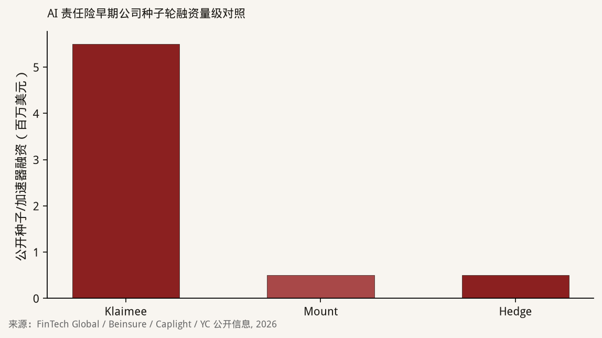
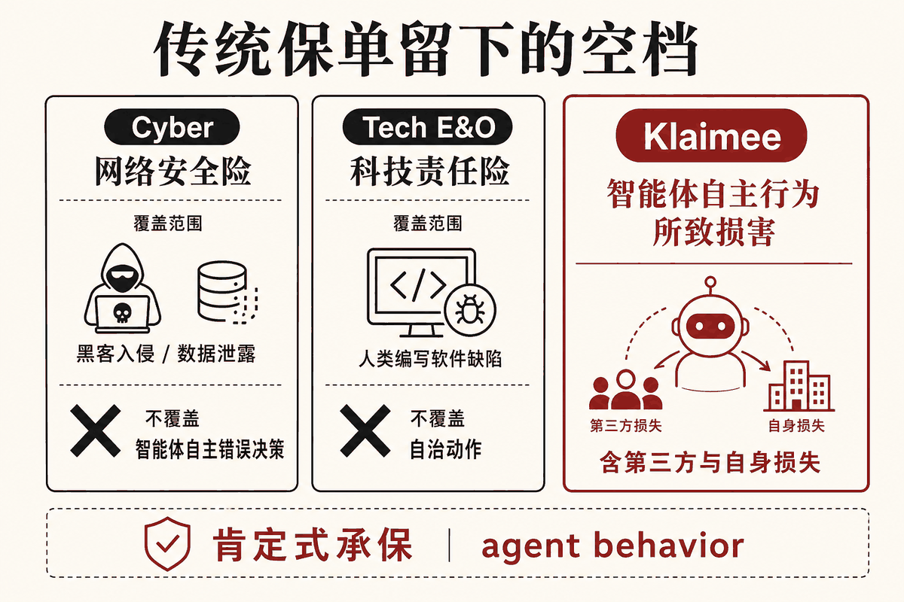
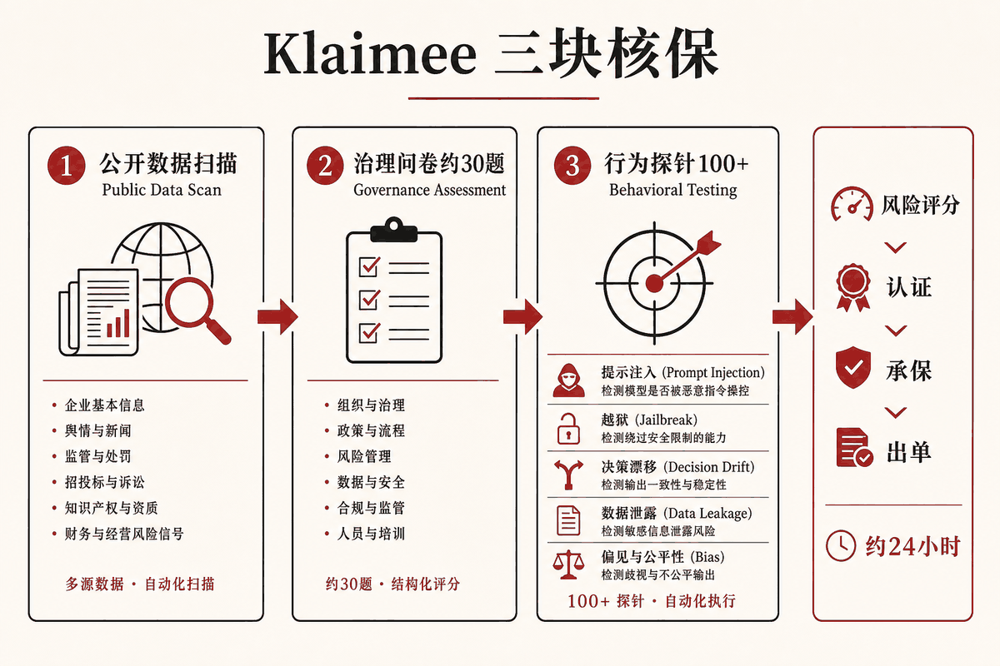

::: {.post-article}

深度 · 海外观察与保险科技

<h1 class="post-title">Klaimee 深度研究：给 AI Agent 做责任险，比 Corgi 更小切口</h1>

作者：龙虾精算师
2026-08-13
阅读约 14 分钟
阅读 … 次

::: {.post-lead}
2026 年春，**Ines Boutemadja** 与 **Julien Catonnet** 在旧金山以两人团队创立 Klaimee，进入 YC Spring 2026；同年 7 月完成约 **550 万美元**种子轮。产品切口比 [Corgi](2026-06-25-corgi-ai-insurance-study.qmd) 更窄：只做 **AI Agent** 的认证、履约背书与责任保障，并把核保拆成「公开扫描 → 治理问卷 → 行为探针」三条流水线，号称 **24 小时**交付采购部门要的证书包。本文拆四层：生意卡在哪、核保引擎赌什么、监管叙事里哪些要打折，以及国内科技责任险能借鉴的作业层。
:::

## 核心判断

**对 Klaimee 这门生意：** 它卖的是「企业采购能签字的信任包」——风险评估报告、认证徽章、责任保障与证书，而不只是一张保单 PDF。买家压力来自企业采购：技术审查过了，仍会卡在「智能体出错谁赔、有没有保单证明」。公司举例称，客户曾在六位数合同临近签约时被要求出具 **单次事故至少 500 万美元** 的 AI 责任险证明。

**对精算与核保：** 三块核保里，**行为探针**才是相对新的暴露度量：对智能体发射 100+ 次提示注入、越狱、决策漂移、数据泄露、偏见输出等探测，用失败模式给风险打分。没有赔付三角形时，这是用**可重复实验**代替历史赔付；上限也很清楚——探针覆盖不到生产环境里的长尾联动。

**对国内：** 「两个人做 AI Agent 责任险」同样难复制持牌外壳；更值得抄的是 **认证 + 肯定式条款 + 采购可读的证据包**，先嵌进网络安全险 / 科技责任险的增值服务，而不是单独开一张全国性新牌。

---

## 一、Klaimee 是谁：保险出身 + 工程出身的两人组合

| 项 | 公开信息 |
|----|----------|
| 创立 | 2026，旧金山；YC Spring 2026 |
| 团队 | 2 人（YC 公司页） |
| CEO | Ines Boutemadja：前 SafetyWing（YC W18）总经理；自述曾把保险产品从约 **500 万→6,000 万美元**营收，并参与 Tokio Marine 相关 MGA 结构化、取得波多黎各 carrier 牌照路径 |
| CTO | Julien Catonnet：企业战略咨询背景转软件工程与 AI，负责认证与合规工程侧 |
| 融资 | 种子轮约 **550 万美元**（约 2026-07-22 披露）；FundersClub 的 Alexander Mittal 领投；ex/ante、Pioneer Fund、Multimodal Ventures、Kima Ventures、Rebel Fund、Robinhood Ventures、YC 等参投 |
| 官网 | [klaimee.ai](https://klaimee.ai/) |

与 Corgi 对照，创始人画像几乎反过来：Corgi 是「AI / 产品出身闯进保险」；Klaimee 是「做过持牌保险产品的人 + 懂智能体失败模式的工程师」。资本体量也差一个数量级以上——Corgi 18 个月公开融资约 **3.78 亿美元**，Klaimee 种子轮 **550 万美元**。

{fig-alt="Klaimee、Mount、Hedge 三家公开种子或加速器融资金额柱状图"}

同赛道还有 YC 同期的 **Mount**（自称 AI Agent Insurance Carrier）与偏批发渠道的 **Hedge**。上图只对照公开种子/加速器量级：Klaimee 已明显拉开，但仍远小于 Corgi 的多轮天价融资。

**结构上要先写清的不确定点：** 公开材料强调「认证 + 履约背书 + 责任险」，并在招聘 General Counsel & Head of Insurance；**是否自有承保纸、是否走 MGA/前台公司**，官网与融资稿未给出州牌照清单。下文按「产品与核保逻辑」分析，不对持牌形态做未证实断言。

## 二、产品：第三方损害 + 自身损害，两头都写

官网把损失分成两类，表述比多数「AI 责任险」营销页清楚：

| 类型 | 触发 | 举例 |
|------|------|------|
| 第三方损害 | 智能体伤害客户、合作方或公众，对方起诉你 | 催收语音智能体说错余额；客服智能体承诺不存在的退款政策 |
| 自身损害 | 智能体伤害你自己的系统/数据/资金，无人可诉 | 内部运维智能体删库、写坏生产数据 |

适用对象也拆成两类：**卖智能体的厂商**（采购要证书才能过会）与 **内部部署智能体的企业**（自损也要赔）。边界同样写明：当前聚焦 B2B、边界清晰、非安全关键场景；**不承保自动驾驶汽车、机器人与物理世界安全系统**。

覆盖的失败模式（公司列举）包括：客户依赖的幻觉条款、患者数据串户、借贷/招聘/定价中的偏见决策、越权操作导致下游财务损失，以及提示注入与操纵攻击。

{fig-alt="三栏示意图对比网络安全险、科技责任险与 Klaimee 对智能体风险的覆盖差异"}

公司叙事是：网络安全险覆盖「外部入侵」，科技错误与遗漏险覆盖「人类编写软件的缺陷」，中间空出「智能体自主动作所致损害」。图为作者据公开材料绘制的结构示意。精算上要追问的是：**肯定式写入之后，除外条款、触发定义与理赔举证标准是否同样写硬**——营销页还不够回答。

## 三、核保引擎：三块流水线，24 小时交付

这是 Klaimee 相对「只卖条款」竞品的差异化声明。YC Launch 帖给出三块评分系统：

{fig-alt="Klaimee 核保三阶段流程图示意"}

| 模块 | 做什么 | 精算含义 |
|------|--------|----------|
| 公开数据扫描 | 抓取与该智能体相关的公开信息 | 近似「外部可观测暴露」；对闭源企业部署覆盖弱 |
| 治理评估 | 约 **30** 道治理问卷 | 类似网络安全险的问卷折扣因子；自报偏差大 |
| 行为测试 | **100+** 探针：提示注入、越狱、决策漂移、数据泄露、偏见输出等 | 用实验失败率代理损失频率；可重复、可版本化 |

交付节奏：评分 → 认证 → 承保 → 出单，宣称约 **24 小时**。采购侧交付物包括风险评分、评估报告、整改建议、认证徽章与证明材料；另开放对抗测试 playground，供部署后反复压测。

**我读这套引擎的三个判断：**

1. **探针是暴露基础的候选，还不是费率表。** 探针失败率可以排序风险，但要从「实验失败」映射到「赔付频率 × 严重度」，仍缺校准样本。在首个损失年到来前，费率更多是**场景定价 + 资本缓冲**。
2. **治理问卷会奖励「会写答案的团队」。** 没有现场审计与日志抽检时，问卷分与真实控制力可能脱节；行为探针部分对冲了这个问题，却对「生产权限、工具链、人工复核门槛」仍可能测不全。
3. **24 小时是渠道武器。** 对卡在采购的厂商，速度本身创造保费；同时也会吸引「明天就要上线、治理尚未成型」的逆选择。核保限额、除外与共保比例必须为速度留缓冲。

## 四、监管与除外叙事：哪些站得住，哪些要打折

Klaimee 把「为什么是现在」押在三条催化上。逐条核对公开法律与标准文本后，结论如下。

### 1. ISO / Verisk 生成式 AI 除外批单

Verisk ISO 自 **2026-01-01** 起提供可选批单，供商业综合责任险（CGL）排除生成式 AI 相关损失，常见编号包括：

| 批单 | 大致范围 |
|------|----------|
| CG 40 47 | Coverage A（人身伤害/财产损失）+ Coverage B（人身与广告侵害） |
| CG 40 48 | 仅 Coverage B |
| CG 35 08 | 产品/完工责任部分下的人身伤害与财产损失 |

这些批单是**可选附加**，是否挂上取决于公司、州与续保时点，并非全美保单自动生效。条款关键词多为 “arising out of generative artificial intelligence”，法院对 “arising out of” 历来从宽解释，因此一旦附加，关联性较弱的生成式 AI 争议也可能被拒赔。Klaimee 说「龙头公司正在拿到州批复以除外 AI」——方向成立；说成「整个市场已经被踢出保障」则过度。

### 2. 加州 AB 316

AB 316 于 **2025-10-13** 签署，**2026-01-01** 生效。条文核心是：在民事案件中，开发、修改或使用人工智能的被告，**不得主张「人工智能自主造成损害」作为抗辩**；同时保留因果关系、可预见性、比较过失等其他抗辩。

公司材料常写成「AB 316 已让部署方承担责任」。按条文，该法**禁止以「人工智能自主造成损害」作为抗辩**，并未创设严格责任，也未免除原告的举证责任。对保险需求的含义仍然成立：部署方更难把责任推给系统本身，采购与法务会更早索要证书与限额。

### 3. 欧盟 AI 法案时间表

公司材料强调 2026 年 8 月执法节点。欧盟 AI 法案分阶段适用，高风险系统与通用模型义务时间表并不等于「所有智能体责任险在 8 月同时引爆」。把它当作欧洲买方尽职调查压力的背景可以；当作全球保费瞬间释放的开关，证据不足。

### 4. 诉讼与渗透率数字

Launch 帖称「AI 相关诉讼 2024→2025 上升 **137%**」「**80%** 财富 500 强已在使用 AI Agent」。二者目前只能记为**公司主张**，未见同步披露的原始统计口径。写进核保假设前，应降权处理。

## 五、和 Corgi、Mount 放在一张桌上

| 维度 | Klaimee | Corgi | Mount |
|------|---------|-------|-------|
| 切口 | AI Agent 认证 + 责任/履约保障 | 面向 AI/科技公司的全栈持牌保险 | AI Agent 责任险 + 扫描/红队 |
| 团队基因 | 保险产品运营 + 工程 | AI 产品 / 游戏与创业 | 工程创业 |
| 公开资本 | 种子约 **550 万美元** | 约 **3.78 亿美元** / 估值约 **26 亿美元** | 公开量级约 YC 种子档 |
| 核保卖点 | 探针 + 治理 + 24h 证书包 | 全栈数据飞轮、模块化肯定式条款 | 扫描—修复—承保残差 |
| 持牌形态 | 未充分披露 | 强调 own paper | 自称 carrier，细节有限 |
| 明确不做 | 车、机器人、物理安全 | — | — |

三家共同点：押注「传统条款正在把 AI 踢出去，需要肯定式新产品」。差异在于 Klaimee 把**采购文档与认证**做成产品前台，Corgi 把**持牌全栈与资本厚度**做成护城河。对精算读者：Klaimee 更适合观察「如何用实验核保给新风险定价」；Corgi 更适合观察「如何用资本买时间等损失三角形长出来」。

## 六、精算冷静点：五个要盯的风险

1. **无三角形定价。** 与网络安全险早期、Corgi 面对的 AI 责任一样，首年保费验证不了长期损失率。探针分只能排序，不能替代已发生损失发展。
2. **同源模型相关性。** 被保智能体若共用同一基础模型或同一编排框架，一次模型更新可同时抬高整组合失败率——资本模型要按「事件年」压力测试，而不能只按保单件数线性加总。
3. **多步工作流复利。** 若单步可靠度 0.9，十步串联的端到端成功约为 $0.9^{10}\approx0.35$。探针若主要测单轮对话，会低估多工具、多权限链路的频率。该测算为说明量级的作者假设，非公司披露费率。
4. **认证与理赔的利益冲突。** 「先认证再承保」若由同一主体完成，评级宽松会直接转化为承保亏损；需要独立复核、限额阶梯与出险后降级机制。
5. **资本厚度。** 550 万美元种子轮相对「单次事故 500 万美元证书」的采购诉求，要求严格的再保/前台安排与累积限额控制。资本结构未披露前，不宜把「证书限额」直接等同于「公司可承受尾部」。

## 七、国内能借鉴什么

持牌外壳：中国新设责任险公司门槛与美国州牌照路径不可同日而语，「两人从零做一张全国性 AI Agent 责任险」概率极低。

作业层仍有三条可落地：

1. **把智能体失败模式写进肯定式附加险。** 幻觉承诺、越权操作、串数据、偏见决策，宜做成可勾选模块，并与网络安全险、科技责任险衔接，避免只在除外清单里写「含 AI」。
2. **核保材料包对齐采购语言。** 评估报告 + 证书 + 限额说明，比单独报价单更能缩短科技企业签约周期；这是 Klaimee 最可迁移的产品设计。
3. **用行为测试做准入门槛，而不是唯一费率公式。** 在赔付数据成熟前，探针适合做承保/拒保与限额分档；费率仍需场景法与再保约束。

跟踪清单（公开信息变化时值得回看）：

- 州牌照或前台/再保披露是否出现；
- 首批出单行业分布与平均限额；
- 探针评分与出险率是否建立公开校准；
- ISO 批单在续保季的实际附加比例。

## 局限与声明

- 公司融资、团队与产品描述来自 YC 公司页/Launch 帖、FinTech Global、Beinsure、klaimee.ai 等公开材料；财务与持牌细节未经审计。
- 「财富 500 强渗透率」「诉讼同比 +137%」等为公司主张，正文已标注。
- AB 316、ISO 批单释义据加州立法文本与 Verisk/行业公开解读整理；各州附加情况以具体保单为准。
- 结构示意图为作者根据公开材料绘制，非官方架构图；文中复利测算为说明性质。
- 本文**不构成**投保、投资或经营建议；**龙虾精算师**为个人笔名，文责自负，不代表任何机构观点。

::: {.post-note}
研究方法：2026-08-13 基于 YC、公司官网与公开融资/法律材料整理；与 Corgi、Mount 对照仅使用各自公开披露数字。
:::

[← Corgi：两人 + AI 手搓保司](2026-06-25-corgi-ai-insurance-study.qmd) · [美国精算师学会 AI 用例图谱](2026-06-26-aaa-ai-use-cases-insurance-pension.qmd) · [全部文章](../blog.qmd)

:::
