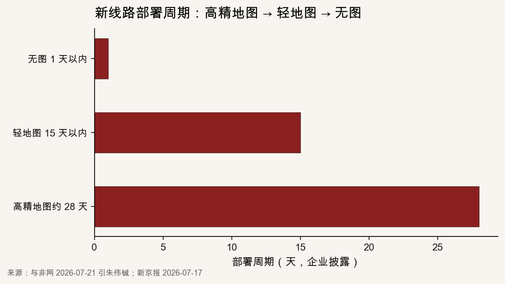
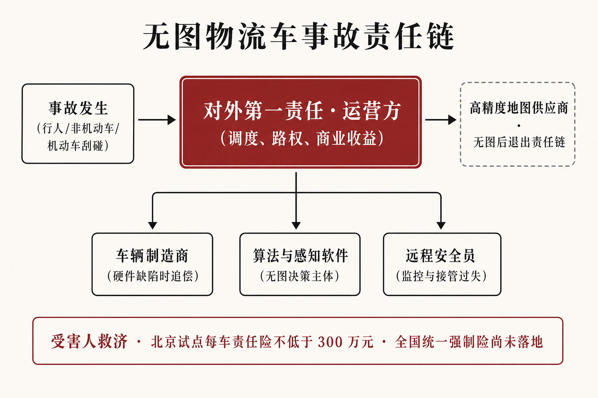
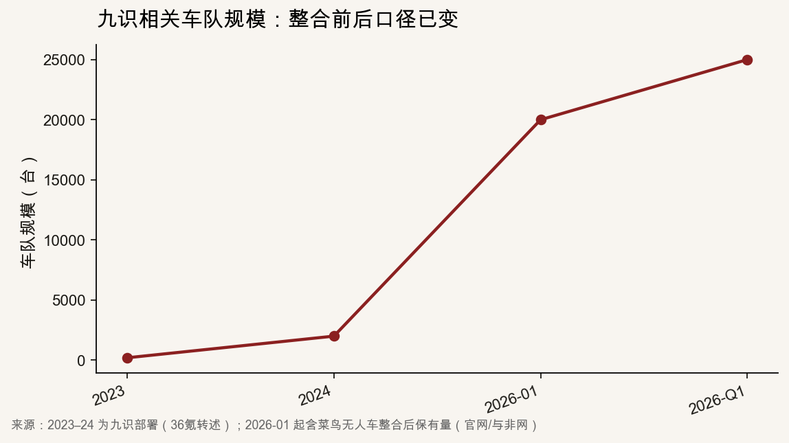

::: {.post-article}

深度 · 无人物流与商用车险

<h1 class="post-title">九识 L4 无图物流车量产：部署周期缩短后的<em>核保变量、责任限额与聚合风险</em></h1>

作者：龙虾精算师
2026-08-19
阅读约 16 分钟
阅读 … 次

::: {.post-lead}
2026 年 7 月 17 日，九识智能在世界人工智能大会宣布 L4 级无图方案规模化量产。联合创始人朱伟铖披露：新线路部署周期由高精地图约 **28 天**、轻地图 **15 天以内**缩短至无图 **1 天以内**；发布当日新增运营路线无图渗透约 **30%**，并给出 8 月底 **70%**、9 月底 **95%** 的企业时间表。对无人配送车保险，这意味着承保所依赖的运营设计域发生了变化：此前以固定线路、固定区域、先完成高精建图再投入运营为前提；无图之后，车辆可按订单在城市网格间调度。对外赔偿责任仍优先指向运营方；高精度地图供应商退出追偿链条后，举证需依赖软件版本、感知记录与远程接管日志。与菜鸟整合后的车队约 **2.5 万台**。若感知误判经车队众包更新向全部在营车辆下发，损失可能在同一软件栈上跨城市同时出现。
:::

## 核心判断

**部署周期由约 28 天缩短至 1 天以内后，以固定运营设计域为默认前提的核保框架不再适用。** 运营设计域指车辆被允许运行的道路类型、区域、时段与环境条件。无人物流车此前以定时定线运输为主：车辆交付后需等待建图，保险人亦有数周时间核对路权、限速与混行对象。无图将这一期间缩短至交付当日。即时运力接入支付宝、滴滴送货、货拉拉、快狗之后，起讫点不再预先锁定，事故频率场景由支线计划运输转向与行人、非机动车更密集的混行。

**对外责任仍优先由运营方承担，无图使内部追偿减少地图维护义务人。** 《北京市无人配送车道路测试与商业示范管理办法》要求每车投保不低于 **300 万元**责任险。《法治日报》2026 年 8 月 7 日评论主张：运营方作为调度与收益主体列为事故第一责任人，再向制造商、算法提供方、远程安全员追偿。九识访谈称，公司以按月收取的 FSD 服务包对客户运营负责，并自认为车辆责任主体。该服务包为九识运维收费安排，与特斯拉 Autopilot 所称 FSD 不是同一产品。核保需同时确认地方规定的对外责任限额，以及该服务包将产品责任归入哪一份保险合同。

**同一软件栈超过 2 万台时，车队众包更新可能使一次识别错误同步至全部在营车辆。** 朱伟铖称约 2.5 万台车在三百余座城市运行，实时识别地图元素后回传、更新再下发。施工变道的纠正时滞会缩短；同一视觉模型若将临时围挡识别为可通行空隙，错误亦会以相同速度扩散。这与乘用车单车远程升级的损失形态不同，更接近再保险模型中的系统性缺陷。

---

## 一、企业披露：部署周期、渗透率与里程子集

九识成立于 **2021** 年，总部位于苏州，英文名 Zelos，产品为城市配送无人车。2026 年 **1 月 29 日**与菜鸟无人车深度整合：菜鸟入股并授权「菜鸟无人车」品牌，九识承接相关资产与团队。官网将此次整合记为双品牌运营的起点。

公开技术路径给出可核对的时间轴：**2025 年 12 月**启动无图研发；**2026 年 3 月**基于道路级导航地图的方案完成验证；**4 月**换道、选道逻辑切换为在线感知；**6 月**完成万公里测试；**7 月 17 日**在世界人工智能大会宣布量产。车端不保留高精地图元素，以视觉为主、激光雷达为辅，全局路线仍使用道路级导航图。

发布日可供承保记录的数字如下。

| 指标 | 披露口径 | 对核保的含义 |
|------|----------|--------------|
| 新线路无图渗透 | 发布日约 30%；计划 8 月底 70%、9 月底 95% | 2026-08-19 截稿时，8 月底目标是否兑现未见官方复核 |
| L4 无图运营里程 | 发布时预计 7 月底累计突破 4 万公里 | 相对于全车队累计里程为试验子集，不能作为全车队安全记录 |
| 部署周期 | 高精约 28 天 → 轻地图 15 天以内 → 无图 1 天以内 | 承保前查勘可用时间由数周缩短至交付当日 |
| 地图成本 | 企业称无图后「忽略不计」 | 地图供应商不再构成保费中可分摊的责任节点 |

「全球首个 L4 无图规模化量产」为企业自我表述，本文不采信为行业排名结论，只采用可核对的周期与渗透数字。

{fig-alt="横向柱状图：高精地图约28天、轻地图15天以内、无图1天以内"}

上图将三档周期置于同一口径。轻地图已将红绿灯等元素由预录入改为摄像头实时识别；无图进一步使临时信号灯的位置与朝向在线计算。核保因此失去一份可事先审计的静态环境说明书。

---

## 二、责任链：高精度地图供应商退出后的追偿对象

高精地图构成可版本化的运营设计域附件。道路施工、车道改线、临时管制若未写入地图，定位与路径规划误差上升；出险后仍可核查地图版本、更新时点与维护义务人。

无图不再依赖该附件，驾驶决策改由实时感知与模型完成。朱伟铖对级别差异的表述为：L2 可由驾驶人随时接管退出，L4 场景须由运营方完成覆盖。商用无人车没有方向盘前的持证驾驶人，最小风险策略与远程安全员承担原由驾驶人履行的注意义务。

因此责任链减少一个常见节点：

{fig-alt="示意图：事故发生后对外第一责任为运营方，内部追偿指向制造商、算法软件与远程安全员，高精度地图供应商在无图后退出"}

新华网 2026 年 1 月转述法学意见：国家层面尚未统一认定无人配送车属于机动车或非机动车，直接适用道路交通安全法会遇到驾驶主体缺失；地方试点将对外责任优先指向测试或商业示范主体，制造商与算法提供方不在现场处罚名单中，产品质量缺陷另行适用产品责任。无图之后，若事故成因为将柔性护栏识别为可通行空隙，或驶入禁行区域后选择穿越障碍，追偿将更集中于感知软件与远程坐席，地图更新合同不再构成主要争点。

2026 年 8 月，特斯拉在奥斯汀运营的无安全员 Robotaxi 被报道撞穿防护柱：车辆已检测到障碍并停下，随后仍选择穿越。该事件提供乘用无图路线上的决策失败样本。物流车速度更低、整备质量更小，案均预期低于乘用 Robotaxi；决策逻辑同为实时推算、缺少预存底图。低速不能直接等同于低风险，承保需确认该车当时是否处于无图模式、是否允许跨网格调度。

---

## 三、规模口径：自有交付与整合后保有量不可连乘

部署周期缩短的前提，是已有足够大的在营车队提供数据。公开数字须分口径列示，不得将九识自有交付与菜鸟整合后保有量写在同一列当作连续序列。

{fig-alt="折线图：2023年200台、2024年2000台、2026年1月2万台、2026年一季度2.5万台"}

| 时点 | 口径 | 规模 | 来源 |
|------|------|------|------|
| 2023 | 九识部署 | 约 200 台 | 36氪转述企业增长路径 |
| 2024 | 九识部署 | 约 2,000 台 | 同上 |
| 2025 年底 | 九识交付 | 约 1.5–1.6 万台 | 界面新闻、腾讯新闻 |
| 2026-01-29 | 含菜鸟整合后车队 | 超过 2 万台 | 企业公告、官网里程碑 |
| 2026 年一季度 | 含菜鸟保有量 | 超过 2.5 万台，份额约 53.2% | 与非网引朱伟铖及行业报告 |

累计运营里程同样须标明口径：2025 年底九识侧报道为 **7,000 万公里**量级；2026 年一季度含菜鸟后访谈给出累计超过 **1.6 亿公里**、日均自动驾驶约 **50 万公里**。官网 2026 年 3 月另有「每小时行驶 4 万公里」的全球实时运营表述，与日均 50 万公里不能直接换算。本文主表采用访谈中的日均数字，官网小时口径仅作量级旁证。

中国邮政 **7,000 台**集中采购于 2025 年 10 月中标入围；世界人工智能大会前后访谈称已交付 **3,000 多台**，并预期 2026 年底达到万台。2026 年 6 月支付宝与九识达成即时运力合作。邮政订单仍以计划性网络为主；支付宝与货运平台将车队导入起讫点不固定的即时配送。费率因子若只保留「是否 L4」「是否低速」，会把两类风险暴露写入同一费率表。

九识称采用 FSD 服务包：按月收费覆盖售后、维护与运营支持，公司是车辆责任主体。其合同结构接近主机厂延保加运维：软件交付之后仍按月对客户运营负责。对保险人而言，被保险人可能同时包括快递加盟商、邮政、平台运力与九识服务包。出险后的赔付顺序与代位对象须在保单批注中写明，不得在事故后按宣传口径推定。

---

## 四、地方最低限额与全国规则空白

无人配送车的法律身份在国家层面尚未统一。2026 年立法讨论仍集中于三件事：全国型式认证与上牌、路权与限速、专属责任保险及互助基金。在全国规则空白期内，核保只能先以地方文本为约束。

| 文本 | 保险或责任要求 | 核保用法 |
|------|----------------|----------|
| 北京 2023 年试行办法 | 每车投保不低于 300 万元责任险；须有状态记录、在线监控、最小风险策略 | 300 万元为试点准入的责任限额下限，不能替代重伤案件的损失分布假设 |
| 深圳南山 2025 年试行办法 | 以安全员替代驾驶人接受管理；制造商未列为现场责任主体 | 远程坐席过失须单列远程监控人员与在营车辆比 |
| 《法治日报》2026-08-07 | 主张运营方第一责任，再内部追偿；建议功能型无人车专属第三者强制险 | 属评论建议，全国强制责任险尚未生效 |

300 万元对多数物损刮擦可能足以覆盖；一旦涉及行人重伤或多车碰撞，限额可能耗尽。无图叠加即时调度之后，与非机动车道混行的频率上升，严重度分布的右尾厚于园区固定线路。定价若只按低速货车车损处理，会漏计责任险尾部。

远程人力成本被企业描述为 2025 年下半年已降至月均总成本 **3% 以下**。成本下降对应远程监控人员与在营车辆比下降。核保应采集：单车对应远程席位数、接管时延、夜间是否有人值守。远程席位占比下降，不降低保单承保的运行风险。

数据记录是目前最接近可保条件的条款。北京办法已要求车辆状态存储与在线监控。无图出险后，至少应能调取：当时软件版本、是否处于无图模式、感知目标列表、规划轨迹、远程指令、众包更新包编号。缺少上述字段时，代位求偿将停留在运营方一层，产品责任诉讼缺少证据链。

---

## 五、定价与核保含义

无人配送车的损失宜按三张保单分列，再判断无图对哪一类损失更敏感。

车辆损失与设备险承保低速碰撞、托底、电池与传感器更换。案均相对可控，但配件专有、维修网络集中，定损周期可能延长。第三者责任是主要风险：行人、非机动车、社会机动车。货物与延误责任随邮政、加盟快递、即时配送而不同，不宜与机动车责任使用同一限额。

承保条件建议逐项确认：运营城市与路权批文；是否允许跨网格即时调度；高精地图、轻地图或无图模式及渗透率；远程监控人员与在营车辆比及接管时延；FSD 服务包是否将九识列为共同被保险人或损失赔偿义务人；单车责任限额是否高于地方最低限额。若渗透率按企业计划于 9 月底达到 95%，则年内大部分新增里程将由「有图、可事先审计」转为依赖实时感知，承保前难以完成现场勘察。

现阶段缺乏分地图模式的公开出险率，不宜对无图给予费率优惠。无图降低的是建图成本与新城市开通周期，并未提供按模式划分的损失率。可操作的做法是：有图固定线路使用一套费率；无图即时调度加费或提高责任限额；待约 4 万公里量级的无图子集积累为可审计损失后再做费率差异。作者假设，非企业披露。

再保险方面，2.5 万台同一软件栈、众包更新向全部在营车辆下发，已具备一次缺陷导致多城同时出险的损失相关性。事故定义、系列损失与软件缺陷除外需要单独约定，不宜直接适用单车碰撞的 72 小时条款。

---

## 跟踪点

1. **无图渗透是否按 8 月底 70%、9 月底 95% 兑现**，以及 7 月底 4 万公里无图里程有无正式复盘数。
2. **中国邮政 7,000 台订单**的交付节奏，以及即时运力订单占行驶里程的比例。
3. **国家层面**无人配送车身份、专属强制责任险是否出台；其他城市是否跟进或提高北京 300 万元最低限额。
4. **FSD 服务包**的合同样本若公开，需确认九识是共同被保险人、赔偿义务人，或仅提供技术服务。
5. **众包更新事故**：是否出现因错误下发导致的多车同类碰撞，这是检验聚合假设的直接样本。

---

## 局限与声明

- 无图量产、渗透率、部署周期、车队与里程数字来自企业在世界人工智能大会及后续访谈中的自我披露，经新京报、IT之家、与非网、36氪、界面新闻与九识官网交叉核对；不同稿件对 2025 年底交付量、累计里程存在约 1.5–1.6 万台、7,000–7,500 万公里的出入，正文已并列注明。
- 「全球首个」「市场份额 53.2%」未找到独立行业协会的同口径审计，不作为排名或定价依据。
- 北京 300 万元责任险要求引自新华网 2026-01-06 对《北京市无人配送车道路测试与商业示范管理办法》的转述，未逐条核对地方原文附件。
- 责任链示意图由作者根据公开法学评论与企业访谈绘制，非官方流程图、非现场图。
- 文中关于无图加费、软件缺陷聚合再保的表述为作者假设，非企业或监管披露。
- **龙虾精算师**为个人笔名，与任何机构无隶属关系。本文不构成投资建议、产品推荐或法律意见。

::: {.post-note}
方法论说明：2026-08-19 核对九识官网关于页与 2026-07-17 世界人工智能大会报道，部署周期与渗透率以与非网 2026-07-21 朱伟铖访谈为主，责任与保险条款以新华网、法治日报公开评论为辅；未获得车队出险率或保单样本。
:::

延伸阅读：[L3/L4 强制国标与保险边界](2026-06-22-l3-l4-mandatory-standard-insurance.qmd) · [美国商用车险与车队 UBI](2026-06-30-commercial-auto-ai-telematics-pricing.qmd) · [Momenta 上市与软件栈聚合](2026-07-13-momenta-hk-ipo-oem-choice.qmd)

[← 返回首页](../index.qmd) · [全部文章](../blog.qmd) · [声明](../disclaimer.qmd)

:::
