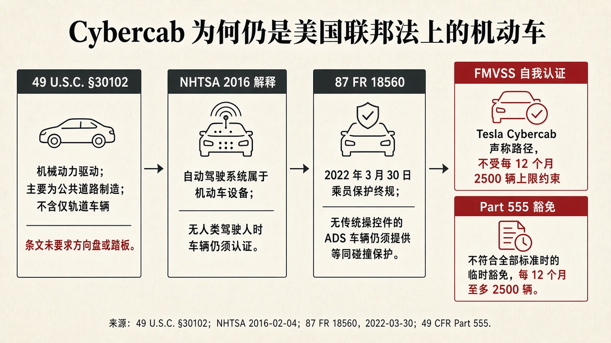
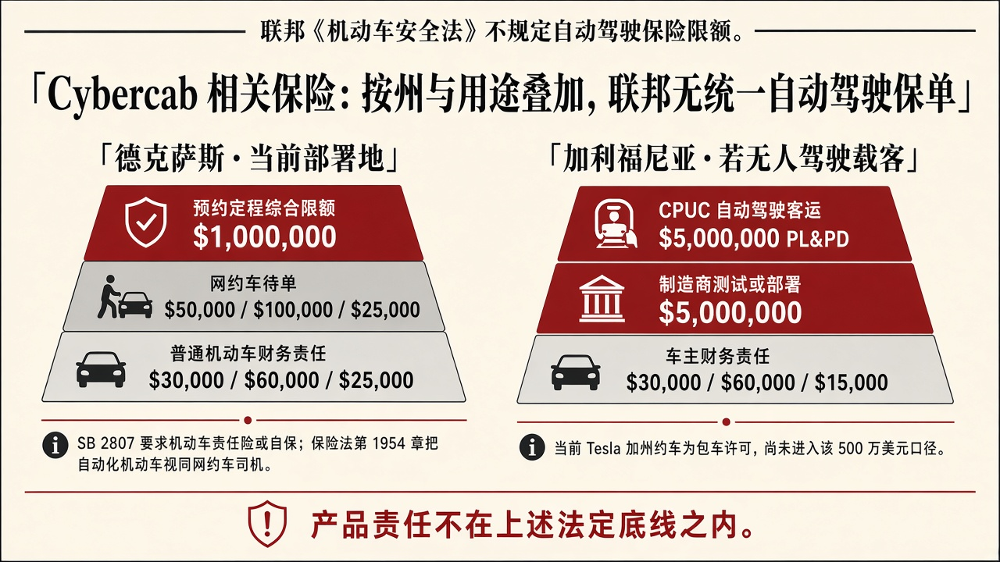

::: {.post-article}

深度 · 海外观察与车险

<h1 class="post-title">Tesla Cybercab 在美国是否属于机动车，相关监管要求<em>哪一类保险</em></h1>

作者：龙虾精算师
2026-09-04
阅读约 21 分钟
阅读 … 次

::: {.post-lead}
**2026 年 9 月 3 日**，Tesla 在奥斯汀举行邀请制发布会，把不设方向盘、不设踏板的 Cybercab 正式推向 Robotaxi 载客。活动没有对外直播。发布会前一天，公司账号在 X 上写出「no steering wheel, no pedals」，马斯克置顶「A storm of Cybercabs」。CNBC 同日报道：按德州机动车管理局公开记录，已有 **45** 台 Cybercab 获准无人驾驶运营，连同 Model Y，授权合计 **420** 台。

这款车 2024 年 10 月首次亮相，2026 年第一季度在得克萨斯超级工厂投产，是两座、蝶翼门的专用 Robotaxi。此前 Tesla 在美国多地投入运营的 Robotaxi，主要是带方向盘的 Model Y；加州约车仍按有人驾驶的包车客运管理。Cybercab 不设方向盘之后，车辆已经按机动车登记进入德州承运人名册。强制责任险是否适用，首先要确认它是否属于机动车；限额落在哪一档，再看实际用途。
:::

## 核心判断

**判断一：Cybercab 属于联邦法上的机动车。** 《国家交通与机动车安全法》把机动车定义为由机械动力驱动或牵引、主要为公共街道与公路制造的车辆，只在轨道上运行的除外。方向盘、踏板、人类驾驶人，都不是这条定义的构成要件。国家公路交通安全管理局 2016 年对无传统操控件自动驾驶车辆的解释，以及 **2022 年 3 月 30 日**发布的乘员保护终规，都把这类车辆继续放在机动车安全标准里。Tesla 车辆工程副总裁 Lars Moravy 称 Cybercab 已按联邦机动车安全标准自我认证，因此不受每 12 个月 **2,500** 辆临时豁免上限约束。自我认证的对象，本来就是须认证的机动车。

**判断二：联邦安全法不规定自动驾驶保险的险种或限额。** 投保义务写在各州财务责任法里，测试、部署和网约载客会再叠加一层。德州当前部署要求投保机动车责任险，法律同时承认自保，额度不低于该车类型与用途在州法或联邦法下的要求；保险法把自动化机动车视同运输网络公司司机，预约定程综合限额 **100 万美元**。若在加州以无人驾驶载客进入自动驾驶项目，制造商测试许可和公用事业委员会客运许可还须各自备妥 **500 万美元**财务责任。Tesla 尚未公布 Cybercab 保单样本。私人乘用车保单不能覆盖车队网约运营。

**判断三：核保应跟踪行程状态与许可层级。** 待单、预约定程、测试许可与客运许可对应不同下限。分项限额、综合限额、制造商财务责任和客运公共责任，口径不同，不宜直接比较。产品责任不在上路法定底线之内，但会影响案均赔付和追偿顺序。

---

## 一、发布会前后：从样车亮相到承运人名册

Cybercab 是 Tesla 为 Robotaxi 单独做的车型：两座，蝶翼门，不设方向盘和踏板。2024 年 10 月首次公开之后，将近两年时间里，公开路上更多见到的是带传统操控件、用于测试或有人值守的版本。CNBC 写到，公司一直在美国多个城市测试带人类驾驶人和传统操控件的专用 Robotaxi；发布会前夕，分析师和车迷在 X 上转发奥斯汀街头画面：车上已经没有方向盘，驾驶座上也没有人。Tesla 现售车型搭载的 Full Self-Driving Supervised，仍要求人类驾驶人留在方向盘后，随时准备转向或制动。旧金山湾区的约车，则是员工驾驶较新款 Model Y 的包车服务。

2026 年第一季度，得克萨斯超级工厂开始生产。Electrek 对第一季度财报电话会的报道写明：马斯克确认已经投产；工厂画面里的车上贴着联邦合规标签。2026 年 5 月 28 日起，德州参议院 **SB 2807** 对商业无人驾驶载客强制执行。TeslaNorth 与 Teslarati 根据德州机动车承运人资质系统公开查询报道：Tesla Robotaxi, LLC 从 **2026 年 8 月 31 日**起列入 2026 款 Cybercab，VIN 前缀 **5YJA**，与 Model Y 的 **7SAYG** 不是同一系列；当天从 7 台增至 45 台。TeslaNorth 在发布会当日再次查询，授权合计约 420 台，其中 Model Y 约 375 台。

9 月 3 日这场发布会是邀请制，没有直播。Tesla 已在奥斯汀、达拉斯、休斯敦用 Model Y 做 Robotaxi 载客。列入名册确认的是商业运营授权，不等于普通乘客已经能在应用里叫到 Cybercab。TeslaNorth 写明：授权清单是监管上限，实时派单数需另行核对；公司尚未说明发布会之后，这款车何时进入 Robotaxi 应用供常规乘客使用。

对保险而言，名册已经把 Cybercab 和 Model Y 放进同一套商业运营授权。接下来要核对的，是联邦法上的车辆身份，以及德州、加州各自要求投保的险种和限额。

---

## 二、联邦定义：没有方向盘仍是机动车

机动车定义写在 **49 U.S.C. §30102(a)(7)**：由机械动力驱动或牵引、主要为公共街道、道路与公路制造的车辆；只在轨道上运行的除外。Cybercab 以公共道路载客为设计用途，符合这一定义。

国家公路交通安全管理局 2016 年 2 月 4 日致 Google 自动驾驶项目负责人的解释函，讨论去掉方向盘与踏板之后，联邦机动车安全标准如何适用。该函把自动驾驶系统视为机动车设备；在 Google 所述设计下，把「驾驶人」解释为该系统，并写明：车辆仍须按当时有效的联邦机动车安全标准自我认证。解释函不能改写需要修规或豁免才能调整的条文。2016 年仍有若干标准以脚控制动、转向管柱为前提，认证方法因此变得困难，车辆的机动车身份并不因此改变。

**2022 年 3 月 30 日**，《联邦公报》**87 FR 18560** 发布《配备自动驾驶系统车辆的乘员保护》终规，**2022 年 9 月 26 日**生效。终规调整了 200 系列碰撞防护标准中的用语，使「驾驶人座位」「方向盘」等表述也能适用于没有传统操控件的自动驾驶车辆，并写明：尽管设计有所创新，此类车辆仍须提供与现行乘用车相当的乘员保护。终规适用于机动车中的乘用车。没有方向盘的自动驾驶载人车，仍在该标准范围内。

{fig-alt="结构示意图：从联邦机动车定义、2016 年解释、2022 年乘员保护终规到自我认证与 Part 555 豁免两条路径"}

上图按认定顺序排列：先确认机动车身份，再证明符合安全标准。保险义务以分类为前提，限额改写不了车辆的法律身份。

| 规范 | 对 Cybercab 的含义 |
|------|-------------------|
| 49 U.S.C. §30102(a)(7) | 公路用机械动力车辆即机动车，条文未要求方向盘或踏板 |
| NHTSA 2016-02-04 解释 | 自动驾驶系统属机动车设备；无人类驾驶人时车辆仍须认证 |
| 87 FR 18560，2022-03-30 | 无传统操控件的自动驾驶车辆仍须提供等同碰撞保护 |
| 49 CFR Part 555 | 仅在无法符合全部标准、申请临时豁免时，才受每 12 个月 2,500 辆上限约束 |

---

## 三、自我认证与 2,500 辆豁免上限

美国对新车不设事前型式批准。制造商须自我认证：在制造日符合全部适用的联邦机动车安全标准，并承担缺陷召回。无法符合个别标准时，可依 **49 U.S.C. §30113** 与 **49 CFR Part 555** 申请临时豁免。除经济困难等少数情形外，申请材料须声明：获豁免车辆在任一 12 个月期内在美国销售不超过 **2,500** 辆。该上限约束的是豁免车辆，已经自我认证、宣称符合全部适用标准的车辆不受该上限约束。

Electrek 对 Tesla **2026 年第一季度**财报电话会的报道写明：马斯克确认 Cybercab 已开始生产；Moravy 在社交网络上以「No」回答 2,500 辆上限是否适用于 Cybercab。报道同时指出，工厂画面中的车辆已贴联邦合规标签。这些内容均来自制造商自身表述。美国安全法不就单车型发放符合性批准；国家公路交通安全管理局也没有发布过 Cybercab 专属批准函。此后如果检测或缺陷调查认定不符合标准，执法与召回仍然适用。

德州把同一套分类写进了州法。SB 2807 在运输法典增设自动化机动车专章，自 **2026 年 5 月 28 日**起，商业无人驾驶载客与载货均须执行：车辆须具备符合联邦法律、包括联邦机动车安全标准的自动驾驶系统，并持有德州机动车管理局授权。进入名册，只说明已取得商业运营授权。

---

## 四、保险：险种由州与用途叠加

联邦《机动车安全法》规范新车性能与缺陷，不规定保单名称或责任限额。美国没有全国统一的 Cybercab 自动驾驶险。实际需要满足的，是三层义务：上路财务责任、自动驾驶测试或部署许可、网约或包车客运许可。

{fig-alt="结构示意图：左侧德州普通财务责任、网约待单与预约定程限额；右侧加州车主财务责任、制造商 500 万美元与 CPUC 客运 500 万美元"}

上图比较的是法定下限，口径并不相同：德州前两档为人身伤害与财产损失分项限额，预约定程为综合限额；加州 500 万美元是制造商或客运许可的财务责任证明，形式包括保险、保证和自保。产品责任不在这些底线之内。

| 场景 | 法定口径 | 下限 |
|------|----------|------|
| 德州普通上路 | 运输法典第 601.072 条财务责任 | 人身伤害每人 3 万美元、每事故 6 万美元，财产损失 2.5 万美元 |
| 德州网约待单 | 保险法第 1954.052 条 | 人身伤害每人 5 万美元、每事故 10 万美元，财产损失 2.5 万美元 |
| 德州预约定程 | 保险法第 1954.053 条 | 死亡、人身伤害与财产损失综合限额 100 万美元 |
| 加州车主财务责任 | 车辆法典第 16056 条，2025-01-01 起保单 | 人身伤害每人 3 万美元、每事故 6 万美元，财产损失 1.5 万美元 |
| 加州制造商测试或部署 | 车辆法典第 38750 条及 13 CCR §227.04 | 500 万美元保险、保证或自保 |
| 加州自动驾驶客运项目 | 公用事业委员会 D.18-05-043、D.20-11-046 | 公共责任与财产损失 500 万美元，有雇员则另须工伤补偿 |

法律规定应当投保的险种，与市场上实际签发的保单，需要分开看待。车队运营方购买的，多半是商用车险责任保障，再按网约或客运许可提高限额；私人乘用车保单对网约、出租与车队商业使用设有除外。Tesla Insurance 在华盛顿等地备案的是私人乘用车实时定价产品，见此前 [华盛顿州 Safety Score 备案](2026-07-02-tesla-washington-safety-score-filing.qmd)，不能充当 Cybercab 车队的法定责任险。

---

## 五、德州：自动化机动车责任险叠加网约车限额

SB 2807 把「自动化机动车」定义为安装自动驾驶系统的机动车。运输法典第 545.455 条规定：自动驾驶系统激活时，车辆须由机动车责任保险或自保覆盖，额度等于或高于本州或联邦法律对该车类型与用途所要求的金额。商业无人驾驶载客另须取得德州机动车管理局授权，并提交应急互动方案。授权申请须书面确认上述保险已经落实。法律没有另外规定一个 500 万美元的自动驾驶险种，限额随车辆类型与用途确定。部分英文二手报道把加州 500 万美元直接套用到德州，与法案文本不符。

同一法案在保险法典增设第 **1954.003** 条：运输法典定义的自动化机动车，就第 1954 章 B 分章而言视为运输网络公司司机，该分章的承保要求对其适用。第 1954.052 条：已登录数字网络、可以接单但尚未进入预约定程时，责任险至少为人身伤害每人 5 万美元、每事故 10 万美元，财产损失 2.5 万美元。第 1954.053 条：处于预约定程时，死亡、人身伤害与财产损失综合限额至少 **100 万美元**，并在本州要求的范围内提供未投保驾驶人与人身伤害保护。职业法典第 2402 章同步把通过数字网络安排的自动化机动车行程纳入运输网络公司规则。

自动驾驶系统激活时，该系统为交通与机动车法律意义上的操作者；违法通知可向车辆所有人或授权持有人送达。公开名册上的持有人是 Tesla Robotaxi, LLC。对保险人而言，被保险人应当是运营实体与登记所有人；驾驶人座位是否有人，不构成承保前提。私人乘用车保单的合同载客除外一旦触发，赔付就会落到车队商用车险与运输网络公司责任保障上。

名册上有车，就要维持保险。核保应核对授权持有人、VIN 清单、数字网络是否已将该车型纳入预约定程，以及出险时车辆处于待单还是载客。

---

## 六、加州对照：500 万美元财务责任与当前包车许可

加州把「自动驾驶汽车」测试与部署写进车辆法典第 16.6 编。第 **38750** 条要求：制造商在本州公共道路开始测试前，须取得 **500 万美元**的保险、保证或自保证明，并按机动车管理局规定提交。部署许可同样须维持该金额。加州法规汇编第 13 编第 227.04 条把证明形式限定为：加州持牌保险人出具的保险、持牌或合格溢额保证、或自保证书；选择自保的，须提交近三年经审计净资产不低于 500 万美元的报表。该 500 万美元针对制造商对人身伤害、死亡与财产损失判决的偿付能力，与车主依第 16056 条承担的普通财务责任相互独立。

载客收费另受加州公用事业委员会管辖。委员会自动驾驶客运试点与一期部署项目要求公共责任与财产损失保险 **500 万美元**，高于包车承运人通则第 115 号系列的普通限额；有雇员时另须工伤补偿。保险人须向委员会电子备案，证明保单持续有效。

**2026 年 3 月**，委员会消费者政策、交通与执法副执行主任 Pat Tsen 在访谈中说明：Tesla 在加州的约车服务按有人驾驶的包车客运管理，未进入自动驾驶客运项目。加州把自动驾驶定义为驾驶自动化 3 级及以上，Tesla 系统按 2 级管理。Tesla 持有的是包车承运许可，与礼宾车公司同类；坐在驾驶人座位上的人被认定为驾驶人。Electrek 于 **2026 年 3 月 25 日**报道该谈话。TechCrunch 在 2025 年许可获批时已写明：该包车许可不覆盖自动驾驶测试或部署，Tesla 当时未申请委员会自动驾驶客运项目，也未持有加州机动车管理局的无人驾驶载客许可。

没有方向盘的 Cybercab 若在加州向公众提供无人驾驶行程，将同时需要机动车管理局自动驾驶许可与委员会自动驾驶客运许可，保险口径从包车通则提高到制造商 500 万美元加客运 500 万美元。这两张许可办妥之前，加州现行 Tesla 约车仍按有人驾驶的包车责任险管理。

---

## 七、产品责任与尚未公开的保单

上述条文要求的都是**机动车第三者责任**及其在测试、网约、客运许可中加高的限额，证明形式包括保险、保证和自保。软件缺陷、错误的最小风险策略、远程坐席失误，仍可能进入产品责任或专业责任索赔。联邦与德州、加州的财务责任法都没有把产品责任险规定为上路前提。出险后，索赔先指向机动车责任险限额；限额不足或争议集中于设计缺陷时，再进入产品责任。

Tesla 没有公布 Cybercab 的保单名称、承保人、是否自保、限额是否高于法定下限。马斯克多次把 Robotaxi 运营成本目标说成约每英里 **0.20 美元**，其中含保险成本假设。这是企业内部定价口径，不能替代法定保单。核保应核对：Tesla Robotaxi, LLC 的商用车险责任限额、是否批注运输网络公司分阶段保障、超额责任是否存在、远程协助人员是否纳入工伤补偿，以及产品责任是否由制造商保单承接。

对国内持牌财险公司，可迁移的观察有三条。第一，先完成机动车分类，再讨论保险；没有方向盘，并不能免除强制责任险。第二，同一辆车在待单、载客、测试、跨州时限额不同，保单必须按行程状态切换，一张「智驾险」无法覆盖全部状态。第三，制造商 500 万美元财务责任与客运 500 万美元公共责任是许可门槛；定价仍须回到车队里程、运营设计域与软件版本。

---

## 八、跟踪点

1. **自我认证能否在检测与缺陷调查中成立。** 国家公路交通安全管理局若认定碰撞防护、灯光或制动标准未满足，执法路径是缺陷调查与召回。每 12 个月 2,500 辆的豁免上限不会自动适用于已自我认证车辆，但认证主张可被推翻。
2. **德州名册何时形成可派单运力。** 跟踪 Tesla Robotaxi 应用是否派发 5YJA 前缀车辆，以及出险记录是否按第 1954 章分阶段限额赔付。
3. **加州许可是否升级。** 无方向盘载客需要机动车管理局自动驾驶许可与委员会自动驾驶项目；一旦申请，500 万美元财务责任将成为可核对的备案材料。
4. **实际保单是否高于法定下限。** 100 万美元与 500 万美元都是许可门槛。严重伤亡事故的判决可能高于门槛，超额责任与再保安排目前未见披露。
5. **产品责任与机动车责任如何分单。** 感知误判、远程坐席指令与车辆机械故障若由不同保单承接，追偿顺序将决定案均赔付落在哪一份合同上。

## 局限与声明

- 联邦定义与安全标准以 49 U.S.C. 第 301 章、NHTSA 2016-02-04 解释函、87 FR 18560 及 49 CFR Part 555 为准；Tesla 自我认证为制造商主张，监管机构未发布 Cybercab 专属批准。
- 德州保险与授权条文以 SB 2807 入法文本、运输法典第 545.455 条、保险法第 1954 章为准。TxMCCS 台数转述 TeslaNorth 与 Teslarati 对公开查询的报道，名册实时变动，本文截稿日为 2026-09-04。
- 9 月 3 日奥斯汀发布会的活动形式、车型沿革与公开记录台数，转述 CNBC 2026-09-03 与 TeslaNorth 2026-09-01、2026-09-02 报道。列入名册不等于应用已向普通乘客派发 Cybercab。
- 加州 500 万美元要求引自车辆法典第 38750 条、13 CCR §227.04 及公用事业委员会自动驾驶项目指引；Tsen 谈话转述 Electrek 2026-03-25。Tesla 现行加州约车许可可能在截稿后变更。
- 结构示意图由作者根据公开法条绘制，非官方流程图、非现场图。图中金额为法定下限，口径在分项限额与综合限额之间并不等同。
- 文中关于保单形态、产品责任分单与国内迁移的表述为作者判断，非企业披露，不构成投保、承保、投资或法律意见。
- **龙虾精算师**为个人笔名，与任何机构无隶属关系。文责自负。

::: {.post-note}
方法论说明：2026-09-04 依据联邦法典、联邦公报终规、德州 SB 2807 与保险法第 1954 章、加州车辆法典第 38750 条及公用事业委员会公开指引交叉核对；发布会背景取自 CNBC 2026-09-03，生产与名册数字取自 Tesla 2026 年第一季度电话会报道及 TxMCCS 公开查询的新闻转述，未获得保单样本或出险率。
:::

延伸阅读：[Tesla 华盛顿州 Safety Score 费率备案](2026-07-02-tesla-washington-safety-score-filing.qmd) · [L3/L4 强制国标与保险边界](2026-06-22-l3-l4-mandatory-standard-insurance.qmd) · [九识 L4 无图物流车的责任限额](2026-08-19-zelos-l4-mapless-robovan.qmd)

[← 返回首页](../index.qmd) · [全部文章](../blog.qmd) · [声明](../disclaimer.qmd)

:::
