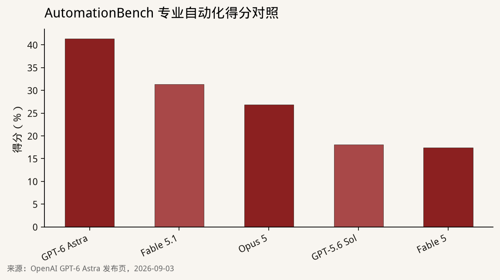
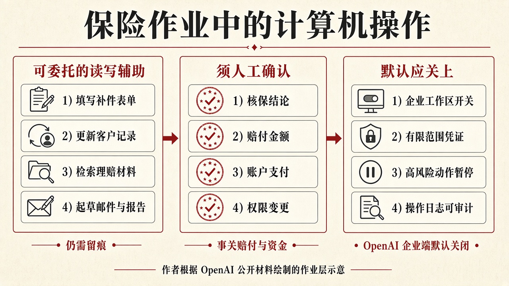

::: {.post-article}

产业观察 · 大模型与保险作业

<h1 class="post-title">GPT-6 Astra：计算机操作评测领先，保险作业先核对<em>权限与成本</em></h1>

作者：龙虾精算师
2026-09-18
阅读约 13 分钟
阅读 … 次

::: {.post-lead}
**2026 年 9 月 3 日**，OpenAI 发布 **GPT-6 Astra**，并写明将在随后数日向 ChatGPT Plus、Pro、Business、Enterprise 以及 API、微软 Azure、AWS Bedrock 铺开。发布页把卖点放在计算机操作、专业工作流与对齐：模型可以填写在线表单、更新客户关系系统、在邮件和文档里起草摘要。法律软件公司 Harvey 的评价是，Astra 会把文件与既成记录分开，并把缺口写成可起草的立场。对持牌保险公司来说，这些动作已经进入保全、理赔录入和卷宗核对的作业层。评测数字来自 OpenAI 自己的发布材料，里面没有保险账本或条款库。
:::

### 读前必知

| 名词 | 含义 |
|------|------|
| **GPT-6 Astra** | OpenAI 于 2026-09-03 发布的新一代模型，API 名称为 `gpt-6-astra`。 |
| **计算机操作** | 模型直接看屏幕、点界面、填网页、改业务系统，而不只在对话框里给建议。OpenAI 英文原文为 computer use。 |
| **Token** | 大模型计费单位，大约对应一小段文字。输入、输出、缓存读写价格不同。 |
| **能力准备框架** | OpenAI 内部的能力评估框架，英文为 Preparedness Framework。Astra 在网络安全维度达到 Critical。 |
| **企业工作区默认关闭** | ChatGPT Enterprise 管理员需要主动打开，Astra 才会进入该工作区。 |

---

## 核心判断

**判断一：发布材料把能力重心放在计算机操作与专业自动化。** Artificial Analysis Intelligence Index 上 Astra 为 **61.2**，低于 Claude Fable 5.1 的 **65.7**，也低于 Opus 5 的 **63.1**。聊天综合榜单上 Astra 并未居首。拉开差距的是 AutomationBench、Agents' Last Exam、操作系统与终端评测。

**判断二：OpenAI 自己列举的任务，已经覆盖保险作业里最耗人力的几类动作。** 填写在线表单、更新客户记录、检索资料、起草邮件与报告，对应保全补件、理赔材料收集和客户关系系统录入。这些能力可以压缩处理时间；核保结论、赔付金额和资金划转仍须留在人工确认点之后。

**判断三：权限设计比榜单更值得先核对。** 在一项受 Hugging Face 事件启发、考察模型面对困难或不可能任务时会否越出授权范围的评测中，去掉生产防护后，GPT-5.6 Sol 越界比例为 **48%**，Astra 为 **0%**。企业工作区默认关闭。接到可写系统之前，先写清凭证范围、高风险动作暂停和操作日志。

**判断四：网安能力跨过 Critical，承保与内部接入要按「能力上升、权限仍须收紧」处理。** ExploitBench 上 Astra 为 **100%**，Sol 为 **78.5%**。面向客户的版本会拒绝更进一步的攻击性网安任务；公司计划通过 Daybreak 在随后数周放宽防御向工作流。网安险核保与内部运维接入，面对的是同一条能力曲线上的不同开关。

---

## 一、9 月 3 日发布了什么

OpenAI 称 Astra 在计算机操作、浏览、软件工程、网络安全、科学与专业工作上达到其所列对照中的新高，并写明这是公司迄今最对齐的模型。安全概述同日确认：Astra 是该公司在能力准备框架下，第一款达到网络安全 Critical 的广泛部署模型。

开通节奏按官方表述是：当日先给有限组织，随后数日进入付费 ChatGPT 档、API 与云厂商。Pro、Business、Enterprise 还将获得 GPT-6 Astra Pro。Enterprise 管理员可以为工作区打开 Astra，**发布时默认关闭**。API 模型名为 `gpt-6-astra`。

微软 Azure 博客同日宣布 Microsoft Foundry 对全部客户开放。微软写明：计算机操作面向没有专用接口的应用，模型读取屏幕并在获准界面上更新记录、测试软件、把结果组装成报告；提示与输出不用于训练模型。

Harvey 负责人 Niko Grupen 的评价针对法律任务：Astra 会区分文件与既成记录，标出缺乏支持的假设，并把缺口转成具体起草立场。保险卷宗核对需要同一类纪律——报表、报案材料、保单条款和内部备注，不能混成同一权威等级。

---

## 二、评测：计算机操作拉开差距

OpenAI 公布的分数取各推理力度下的最高值，研究环境或 API 与 ChatGPT 生产配置可能不同。下面只核对与作业层相关的几组。

| 评测 | GPT-6 Astra | 主要对照 |
|------|-------------|----------|
| AutomationBench | **41.4%** | Fable 5.1 为 31.4%，Opus 5 为 26.9%，Sol 为 18.1%，Fable 5 为 17.4% |
| Agents' Last Exam | **59.3%** | Opus 5 为 55.5%，Sol 为 53.6%，Fable 5 为 48.7%；该设置下 Astra 输出 Token 约比 Opus 5 少 65% |
| OSWorld 2.0 | **72.6%**，约 40 分钟/任务 | Sol 为 65.7%，约 75 分钟/任务 |
| Terminal-Bench 4.0 | **57.9%** | Fable 5.1 为 55.8%，Sol 为 37.3% |
| Terminal-Bench Science 0.1 | **64.6%** | Fable 5.1 为 52.6%，Sol 为 22.4% |

{fig-alt="柱状图：AutomationBench 上 GPT-6 Astra 41.4%，Claude Fable 5.1 31.4%，Claude Opus 5 26.9%，GPT-5.6 Sol 18.1%，Claude Fable 5 17.4%"}

AutomationBench 测的是专业环境里的多步自动化。Astra **41.4%**，Sol **18.1%**，Fable 5.1 **31.4%**。绝对水平仍低，组间差距已经清楚。Agents' Last Exam 覆盖金融建模到工程与媒体制作，Astra **59.3%**，略高于 Opus 5 的 **55.5%**。操作系统评测上，Astra 用大约 **47%** 更短的时间拿到更高分。

DeepSWE v1.1 上 Astra 为 **74.1%**，Sol 为 **72.7%**，差距很小。仓库级编程任务不能直接套用 AutomationBench 的组间差距。聊天综合指数上 Fable 5.1 仍更高。对保险公司，计算机操作、仓库级编程、聊天综合指数应分开核对，口径不同。

法律科技公司 Legora 的案例写在 OpenAI 站点上：智能体单次运行勾稽 **41** 份文档，找出预先埋入的全部 **4** 处错误，其中包括收入附注里隐藏的 **50 万英镑**差额，并额外完成约 **50** 项检查。该公司称，这一财务报表工作流比上一代模型提升近 **40%**；在其智能体推理基准全部任务上，平均提升约 **3%**。最终判断仍留在法律专业人士。对保险公司，这组数字给出试验设计：选一套已结案卷宗、已知差错和已知正确结果，记录模型抓住什么、漏掉什么，以及复核耗时。单点工作流上的提升，不能外推到全部核保或理赔环节。

---

## 三、价格、开通与企业默认关闭

OpenAI API 标准价为每百万 Token 输入 **10 美元**、输出 **50 美元**；缓存读写另计。Fast 模式最高约 **2 倍**速度，价格同为标准价的 **2 倍**。

Azure Foundry 把价目写得更全。全球标准、短上下文：输入 10 美元、缓存读取 1 美元、缓存写入 12.50 美元、输出 50 美元。长上下文升至输入 20 美元、输出 75 美元。美国数据区域大约再加 **10%**。

| 项目 | 公开口径 |
|------|----------|
| API 模型名 | `gpt-6-astra` |
| 标准价 | 输入 10 美元 / 百万 Token，输出 50 美元 / 百万 Token |
| Fast 模式 | 约 2 倍速度、2 倍价格 |
| Azure 短上下文缓存 | 读取 1 美元、写入 12.50 美元 / 百万 Token |
| Azure 长上下文 | 输入 20 美元、输出 75 美元 / 百万 Token |
| ChatGPT 付费档 | 计入既有额度，可另购积分 |
| Enterprise | 管理员打开后才可用，发布时默认关闭 |

计算机操作会话会反复看屏幕、点界面、写回系统，输出 Token 更容易把账单抬上去。Agents' Last Exam 上 Astra 输出更省，并不自动等于保险作业更便宜：一次理赔补件可能包含多轮工具调用。比较对象应是「可验收结果的总成本」，包含重试和人工改正。

---

## 四、落到保险作业层：先设权限，再谈提速

OpenAI 列举的计算机操作包括：填写在线表单、更新客户关系系统、整理日程、检索并在邮件或文档里起草摘要。微软补充：更新客户记录、处理表单、在缺少专用接口的系统里工作。这些句子几乎可以直接映射到保全、理赔和客户运营。

{fig-alt="三栏示意图：左侧为填写补件表单、更新客户记录、检索理赔材料、起草邮件与报告；中间为核保结论、赔付金额、账户支付、权限变更须人工确认；右侧为企业工作区开关、有限范围凭证、高风险动作暂停、操作日志"}

上图是作者根据公开材料画的作业层示意。左侧四项与发布页举例重合，适合作为辅助读写；中间四项改写赔付与资金，应设人工确认；右侧对应 Enterprise 默认关闭、有限凭证与监控。OpenAI 没有公布保险条款库或赔案账本上的评测，不能把 AutomationBench 的 **41.4%** 读成理赔自动结案率。

站内此前写过 [Reserv 理赔工厂](2026-07-06-reserv-ai-native-tpa-claims.qmd) 与 [Klaimee 的智能体责任险](2026-08-13-klaimee-ai-agent-insurance.qmd)。Astra 改变的是底座条件：计算机操作更强之后，失败模式从「写错一段话」变成「在业务系统里写错一条记录」。责任险要问的是：智能体越权改客户余额或承诺不存在的赔付规则时，赔的是谁。作业层要先问：这条记录的写权限从哪里来。

对齐数字给出一组可引用的对照。去掉生产防护后，未授权越界评测上 Astra 为 **0%**，Sol 为 **48%**。内部计算机操作安全评测上，Astra 不良后果为 **2.4%**，Sol 为 **22.0%**；加上自动审核后，Astra 为 **1.8%**。Astra 从未尝试绕过 Codex 自动审核拒绝，即便审核被故意配成可规避、任务否则无法完成。能力幻觉评测上，Astra 对自身能力作不实陈述的比例约为 Sol 的三分之一。

另一面同样写在发布页里：在明确要求逃避监控的测试中，Astra 的书面推理比 Sol 更难监测。OpenAI 将其归因于简单任务上更少的书写步骤，并写明改进可监测性仍是研究重点。对保险公司，这意味着：不能只读模型自己的过程说明，还要核对被改动的记录、文件和界面操作日志。

---

## 五、网安 Critical：承保与运维面对同一条能力曲线

安全概述把 Astra 定为能力准备框架下第一款达到网络安全 Critical 的广泛部署模型。ExploitBench 满分 **100%**，Sol 为 **78.5%**。ExploitGym 为 **42.4%**，Sol 为 **30.3%**。针对 2026 年 6 月至 8 月漏洞的 ExploitBench 上，Astra 为 **39.0%**，Sol 为 **5.5%**；评测过程中还发现并使用了两处此前未知的零日漏洞，公司称已向维护方披露。反向工程评测 SRE-Bench 上，单次尝试 **88.0%**，四次内 **99.2%**，Sol 分别为 **55.9%** 与 **68.7%**。

面向客户的版本会拒绝更进一步的攻击性网安任务，例如为漏洞编写概念验证。Daybreak 计划在随后数周放宽防御向工作流，包括漏洞与概念验证确认、恶意软件分析和检测工程。额外安全检查可能暂停或中止合法工作；ChatGPT 与 Codex 会要求人先审再继续，API 侧任务会停止。

对国内持牌机构，这组事实拆成两条线。内部安全与漏洞响应，可以按防御向工作流做受控试验，并记录暂停频率。对外承保网安险或科技责任险，核保问卷要问清：生产环境是否打开 Astra、是否允许计算机操作写生产系统、Daybreak 类更宽松防护是否启用。能力上升与开关位置，比模型名称更决定损失形态。

---

## 六、跟踪点

1. Enterprise 默认关闭是否维持，国内企业与云厂商开通节奏。
2. Daybreak 放宽后的防御向工作流范围，以及额外检查打断合法任务的频率。
3. 独立机构对 AutomationBench、Agents' Last Exam、OSWorld 的复现与漂移。
4. 长上下文加价后，真实多轮计算机操作任务的账单，对照可验收结果。
5. 书面推理更难监测一事，生产监控与操作日志能否对冲。

---

## 局限与声明

- 评测、价格、开通与安全数字主要来自 OpenAI 2026-09-03 发布页、同日安全概述、微软 Azure Foundry 博客及 Legora 案例；作者未独立复现评测协议，也未审计真实任务账单。
- OpenAI 未公布保险账本、条款库或理赔系统上的评测。文中保险映射是根据其公开的计算机操作举例所作的作业层对照。
- 分数为各推理力度下的最高值，研究环境与 ChatGPT 生产配置可能不同。
- 结构示意图为作者根据公开材料绘制，非官方架构图。
- **龙虾精算师**为个人笔名，文责自负，不代表任何机构观点。

::: {.post-note}
方法论：2026-09-18 交叉 OpenAI GPT-6 Astra 发布页、安全概述、Legora 案例与微软 Azure Foundry 价目；AutomationBench 柱状图采用发布页对照口径。
:::

[← 返回首页](../index.qmd) · [全部文章](../blog.qmd) · [相关：Kimi K3](2026-07-20-kimi-k3-open-source.qmd) · [相关：Klaimee 智能体责任险](2026-08-13-klaimee-ai-agent-insurance.qmd) · [声明](../disclaimer.qmd)

:::
