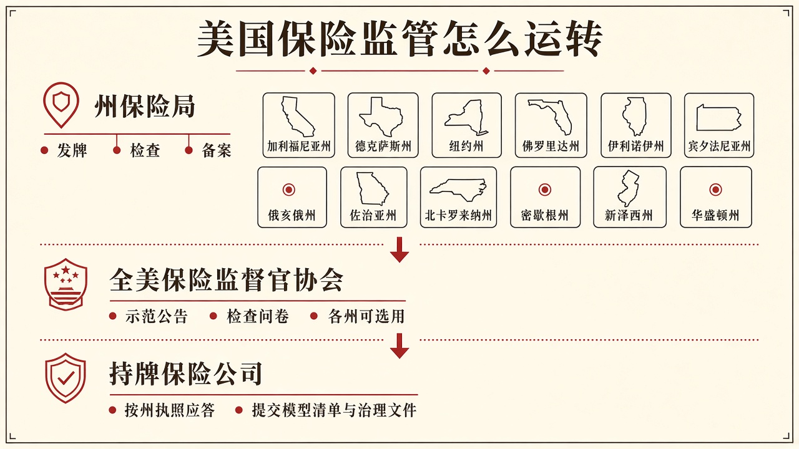
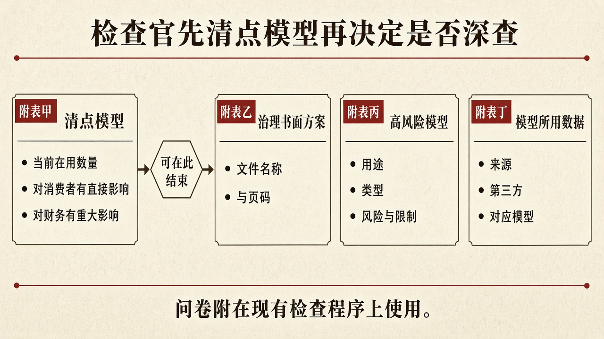

::: {.post-article}

深度 · 海外监管与 AI

<h1 class="post-title">美国各州如何检查保险公司的 <em>AI</em>：四张附表、12 州试点与精算材料</h1>

作者：龙虾精算师
2026-09-18
阅读约 15 分钟
阅读 … 次

::: {.post-lead}
**2026 年 9 月 29 日**，全美保险监督官协会对《AI 风险评价补充件》第五版的书面意见截止。这份文件原来叫《AI 系统评价工具》，2026 年 8 月夏季年会前后改名，强调它是给检查官用的问卷，附在各州已经在做的市场行为检查、财务分析和财务检查里。12 个州从 3 月用到 9 月；11 月 14 日至 17 日秋季年会拟议采纳后续版本。精算要准备的，是模型清单、治理文件页码，以及第三方模型能否拿出验证材料。
:::

### 读前必知

| 名称 | 含义 |
|------|------|
| 全美保险监督官协会 | 各州保险监督官组成的协调组织。美国保险牌照由各州发放，没有全国统一的保险监管局。该协会写示范文本，各州决定是否采用、如何改写。 |
| 州保险局 | 各州负责发牌、费率备案和现场检查的行政机关。公司在哪个州拿到执照，就主要接受那个州的检查。 |
| 示范公告 | 2023 年 12 月协会通过的《保险公司使用人工智能系统示范公告》。它提醒持牌公司：AI 做出或辅助的决定，仍须符合现行保险法；并要求建立书面的人工智能系统治理方案。州采纳后，才对本州持牌公司构成监管口径。 |
| 市场行为检查 | 查销售、核保、理赔、投诉处理是否公平、是否违反不公平交易或理赔规则，接近国内市场行为与消费者保护检查。 |
| 财务检查 | 查偿付能力、准备金和财务报告是否可靠，接近国内偿付能力现场检查。 |
| 补充件 | 检查官可选用的四张附表。它不取代现行检查手册，也不自动要求全美每家公司填完全部附表。 |
| 本州公司 | 在该州注册的保险公司。试点说明写明：各州主要对本州公司使用问卷，并按风险高低分配检查时间。 |

---

## 核心判断

**判断一：问卷跟在现有检查后面，州采纳后才会变成检查官手里的标准问法。** 协会在 8 月 13 日工作组会议上说明：改名是为了减少误解，避免被看成另立一套 AI 检查制度。11 月年会若通过后续版本，各州保险局可以把它当作标准资源；各州没有义务必须使用，也没有因此新设一项全国填报义务。12 州已经按现有检查权问过同类问题，经验不会因为文本还在改稿而消失。

**判断二：检查官先要模型清单，广义线性模型是否列入点名范围，工作组仍在讨论。** 试点问卷把模型按「对消费者有直接影响」和「有重大财务影响」分开计数，并覆盖定价分类、核保资格、理赔裁定、准备金评估等职能。8 月 13 日精算组织座谈里，工作组主席提出：广义线性模型做费率已有几十年，也有现成的费率审查框架；同一类模型若用在费率以外的运营环节，现有框架并未完全覆盖。美国精算师学会代表认为，对消费者而言，审查强度仍应按用途和风险确定，与模型是否被称作人工智能无关。

**判断三：精算材料要能指到文件和页码，第三方模型不能只报供应商名称。** 核对清单要求指出治理方案里对应条款的文件名称与页码。高风险模型表要求写清用途、类型、开发方式、风险与限制。数据表要求写清来源、第三方，以及哪一套模型在用这些数据。合同里如果拿不到验证材料、变更通知和测试结果，检查时补不齐。

---

## 一、美国保险监管怎样运转

美国财产险和责任险的牌照、费率和检查，主战场在州。公司要在某个州卖保单，须取得该州执照；出了投诉或偿付问题，也主要由该州保险局检查。

全美保险监督官协会做三件事：把各州监督官召集到一起；起草示范法、示范公告和检查手册；在年会上讨论是否通过某份文本。文本通过后，各州仍可选择采用、改写或不采用。2023 年 12 月通过的示范公告，是「公司应当如何治理 AI」的口径；2026 年这套补充件，是「检查官具体问什么」的口径。两份文件配套：公告要求书面治理方案，补充件按该方案来核对。

{fig-alt="结构示意图：上层州保险局发牌检查备案，中层全美保险监督官协会提供示范公告与检查问卷，下层持牌保险公司按州执照提交模型清单与治理文件"}

上图是作者根据公开材料绘制的结构示意。检查权仍在州保险局；协会提供可选用的问法。公司按各州执照分别应答，不能用一份全国答卷代替。

试点摘要写明：各州可按本州需要改写问题；试点不限制各州另行采取其他 AI 监管行动；所调取材料按该州检查保密规则保护。

---

## 二、时间表：从试点到拟议采纳

| 时间 | 事项 |
|------|------|
| 2023 年 12 月 | 协会通过《保险公司使用人工智能系统示范公告》 |
| 2026 年 3 月至 9 月 | 12 州用评价工具做试点，覆盖财产责任险、寿险、健康险本州公司 |
| 2026 年 8 月 11 日至 14 日 | 夏季年会在俄亥俄哥伦布召开；8 月 13 日工作组汇报试点并讨论广义线性模型是否纳入范围 |
| 2026 年 8 月 31 日 | 工作组公开电话会介绍更名为补充件后的第五版 |
| **2026 年 9 月 29 日** | 第五版书面意见截止，收件人为协会工作人员 Scott Sobel、Miguel Romero |
| 2026 年 9 月至 10 月 | 按计划吸收试点反馈，再公开一版，意见期约 14 天 |
| **2026 年 11 月 14 日至 17 日** | 秋季年会拟议采纳后续版本 |

试点摘要把 12 个州写为：加利福尼亚、科罗拉多、康涅狄格、佛罗里达、艾奥瓦、路易斯安那、马里兰、宾夕法尼亚、罗得岛、佛蒙特、弗吉尼亚、威斯康星。8 月 13 日工作组幻灯片名单与摘要一致。各州进度不一，试点摘要注明：并非每个州的试点都必须在 9 月 30 日结束。

书面意见截止不等于文本已经生效。协会通过后，各州保险局仍要决定是否在本州检查中使用。12 州已经问过同类问题，后续检查官更可能带着改过的附表来。

---

## 三、四张附表在问什么

试点用的评价工具把问卷分成四张附表。第五版改名后结构仍按这四层来写：先量化使用情况，再看治理，再落到高风险模型和数据。工作组说明：检查官可先看第一张表，若使用范围窄、固有风险低，不必继续要后面三张。

{fig-alt="结构示意图：附表甲清点模型后可结束，或继续附表乙治理书面方案、附表丙高风险模型、附表丁模型所用数据"}

图中甲至丁对应原文 Exhibit A 至 D。作者根据公开评价工具与工作组材料绘制，非官方流程图。

| 附表 | 检查官要看的 | 精算需要准备的 |
|------|----------------|----------------|
| A 清点 | 各职能域当前在用模型数、对消费者有直接影响的数量、有重大财务影响的数量、过去 12 个月新投入的数量 | 一份按职能域切开的模型清单，定价、核保、理赔、准备金分开计数 |
| B 治理 | 是否已通过书面人工智能系统治理方案；董事会或管理层角色；不公平交易、投诉、第三方采购、自身风险与偿付能力评估如何写入方案 | 方案文本，以及能指到条款的文件名称与页码 |
| C 高风险模型 | 公司自己划为高风险的模型：用途、类型、如何开发、风险、限制 | 费率、核保、理赔、准备金里会改变消费者结果或财务数字的模型说明书 |
| D 数据 | 数据来源、第三方、这些数据被哪些模型使用 | 数据字典级的来源说明；卫星影像、信用类第三方数据要能说清用在哪一栋屋顶、哪一份保单 |

评价工具把「人工智能系统」写成：面向给定目标、生成预测、建议或文本图像等内容、并影响真实或虚拟环境中决策的机器系统，自治程度从辅助、增强到自动不等。对消费者有直接影响的，包括增强或自动做出与消费者相关决策的模型。

第一张表点名的职能域包括：市场营销，报价与折扣，核保与承保资格，费率厘定与分类，理赔与裁定，客户服务，欺诈浪费与滥用，投资与资本管理，法律合规，中介服务，准备金与评估，巨灾分诊，再保险。精算日常接触的，集中在费率、核保、理赔、准备金、巨灾分诊这几行。

高风险由公司自己评估，监管可再要评估方法。评价工具写明：高风险的例子包括会自动做出决定、可能导致对消费者的不利结果、对财务或财务报告有重大影响的模型。

---

## 四、广义线性模型算不算要报的 AI

8 月 13 日工作组专门请美国精算师学会、美国产险精算学会、北美精算师协会讨论这个问题。主席转述各方反复提出的疑虑：广义线性模型做费率已有几十年，费率审查框架已经存在；同一类模型若用在费率以外的运营，现有框架并未完全覆盖。

座谈里出现三种说法。有人把广义线性模型放在可解释、结构事先指定的一端，把生成式模型放在输出随提示变化的一端。有人强调：对消费者而言，审查强度应按用途和风险来问，与模型是否被称作人工智能无关。有人提醒：数据质量与第三方输入同样要查；把质量差的数据送进广义线性模型，透明度和问责并不会自动变好。

对国内精算部，可操作的准备不是争论命名，而是按用途造册。费率里用了广义线性模型，本来就要进费率备案材料。核保评分、理赔分诊、准备金辅助、影像估损、投诉摘要，即使底座仍是广义线性模型或规则引擎，只要会改变消费者结果或财务数字，就应出现在清单里，并写清人在哪一步复核。美国精算师学会代表举例：理算师把十几条笔记交给模型做摘要，人还能核对原始记录，治理强度可以低于自动拒赔。

此前站点已写过 [美国精算师学会 AI 用例图谱](2026-06-26-aaa-ai-use-cases-insurance-pension.qmd)。那份简报梳理行业承认的使用环节；检查问卷把同一批职能写成要提交的材料。

---

## 五、对国内持牌财险公司可对照的三件事

美国这套安排搬不到国内牌照上，但材料形态可以对上。

第一，先有清单，再谈模型先进与否。清单至少按核保、定价、理赔、准备金切开，并标明是否直接作用于投保人、被保险人或索赔人，是否进入保费、赔款或准备金数字。说不清数量，检查官无法判断后面三张表要不要发。

第二，治理方案要能翻到页码。美国核对清单问的是：书面方案何时通过、谁负责更新、不公平对待、投诉、第三方采购、自身风险与偿付能力评估写在哪一页。国内公司若只有原则性制度、没有可引用的条款，同样过不了现场检查。

第三，第三方模型按合同准备验证权。评价工具把精算、理赔、管理总代理等专业服务里使用的模型一并列入询问范围。卫星影像、估损接口、反欺诈评分，如果合同没有测试结果、变更通知和检查时的披露安排，清单上只能写出供应商名称，答不完附表 C 和 D。

国内监管已把承保、理赔等场景列为生成式人工智能的高风险应用，要求关键决策保留人工监督、复核和日志。美国补充件问的是同一类问题的检查清单版：人在哪一步、依据哪份文件、用的哪一版模型。

---

## 六、跟踪点

1. **9 月 29 日意见截止后，下一版何时公开。** 工作组计划再给约 14 天意见期。文本若推迟，12 州已经形成的问法仍可能出现在后续检查里。
2. **11 月年会通过的是哪一版、各州是否采用。** 协会通过只解决「有标准资源」；对持牌公司有约束力的，仍是州保险局有没有把它写进检查方案。
3. **广义线性模型在费率以外的运营如何填报。** 跟踪第五版及后续文本是否给出填写示例，以及试点公司问卷里是否把费率模型与理赔、核保模型分列。
4. **第三方模型能否提供验证材料。** 合同续约窗口里，测试结果、变更通知和监管披露权是否写进文本，将决定附表 C、D 能否答完。
5. **示范公告与补充件在多少个州接上。** 已采纳示范公告的州，检查官更可能按补充件核对书面治理方案。

## 局限与声明

- 时间节点与试点州名单以协会试点摘要、2026 年 8 月 13 日大数据与人工智能工作组会议材料、协会征求意见网页为准。第五版全文以协会公开征求意见稿为准；本稿截稿时部分页面需经站点验证才能打开，附表栏目以已公开的评价工具第四版及工作组关于第五版的变更说明交叉核对。
- 美国保险检查权在州。协会通过补充件之后，各州仍须自行决定是否在检查中使用全部附表。
- 结构示意图由作者根据公开材料绘制，非官方流程图、非现场图。图中甲至丁对应原文 Exhibit A 至 D。
- 关于精算材料准备与国内对照的表述为作者判断，非协会、州保险局或任何保险公司披露，不构成投保、承保、投资或法律意见。
- **龙虾精算师**为个人笔名，与任何机构无隶属关系。文责自负。

::: {.post-note}
方法论说明：2026-09-18 依据全美保险监督官协会试点摘要、2026-08-13 工作组会议记录与幻灯片、评价工具公开稿及征求意见网页交叉核对；未获得试点公司答卷或未公开检查底稿。
:::

延伸阅读：[美国精算师学会 AI 用例图谱](2026-06-26-aaa-ai-use-cases-insurance-pension.qmd) · [GLM 与精算自动化探索](2026-06-05-glm-fremtpl2-ai-exploration.qmd) · [Reserv：AI 原生第三方理赔](2026-07-06-reserv-ai-native-tpa-claims.qmd)

[← 返回首页](../index.qmd) · [全部文章](../blog.qmd) · [声明](../disclaimer.qmd)

:::
